<!-- fit-css -->
<style>
section { font-size: 24px; padding: 40px 52px; justify-content: flex-start; }
section h1 { font-size: 1.45em; line-height: 1.12; margin: 0 0 .22em; }
section h2 { font-size: 1.12em; margin: .15em 0; }
section h3 { font-size: 1.0em; margin: .12em 0; }
section p, section li { margin: .16em 0; line-height: 1.32; }
section img { max-width: 100%; height: auto; }
section svg { max-height: 330px; width: 100%; }
section table { font-size: .78em; }
section pre { font-size: .70em; line-height: 1.32; background:#0d1117; color:#e6edf3; border:1px solid #30363d; border-radius:8px; padding:12px 16px; box-shadow:0 2px 8px rgba(0,0,0,.25); }
section pre code { white-space: pre-wrap; background:transparent; color:inherit; } section pre .hljs-comment{color:#8b949e;font-style:italic} section pre .hljs-keyword,section pre .hljs-built_in,section pre .hljs-literal{color:#ff7b72} section pre .hljs-string{color:#a5d6ff} section pre .hljs-number{color:#79c0ff} section pre .hljs-title,section pre .hljs-title.function_,section pre .hljs-section{color:#d2a8ff} section pre .hljs-meta{color:#ffa657} section pre .hljs-attr,section pre .hljs-attribute,section pre .hljs-name{color:#7ee787}
section blockquote { margin: .25em 0; font-size: .92em; }
section p > img + img { margin-left: 10px; }
section { overflow-y: auto; overflow-x: hidden; }
section::-webkit-scrollbar { width: 11px; }
section::-webkit-scrollbar-thumb { background:#4a90d9; border-radius:6px; }
section::-webkit-scrollbar-track { background:rgba(0,0,0,.06); }
section img{filter:drop-shadow(0 3px 12px rgba(0,0,0,.5))}
section.cover{background-color:#0b1426}
section.cover *{color:#fff !important}
section.cover h1,section.cover h2,section.cover h3,section.cover p,section.cover li,section.cover strong,section.cover em,section.cover blockquote,section.cover div{text-shadow:0 2px 9px rgba(0,0,0,.92),0 0 3px rgba(0,0,0,.8)}
section.cover blockquote{border-left:4px solid rgba(120,200,255,.6) !important;background:rgba(13,17,23,.55) !important;border-radius:6px;padding:.3em .6em}
section.cover h1,section.cover h2,section.cover h3,section.cover p,section.cover blockquote{max-width:60%}
section.cover img{filter:none}

/* ---- ส่วนของคอร์ส Smart Farm ---- */
section.sec { background: linear-gradient(135deg,#0f3d2e 0%,#1f6b3a 55%,#7cb342 100%); color:#fff; justify-content:center; }
section.sec h1 { font-size: 2.1em; color:#fff; }
section.sec h2, section.sec p, section.sec li { color:#e8f5e9; }
section.sec .when { display:inline-block; background:rgba(0,0,0,.28); border-radius:999px; padding:.1em .8em; font-size:.9em; margin-bottom:.4em; }
.chal { margin-top:.7em; background:rgba(255,255,255,.95); color:#bf360c !important; border-radius:14px; padding:.45em .9em; font-size:.95em; box-shadow:0 4px 18px rgba(0,0,0,.25); }
.chal b { color:#bf360c; }
section.brk { background: linear-gradient(135deg,#ff9f1c 0%,#ffbf69 60%,#ffe8c2 100%); justify-content:center; }
.cols { display:flex; gap:20px; align-items:flex-start; }
.cols > div { flex:1; min-width:0; }
.c40 { flex:0 0 40% !important; } .c45 { flex:0 0 45% !important; } .c55 { flex:0 0 55% !important; } .c60 { flex:0 0 60% !important; }
.cap { font-size:.5em; color:#78909c; line-height:1.3; margin-top:.15em; }
.shot img { border-radius:8px; filter:drop-shadow(0 3px 10px rgba(0,0,0,.35)); }
.goal { background:#e8f5e9; border-left:6px solid #2e7d32; border-radius:8px; padding:.25em .7em; margin:.2em 0; font-size:.86em; }
.think { background:#fff8e1; border-left:6px solid #f5a623; border-radius:8px; padding:.25em .7em; margin:.25em 0; font-size:.84em; }
.warn { background:#ffebee; border-left:6px solid #e53935; border-radius:8px; padding:.25em .7em; margin:.25em 0; font-size:.84em; }
.try { font-size:.84em; }
.tiles { display:grid; grid-template-columns:repeat(4,1fr); gap:12px; }
.tile { background:#f6faf5; border:2px solid #cfe3c9; border-radius:12px; padding:8px 10px; font-size:.6em; line-height:1.3; }
.tile img { width:100%; height:128px; object-fit:cover; border-radius:8px; filter:none; }
.tile b.t { display:block; font-size:1.25em; color:#1b5e20; margin:.2em 0; }
.chip { display:inline-block; border-radius:999px; padding:0 8px; margin:2px 2px 0 0; color:#fff; font-size:.92em; }
.chip.s { background:#1e88e5; } .chip.d { background:#8e24aa; } .chip.a { background:#2e7d32; } .chip.r { background:#607d8b; }
.vid { display:flex; gap:14px; align-items:flex-start; background:#f3f6fb; border:1px solid #d6deea; border-radius:10px; padding:8px 10px; margin:.25em 0; }
.vid iframe { flex:0 0 auto; border-radius:6px; }
.vid div { font-size:.64em; line-height:1.35; }
.vid b { font-size:1.08em; }
.timeline { display:flex; gap:4px; margin:.3em 0 .5em; }
.timeline div { border-radius:8px; padding:6px 6px; color:#fff; font-size:.52em; line-height:1.25; text-align:center; }
.timeline div b { display:block; font-size:1.25em; }
.pill { display:inline-block; background:#263238; color:#fff; border-radius:6px; padding:0 7px; font-family:monospace; font-size:.9em; }
.kbd { display:inline-block; border:2px solid #455a64; border-bottom-width:4px; border-radius:6px; padding:0 7px; font-weight:700; }
.big { font-size:1.35em; font-weight:700; }
.src { font-size:.48em; color:#78909c; }
</style>


<!-- _class: cover -->
<!-- _paginate: false -->

# Session 1 — ฟาร์มอัจฉริยะเริ่มที่เซนเซอร์

## บอร์ดของเราคือผู้ช่วยในโรงเรือน

> คาถาประจำคาบ: **อ่าน (Sense) → ตัดสิน (Decide) → ลงมือ (Act)**

AIoT Development for Smart Farm · Intensive Course · TESAIoT Dev Kit + BENTO Emulator

---

## 3 ชั่วโมงของเราวันนี้

<div class="timeline">
<div style="flex:10;background:#546e7a"><b>0:00</b>เปิดคาบ<br>AIoT<br>ในฟาร์ม</div>
<div style="flex:20;background:#5e35b1"><b>0:10</b>ติดตั้ง<br>Programmer<br>+ แฟลช v2.4.1</div>
<div style="flex:30;background:#1e88e5"><b>0:30</b>กิจกรรม 1<br>โรงเรือนของเรา<br>ตอนนี้</div>
<div style="flex:30;background:#43a047"><b>1:00</b>กิจกรรม 2<br>พืชของเรา<br>สบายดีไหม</div>
<div style="flex:10;background:#ff9f1c"><b>1:30</b>พัก</div>
<div style="flex:30;background:#00897b"><b>1:40</b>กิจกรรม 3<br>รดน้ำ<br>อัตโนมัติ</div>
<div style="flex:20;background:#8e24aa"><b>2:10</b>กิจกรรม 4<br>แท็งก์/รถไถ<br>เอียงเกินไหม</div>
<div style="flex:20;background:#e53935"><b>2:30</b>ภารกิจกลุ่ม<br>แผงควบคุม<br>ฟาร์มของเรา</div>
<div style="flex:10;background:#37474f"><b>2:50</b>ไอเดีย<br>+ Exit</div></div>

<div class="cols">
<div>

**สิ่งที่จะทำได้เมื่อจบคาบ**

- **LO1** อ่านอุณหภูมิ ความชื้น ความกดอากาศ มุมเอียง แล้วโชว์บนจอ
- **LO2** เขียนกฎ "สบาย / เครียด / แย่แล้ว" แล้วสั่งไฟ/ปั๊มตามกฎ
- **LO3** อธิบายได้ว่าทำไมระบบรดน้ำต้องมี **ช่องกันกระพือ** (hysteresis)
- **LO4** ได้ไอเดียตั้งต้นของโปรเจกต์ Smart Farm ของกลุ่ม

</div>
<div>

**ทำงานเป็นคู่ สลับบทบาททุกกิจกรรม**

| บทบาท | ทำอะไร |
|---|---|
| 🚜 **คนขับ** | คุมบอร์ด กด Program to Device |
| 🧭 **ผู้นำทาง** | อ่านใบงาน ลองไฟล์เดียวกันใน **Emulator** ก่อน แล้วจดผล |

ใบงาน: `sf-s1-th` (ทีมละ 1 ชุด)

</div>
</div>

---

<!-- _class: sec -->

<div class="when">0:00 – 0:30 · เปิดคาบ 10 นาที + ติดตั้ง/แฟลช 20 นาที</div>

# เปิดคาบ: AIoT ในฟาร์มจริง

เกษตรกรไม่ได้อยากได้ "เซนเซอร์" — เขาอยากได้ **ผักที่ไม่เน่า น้ำที่ไม่หมด และของที่ส่งถึงมือลูกค้าในสภาพดี**

---

## AIoT อยู่ตรงไหนในฟาร์มและโลจิสติกส์เกษตร

<div class="tiles">
<div class="tile">

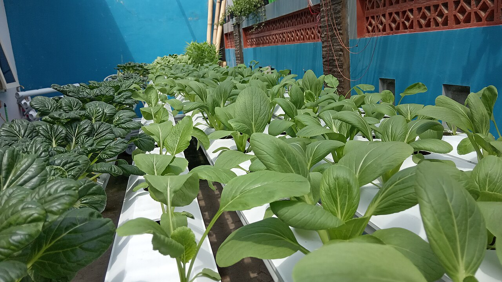

<b class="t">โรงเรือน</b>
<span class="chip s">วัด</span> อุณหภูมิ ความชื้น แสง
<span class="chip d">ตัดสิน</span> ร้อน/ชื้นเกินช่วงของพืช?
<span class="chip a">ทำ</span> เปิดพัดลม พ่นหมอก ม่านพรางแสง

</div>
<div class="tile">

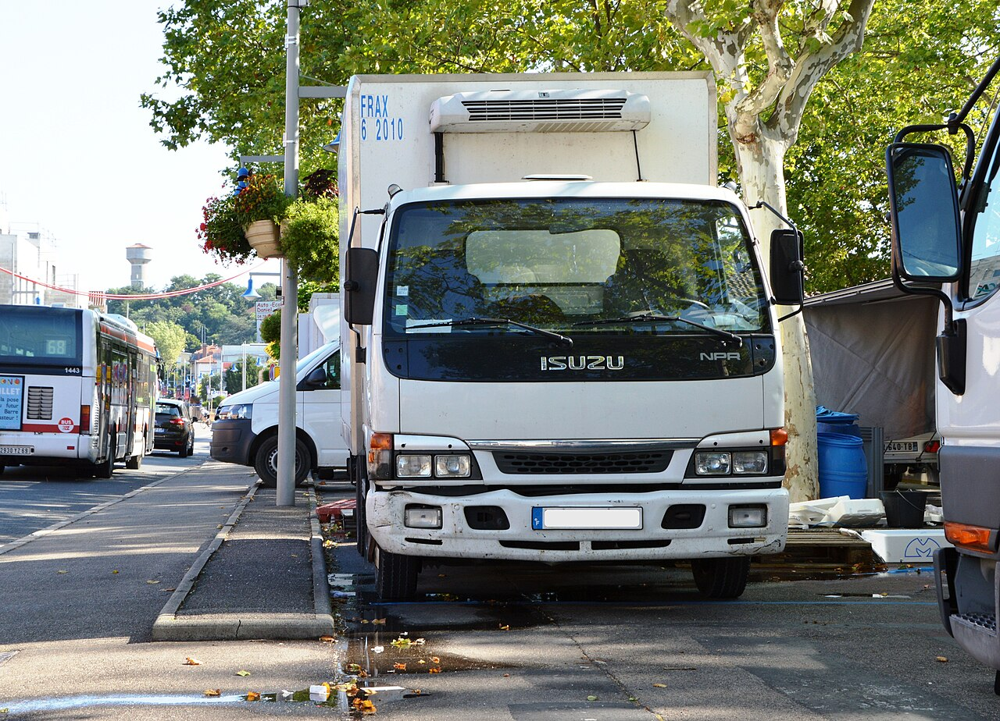

<b class="t">ห่วงโซ่ความเย็น</b>
<span class="chip s">วัด</span> อุณหภูมิในรถ/ห้องเย็น แรงกระแทก
<span class="chip d">ตัดสิน</span> อุ่นเกินกี่นาทีแล้ว?
<span class="chip a">ทำ</span> แจ้งคนขับ บันทึกหลักฐานคุณภาพ

</div>
<div class="tile">

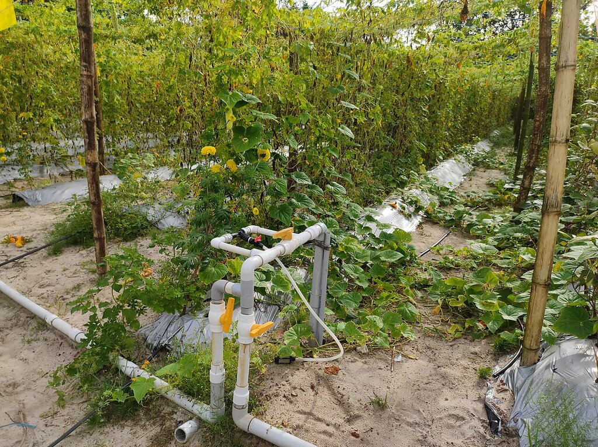

<b class="t">น้ำและชลประทาน</b>
<span class="chip s">วัด</span> ความชื้นดิน ระดับน้ำในถัง
<span class="chip d">ตัดสิน</span> ดินแห้งกว่าเกณฑ์? น้ำพอไหม?
<span class="chip a">ทำ</span> เปิด-ปิดปั๊ม ปิดวาล์ว

</div>
<div class="tile">

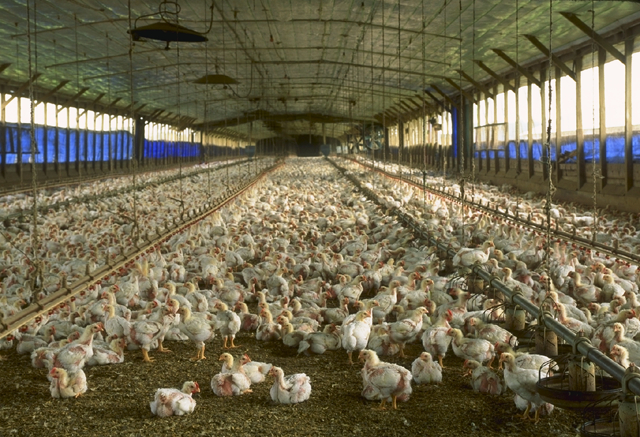

<b class="t">ปศุสัตว์</b>
<span class="chip s">วัด</span> อากาศในเล้า เสียง การเคลื่อนไหว
<span class="chip d">ตัดสิน</span> สัตว์เครียดร้อน? ผิดปกติ?
<span class="chip a">ทำ</span> เปิดพัดลม-น้ำ แจ้งเตือนเจ้าของ

</div>
</div>

<div class="cap">ภาพ (ซ้าย→ขวา): ผักไฮโดรโปนิกส์ อินโดนีเซีย — Setiawanap, CC BY-SA 4.0 · รถบรรทุกห้องเย็น — Spielvogel, CC0 · น้ำหยดพร้อมวาล์วแยกโซน รัฐเกรละ — Vis M, CC BY-SA 4.0 · โรงเรือนไก่เนื้อ — Larry Rana (USDA), สาธารณสมบัติ · ทั้งหมดจาก Wikimedia Commons</div>

> ทุกช่องมีโครงเดียวกัน: **วัด → ตัดสิน → ทำ** — วันนี้เราจะสร้างครบทั้งสามขั้นบนบอร์ดเดียว

---

## โลจิสติกส์เกษตร: ห่วงโซ่ความเย็น (cold chain) ต้องการเซนเซอร์ตลอดทาง

<svg viewBox="0 0 1000 300" xmlns="http://www.w3.org/2000/svg" font-family="sans-serif">
  <g font-size="34" text-anchor="middle">
    <text x="100" y="48">🌾</text><text x="300" y="48">📦</text><text x="500" y="48">🚚</text><text x="700" y="48">🏬</text><text x="900" y="48">🛒</text>
  </g>
  <g font-size="17" text-anchor="middle" fill="#37474f">
    <text x="100" y="76">เก็บเกี่ยว</text><text x="300" y="76">โรงคัดบรรจุ</text><text x="500" y="76">รถห้องเย็น</text><text x="700" y="76">ศูนย์กระจายสินค้า</text><text x="900" y="76">ร้านค้า</text>
  </g>
  <rect x="40" y="150" width="920" height="60" fill="#e3f2fd"/>
  <text x="952" y="203" text-anchor="end" font-size="15" fill="#1565c0">ช่วงที่ต้องคุม 2–8 °C</text>
  <line x1="40" y1="150" x2="960" y2="150" stroke="#1e88e5" stroke-dasharray="6 5"/>
  <line x1="40" y1="210" x2="960" y2="210" stroke="#1e88e5" stroke-dasharray="6 5"/>
  <path d="M40 120 C 120 125, 180 170, 240 180 L 440 182 C 470 182, 480 176, 500 180 L 560 182 C 575 182, 585 110, 600 108 C 625 106, 640 175, 660 180 L 960 184" fill="none" stroke="#e53935" stroke-width="4"/>
  <circle cx="600" cy="108" r="9" fill="#e53935"><animate attributeName="r" values="7;13;7" dur="1.4s" repeatCount="indefinite"/></circle>
  <rect x="612" y="88" width="330" height="46" rx="10" fill="#ffebee" stroke="#e53935" stroke-width="2"/>
  <text x="777" y="108" text-anchor="middle" font-size="16" font-weight="700" fill="#b71c1c">⚠ เปิดประตูรถนาน → 12 °C นาน 25 นาที</text>
  <text x="777" y="127" text-anchor="middle" font-size="15" fill="#b71c1c">เซนเซอร์เตือนคนขับ + บันทึกเป็นหลักฐาน</text>
  <text x="60" y="112" font-size="15" fill="#e53935">อุณหภูมิผักจริง</text>
  <g font-size="16" fill="#263238">
    <text x="40" y="250"><tspan font-weight="700" fill="#1e88e5">วัด</tspan> อุณหภูมิ ความชื้น แรงกระแทก ตำแหน่ง ทุกช่วงของการขนส่ง</text>
    <text x="40" y="276"><tspan font-weight="700" fill="#8e24aa">ตัดสิน</tspan> หลุดช่วงนานเกินกำหนดไหม · <tspan font-weight="700" fill="#2e7d32">ทำ</tspan> เตือน · แก้ทันที · ออกใบรับรองคุณภาพให้ลูกค้า</text>
  </g>
</svg>

<div class="cols">
<div class="vid" style="flex:0 0 auto">
<iframe width="320" height="180" src="https://www.youtube.com/embed/IB7Zq7xcgLY" title="Cold Chain คืออะไร — Thai Refrigeration Association" loading="lazy" frameborder="0" allowfullscreen></iframe>
</div>
<div>

**Cold Chain คืออะไร ? ทำไมถึงสำคัญกับ "ทุกคน"** — Thai Refrigeration Association · 4:16 · ภาษาไทย
<https://www.youtube.com/watch?v=IB7Zq7xcgLY>

<div class="think">

**คิดแบบคนทำโลจิสติกส์:** ถ้าลูกค้าถามว่า "ผักล็อตนี้เย็นตลอดทางจริงไหม?" — เราจะ **พิสูจน์** ด้วยข้อมูลอะไร? (กราฟนี้เป็นตัวอย่างสมมติ)

</div>

</div>
</div>

---

## หัวใจของทุกระบบ: Sense → Decide → Act

<svg viewBox="0 0 1000 330" xmlns="http://www.w3.org/2000/svg" font-family="sans-serif">
  <defs><marker id="ar" markerUnits="userSpaceOnUse" viewBox="0 0 12 12" markerWidth="20" markerHeight="20" refX="10" refY="6" orient="auto"><path d="M0,0 L12,6 L0,12 z" fill="#546e7a"/></marker></defs>
  <rect x="20" y="40" width="250" height="170" rx="22" fill="#e3f2fd" stroke="#1e88e5" stroke-width="4"/>
  <text x="145" y="84" text-anchor="middle" font-size="30" font-weight="700" fill="#1565c0">① อ่าน · Sense</text>
  <text x="145" y="122" text-anchor="middle" font-size="20" fill="#37474f">SHT40: 33.1 °C, 55 %</text>
  <text x="145" y="150" text-anchor="middle" font-size="20" fill="#37474f">ลูกบิด VR1: ดินชื้น 32 %</text>
  <text x="145" y="178" text-anchor="middle" font-size="20" fill="#37474f">BMI270: เอียง 12°</text>
  <rect x="375" y="40" width="250" height="170" rx="22" fill="#f3e5f5" stroke="#8e24aa" stroke-width="4"/>
  <text x="500" y="84" text-anchor="middle" font-size="30" font-weight="700" fill="#6a1b9a">② ตัดสิน · Decide</text>
  <text x="500" y="122" text-anchor="middle" font-size="20" fill="#37474f">if ร้อนเกิน 30 °C:</text>
  <text x="500" y="150" text-anchor="middle" font-size="20" fill="#37474f">    พืช "เริ่มเครียด"</text>
  <text x="500" y="178" text-anchor="middle" font-size="20" fill="#37474f">if ดิน &lt; เกณฑ์: รดน้ำ</text>
  <rect x="730" y="40" width="250" height="170" rx="22" fill="#e8f5e9" stroke="#2e7d32" stroke-width="4"/>
  <text x="855" y="84" text-anchor="middle" font-size="30" font-weight="700" fill="#1b5e20">③ ลงมือ · Act</text>
  <text x="855" y="122" text-anchor="middle" font-size="20" fill="#37474f">จอไฟ RGB เป็นสีเหลือง</text>
  <text x="855" y="150" text-anchor="middle" font-size="20" fill="#37474f">ลำโพงเตือน ui.sfx</text>
  <text x="855" y="178" text-anchor="middle" font-size="20" fill="#37474f">LED = ปั๊มน้ำเปิด</text>
  <line x1="275" y1="125" x2="368" y2="125" stroke="#546e7a" stroke-width="5" marker-end="url(#ar)"/>
  <line x1="630" y1="125" x2="723" y2="125" stroke="#546e7a" stroke-width="5" marker-end="url(#ar)"/>
  <path d="M790 214 C 790 292, 145 292, 145 216" fill="none" stroke="#546e7a" stroke-width="4" stroke-dasharray="10 7" marker-end="url(#ar)"/>
  <text x="470" y="318" text-anchor="middle" font-size="20" fill="#546e7a">วนซ้ำเป็นรอบ ๆ (ทุก 0.5–1 วินาที) ในลูป while: อ่าน → ตัดสิน → ทำ</text>
  <line x1="905" y1="212" x2="905" y2="238" stroke="#ff9f1c" stroke-width="3" stroke-dasharray="5 4"/>
  <rect x="815" y="240" width="180" height="50" rx="10" fill="#fff" stroke="#ff9f1c" stroke-width="3" stroke-dasharray="8 5"/>
  <text x="905" y="264" text-anchor="middle" font-size="17" fill="#e65100">④ รายงาน · Report</text>
  <text x="905" y="284" text-anchor="middle" font-size="15" fill="#e65100">(คาบ 2)</text>
</svg>

- ทุกไฟล์วันนี้มีลูป `while` ที่ทำสามขั้นนี้ซ้ำ ๆ — **อ่านโค้ดให้เจอว่าบรรทัดไหนคือขั้นไหน**
- ขั้นที่ 4 **รายงาน** (ส่งค่าขึ้นอินเทอร์เน็ตด้วย MQTT) เป็นเรื่องของคาบหน้า

---

## ดูของจริง: ฟาร์มอัจฉริยะในไทย

<div class="vid">
<iframe width="400" height="225" src="https://www.youtube.com/embed/kr3RPtK0sX8" title="HandySense EP.1 — NECTEC" loading="lazy" frameborder="0" allowfullscreen></iframe>
<div>

<b>HandySense | EP.1 ระบบเกษตรแม่นยำฟาร์มอัจฉริยะ "เพื่อทุกคน"</b><br>
ช่อง NECTEC · 6:13 · ภาษาไทย<br>
<https://www.youtube.com/watch?v=kr3RPtK0sX8>

**ดูแล้วจดสามอย่าง:** ระบบนี้ **วัด** อะไร · **ตัดสิน** จากอะไร · **ทำ** อะไรให้เกษตรกร

</div>
</div>

<div class="vid">
<iframe width="400" height="225" src="https://www.youtube.com/embed/cYTolXA-HdU" title="โรงเรือนอัจฉริยะ — เทคโนโลยีชาวบ้าน" loading="lazy" frameborder="0" allowfullscreen></iframe>
<div>

<b>ปลูกพืชเป็นเรื่องง่ายด้วยโรงเรือนอัจฉริยะ ช่วย New Gen! สร้างอาชีพเกษตร</b><br>
ช่อง เทคโนโลยีชาวบ้าน - Technologychaoban · 6:29 · ภาษาไทย<br>
<https://www.youtube.com/watch?v=cYTolXA-HdU>

**คำถามชวนคุย:** ถ้าเราเป็นเจ้าของโรงเรือนนี้ อยากให้ระบบ **เตือนเรื่องอะไรเป็นอย่างแรก**?

</div>
</div>

---

## ปลายทางของคอร์ส: อุปกรณ์ฟาร์มอัจฉริยะ 5 เสาหลัก

<svg viewBox="0 0 1000 250" xmlns="http://www.w3.org/2000/svg" font-family="sans-serif">
  <rect x="10" y="10" width="980" height="44" rx="10" fill="#1b5e20"/>
  <text x="500" y="41" text-anchor="middle" font-size="24" font-weight="700" fill="#fff">โปรเจกต์กลุ่ม — นำเสนอบนบอร์ดจริง 26 ต.ค.</text>
  <g font-size="19" text-anchor="middle">
    <rect x="20" y="70" width="176" height="150" rx="12" fill="#e3f2fd" stroke="#1e88e5" stroke-width="3"/>
    <text x="108" y="104" font-size="34">🖥️</text><text x="108" y="140" font-weight="700" fill="#1565c0">1. Smart HMI</text>
    <text x="108" y="166" fill="#37474f">จอสัมผัส ui</text><text x="108" y="190" fill="#37474f">+ จอไฟ RGB</text>
    <rect x="215" y="70" width="176" height="150" rx="12" fill="#e8f5e9" stroke="#2e7d32" stroke-width="3"/>
    <text x="303" y="104" font-size="34">🌡️</text><text x="303" y="140" font-weight="700" fill="#1b5e20">2. เซนเซอร์</text>
    <text x="303" y="166" fill="#37474f">SHT40 DPS368</text><text x="303" y="190" fill="#37474f">BMI270 เรดาร์ ไมค์</text>
    <rect x="410" y="70" width="176" height="150" rx="12" fill="#fff3e0" stroke="#ef6c00" stroke-width="3"/>
    <text x="498" y="104" font-size="34">🎛️</text><text x="498" y="140" font-weight="700" fill="#e65100">3. ปุ่มตั้งค่า</text>
    <text x="498" y="166" fill="#37474f">ลูกบิด VR1–VR4</text><text x="498" y="190" fill="#37474f">ปุ่ม SW5 / SW6</text>
    <rect x="605" y="70" width="176" height="150" rx="12" fill="#f3e5f5" stroke="#8e24aa" stroke-width="3"/>
    <text x="693" y="104" font-size="34">🔊</text><text x="693" y="140" font-weight="700" fill="#6a1b9a">4. เสียง</text>
    <text x="693" y="166" fill="#37474f">ui.sfx 21 แบบ</text><text x="693" y="190" fill="#37474f">ui.tone แต่งเอง</text>
    <rect x="800" y="70" width="176" height="150" rx="12" fill="#eceff1" stroke="#546e7a" stroke-width="3" stroke-dasharray="8 5"/>
    <text x="888" y="104" font-size="34">📡</text><text x="888" y="140" font-weight="700" fill="#37474f">5. MQTT + แอป</text>
    <text x="888" y="166" fill="#37474f">ส่งค่า/รับคำสั่ง</text><text x="888" y="190" fill="#37474f">(คาบ 2–3)</text>
  </g>
  <text x="400" y="244" text-anchor="middle" font-size="18" fill="#2e7d32">◀ เสา 1–4 เริ่มวันนี้ ▶</text>
</svg>

> บทบาทของบอร์ดในโปรเจกต์: **Smart IoT Gateway** — รวมเซนเซอร์ ตัดสิน แสดงผล ส่งเสียง สั่งงาน · ส่วนกราฟสวย ๆ และการแจ้งเตือนเข้ามือถือ ให้ **แอปเว็บ/มือถือของกลุ่ม** ทำ
>
> ทุกกิจกรรมวันนี้คือ **ชิ้นส่วน** ของโปรเจกต์ — เก็บโค้ดไว้ให้ดี คาบ 3 จะเอามาประกอบกัน

---

## รู้จักบอร์ด: TESAIoT Dev Kit

<style scoped>
.board { position:relative; width:600px; }
.board img { width:600px; filter:none; border-radius:10px; }
.pin { position:absolute; transform:translate(-50%,-50%); width:30px; height:30px; border-radius:50%; background:#e65100; color:#fff; font-weight:700; font-size:17px; line-height:30px; text-align:center; border:2px solid #fff; box-shadow:0 2px 6px rgba(0,0,0,.5); }
.pin.today { background:#2e7d32; }
.legend { font-size:.6em; line-height:1.3; }
.legend li { margin:.12em 0; }
.n { display:inline-block; width:22px; height:22px; border-radius:50%; color:#fff; text-align:center; line-height:22px; font-weight:700; font-size:.9em; margin-right:4px; }
.n.g { background:#2e7d32; } .n.o { background:#e65100; }
.cores { display:flex; gap:6px; margin-top:.4em; }
.cores div { flex:1; border-radius:8px; padding:4px 8px; font-size:.5em; line-height:1.3; color:#fff; }
</style>

<div class="cols">
<div style="flex:0 0 600px">

<div class="board">
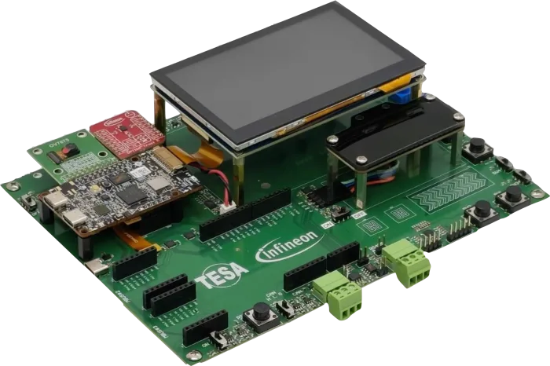
<span class="pin today" style="left:52%;top:22%">1</span>
<span class="pin" style="left:22%;top:47%">2</span>
<span class="pin today" style="left:30%;top:47%">3</span>
<span class="pin" style="left:31%;top:79%">4</span>
<span class="pin" style="left:76%;top:64%">5</span>
<span class="pin today" style="left:82%;top:54%">6</span>
<span class="pin today" style="left:76%;top:36%">7</span>
<span class="pin" style="left:25%;top:32%">8</span>
</div>

<div class="cap">ภาพและตำแหน่งหมุด 1–8 จาก TESAIoT Dev Kit SDK — tesaiot.github.io/tesaiot-pse84-devkit-sdk · หมุดสีเขียว = ของที่ใช้วันนี้</div>

<div class="cores">
<div style="background:#455a64"><b>Cortex-M33 · ฝั่ง Secure</b><br>secure boot · TrustZone</div>
<div style="background:#1565c0"><b>Cortex-M33 · ฝั่ง Non-secure</b> 200 MHz<br>WiFi · MQTT · TLS · OPTIGA</div>
<div style="background:#6a1b9a"><b>Cortex-M55</b> 400 MHz + NPU Ethos-U55<br>จอแสดงผล · Edge AI</div>
</div>

</div>
<div class="legend">

**บอร์ดสองชั้น:** บอร์ดฐาน TESAIoT + โมดูล (SoM) **Infineon KIT_PSE84_AI** ที่มีชิป **PSoC™ Edge E84** — ข้างในมี M33 (แบ่งสองฝั่งความปลอดภัย) + M55 + NPU

<ul>
<li><span class="n g">1</span><b>จอสัมผัส 4.3 นิ้ว</b> — โมดูล <code>ui</code> · ทุกกิจกรรม</li>
<li><span class="n o">2</span><b>SoM</b> — ชิป PSoC Edge E84, หน่วยความจำ, วิทยุ WiFi</li>
<li><span class="n g">3</span><b>เซนเซอร์บน SoM</b> — SHT40 อุณหภูมิ/ความชื้น · DPS368 ความกด · BMI270 IMU · เข็มทิศ · เรดาร์ 60 GHz · ไมค์ · ลำโพง — กิจกรรม 1 2 4</li>
<li><span class="n o">4</span><b>mikroBUS ×3 + Arduino header</b> — ต่อเซนเซอร์เพิ่มในโปรเจกต์</li>
<li><span class="n o">5</span><b>CAN / RS-485</b> — สายสื่อสารของเครื่องจักรในงานจริง</li>
<li><span class="n g">6</span><b>CapSense + ลูกบิด VR1–VR4 + ปุ่ม SW5/SW6</b> — กิจกรรม 1 3 4 ภารกิจ</li>
<li><span class="n g">7</span><b>จอไฟ RGB 16×8 จุด</b> — ทุกกิจกรรม</li>
<li><span class="n o">8</span><b>OPTIGA™ Trust M</b> — ชิปเก็บกุญแจความปลอดภัย (โมดูลเสียบเพิ่ม)</li>
</ul>

</div>
</div>

---

## ของบนบอร์ดที่ใช้วันนี้ — ใช้ในกิจกรรมไหน

<style scoped>
section table { font-size: .7em; }
</style>

| ของบนบอร์ด | ในโค้ด | ในฟาร์มใช้ทำอะไร | กิจกรรม |
|---|---|---|---|
| 🌡️ เซนเซอร์อุณหภูมิ/ความชื้น **SHT40** | `sensors.sht40` | อากาศในโรงเรือน | 1 · 2 · ภารกิจ |
| ⛅ เซนเซอร์ความกดอากาศ **DPS368** | `sensors.dps368` | เดาว่าฝนจะมา | 1 |
| 📐 IMU **BMI270** (ความเร่ง 3 แกน + ไจโร) | `sensors.bmi270.motion()` | มุมเอียง แรงกระแทก | 4 |
| 🟩 **จอไฟ RGB 16×8 จุด** (dot matrix) | `rgbmatrix` | ไฟสถานะที่เห็นจากอีกฝั่งห้อง | ทุกกิจกรรม |
| 🎛️ ลูกบิด **VR1–VR4** | `pots.read(0)` … `pots.read(3)` | แทนเซนเซอร์ที่ยังไม่มี: ความชื้นดิน น้ำในถัง | 3 · ภารกิจ |
| 🔘 ปุ่ม **SW5** (ล่าง), **SW6** (บน) บนฐานบอร์ด | `buttons.pressed(0)`, `buttons.pressed(1)` | สั่งปั๊มเอง ตั้งศูนย์ ล้างตัวนับ | 1 · 3 · 4 · ภารกิจ |
| 💡 ไฟ LED สีบนโมดูล SoM (RGB_RED / RGB_BLUE) | `gpio.led(...)` | ไฟแดง = พืช/แท็งก์มีปัญหา · ไฟฟ้า = ปั๊มเดิน (คนละอย่างกับจอไฟ RGB 16×8) | 2 · 3 · 4 · ภารกิจ |
| 🔊 ลำโพง | `ui.sfx(...)`, `ui.tone(...)` | เสียงเตือน เสียงยืนยัน | ทุกกิจกรรม |
| 🖥️ จอสัมผัส | `ui` | แผงหน้าปัดฟาร์ม | ทุกกิจกรรม |

<div class="src">SW5 (ปุ่มล่าง) = P17.5 · SW6 (ปุ่มบน) = P17.7 · VR1–VR4 = <code>pots.read(0)</code>–<code>pots.read(3)</code> ค่า 0–4095 · จอไฟ RGB = DFR0522 ที่ I²C 0x10 · ข้อมูลฮาร์ดแวร์: TESAIoT Dev Kit SDK — tesaiot.github.io/tesaiot-pse84-devkit-sdk</div>

<div class="warn">

**SW2** บนฐานบอร์ดคือ **สวิตช์ตัดไฟ** ไม่ใช่ปุ่มของเรา — **ห้ามโยก** · ลำโพงหลายบอร์ดดังพร้อมกันจะรบกวนกัน โค้ดทุกไฟล์จึงส่งเสียง **เฉพาะตอนมีเหตุการณ์**

</div>

---

## ติดตั้ง TESAIoT PSE84 Programmer — ทุกคนทำเอง

<style scoped>
.step { display:flex; gap:14px; align-items:flex-start; margin:.35em 0; }
.step .num { flex:0 0 52px; height:52px; border-radius:50%; background:#5e35b1; color:#fff; font-size:30px; font-weight:800; display:flex; align-items:center; justify-content:center; }
.step div { font-size:.9em; line-height:1.35; }
section a { word-break: break-all; }
</style>

<div class="cols">
<div class="c55">

<div class="step"><span class="num">1</span><div>

**ดาวน์โหลด + ติดตั้ง** TESAIoT PSE84 Programmer (รุ่นล่าสุด v1.0.2)
<https://github.com/wiroon/TESAIoT_PSE84_Programmer/releases>
macOS → ไฟล์ `…_universal.dmg` · Windows → ไฟล์ `…_x64-setup.exe` (หรือ `.msi`)

</div></div>

<div class="step"><span class="num">2</span><div>

**เปิดแอปค้างไว้** แล้วสลับเป็นโหมด **Remote** — หน้า IDE จะจับคู่กับแอปนี้เพื่อแฟลชบอร์ดผ่าน USB

</div></div>

<div class="step"><span class="num">3</span><div>

**เสียบ USB-C** เข้าพอร์ต **KitProg3** ของบอร์ด (ใช้สายที่ส่งข้อมูลได้ · บอร์ดมี USB-C หลายช่อง — ผู้สอนจะชี้ช่อง KitProg3 บนบอร์ดจริง)

</div></div>

<div class="warn">

**เครื่องเตือนตอนเปิดแอป** (macOS/Windows ถามว่าไว้ใจแอปนี้ไหม) → **ยกมือเรียกผู้สอน** อย่ากดข้ามเอง

</div>

</div>
<div class="shot">


<div class="cap">หน้าจอจริงของ BENTO IDE (ide.tesaiot.com) — Remote Flash ขั้นที่ 1: ต้องมี TESAIoT Programmer ก่อน</div>

</div>
</div>

---

## Remote Flash v2.4.1 — ทีมละ 1 บอร์ด

<style scoped>
.step { display:flex; gap:14px; align-items:flex-start; margin:.3em 0; }
.step .num { flex:0 0 48px; height:48px; border-radius:50%; background:#2e7d32; color:#fff; font-size:28px; font-weight:800; display:flex; align-items:center; justify-content:center; }
.step div { font-size:.86em; line-height:1.32; }
</style>

<div class="cols">
<div class="c45">

<div class="step"><span class="num">4</span><div>

เปิด **Chrome หรือ Edge** → <https://ide.tesaiot.com/> → หน้า **Welcome** → เลือก **TESAIoT Dev Kit** → แถบ **BENTO Firmware — TESAIoT Dev Kit** → **Flash this board →**

</div></div>

<div class="step"><span class="num">5</span><div>

**I'm ready →** จับคู่กับ Programmer → ตรวจว่าเป็น **v2.4.1** → **Flash** แล้วรอจนเสร็จ

</div></div>

<div class="step"><span class="num">6</span><div>

จอบอร์ดขึ้น **v2.4.1** → กด **Connect** ใน IDE ✅

</div></div>

<div class="think">

**แก้ปัญหาเร็ว**
- คอมไม่เห็นบอร์ด → **เปลี่ยนสาย / เปลี่ยนพอร์ต USB** (สายชาร์จอย่างเดียวใช้ไม่ได้)
- จอดำหลังแฟลช/รันโค้ด → กด **RESET** หนึ่งครั้ง → ยังดำ: **ถอดสาย USB แล้วเสียบใหม่**
- **SW2** บนฐานบอร์ด = **สวิตช์ตัดไฟ** ห้ามโยก/ห้ามกด

</div>

</div>
<div class="shot">

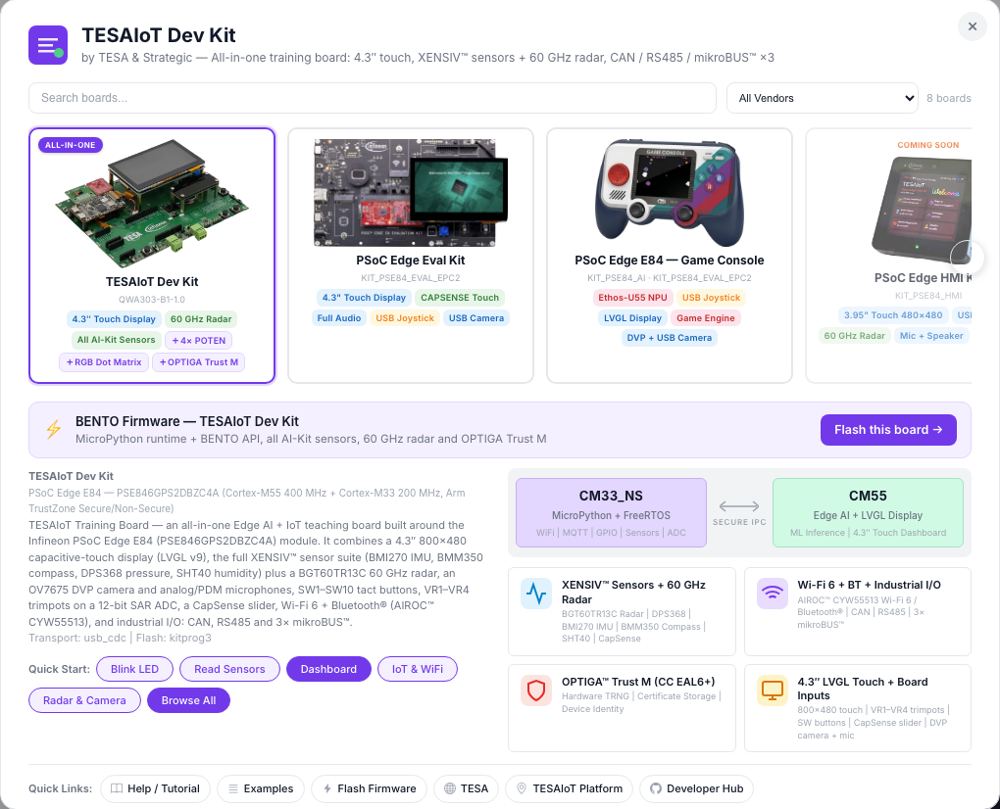

<div class="cap">หน้าจอจริงของ BENTO IDE — หน้า Welcome เลือก TESAIoT Dev Kit แล้วกด "Flash this board →" (ภาพถ่ายเมื่อ 28 ก.ย. 2569)</div>

</div>
</div>

> โปรแกรมแต่ละไฟล์เดิน 2–5 นาทีแล้ว **จบเอง** อยากเล่นต่อ กด Program to Device อีกครั้ง
---

## BENTO Emulator — บอร์ดจำลองของผู้นำทาง (และการบ้าน)

<div class="cols">
<div class="c55 shot">

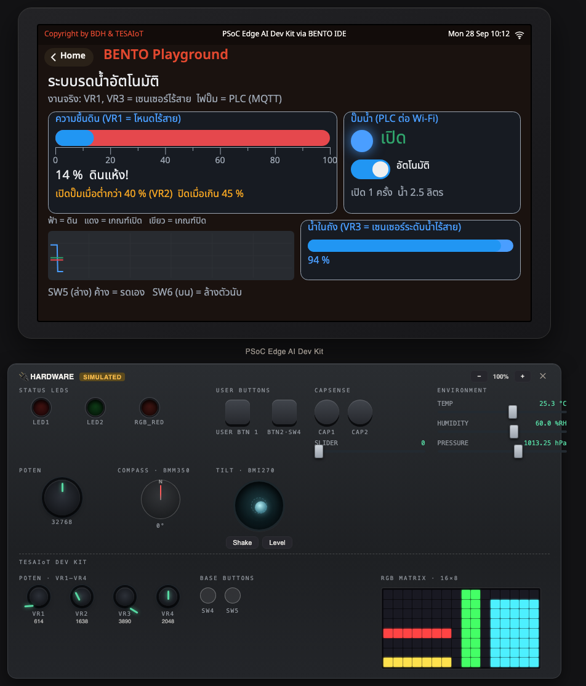

<div class="cap">ภาพจริงจาก BENTO Emulator ขณะรัน sf1_03 — ค่าเซนเซอร์ใน Emulator เป็นค่าจำลอง</div>

</div>
<div>

**บนลงล่าง**

1. **จอบอร์ด** 800×480 — หน้าตาเหมือนบนบอร์ดจริง
2. **HARDWARE (SIMULATED)** — กด 🔌 HW เพื่อเปิด
   - **ENVIRONMENT** เลื่อน TEMP / HUMIDITY / PRESSURE แทนการเป่าลม
   - **TILT · BMI270** ลากลูกบอลแทนการเอียงบอร์ด · ปุ่ม **Shake** แทนการกระแทก
3. **TESAIoT DEV KIT** (แถวล่างสุด) — **ลูกบิด VR1–VR4, ปุ่มคู่ของฐานบอร์ด, จอไฟ RGB 16×8**
   <span class="src">แผง Emulator พิมพ์ชื่อปุ่มเป็น SW4 / SW5 — ปุ่มซ้ายของแผง = <b>SW5</b> (ปุ่มล่างบนบอร์ด) · ปุ่มขวา = <b>SW6</b> (ปุ่มบน)</span>

<div class="warn">

ใช้ **VR1–VR4 แถวล่าง** ไม่ใช่ลูกบิด **POTEN** ตัวใหญ่ (นั่นของบอร์ด Eva Kit)

</div>

</div>
</div>

---

## เล่นก่อน 2 นาที: เมนู GPIO & RGB Matrix บนบอร์ด

<div class="cols">
<div class="c45">

1. ที่หน้า **Home** ของบอร์ด แตะการ์ด **GPIO & RGB Matrix**
2. **หมุนลูกบิด VR1–VR4** → แถบ 4 แถบบนจอขยับตาม
3. **แตะสี / เอฟเฟกต์** บนจอ → **จอไฟ RGB จริง** บนฐานบอร์ดเปลี่ยนตาม
4. **กดปุ่มคู่บนฐานบอร์ด** → ดูสถานะปุ่มบนจอ

<div class="think">

**ปุ่มคู่บนฐานบอร์ด:** **SW5 = ปุ่มล่าง** · **SW6 = ปุ่มบน**
ในโค้ดของเรา: `buttons.pressed(0)` = **SW5** (ล่าง) · `buttons.pressed(1)` = **SW6** (บน)

</div>

> ยังไม่ต้องเขียนโค้ดสักบรรทัด — แค่ให้มือคุ้นกับลูกบิดและปุ่ม ก่อนที่โค้ดของเราจะใช้มันแทนเซนเซอร์

</div>
<div>

<svg viewBox="0 0 560 360" xmlns="http://www.w3.org/2000/svg" font-family="sans-serif">
  <rect x="4" y="4" width="552" height="352" rx="16" fill="#101418" stroke="#30363d" stroke-width="3"/>
  <text x="24" y="40" font-size="22" font-weight="700" fill="#e8eaed">GPIO &amp; RGB Matrix</text>
  <text x="400" y="40" font-size="15" fill="#9aa3af">ภาพวาดประกอบ</text>
  <g font-size="16" fill="#9aa3af">
    <text x="24" y="84">VR1</text><text x="24" y="118">VR2</text><text x="24" y="152">VR3</text><text x="24" y="186">VR4</text>
  </g>
  <g>
    <rect x="70" y="70" width="220" height="18" rx="9" fill="#263238"/><rect x="70" y="70" width="160" height="18" rx="9" fill="#30a46c"><animate attributeName="width" values="160;60;200;160" dur="4s" repeatCount="indefinite"/></rect>
    <rect x="70" y="104" width="220" height="18" rx="9" fill="#263238"/><rect x="70" y="104" width="90" height="18" rx="9" fill="#4a9eff"><animate attributeName="width" values="90;190;40;90" dur="5s" repeatCount="indefinite"/></rect>
    <rect x="70" y="138" width="220" height="18" rx="9" fill="#263238"/><rect x="70" y="138" width="200" height="18" rx="9" fill="#f5a623"><animate attributeName="width" values="200;120;210;200" dur="4.5s" repeatCount="indefinite"/></rect>
    <rect x="70" y="172" width="220" height="18" rx="9" fill="#263238"/><rect x="70" y="172" width="50" height="18" rx="9" fill="#e5484d"><animate attributeName="width" values="50;170;100;50" dur="5.5s" repeatCount="indefinite"/></rect>
  </g>
  <g>
    <circle cx="340" cy="80" r="16" fill="#ff3b30"/><circle cx="385" cy="80" r="16" fill="#30d158"/><circle cx="430" cy="80" r="16" fill="#2f6bff"/>
    <circle cx="340" cy="125" r="16" fill="#ffd60a"/><circle cx="385" cy="125" r="16" fill="#40e0ff"/><circle cx="430" cy="125" r="16" fill="#d633ff"/>
    <circle cx="475" cy="102" r="16" fill="#ffffff"/>
    <text x="330" y="176" font-size="16" fill="#9aa3af">แตะสี → จอไฟจริงเปลี่ยน</text>
  </g>
  <rect x="24" y="214" width="512" height="126" rx="10" fill="#0d1117" stroke="#30363d"/>
  <g>
    <g id="mrow"><circle cx="48" cy="232" r="7" fill="#1b222c"/><circle cx="78" cy="232" r="7" fill="#1b222c"/><circle cx="108" cy="232" r="7" fill="#1b222c"/><circle cx="138" cy="232" r="7" fill="#1b222c"/><circle cx="168" cy="232" r="7" fill="#1b222c"/><circle cx="198" cy="232" r="7" fill="#1b222c"/><circle cx="228" cy="232" r="7" fill="#1b222c"/><circle cx="258" cy="232" r="7" fill="#1b222c"/><circle cx="288" cy="232" r="7" fill="#1b222c"/><circle cx="318" cy="232" r="7" fill="#1b222c"/><circle cx="348" cy="232" r="7" fill="#1b222c"/><circle cx="378" cy="232" r="7" fill="#1b222c"/><circle cx="408" cy="232" r="7" fill="#1b222c"/><circle cx="438" cy="232" r="7" fill="#1b222c"/><circle cx="468" cy="232" r="7" fill="#1b222c"/><circle cx="498" cy="232" r="7" fill="#1b222c"/></g>
    <use href="#mrow" y="15"/><use href="#mrow" y="30"/><use href="#mrow" y="45"/><use href="#mrow" y="60"/><use href="#mrow" y="75"/><use href="#mrow" y="90"/><use href="#mrow" y="105"/>
    <g fill="#30d158"><circle cx="48" cy="337" r="7"/><circle cx="78" cy="337" r="7"/><circle cx="108" cy="322" r="7"/><circle cx="138" cy="307" r="7"/><circle cx="168" cy="292" r="7"/><circle cx="198" cy="277" r="7"/><circle cx="228" cy="262" r="7"/><circle cx="258" cy="247" r="7"/><circle cx="288" cy="232" r="7"/>
      <animate attributeName="fill" values="#30d158;#40e0ff;#d633ff;#ffd60a;#30d158" dur="4s" repeatCount="indefinite"/></g>
  </g>
</svg>

<div class="cap">ภาพวาดประกอบแนวคิดของหน้าเมนู ไม่ใช่ภาพถ่ายจอจริง — หน้าจริงอยู่ในเฟิร์มแวร์ TESAIoT Dev Kit v2.4.1</div>

</div>
</div>

---

## อ่านโค้ดให้เป็น: ทุกไฟล์วันนี้มี 5 ส่วนเรียงเหมือนกัน

<svg viewBox="0 0 1000 250" xmlns="http://www.w3.org/2000/svg" font-family="sans-serif">
  <g font-size="17">
    <rect x="10" y="20" width="180" height="150" rx="14" fill="#eceff1" stroke="#546e7a" stroke-width="3"/>
    <text x="100" y="56" text-anchor="middle" font-size="30">⚙️</text><text x="100" y="92" text-anchor="middle" font-weight="700" fill="#37474f">1) ตั้งค่า</text>
    <text x="100" y="118" text-anchor="middle" fill="#546e7a">เกณฑ์ ค่าชดเชย</text><text x="100" y="140" text-anchor="middle" fill="#546e7a">เวลา สี</text>
    <rect x="207" y="20" width="180" height="150" rx="14" fill="#e3f2fd" stroke="#1e88e5" stroke-width="3"/>
    <text x="297" y="56" text-anchor="middle" font-size="30">🔌</text><text x="297" y="92" text-anchor="middle" font-weight="700" fill="#1565c0">2) ฮาร์ดแวร์</text>
    <text x="297" y="118" text-anchor="middle" fill="#546e7a">อ่านเซนเซอร์ ปุ่ม</text><text x="297" y="140" text-anchor="middle" fill="#546e7a">สั่งไฟ จอไฟ RGB</text>
    <rect x="404" y="20" width="180" height="150" rx="14" fill="#f3e5f5" stroke="#8e24aa" stroke-width="3"/>
    <text x="494" y="56" text-anchor="middle" font-size="30">🧠</text><text x="494" y="92" text-anchor="middle" font-weight="700" fill="#6a1b9a">3) สมอง</text>
    <text x="494" y="116" text-anchor="middle" font-size="15" fill="#546e7a">judge()</text><text x="494" y="136" text-anchor="middle" font-size="15" fill="#546e7a">pump_decision()</text><text x="494" y="156" text-anchor="middle" font-size="15" fill="#546e7a">health()</text>
    <rect x="601" y="20" width="180" height="150" rx="14" fill="#fff3e0" stroke="#ef6c00" stroke-width="3"/>
    <text x="691" y="56" text-anchor="middle" font-size="30">🖥️</text><text x="691" y="92" text-anchor="middle" font-weight="700" fill="#e65100">4) หน้าจอ</text>
    <text x="691" y="118" text-anchor="middle" fill="#546e7a">build_screen()</text><text x="691" y="140" text-anchor="middle" fill="#546e7a">show...()</text>
    <rect x="798" y="20" width="192" height="150" rx="14" fill="#e8f5e9" stroke="#2e7d32" stroke-width="3"/>
    <text x="894" y="56" text-anchor="middle" font-size="30">🔁</text><text x="894" y="92" text-anchor="middle" font-weight="700" fill="#1b5e20">5) โปรแกรมหลัก</text>
    <text x="894" y="118" text-anchor="middle" fill="#546e7a">main() วนลูป</text><text x="894" y="140" text-anchor="middle" font-size="15" fill="#546e7a">อ่าน→ตัดสิน→ทำ→โชว์</text>
  </g>
  <g font-size="16" text-anchor="middle" fill="#37474f">
    <text x="100" y="205">แก้ "ตัวเลข"</text><text x="297" y="205">Sense + Act</text><text x="494" y="205">แก้ "กฎ" (Decide)</text><text x="691" y="205">แก้ "หน้าตา"</text><text x="894" y="205">ทุกอย่างต่อกัน</text>
  </g>
</svg>

- ในไฟล์ให้หาบรรทัด `# ---- 1) ตั้งค่า (แก้ได้) ----` ถึง `# ---- 5) โปรแกรมหลัก ----`
- widget บนจอที่จะได้เจอวันนี้: หน้าปัดมีเข็ม (**Scale**) · วงแหวน (**Arc**) · ไฟสถานะ (**Led**) · กราฟ (**Chart**) · วงล้อเลือก (**Roller**) · สวิตช์ (**Switch**) · แท็บ (**Tabview**)

---

## Code Quest — โจทย์ 4 ระดับในทุกกิจกรรม

ทำเรียงจากระดับ 1 ขึ้นไป ทำได้ถึงไหนก็ได้แค่นั้น · แต้มสนุก ไม่นับเกรด · ไม่เพิ่มเวลาคาบ

| ระดับ | ทำอะไร | ประเภท | แต้ม |
|---|---|---|---|
| **1 เดา** (Predict) | อ่านโค้ด เขียนคำตอบที่เดาไว้ก่อน แล้วรันดูว่าตรงไหม | โจทย์หลัก (มีเฉลยในคาบ) | ข้อละ 1 |
| **2 แก้** (Tweak) | แก้ตัวเลขในส่วน `# ---- 1) ตั้งค่า ----` แล้วดูผล | โจทย์หลัก (มีเฉลยในคาบ) | ข้อละ 2 |
| **3 เติม** (Fill-in) | เติมช่อง `____` ในไฟล์ฝึก ให้ผ่านการตรวจอัตโนมัติ | กิจกรรม 3 = โจทย์หลัก (มีเฉลยในคาบ) · กิจกรรม 2 = โจทย์เพิ่ม (โบนัส เฉลยคาบหน้า) | ลงมือ 3 + ผ่าน 1 |
| **4 สร้าง** (Make) | เพิ่มความสามารถใหม่ 1 อย่างให้แผงควบคุมฟาร์ม | โจทย์เพิ่ม (โบนัส เฉลยคาบหน้า) | 5 |

<div class="goal">

**โจทย์หลัก (มีเฉลยในคาบ)** = ทุกกลุ่มควรทำได้ ไม่มีใครติดค้าง · **โจทย์เพิ่ม (โบนัส เฉลยคาบหน้า)** = ทำเพื่อสนุกและเก็บแต้ม เฉลยต้นคาบ 2

</div>

---

## Code Quest — ไฟล์ฝึกอยู่ที่ไหน + ติดขัดทำอย่างไร

<div class="cols">
<div>

**ไฟล์ฝึก (ระดับ 3)**
- [`s1/practise/sf1_03_practise.py`](https://github.com/Advance-Innovation-Centre-AIC/aiot-development-for-smart-farm/blob/main/s1/practise/sf1_03_practise.py) — โจทย์หลัก กิจกรรม 3
- [`s1/practise/solutions/sf1_03_practise_solution.py`](https://github.com/Advance-Innovation-Centre-AIC/aiot-development-for-smart-farm/blob/main/s1/practise/solutions/sf1_03_practise_solution.py) — เฉลย เปิดได้ในคาบ
- [`s1/practise/sf1_02_practise.py`](https://github.com/Advance-Innovation-Centre-AIC/aiot-development-for-smart-farm/blob/main/s1/practise/sf1_02_practise.py) — โจทย์เพิ่ม (การบ้าน รันใน Emulator ได้)

ช่องที่ต้องเติมเขียนว่า `____` · รันแล้วไฟล์ตรวจคำตอบให้เอง

</div>
<div>

**ติดขัด? บันไดช่วยเหลือ 5 ขั้น**
1. **คำใบ้ 3 ขั้น** ท้ายใบงาน — เปิดทีละขั้น ขั้นละ −1 แต้ม
2. **อ่านข้อความ error** ด้วยตารางในใบงาน
3. **สลับคนขับกับคนนำทาง** · ถามเพื่อน 3 คนก่อนถามผู้สอน
4. **ทางออกฉุกเฉิน:** รันไฟล์ตัวอย่างเต็มเพื่อไปต่อก่อน แล้วค่อยเทียบ
5. **เฉลย:** โจทย์หลักอยู่ใน `s1/practise/solutions/` · ทุกข้ออธิบายต้นคาบ 2

</div>
</div>

---

<!-- _class: sec -->

<div class="when">0:30 – 1:00 · คนขับ = คนที่ 1</div>

# กิจกรรม 1 — โรงเรือนของเราตอนนี้

[`sf1_01_greenhouse_hello.py`](https://github.com/Advance-Innovation-Centre-AIC/aiot-development-for-smart-farm/blob/main/s1/sf1_01_greenhouse_hello.py) · เซนเซอร์ SHT40 + DPS368 · จอไฟ RGB โชว์อุณหภูมิ

<div class="chal">🏆 <b>ท้าทาย:</b> กลุ่มไหนทำ <b>ความชื้นได้สูงสุด</b> ในห้อง — และใครทำ <b>อุณหภูมิขึ้น</b> ได้มากที่สุดด้วยมือเปล่า?</div>


---

## เบื้องหลัง: เซนเซอร์ความชื้นแบบตัวเก็บประจุ (SHT40)

<div class="cols">
<div class="c55">

<svg viewBox="0 0 560 300" xmlns="http://www.w3.org/2000/svg" font-family="sans-serif">
  <text x="280" y="26" text-anchor="middle" font-size="20" fill="#37474f">ภาพตัดขวางอย่างง่าย (วาดประกอบ ไม่ใช่สเกลจริง)</text>
  <rect x="60" y="70" width="380" height="22" fill="#b0bec5" stroke="#546e7a"/>
  <g fill="#fff"><rect x="90" y="70" width="30" height="22"/><rect x="170" y="70" width="30" height="22"/><rect x="250" y="70" width="30" height="22"/><rect x="330" y="70" width="30" height="22"/><rect x="400" y="70" width="30" height="22"/></g>
  <text x="448" y="87" font-size="16" fill="#37474f">ขั้วบน (พรุน)</text>
  <rect x="60" y="92" width="380" height="90" fill="#ffe0b2" stroke="#ef6c00"/>
  <text x="250" y="170" text-anchor="middle" font-size="18" fill="#e65100">ชั้นพอลิเมอร์ดูดซับน้ำ</text>
  <rect x="60" y="182" width="380" height="22" fill="#b0bec5" stroke="#546e7a"/>
  <text x="448" y="199" font-size="16" fill="#37474f">ขั้วล่าง</text>
  <g fill="#1e88e5">
    <circle cx="105" cy="45" r="7"><animate attributeName="cy" values="40;120;40" dur="3s" repeatCount="indefinite"/></circle>
    <circle cx="185" cy="50" r="7"><animate attributeName="cy" values="45;140;45" dur="3.6s" repeatCount="indefinite"/></circle>
    <circle cx="265" cy="42" r="7"><animate attributeName="cy" values="38;110;38" dur="2.8s" repeatCount="indefinite"/></circle>
    <circle cx="345" cy="48" r="7"><animate attributeName="cy" values="44;150;44" dur="3.3s" repeatCount="indefinite"/></circle>
    <circle cx="415" cy="44" r="7"><animate attributeName="cy" values="40;125;40" dur="3.9s" repeatCount="indefinite"/></circle>
  </g>
  <text x="30" y="52" font-size="17" fill="#1e88e5">H₂O</text>
  <rect x="10" y="222" width="540" height="66" rx="10" fill="#e8f5e9" stroke="#2e7d32"/>
  <text x="280" y="250" text-anchor="middle" font-size="17" fill="#1b5e20">อากาศชื้น → น้ำซึมเข้าพอลิเมอร์มาก → ค่าความจุ C สูงขึ้น</text>
  <text x="280" y="276" text-anchor="middle" font-size="17" fill="#1b5e20">ชิปวัด C แล้วแปลงเป็น %RH ส่งให้บอร์ดทาง I²C</text>
</svg>

</div>
<div>

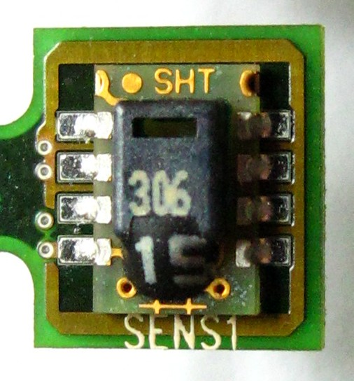 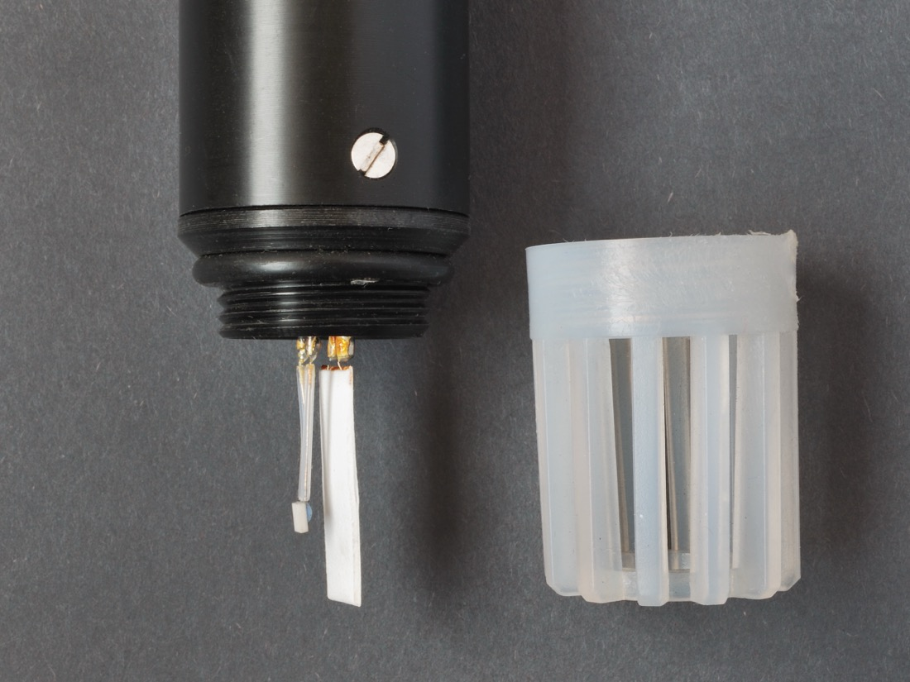

<div class="cap">ซ้าย: ชิปวัดความชื้นตระกูล SHT บนแผงวงจร — ภาพ: wdwd / Wikimedia Commons — CC BY-SA 3.0 · ขวา: หัววัดความชื้นแบบตัวเก็บประจุในงานอุตสาหกรรม — ภาพ: Harke / Wikimedia Commons — สาธารณสมบัติ</div>

- SHT40 บนบอร์ดเราคือหลักการเดียวกัน แต่ย่อเหลือชิปขนาด **1.5 × 1.5 มม.** และวัด **อุณหภูมิ** ไปพร้อมกัน
- น้ำต้องใช้เวลา **ซึมเข้า–ซึมออก** จากพอลิเมอร์ — จำข้อนี้ไว้ตอบคำถามในกิจกรรม 1

</div>
</div>

---

## เบื้องหลัง: ความชื้น "สัมพัทธ์" สัมพัทธ์กับอะไร

<div class="cols">
<div class="c55">

<svg viewBox="0 0 560 300" xmlns="http://www.w3.org/2000/svg" font-family="sans-serif">
  <text x="150" y="24" text-anchor="middle" font-size="17" fill="#37474f">ไอน้ำมากที่สุดที่อากาศ</text><text x="150" y="46" text-anchor="middle" font-size="17" fill="#37474f">1 ลูกบาศก์เมตรรับได้</text>
  <line x1="70" y1="250" x2="530" y2="250" stroke="#90a4ae" stroke-width="2"/>
  <rect x="100" y="185" width="100" height="65" fill="#90caf9"/><text x="150" y="176" text-anchor="middle" font-size="20" font-weight="700" fill="#1565c0">12.8 g</text>
  <text x="150" y="276" text-anchor="middle" font-size="20" fill="#37474f">15 °C</text>
  <rect x="240" y="133" width="100" height="117" fill="#42a5f5"/><text x="290" y="124" text-anchor="middle" font-size="20" font-weight="700" fill="#1565c0">23.0 g</text>
  <text x="290" y="276" text-anchor="middle" font-size="20" fill="#37474f">25 °C</text>
  <rect x="380" y="48" width="100" height="202" fill="#1e88e5"/><text x="430" y="40" text-anchor="middle" font-size="20" font-weight="700" fill="#1565c0">39.6 g</text>
  <text x="430" y="276" text-anchor="middle" font-size="20" fill="#37474f">35 °C</text>
  <rect x="380" y="149" width="100" height="101" fill="none" stroke="#fff" stroke-width="3" stroke-dasharray="7 5"/>
  <text x="430" y="206" text-anchor="middle" font-size="18" fill="#fff">ครึ่งเดียว</text>
  <text x="430" y="228" text-anchor="middle" font-size="18" fill="#fff">= 50 %RH</text>
</svg>

<div class="src">ค่าไอน้ำอิ่มตัวจากตารางมาตรฐานทางอุตุนิยมวิทยา (ปัดทศนิยม 1 ตำแหน่ง)</div>

</div>
<div>

<div style="display:flex;align-items:center;justify-content:center;gap:.5em;font-size:.85em;margin:.3em 0 .9em;line-height:1.25">
<b>%RH =</b>
<div style="text-align:center"><div style="border-bottom:2px solid currentColor;padding:0 .4em .15em">ไอน้ำที่มีจริงในอากาศ</div><div style="padding:.15em .4em 0">ไอน้ำมากที่สุดที่อากาศรับได้<br>ณ อุณหภูมินั้น</div></div>
<b>× 100</b>
</div>

- อากาศ **อุ่น** รับไอน้ำได้ **มากกว่า** อากาศเย็นมาก
- ไอน้ำเท่าเดิม แต่อากาศร้อนขึ้น → **%RH ลดลง** ทั้งที่น้ำไม่ได้หายไปไหน
- ห้องแอร์มักแห้งกว่าที่มะเขือเทศชอบ (ต่ำกว่า 60 %RH) เพราะคอยล์เย็นของแอร์กลั่นน้ำออกจากอากาศ

<div class="think">

**ในฟาร์ม:** RH ค้างสูงเกือบ 100 % นาน ๆ + ใบเปียก = เชื้อราชอบมาก

</div>

</div>
</div>

---

## เบื้องหลัง: ความกดอากาศบอกอะไรเกี่ยวกับฝน (DPS368)

<div class="cols">
<div class="c55">

<svg viewBox="0 0 560 250" xmlns="http://www.w3.org/2000/svg" font-family="sans-serif">
  <defs><linearGradient id="pg" x1="0" x2="1"><stop offset="0" stop-color="#5c6bc0"/><stop offset=".5" stop-color="#90a4ae"/><stop offset="1" stop-color="#ffb300"/></linearGradient>
  <marker id="ar2" markerUnits="userSpaceOnUse" viewBox="0 0 12 12" markerWidth="20" markerHeight="20" refX="10" refY="6" orient="auto"><path d="M0,0 L12,6 L0,12 z" fill="#3949ab"/></marker></defs>
  <rect x="30" y="70" width="500" height="34" rx="17" fill="url(#pg)"/>
  <text x="40" y="58" font-size="20" fill="#3949ab">⛈️ 990 hPa</text>
  <text x="280" y="58" text-anchor="middle" font-size="20" fill="#455a64">☁️ 1013 hPa</text>
  <text x="520" y="58" text-anchor="end" font-size="20" fill="#ef6c00">☀️ 1030 hPa</text>
  <text x="40" y="132" font-size="18" fill="#3949ab">ความกดต่ำ: อากาศลอยขึ้น</text>
  <text x="40" y="154" font-size="18" fill="#3949ab">เย็นลง กลายเป็นเมฆฝน</text>
  <text x="520" y="132" text-anchor="end" font-size="18" fill="#ef6c00">ความกดสูง: อากาศจมลง</text>
  <text x="520" y="154" text-anchor="end" font-size="18" fill="#ef6c00">ฟ้าโปร่ง</text>
  <path d="M420 200 L160 200" stroke="#3949ab" stroke-width="6" marker-end="url(#ar2)"/>
  <text x="290" y="236" text-anchor="middle" font-size="20" font-weight="700" fill="#3949ab">ลดลงเรื่อย ๆ หลายชั่วโมง = ฝนอาจมา</text>
</svg>

- ตัวเลข "ครั้งเดียว" บอกไม่ได้มาก — **แนวโน้ม** ต่างหากที่สำคัญ
- **ในเขตร้อนอย่างไทย** ความกดอากาศลดลงทุกบ่ายราว 2–3 hPa เป็นปกติ (ขึ้น-ลงตามเวลาของวัน) → ต้อง **เทียบกับเวลาเดียวกันของเมื่อวาน**
- ขึ้นที่สูง ~8 เมตร ความกดลดราว 1 hPa → ย้ายบอร์ดขึ้นชั้นบนก็เห็นค่าต่าง
- บอร์ดของผู้สอนวัดได้ **1010.95 hPa** (เช้าวันนี้)

</div>
<div>

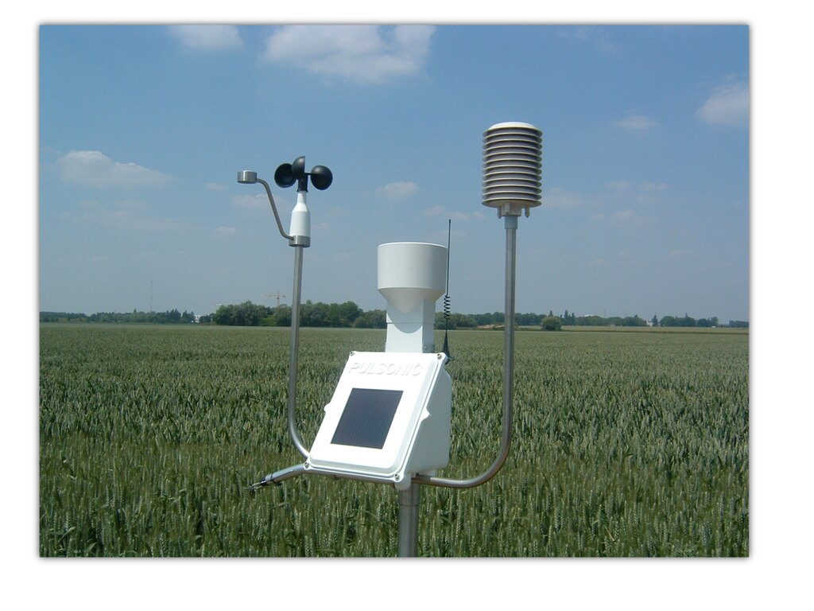

<div class="cap">สถานีอากาศในแปลงเกษตร วัดอุณหภูมิ ความชื้น ความกด ฝน ลม — ภาพ: Noar 91 / Wikimedia Commons — CC BY-SA 3.0</div>

<div class="vid" style="margin-top:.4em">
<iframe width="220" height="124" src="https://www.youtube.com/embed/SWHj71qS_NA" title="How does atmospheric pressure affect weather? — Met Office" loading="lazy" frameborder="0" allowfullscreen></iframe>
<div><b>How does atmospheric pressure affect weather?</b><br>Met Office - Learn About Weather · 1:40 · EN</div>
</div>

</div>
</div>

---

## ทำไมบอร์ดอ่านอุณหภูมิ "ร้อนกว่าห้อง" — เรื่องของการสอบเทียบ

<style scoped>
section svg { max-height: 230px; }
section pre { font-size: .6em; }
section li { font-size: .9em; }
</style>

<div class="cols">
<div class="c45">

<svg viewBox="0 0 560 280" xmlns="http://www.w3.org/2000/svg" font-family="sans-serif">
  <text x="280" y="26" text-anchor="middle" font-size="19" fill="#37474f">วัดจริงบน TESAIoT Dev Kit (firmware 2.4.1) เช้าวันนี้</text>
  <line x1="60" y1="240" x2="520" y2="240" stroke="#90a4ae" stroke-width="2"/>
  <rect x="90" y="84" width="110" height="156" fill="#ff8a65"/>
  <text x="145" y="74" text-anchor="middle" font-size="22" font-weight="700" fill="#d84315">35.4→36.0 °C</text>
  <text x="145" y="266" text-anchor="middle" font-size="18" fill="#37474f">SHT40 บนบอร์ด</text>
  <rect x="245" y="60" width="110" height="180" fill="#e53935"/>
  <text x="300" y="50" text-anchor="middle" font-size="22" font-weight="700" fill="#b71c1c">37.2 °C</text>
  <text x="300" y="266" text-anchor="middle" font-size="18" fill="#37474f">ชิป IMU</text>
  <rect x="400" y="130" width="110" height="110" fill="#4fc3f7" stroke="#0277bd" stroke-dasharray="8 5" stroke-width="3"/>
  <text x="455" y="120" text-anchor="middle" font-size="22" font-weight="700" fill="#0277bd">~25–28 °C</text>
  <text x="455" y="266" text-anchor="middle" font-size="18" fill="#37474f">ห้องแอร์ปกติ</text>
</svg>

```python
TEMP_OFFSET = 0.0    # ... แล้วใส่ค่าชดเชย เช่น -9.5
HUM_FIX = True       # ... แปลงความชื้นเป็นของห้อง
# ... ใน read_climate()
    t = None if t_raw is None else t_raw + TEMP_OFFSET
    if h is not None and t is not None and TEMP_OFFSET != 0 and HUM_FIX:
        h = room_humidity(h, t_raw, t)
```

</div>
<div>

- ชิปประมวลผล จอ และวงจรจ่ายไฟ **อุ่นตัวเอง** → เซนเซอร์บนบอร์ดอ่านความร้อนของบอร์ดปนเข้าไปด้วย
- งานจริงแก้ด้วยการ **สอบเทียบ** (calibration): $\texttt{TEMP\_OFFSET} = T_{\text{ห้อง}} - T_{\text{บอร์ด}}$
- เทียบกับ **เทอร์โมมิเตอร์ในห้อง** — ค่าชดเชยมักราว **−9 ถึง −10**
- **ความชื้นก็ถูกแปลงเป็นของห้อง:** อากาศรอบเซนเซอร์อุ่นกว่าห้อง %RH จึงอ่านได้ต่ำกว่า (ย้อนดูสไลด์ "ความชื้นสัมพัทธ์") · ถ้าสูงเกินจริงเมื่อเทียบไฮโกรมิเตอร์ ตั้ง `HUM_FIX = False`
- ค่า **"ดิบ"** บนจอไม่เปลี่ยน แต่เข็ม เลขใหญ่ และสีเปลี่ยน — ใช้ค่าเดียวกันต่อใน **กิจกรรม 2 และภารกิจกลุ่ม**

<div class="think">

**คิด:** ติดตั้งจริงในโรงเรือน ควรวางเซนเซอร์ **ห่างจากกล่องควบคุม** หรือ **ในร่มที่ลมผ่าน** — เพราะอะไร?

</div>

</div>
</div>

---

## กิจกรรม 1 — โรงเรือนของเราตอนนี้

<div class="cols">
<div class="c40">

<div class="goal">

🎯 **เป้าหมาย:** อ่านอากาศในโรงเรือนจากเซนเซอร์จริง แล้วโชว์บนจอ + จอไฟ RGB

</div>

<div class="try">

**ลองทำ**
1. รันไฟล์ → **หน้าปัดเข็ม** อุณหภูมิ · **วงแหวน** ความชื้น · ความกดอากาศ · **กราฟย้อนหลัง** (ฟ้า = ความชื้น, ส้ม = อุณหภูมิ)
2. **ขั้นแรก: ชดเชยค่า** — เทียบเลข **"ดิบ"** กับ **เทอร์โมมิเตอร์ในห้อง** (หรือค่าที่ผู้สอนประกาศ) แล้วตั้ง `TEMP_OFFSET` (สไลด์ก่อนหน้า) · จดไว้ใช้ต่อ
3. จอไฟ RGB: เลขอุณหภูมิตัวใหญ่ 🟩 ปกติ · 🟨 เกิน 30 · 🟥 เกิน 35
4. **แข่ง!** เป่าลมหายใจ → ความชื้นสูงสุด · จับบอร์ด → อุณหภูมิสูงสุด · กด **SW5** ล้างสถิติแล้วแข่งใหม่

</div>

</div>
<div class="shot">

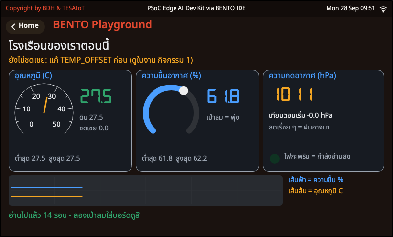

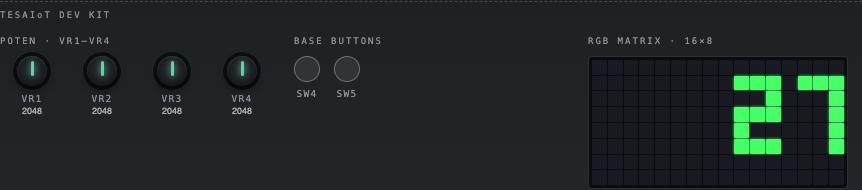

<div class="cap">ภาพจริงจาก BENTO Emulator (ค่าจำลอง: 27.5 °C, 62 %RH, 1010.9 hPa, TEMP_OFFSET = 0) · แถวล่าง = แผง TESAIoT DEV KIT ของ Emulator</div>

</div>
</div>

---

## กิจกรรม 1 — หัวใจของโค้ด + คำถามชวนคิด

<div class="cols">
<div>

**อ่าน → ตัดสิน → ทำ ในลูปเดียว**

```python
    while time.ticks_diff(time.ticks_ms(), t0) < RUN_MS:
        t, t_raw, h, p = read_climate()                  # 1) อ่าน
        rounds += 1
        if sw5.pressed_now():                             # 2) SW5 (ปุ่มล่าง) = เริ่มแข่งใหม่
            temp_rec.reset()
            hum_rec.reset()
            ui.sfx(ui.SFX_UI_SELECT)
        if t is not None:
            temp_rec.add(t)
            shown = matrix_show(t, shown)                # 3) ทำ: จอไฟ RGB
        # ...
        show_temp(w, t, t_raw, temp_rec)                 # 4) โชว์บนจอ
```

</div>
<div class="shot">

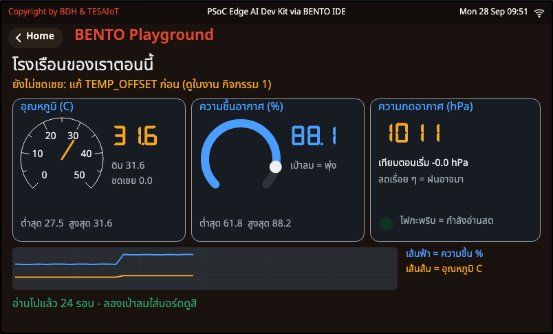

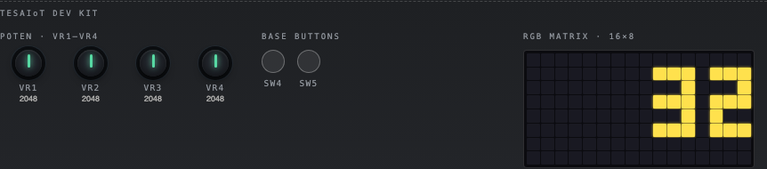

<div class="cap">จำลอง "เป่าลมหายใจ": 31.6 °C, 88 %RH → เลขบนจอไฟ RGB เปลี่ยนเป็นสีเหลือง</div>

</div>
</div>

<div class="think">

**คิด:** ความชื้นพุ่งเร็วแต่ลดลงช้า เพราะอะไร? ในโรงเรือนจริง ถ้าความชื้นค้างสูงนาน ๆ จะเกิดปัญหาอะไรกับพืช?

</div>

---

## ดูเพิ่ม: เขาวัดความชื้นสัมพัทธ์กันอย่างไร

<div class="vid">
<iframe width="480" height="270" src="https://www.youtube.com/embed/IoXwZ5CfKWY" title="Relative Humidity Measurement explained — Rotronic" loading="lazy" frameborder="0" allowfullscreen></iframe>
<div>

<b>Relative Humidity Measurement explained</b><br>
ช่อง Rotronic (ผู้ผลิตเครื่องวัดความชื้น) · 4:46 · ภาษาอังกฤษ (เปิดคำบรรยายแปลไทยอัตโนมัติได้)<br>
<https://www.youtube.com/watch?v=IoXwZ5CfKWY>

**ดูแล้วตอบ:**
- %RH ขึ้นกับอุณหภูมิอย่างไร?
- ทำไมเครื่องวัดความชื้นที่ดีต้องวัดอุณหภูมิไปด้วย?

</div>
</div>

---

<!-- _class: sec -->

<div class="when">1:00 – 1:30 · คนขับ = คนที่ 2</div>

# กิจกรรม 2 — พืชของเราสบายดีไหม

[`sf1_02_crop_comfort.py`](https://github.com/Advance-Innovation-Centre-AIC/aiot-development-for-smart-farm/blob/main/s1/sf1_02_crop_comfort.py) · กฎ "สบาย / เครียด / แย่แล้ว" · หน้าพืชบนจอไฟ RGB · เสียง · LED

<div class="chal">🏆 <b>ท้าทาย:</b> ทำให้พืชบนจอไฟ <b>หน้าเศร้า</b> ให้ได้ — แล้ว <b>ช่วยให้กลับมายิ้ม</b> เร็วที่สุด!</div>


---

## เบื้องหลัง: พืชแต่ละชนิดมี "ช่วงที่สบาย" ต่างกัน

<!-- CROP_BARS_BEGIN -->
<style scoped>
.cz-row, .cz-head { display:flex; gap:18px; align-items:center; margin:8px 0; }
.cz-name { flex:0 0 170px; font-weight:700; font-size:.85em; }
.cz-track { flex:1; position:relative; height:34px; background:#eceff1; border-radius:8px; }
.cz-bar { position:absolute; top:3px; bottom:3px; border-radius:6px; color:#fff; font-weight:700; font-size:.62em; display:flex; align-items:center; justify-content:center; }
.cz-axis { flex:1; position:relative; height:22px; font-size:.5em; color:#607d8b; }
.cz-axis span { position:absolute; transform:translateX(-50%); }
.cz-h { flex:1; text-align:center; font-weight:700; font-size:.7em; }
</style>
<div class="cz-head"><div class="cz-name"></div><div class="cz-h" style="color:#ef6c00">🌡️ อุณหภูมิที่สบาย (°C)</div><div class="cz-h" style="color:#1e88e5">💧 ความชื้นอากาศที่สบาย (%RH)</div></div>
<div class="cz-row"><div class="cz-name">🍅 มะเขือเทศ</div><div class="cz-track"><div class="cz-bar" style="left:33.3%;width:33.3%;background:#ef6c00">20–30</div></div><div class="cz-track"><div class="cz-bar" style="left:42.9%;width:28.6%;background:#1e88e5">60–80</div></div></div><div class="cz-row"><div class="cz-name">🥬 ผักสลัด</div><div class="cz-track"><div class="cz-bar" style="left:16.7%;width:33.3%;background:#ef6c00">15–25</div></div><div class="cz-track"><div class="cz-bar" style="left:28.6%;width:28.6%;background:#1e88e5">50–70</div></div></div><div class="cz-row"><div class="cz-name">🍄 เห็ดนางฟ้า</div><div class="cz-track"><div class="cz-bar" style="left:40.0%;width:20.0%;background:#ef6c00">22–28</div></div><div class="cz-track"><div class="cz-bar" style="left:71.4%;width:21.4%;background:#1e88e5">80–95</div></div></div><div class="cz-row"><div class="cz-name">🌸 กล้วยไม้</div><div class="cz-track"><div class="cz-bar" style="left:40.0%;width:33.3%;background:#ef6c00">22–32</div></div><div class="cz-track"><div class="cz-bar" style="left:42.9%;width:28.6%;background:#1e88e5">60–80</div></div></div>
<div class="cz-row"><div class="cz-name"></div><div class="cz-axis"><span style="left:0.0%">10</span><span style="left:16.7%">15</span><span style="left:33.3%">20</span><span style="left:50.0%">25</span><span style="left:66.7%">30</span><span style="left:83.3%">35</span><span style="left:100.0%">40</span></div><div class="cz-axis"><span style="left:0.0%">30</span><span style="left:14.3%">40</span><span style="left:28.6%">50</span><span style="left:42.9%">60</span><span style="left:57.1%">70</span><span style="left:71.4%">80</span><span style="left:85.7%">90</span><span style="left:100.0%">100</span></div></div>
<!-- CROP_BARS_END -->

<div class="cols">
<div>

- ช่วงนี้คือ **ค่าตั้งต้นในไฟล์** [`sf1_02_crop_comfort.py`](https://github.com/Advance-Innovation-Centre-AIC/aiot-development-for-smart-farm/blob/main/s1/sf1_02_crop_comfort.py) — ตัวเลขสำหรับการเรียน **ไม่ใช่คำแนะนำทางเกษตรกรรม**
- **เห็ดนางฟ้า** (เห็ดเป็นเชื้อรา ไม่ใช่พืช แต่ใช้กฎเดียวกันได้) ต้องการความชื้นสูงกว่าตัวอื่นมาก → ห้องแอร์ของเรา "แห้งเกินไป" แน่นอน

</div>
<div>

<div class="think">

**กฎตัดสินในโค้ด:** อยู่ในช่วง = 😊 สบาย · หลุดช่วงนิดเดียว = 😐 เริ่มเครียด · หลุดเกิน 3 °C หรือ 10 %RH = 😢 แย่แล้ว
พืชของกลุ่มเรา — หาช่วงที่เหมาะจากแหล่งที่เชื่อถือได้ แล้วเพิ่มลงใน `CROPS`

</div>

</div>
</div>

---

## เบื้องหลัง: จอไฟ RGB ผสมสีแบบ "บวกแสง"

<div class="cols">
<div class="c40">

<svg viewBox="0 0 360 330" xmlns="http://www.w3.org/2000/svg" font-family="sans-serif">
  <rect x="0" y="0" width="360" height="330" rx="16" fill="#000"/>
  <g style="mix-blend-mode:screen">
    <circle cx="180" cy="125" r="90" fill="#ff0000" style="mix-blend-mode:screen"/>
    <circle cx="125" cy="215" r="90" fill="#00ff00" style="mix-blend-mode:screen"/>
    <circle cx="235" cy="215" r="90" fill="#0000ff" style="mix-blend-mode:screen"/>
  </g>
  <text x="180" y="62" text-anchor="middle" font-size="22" font-weight="700" fill="#fff">R</text>
  <text x="62" y="262" text-anchor="middle" font-size="22" font-weight="700" fill="#fff">G</text>
  <text x="298" y="262" text-anchor="middle" font-size="22" font-weight="700" fill="#fff">B</text>
</svg>

<div class="src">วาดประกอบ: แสงแดง + เขียว = เหลือง · เขียว + น้ำเงิน = ฟ้า · แดง + น้ำเงิน = ม่วง · ครบสาม = ขาว</div>

</div>
<div>

แต่ละจุดบนจอไฟมี LED จิ๋ว **3 สี** — เปิด/ปิดได้ทีละสี → เลข 3 บิต

<svg viewBox="0 0 620 200" xmlns="http://www.w3.org/2000/svg" font-family="monospace">
  <g font-size="17" text-anchor="middle">
    <circle cx="40" cy="40" r="26" fill="#1b222c" stroke="#555"/><text x="40" y="92" fill="#37474f">0</text><text x="40" y="114" fill="#37474f">000</text><text x="40" y="138" font-size="14" fill="#546e7a">OFF</text>
    <circle cx="117" cy="40" r="26" fill="#ff3b30"/><text x="117" y="92" fill="#37474f">1</text><text x="117" y="114" fill="#37474f">001</text><text x="117" y="138" font-size="14" fill="#546e7a">RED</text>
    <circle cx="194" cy="40" r="26" fill="#30d158"/><text x="194" y="92" fill="#37474f">2</text><text x="194" y="114" fill="#37474f">010</text><text x="194" y="138" font-size="14" fill="#546e7a">GREEN</text>
    <circle cx="271" cy="40" r="26" fill="#ffd60a"/><text x="271" y="92" fill="#37474f">3</text><text x="271" y="114" fill="#37474f">011</text><text x="271" y="138" font-size="14" fill="#546e7a">YELLOW</text>
    <circle cx="348" cy="40" r="26" fill="#2f6bff"/><text x="348" y="92" fill="#37474f">4</text><text x="348" y="114" fill="#37474f">100</text><text x="348" y="138" font-size="14" fill="#546e7a">BLUE</text>
    <circle cx="425" cy="40" r="26" fill="#d633ff"/><text x="425" y="92" fill="#37474f">5</text><text x="425" y="114" fill="#37474f">101</text><text x="425" y="138" font-size="14" fill="#546e7a">PURPLE</text>
    <circle cx="502" cy="40" r="26" fill="#40e0ff"/><text x="502" y="92" fill="#37474f">6</text><text x="502" y="114" fill="#37474f">110</text><text x="502" y="138" font-size="14" fill="#546e7a">CYAN</text>
    <circle cx="579" cy="40" r="26" fill="#ffffff" stroke="#999"/><text x="579" y="92" fill="#37474f">7</text><text x="579" y="114" fill="#37474f">111</text><text x="579" y="138" font-size="14" fill="#546e7a">WHITE</text>
  </g>
  <text x="310" y="184" text-anchor="middle" font-size="17" fill="#6a1b9a">บิต: B G R  →  RED=1  GREEN=2  BLUE=4</text>
</svg>

```python
# แดง + เขียว = เหลือง (รวมแสงเหมือนไฟ RGB)
yellow = rgbmatrix.RED | rgbmatrix.GREEN   # 1 + 2 = 3 = YELLOW
rgbmatrix.fill(yellow)                     # ทั้งจอสีเหลือง
rgbmatrix.score(28, rgbmatrix.GREEN)       # เลข 28 ตัวใหญ่สีเขียว
rgbmatrix.pixel(3, 5, rgbmatrix.CYAN)      # จุดเดียวที่ x=3, y=5
```

</div>
</div>

<div class="cap">ในงานจริง ไฟสถานะเครื่องจักรในโรงงาน/โรงเรือนก็ใช้สีบอกความหมายแบบเดียวกัน: เขียว = ปกติ · เหลือง = ระวัง · แดง = หยุด/อันตราย</div>

---

## กิจกรรม 2 — พืชของเราสบายดีไหม

<div class="cols">
<div class="c40">

<div class="goal">

🎯 **เป้าหมาย:** เขียนกฎตัดสินว่าพืช "สบาย / เริ่มเครียด / แย่แล้ว" แล้วให้บอร์ดแสดงผลครบ 3 ทาง

</div>

<div class="try">

**ลองทำ**
1. ใส่ `TEMP_OFFSET` ค่าเดียวกับกิจกรรม 1 ก่อนรัน
2. **ปัดวงล้อด้านซ้ายของจอ** เลือกพืช (เปลี่ยนพืช = คะแนนเริ่มนับใหม่) · อยากเพิ่มพืชของกลุ่ม เพิ่มหนึ่งบรรทัดใน `CROPS`
3. กราฟ: เส้นส้ม = อุณหภูมิ · เส้นเขียวสองเส้น = ขอบช่วงที่พืชชอบ
4. ทำให้เกิดครบ 3 สถานะ สังเกต **ไฟแดงบนบอร์ด** (ดับ/กะพริบ/ติดค้าง) **หน้าพืชบนจอไฟ RGB** และ **เสียง**
5. (โบนัส) วาดหน้าพืชของกลุ่มเองใน `FACES` — ตาราง 8×8 ใช้ `#` แทนจุดที่ติด

</div>

</div>
<div class="shot">

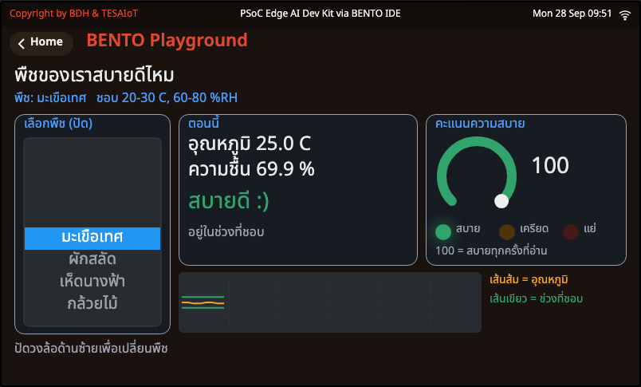

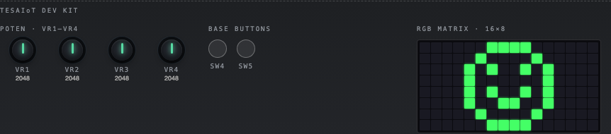

<div class="cap">ภาพจริงจาก BENTO Emulator — จำลอง 25 °C, 70 %RH (มะเขือเทศสบาย)</div>

</div>
</div>

---

## กิจกรรม 2 — สามสถานะ สามหน้าตา

<div class="cols">
<div class="shot">


<div class="cap">😊 สบาย — จำลอง 25 °C / 70 %</div>

</div>
<div class="shot">

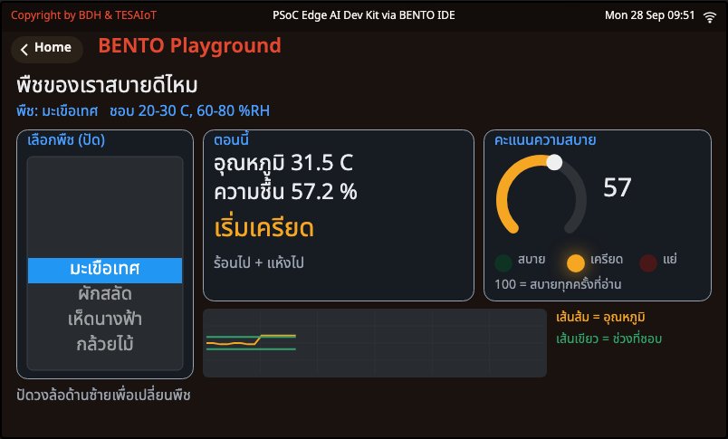
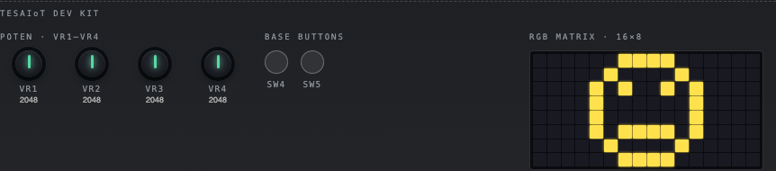

<div class="cap">😐 เริ่มเครียด — จำลอง 31.5 °C / 57 %</div>

</div>
<div class="shot">

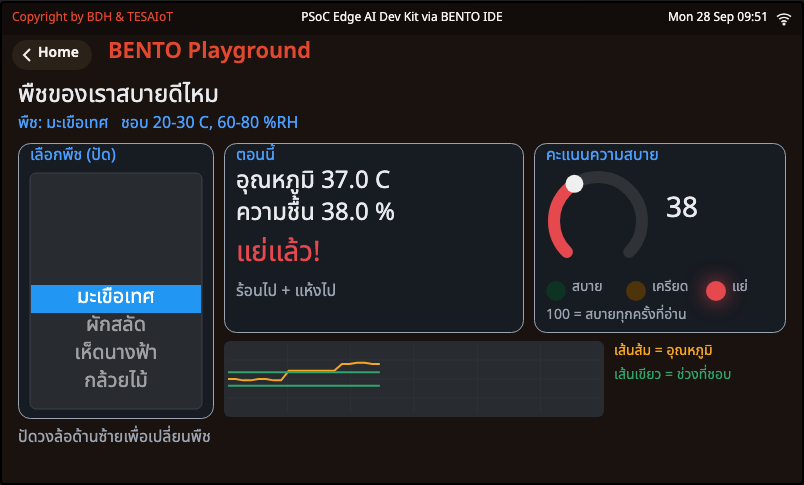
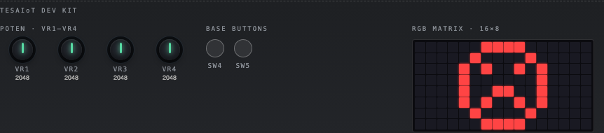

<div class="cap">😢 แย่แล้ว — จำลอง 37 °C / 38 %</div>

</div>
</div>

<div class="think">

**คิด:** พืชของกลุ่มเรา ช่วงอุณหภูมิ ………–……… °C ความชื้น ………–……… % — **เอาข้อมูลมาจากแหล่งไหน?** แหล่งนั้นน่าเชื่อถือแค่ไหน?

</div>

---

## กิจกรรม 2 — หัวใจของโค้ด: กฎตัดสิน

<div class="cols">
<div class="c60">

```python
def judge(t, h, crop):
    name, t_lo, t_hi, h_lo, h_hi = crop
    problems = []
    if t > t_hi:
        problems.append("ร้อนไป")
    if h < h_lo:
        problems.append("แห้งไป")
    # ... (หนาวไป / ชื้นไป เขียนแบบเดียวกัน)
    if not problems:
        return 0, "อยู่ในช่วงที่ชอบ"
    far = (t < t_lo - 3) or (t > t_hi + 3) or (h < h_lo - 10) or (h > h_hi + 10)
    return (2 if far else 1), " + ".join(problems)
```

</div>
<div>

**อ่านโค้ดให้ออก**
- `problems` = รายการ "อะไรหลุดช่วง" — ว่าง = 😊 **สบาย**
- `far` = หลุด **เกิน 3 °C** หรือ **เกิน 10 %RH** → 😢 **แย่แล้ว**
- ไม่ถึง `far` → 😐 **เริ่มเครียด**
- เหตุผลที่คืนไป (`"ร้อนไป + แห้งไป"`) คือข้อความที่ขึ้นบนจอ

<div class="think">

**ลองแก้:** ถ้าพืชของกลุ่ม "ทนร้อนได้มากกว่าทนแห้ง" จะแก้บรรทัด `far` อย่างไร?

</div>

</div>
</div>

---

<!-- _class: brk -->

# ☕ พัก 10 นาที

<div class="big">1:30 – 1:40</div>

**ระหว่างพัก ลองทายเล่น:** ปั๊มน้ำจริงที่ "เปิด-ปิด-เปิด-ปิด" 30 ครั้งในหนึ่งนาที จะเกิดอะไรขึ้นกับมัน?

(เฉลยในกิจกรรม 3)

---

<!-- _class: sec -->

<div class="when">1:40 – 2:10 · คนขับ = คนที่ 1</div>

# กิจกรรม 3 — รดน้ำอัตโนมัติ

[`sf1_03_auto_irrigation.py`](https://github.com/Advance-Innovation-Centre-AIC/aiot-development-for-smart-farm/blob/main/s1/sf1_03_auto_irrigation.py) · ลูกบิด 3 ตัว + ปุ่ม 2 ตัว · ช่องกันกระพือ (hysteresis)

<div class="chal">🏆 <b>ท้าทาย:</b> รดน้ำให้ดินชื้นพอ <b>โดยปั๊มเปิดน้อยครั้งที่สุด</b> และ <b>ห้ามถังแห้ง</b> เด็ดขาด</div>


---

## ภาพจริงในฟาร์ม: บอร์ดของเราคือ Smart IoT Gateway

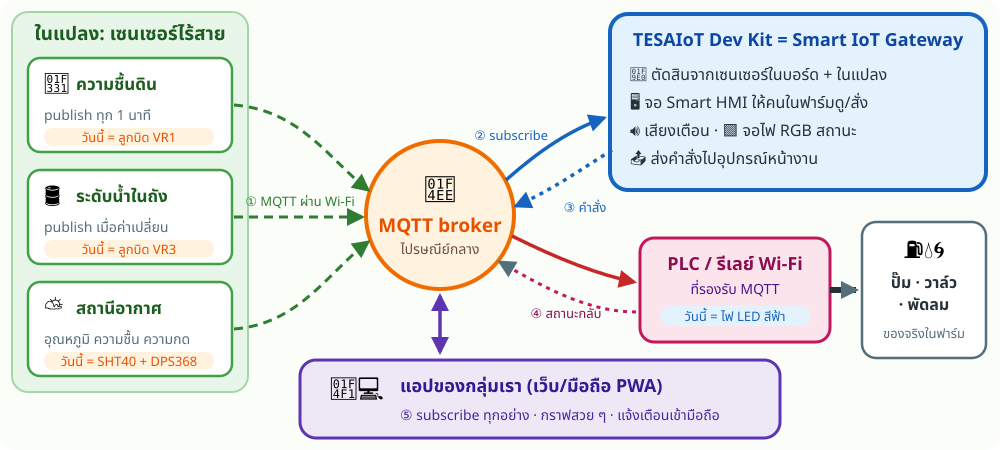

<div class="think" style="text-align:center">

**วันนี้:** ลูกบิด = เซนเซอร์ไร้สาย · ไฟสีฟ้า = PLC คุมปั๊ม &nbsp;·&nbsp; **คาบหน้า:** ต่อจริงผ่าน MQTT

</div>

<div class="cap">อินโฟกราฟิกวาดประกอบ — "PLC / รีเลย์ Wi-Fi ที่รองรับ MQTT" หมายถึงอุปกรณ์ประเภทนี้โดยทั่วไป ไม่ได้ระบุยี่ห้อ · ดูเพิ่ม: <a href="https://www.youtube.com/watch?v=MHUWmhuaC1A">ระบบ IoT sensor สำหรับความชื้นในดิน</a> (mju.mooc · 5:13) · <a href="https://www.youtube.com/watch?v=-OFNvMDLv5g">Control PLC by MQTT Client</a> (ThaiPLC · 6:21)</div>

---

## เบื้องหลัง: ทำไมปั๊มต้องมี "ช่องกันกระพือ"

<svg viewBox="0 0 1000 310" xmlns="http://www.w3.org/2000/svg" font-family="sans-serif">
  <!-- left: with hysteresis -->
  <text x="255" y="22" text-anchor="middle" font-size="21" font-weight="700" fill="#2e7d32">มีช่องกันกระพือ (HYST = 5)</text>
  <line x1="40" y1="220" x2="470" y2="220" stroke="#b0bec5"/>
  <line x1="40" y1="160" x2="470" y2="160" stroke="#e53935" stroke-width="2.5" stroke-dasharray="9 6"/>
  <line x1="40" y1="130" x2="470" y2="130" stroke="#43a047" stroke-width="2.5" stroke-dasharray="9 6"/>
  <text x="44" y="178" font-size="15" fill="#e53935">เปิดปั๊ม &lt; 40 %</text>
  <text x="44" y="124" font-size="15" fill="#2e7d32">ปิดปั๊ม &gt; 45 %</text>
  <path d="M40 52 L70 70 L100 86 L130 104 L160 124 L185 145 L205 161 L220 150 L240 138 L258 129 L275 136 L300 142 L330 150 L360 155 L385 162 L400 161 L415 148 L432 137 L450 129 L470 134" fill="none" stroke="#1e88e5" stroke-width="4"/>
  <text x="330" y="70" font-size="16" fill="#1565c0">ความชื้นดิน</text>
  <rect x="40" y="244" width="430" height="26" rx="4" fill="#eceff1"/>
  <rect x="205" y="244" width="53" height="26" fill="#43a047"/><rect x="400" y="244" width="50" height="26" fill="#43a047"/>
  <text x="44" y="296" font-size="16" fill="#37474f">ปั๊ม:  เปิด 2 ครั้ง — เปิดนานพอให้น้ำลงดินจริง</text>
  <!-- right: without -->
  <text x="745" y="22" text-anchor="middle" font-size="21" font-weight="700" fill="#c62828">ไม่มีช่องกันกระพือ (HYST = 0)</text>
  <line x1="530" y1="220" x2="960" y2="220" stroke="#b0bec5"/>
  <line x1="530" y1="160" x2="960" y2="160" stroke="#e53935" stroke-width="2.5" stroke-dasharray="9 6"/>
  <text x="534" y="178" font-size="15" fill="#e53935">เปิด/ปิดที่ 40 % จุดเดียว</text>
  <path d="M530 52 L560 72 L590 92 L620 118 L645 146 L660 158 L670 164 L680 155 L690 166 L700 154 L710 167 L720 156 L730 165 L740 153 L750 166 L760 155 L770 164 L780 152 L790 167 L800 156 L810 165 L820 154 L830 166 L840 157 L850 164 L860 153 L870 166 L880 156 L890 165 L900 154 L910 166 L920 157 L930 164 L940 155 L950 165 L960 157" fill="none" stroke="#1e88e5" stroke-width="4"/>
  <rect x="530" y="244" width="430" height="26" rx="4" fill="#eceff1"/>
  <g fill="#e53935"><rect x="665" y="244" width="10" height="26"/><rect x="685" y="244" width="10" height="26"/><rect x="705" y="244" width="10" height="26"/><rect x="725" y="244" width="10" height="26"/><rect x="745" y="244" width="10" height="26"/><rect x="765" y="244" width="10" height="26"/><rect x="785" y="244" width="10" height="26"/><rect x="805" y="244" width="10" height="26"/><rect x="825" y="244" width="10" height="26"/><rect x="845" y="244" width="10" height="26"/><rect x="865" y="244" width="10" height="26"/><rect x="885" y="244" width="10" height="26"/><rect x="905" y="244" width="10" height="26"/><rect x="925" y="244" width="10" height="26"/><rect x="945" y="244" width="10" height="26"/></g>
  <text x="534" y="296" font-size="16" fill="#c62828">ปั๊ม: เปิด-ปิด 15 ครั้ง ทั้งที่ดินแทบไม่ได้น้ำ!</text>
</svg>

<div class="cols">
<div>

- ค่าเซนเซอร์จริง **สั่นไปมาเล็กน้อย** เสมอ (สัญญาณรบกวน) — ถ้าเกณฑ์เปิดกับปิดเป็นเลขเดียวกัน ปั๊มจะ **กระพือ** ตามทุกการสั่น
- ทางแก้: เปิดที่ **เกณฑ์** แต่ปิดที่ **เกณฑ์ + HYST** — ต้องชื้นขึ้นจริง ๆ ถึงจะปิด

</div>
<div>

**ปั๊มที่กระพือเสียอะไรบ้าง**
- มอเตอร์กินกระแส **ตอนสตาร์ต** สูงกว่าตอนเดินหลายเท่า → ร้อน สิ้นเปลืองไฟ
- หน้าสัมผัสรีเลย์สึกเร็ว · ท่อกระแทก (water hammer)

</div>
</div>

---

## Hysteresis อยู่รอบตัวเรา: แอร์ ตู้เย็น เตารีด

<div class="cols">
<div class="c55">

<div class="vid">
<iframe width="320" height="180" src="https://www.youtube.com/embed/GYd6gmAnNn4" title="Temperature hysteresis — Texas Instruments" loading="lazy" frameborder="0" allowfullscreen></iframe>
</div>

<b>Temperature hysteresis</b> — ช่อง Texas Instruments · 6:53 · EN<br>
<https://www.youtube.com/watch?v=GYd6gmAnNn4>

</div>
<div>

**ตัวอย่าง: แอร์แบบเปิด-ปิด (ไม่ใช่อินเวอร์เตอร์) ตั้ง 25 °C**
- คอมเพรสเซอร์ **ติด** เมื่อห้องร้อนถึง ~26 °C
- **ดับ** เมื่อเย็นลงถึง ~24 °C
- ช่วงกลาง 24–26 °C = ช่องกันกระพือ → ไม่ติด-ดับทุกนาที

<div class="think">

**ในฟาร์ม:** พัดลมโรงเรือน พ่นหมอกโรงเห็ด ฮีตเตอร์กกลูกไก่ — **ทุกตัว** ต้องมีช่องกันกระพือ ลองบอกว่าแต่ละตัวควรกว้างแค่ไหน

</div>

</div>
</div>

<div class="cols">
<div class="c40">

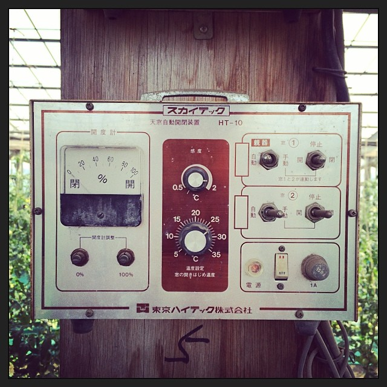

<div class="cap">กล่องควบคุมหน้าต่างหลังคาโรงเรือนอัตโนมัติ (ญี่ปุ่น) — ภาพ: yoppy / Wikimedia Commons — CC BY 2.0</div>

</div>
<div>

**ของจริงในโรงเรือน:** ลูกบิดล่าง 温度設定 = **อุณหภูมิที่เริ่มเปิดหน้าต่าง** (5–35 °C) · ลูกบิดบน 感度 = **ความไว 0.5–2 °C** — ทำหน้าที่แบบเดียวกับ **ช่องกันกระพือ** ที่ชาวสวนตั้งเองได้ด้วยมือ

เทียบกับกิจกรรม 3: **VR2 = เกณฑ์** · **HYST = ความไว**

</div>
</div>

---

## กิจกรรม 3 — รดน้ำอัตโนมัติ

<div class="cols">
<div class="c40">

<div class="goal">

🎯 **เป้าหมาย:** สร้างระบบรดน้ำที่ตัดสินเองจากความชื้นดิน และ **ปลอดภัย** เมื่อน้ำในถังหมด

</div>

| ของบนบอร์ด | แทนอะไร |
|---|---|
| **VR1** | เซนเซอร์ความชื้นดิน (จำลอง) |
| **VR2** | เกณฑ์เปิดปั๊ม |
| **VR3** | น้ำในถัง |
| **ไฟสีฟ้าบนบอร์ด** (RGB_BLUE) | ปั๊มน้ำ |
| **สวิตช์บนจอ** | อัตโนมัติ / มือ |
| **SW5** กดหนึ่งครั้ง | รดน้ำเอง 10 วินาที (กดอีกครั้ง = หยุด) |
| **SW6** | ล้างตัวนับ |

<div class="src">จอไฟ RGB: ซ้าย = ความชื้นดิน (เส้นแดง = เกณฑ์) · กลางสีเขียว = น้ำกำลังไหล · ขวา = น้ำในถัง · กราฟบนจอ: ฟ้า = ความชื้นดิน, แดง = เกณฑ์เปิด, เขียว = เกณฑ์ปิด</div>

</div>
<div class="shot">

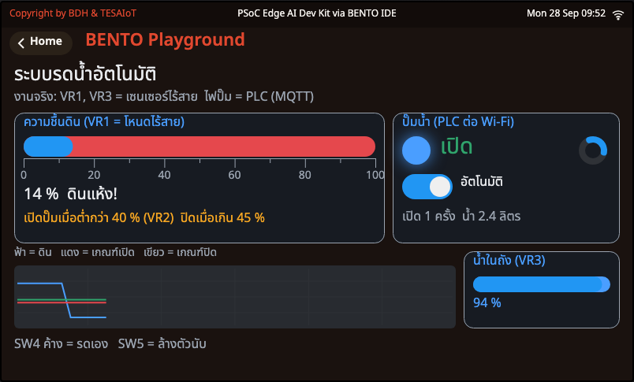

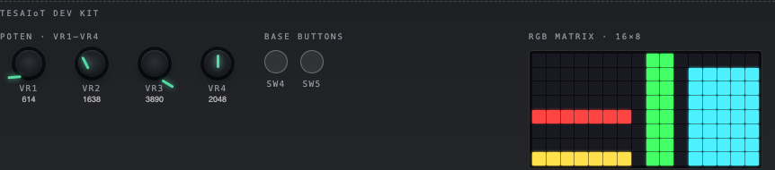

<div class="cap">ภาพจริงจาก BENTO Emulator — หมุน VR1 ลง (ดินแห้ง) ปั๊มเปิด · แถวล่าง: ลูกบิด VR1–VR3 และจอไฟ RGB แสดงดิน/น้ำไหล/ถัง</div>

</div>
</div>

---

## กิจกรรม 3 — ทดลองให้เห็นการกระพือ

<div class="cols">
<div>

**ลองทำ**
1. หมุน **VR3** ให้ถังเต็มก่อน
2. หมุน **VR1** ลงช้า ๆ → จดค่าที่ปั๊ม **เปิด** · หมุนขึ้น → จดค่าที่ปั๊ม **ปิด**
3. **การทดลอง:** หมุน VR1 ค้างตรงขอบเกณฑ์ ขยับเบา ๆ 30 วินาที **นับครั้งที่ปั๊มเปิด**
4. แก้โค้ดเป็น `HYST = 0` แล้วทำข้อ 3 ซ้ำ (กราฟ: เส้นแดงกับเขียวทับกันเป็นเส้นเดียว)
5. แตะ **สวิตช์บนจอ** เป็น "มือ" → หมุน VR1 จนดินแห้ง ปั๊มเปิดเองไหม? กด SW5 หนึ่งครั้งล่ะ?
6. หมุน **VR3** จนถังเหลือ < 10 % ขณะปั๊มเปิด → เกิดอะไรขึ้น? กด **SW5** แล้วปั๊มยอมเดินไหม?


</div>
<div class="shot">

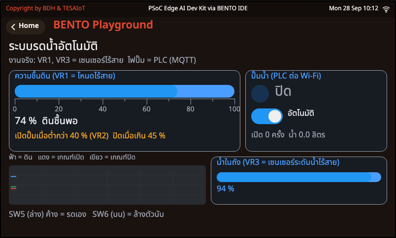

<div class="cap">ดินชื้นพอ — ปั๊มหยุด</div>

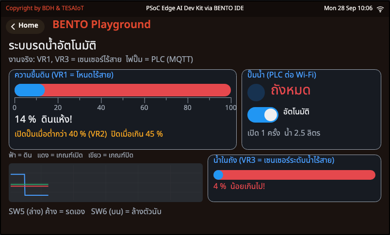

<div class="cap">น้ำในถังหมด — ปั๊มถูกล็อก (กันปั๊มเดินตัวเปล่า)</div>

</div>
</div>

<div class="think">

**คิด:** ถ้าปั๊มจริงเปิด-ปิดถี่แบบ HYST = 0 จะเกิดอะไรขึ้นกับปั๊มและค่าไฟ? · ฟาร์มจริงต้องมี **โหมดมือ** ไว้ทำไม? · ทำไมต้องห้ามปั๊มเดินตอนถังหมด **แม้ผู้ใช้กด SW5 เอง**?

</div>

---

## กิจกรรม 3 — หัวใจของโค้ด: กฎปั๊มแบบมีช่องกันกระพือ

<div class="cols">
<div class="c55">

```python
def pump_decision(pump_on, soil, th):
    if not pump_on and soil < th:
        return True
    if pump_on and soil > th + HYST:
        return False
    return pump_on


def should_run(auto_wants, manual, tank_ok):
    return (auto_wants or manual) and tank_ok
```

- ปั๊ม **ปิดอยู่** + ดินแห้งกว่าเกณฑ์ → **เปิด**
- ปั๊ม **เปิดอยู่** + ดินชื้นเกิน เกณฑ์ + `HYST` → **ปิด**
- อยู่ระหว่างกลาง → **คงสถานะเดิม** ← นี่แหละช่องกันกระพือ
- `should_run`: ถังน้ำไม่พอ = **ห้ามเดิน** ไม่ว่าใครสั่ง

</div>
<div class="shot">


<div class="cap">กราฟล่างซ้าย: เส้นฟ้า = ความชื้นดิน · เส้นแดง = เกณฑ์เปิด · เส้นเขียว = เกณฑ์ปิด — ช่องระหว่างแดงกับเขียวคือ HYST</div>

</div>
</div>

---

<!-- _class: sec -->

<div class="when">2:10 – 2:30 · คนขับ = คนที่ 2</div>

# กิจกรรม 4 — แท็งก์น้ำ/รถไถเอียงเกินไหม

[`sf1_04_tank_tilt.py`](https://github.com/Advance-Innovation-Centre-AIC/aiot-development-for-smart-farm/blob/main/s1/sf1_04_tank_tilt.py) · IMU BMI270 · bubble level บนจอไฟ RGB · นับแรงกระแทก

<div class="chal">🏆 <b>ท้าทาย:</b> เกม <b>ประคองแท็งก์</b> — ถือบอร์ดเดินรอบโต๊ะ 1 รอบ ให้จุดบนจอไฟ RGB อยู่ใน <b>เป้าสีฟ้า</b> (เอียงไม่เกิน 3°) นานที่สุด · ระวังสาย USB!</div>


---

## เบื้องหลัง: เครื่องวัดความเร่ง MEMS ทำงานอย่างไร

<div class="cols">
<div>

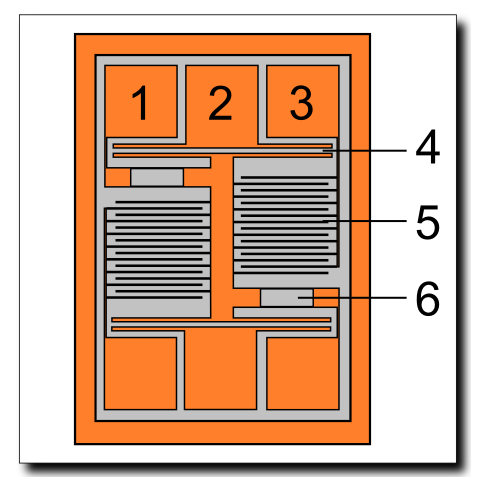

<div class="cap">หลักการ accelerometer แบบตัวเก็บประจุ — ภาพ: Tosaka / Wikimedia Commons — CC BY 3.0</div>

</div>
<div>

- ข้างในชิปมี **มวลจิ๋วแขวนบนสปริงซิลิคอน** อยู่ระหว่างแผ่นขั้วไฟฟ้า
- บอร์ดเร่ง/เอียง → มวลขยับ → **ระยะห่างแผ่นเปลี่ยน → ค่าความจุเปลี่ยน** (วัดด้วยค่าความจุเหมือน SHT40 แต่ที่นี่ "ระยะห่าง" เปลี่ยน ไม่ใช่ชั้นพอลิเมอร์)
- ทำ 3 ชุดตั้งฉากกัน = วัด 3 แกน X Y Z
- **อยู่นิ่ง ๆ ก็วัดได้ 1 g** (9.81 m/s²) — นั่นคือแรงโน้มถ่วง

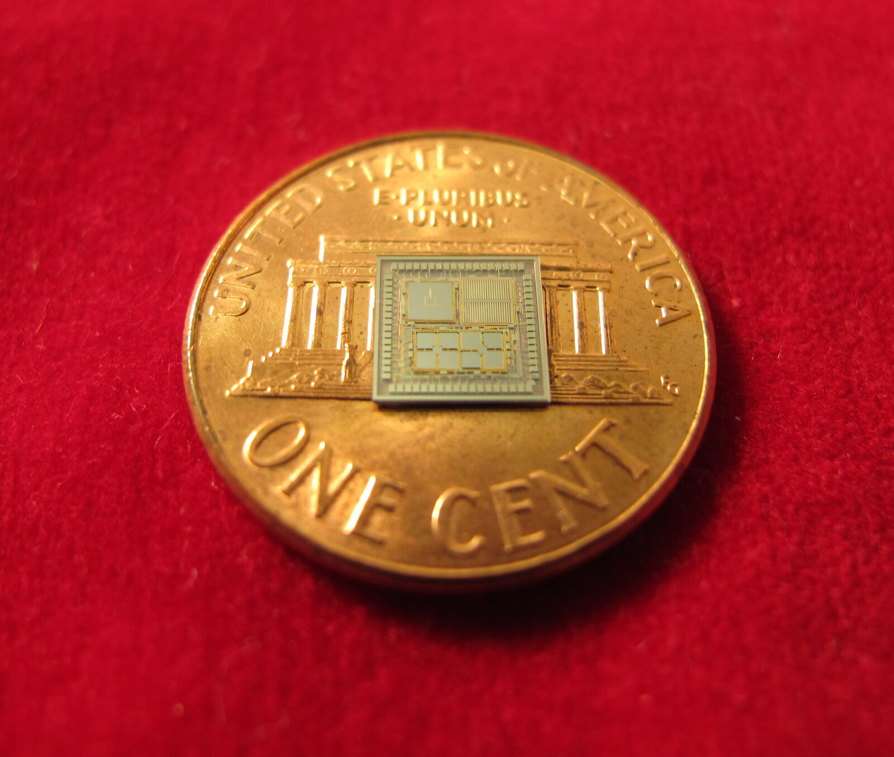

<div class="cap">IMU แบบ MEMS เทียบกับเหรียญ — ภาพ: University of Michigan / DARPA — สาธารณสมบัติ</div>

</div>
<div>

<div class="vid" style="flex-direction:column">
<iframe width="300" height="169" src="https://www.youtube.com/embed/KZVgKu6v808" title="How a Smartphone Knows Up from Down — engineerguy" loading="lazy" frameborder="0" allowfullscreen></iframe>
<div><b>How a Smartphone Knows Up from Down (accelerometer)</b><br>engineerguy · 4:24 · EN<br><https://www.youtube.com/watch?v=KZVgKu6v808></div>
</div>

</div>
</div>

---

## เบื้องหลัง: มุมเอียงคำนวณจากแรงโน้มถ่วง

<div class="cols">
<div class="c55">

<svg viewBox="0 0 560 300" xmlns="http://www.w3.org/2000/svg" font-family="sans-serif">
  <defs><marker id="ag" markerUnits="userSpaceOnUse" viewBox="0 0 12 12" markerWidth="20" markerHeight="20" refX="10" refY="6" orient="auto"><path d="M0,0 L12,6 L0,12 z" fill="#e53935"/></marker>
  <marker id="ab" markerUnits="userSpaceOnUse" viewBox="0 0 12 12" markerWidth="20" markerHeight="20" refX="10" refY="6" orient="auto"><path d="M0,0 L12,6 L0,12 z" fill="#1e88e5"/></marker>
  <marker id="ac" markerUnits="userSpaceOnUse" viewBox="0 0 12 12" markerWidth="20" markerHeight="20" refX="10" refY="6" orient="auto"><path d="M0,0 L12,6 L0,12 z" fill="#43a047"/></marker></defs>
  <path d="M30 270 L530 270 L530 110 Z" fill="#d7ccc8" stroke="#8d6e63" stroke-width="2"/>
  <text x="110" y="262" font-size="22" fill="#5d4037">θ</text>
  <g transform="translate(300 176) rotate(-17.7)">
    <rect x="-70" y="-78" width="140" height="78" rx="10" fill="#90caf9" stroke="#1565c0" stroke-width="3"/>
    <text x="0" y="-50" text-anchor="middle" font-size="19" fill="#0d47a1">แท็งก์น้ำ</text>
    <line x1="10" y1="-26" x2="10" y2="44" stroke="#43a047" stroke-width="4" marker-end="url(#ac)"/>
    <line x1="10" y1="-26" x2="-62" y2="-26" stroke="#1e88e5" stroke-width="4" marker-end="url(#ab)"/>
  </g>
  <line x1="287" y1="138" x2="287" y2="240" stroke="#e53935" stroke-width="5" marker-end="url(#ag)"/>
  <text x="300" y="232" font-size="20" font-weight="700" fill="#e53935">g</text>
  <text x="30" y="40" font-size="19" fill="#43a047">az = g·cos θ (ตั้งฉากกับพื้นเอียง)</text>
  <text x="30" y="68" font-size="19" fill="#1e88e5">ay = g·sin θ (ขนานกับพื้นเอียง)</text>
</svg>

</div>
<div>

$$\text{roll} = \operatorname{atan2}(a_y,\ |a_z|)$$

- วางราบ: $a_y = 0,\ a_z = 9.81$ → roll = 0°
- เอียงมาก: $a_y$ โตขึ้น $a_z$ เล็กลง → มุมโตขึ้น (pitch คิดแบบเดียวกันจาก $a_x$)

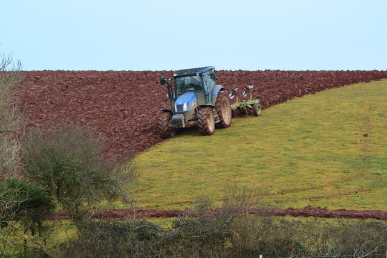

<div class="cap">รถไถบนเนินชัน — ภาพ: David Martin (geograph.org.uk) / Wikimedia Commons — CC BY-SA 2.0</div>

<div class="think">

**ของจริงบนโต๊ะเรา:** บอร์ดของผู้สอนวางปกติแต่ IMU อ่านได้ $a_y ≈ -6.2,\ a_z ≈ +7.7$ m/s² → atan2(−6.2, 7.7) ≈ −39° คือ **เอียงราว 39°**
แปลว่า IMU บนบอร์ดไม่ได้วางราบกับโต๊ะ — โค้ดจึง **วัดท่าตอนเริ่ม 1 วินาทีเป็นศูนย์** (`measure_zero()`) และกด **SW5** ตั้งศูนย์ใหม่ได้

</div>

</div>
</div>

---

## กิจกรรม 4 — แท็งก์น้ำ/รถไถเอียงเกินไหม

<div class="cols">
<div class="c40">

<div class="goal">

🎯 **เป้าหมาย:** เตือนเมื่อแท็งก์/รถไถ **เอียงเกินมุมปลอดภัย** และนับแรงกระแทก

</div>

<div class="try">

**ลองทำ**
1. **วางบอร์ดนิ่ง ๆ ตอนเริ่ม 1 วินาที** → บอร์ดถือท่านั้นเป็น "ศูนย์" เอง (ขยับตอนเริ่ม → กด **SW5** ตั้งศูนย์ใหม่)
2. ค่อย ๆ เอียงจนไฟแดงบนบอร์ดติด + ได้ยินเสียง (เข็มเลยเลข 20) → **จดมุมที่เตือน**
3. เอียงขวา จุดวิ่งไปทางไหน? (กลับด้าน → ลองแก้เครื่องหมายใน `bubble_cell()`)
4. ยกบอร์ดเล็กน้อยแล้ววางกระแทกโต๊ะ **เบา ๆ** → นับแรงกระแทก (ตัวนับไม่ขึ้น? โค้ดอ่านทุก 0.5 วินาที แรงกระแทกสั้น ๆ อาจหลุด — ลองลด `BUMP_G`)
5. **เกมประคองแท็งก์** — บรรทัด "อยู่ในเป้า" นับวินาทีให้ · กด **SW6** ล้างแล้วแข่งกับกลุ่มข้าง ๆ

</div>

<div class="warn">อย่าเขย่าบอร์ดแรงขณะเสียบสาย USB · เดินถือบอร์ดระวังสายหลุด/สะดุด</div>

</div>
<div class="shot">

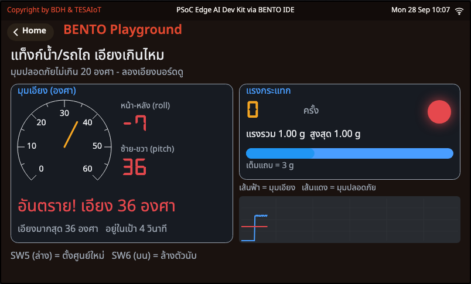

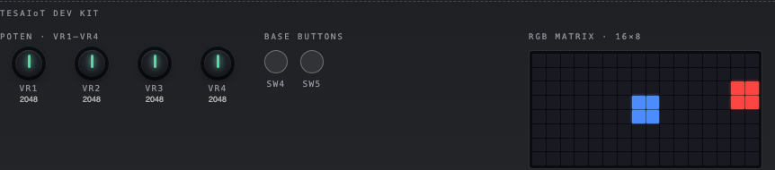

<div class="cap">ภาพจริงจาก BENTO Emulator — ลากลูกบอล TILT ให้เอียงเกินมุมปลอดภัย → จอเตือน "อันตราย!" จุดบนจอไฟ RGB วิ่งออกจากเป้า</div>

</div>
</div>

---

## กิจกรรม 4 — หัวใจของโค้ด + คำถามชวนคิด

<div class="cols">
<div>

```python
def tilt_angles(ax, ay, az):
    roll = math.degrees(math.atan2(ay, abs(az)))
    pitch = math.degrees(math.atan2(-ax, math.sqrt(ay * ay + az * az)))
    return roll, pitch

# ... ในลูปหลัก
        roll, pitch = raw_roll - roll0, raw_pitch - pitch0  # 2) คิด
        tilt = int(max(abs(roll), abs(pitch)))
        # ...
        level = tilt_level(tilt)
```

</div>
<div class="shot">

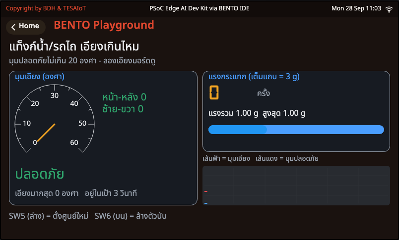

<div class="cap">วางราบหลังตั้งศูนย์ — จุดอยู่ในเป้า</div>

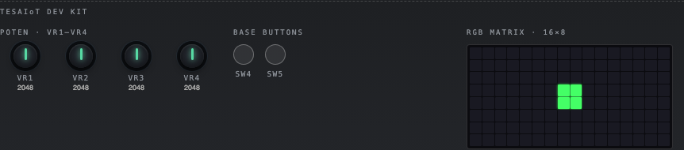

</div>
</div>

<div class="think">

**คิด:** งาน ……… ในฟาร์มควรตั้ง `SAFE_DEG` = ……… องศา เพราะ ………
(ตัวอย่างงาน: รถไถบนคันนา · แท็งก์น้ำบนขาตั้ง · รถขนผลผลิตบนทางลาด · ลังไข่บนสายพาน)

</div>

---

<!-- _class: sec -->

<div class="when">2:30 – 2:50 · สลับกันขับ</div>

# ภารกิจกลุ่ม — แผงควบคุมฟาร์มของเรา

[`sf1_05_my_farm_dashboard.py`](https://github.com/Advance-Innovation-Centre-AIC/aiot-development-for-smart-farm/blob/main/s1/sf1_05_my_farm_dashboard.py) · รวมทุกอย่างที่ทำมาเป็นแผงเดียว · แก้ทุก `TODO`

<div class="chal">🏆 <b>ท้าทาย:</b> ฟาร์มไหนได้ <b>คะแนนสุขภาพ 100</b> ก่อน — แล้วใครทำให้ <b>ต่ำกว่า 50</b> ได้ด้วยวิธีที่แปลกที่สุด?</div>


---

## ภารกิจกลุ่ม — คะแนนสุขภาพฟาร์ม

<div class="cols">
<div class="c40">

<div class="goal">

🎯 **เป้าหมาย:** แผงควบคุมที่เป็น **ของกลุ่มเรา** — ชื่อฟาร์ม พืช/สัตว์ เกณฑ์ คำแนะนำ

</div>

<div class="try">

1. แก้ทุกบรรทัดที่มี `TODO` (ชื่อฟาร์ม พืช/สัตว์ เกณฑ์ **TEMP_OFFSET จากกิจกรรม 1**)
2. แตะแถบด้านบนสลับ 2 หน้า: **ภาพรวม · กราฟ** (เหตุการณ์ล่าสุดขึ้นใต้คะแนน)
3. ทำให้ **คะแนนสุขภาพฟาร์ม** ได้ทั้ง **100** และ **ต่ำกว่า 50** → ถ่ายรูปจอทั้งสองกรณี แนบใบงาน
4. จอไฟ RGB โชว์คะแนน · กด **SW6** สลับเป็นอุณหภูมิ · กด **SW5** = เริ่ม/หยุดรดน้ำเอง
5. (โบนัส) เพิ่มแท็บที่ 3 ด้วย `tabs.add_tab("ชื่อ")` หรือใช้ **VR3** = น้ำในถัง, **VR4** = แสงแดด

</div>

</div>
<div class="shot">

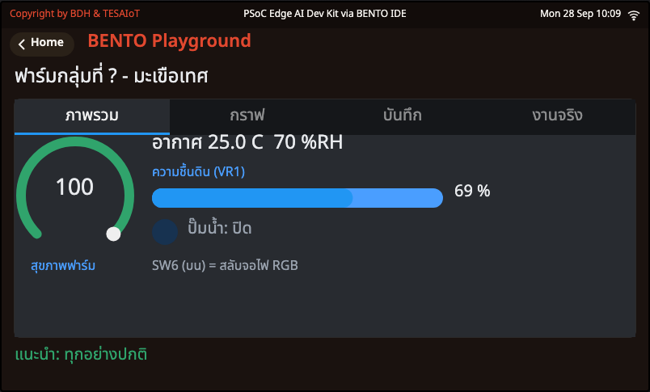

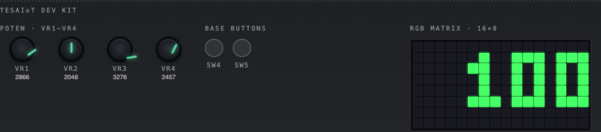

<div class="cap">ภาพจริงจาก BENTO Emulator — ฟาร์มสุขภาพดี (จำลอง 25 °C, 70 %RH, VR1 ดินชื้น) · ใน Emulator เนื้อหาในแท็บวาดสูงกว่าบนบอร์ดจริงราว 20 px</div>

</div>
</div>

---

## ภารกิจกลุ่ม — คะแนนคิดอย่างไร

<div class="cols">
<div>

```python
def health(t, h, soil):
    # คะแนนสุขภาพฟาร์ม 0-100 (TODO: ปรับน้ำหนักตามความสำคัญของงานกลุ่ม)
    if t is None or h is None:
        return 0
    score = 100
    if t < T_LO or t > T_HI:
        score -= 35
    if h < H_LO or h > H_HI:
        score -= 25
    if soil < SOIL_MIN:
        score -= 40
    return max(0, score)
```

</div>
<div class="shot">

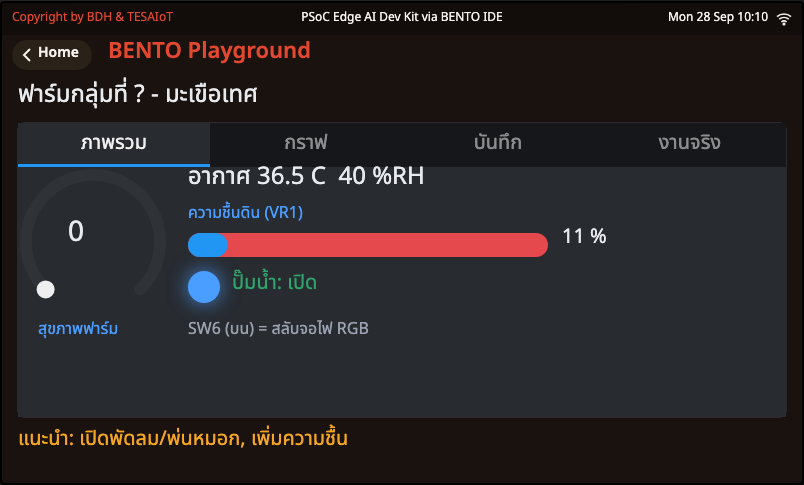

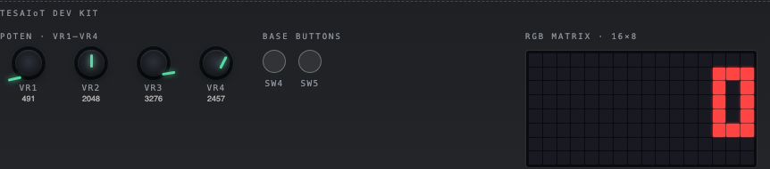

<div class="cap">ฟาร์มกำลังแย่ — จำลอง 36.5 °C, 40 %RH, ดินแห้ง</div>

</div>
</div>

<div class="think">

**คิด:** ถ้าเป็นเจ้าของฟาร์มจริง ปัจจัยไหนควร "หักคะแนนหนักที่สุด"? ทำไม? ลองปรับน้ำหนักในโค้ดให้ตรงกับความเห็นของกลุ่ม

</div>

---

## ภารกิจกลุ่ม — แท็บกราฟ และเหตุการณ์ล่าสุด

<div class="cols">
<div class="shot">

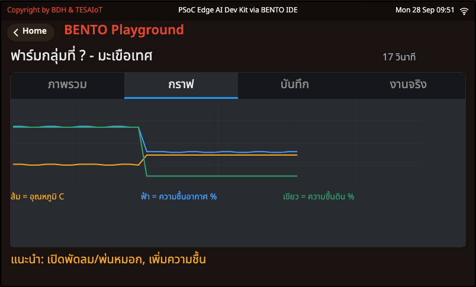

<div class="cap">📈 <b>กราฟ</b> — ส้ม = อุณหภูมิ · เขียว = ความชื้นดิน ย้อนหลัง</div>

</div>
<div class="shot">


<div class="cap">📋 <b>เหตุการณ์ล่าสุด</b> — ใต้ไฟปั๊ม: "วินาที 8: ฟาร์มแย่ลง (คะแนน 0)" จดลงใบงานทุกครั้งที่เปลี่ยน</div>

</div>
</div>

<div class="think">

**ในงานจริง:** ถ้าฟาร์มมีเซนเซอร์ไร้สายและ PLC ต่อ Wi-Fi บอร์ดนี้คือ **แผงควบคุมกลาง** ของทั้งฟาร์ม — กลุ่มเราจะวางมันไว้ **ตรงไหน** ของฟาร์ม และให้ **ใคร** ดู?

</div>

<div class="cap">ภาพจริงจาก BENTO Emulator — ค่าจำลอง ไม่ใช่ค่าจากบอร์ดจริง</div>

---

<!-- _class: sec -->

<div class="when">2:50 – 3:00</div>

# ไอเดียโปรเจกต์ + Exit ticket

---

## ไอเดียโปรเจกต์ตั้งต้น — เลือกปัญหาที่กลุ่มสนใจ

<div class="tiles" style="grid-template-columns:repeat(3,1fr)">
<div class="tile">
<b class="t">🧊 กล่องขนส่งผักห้องเย็น</b>
<span class="chip s">วัด</span> SHT40 อุณหภูมิในกล่อง · BMI270 แรงกระแทกระหว่างทาง<br>
<span class="chip d">ตัดสิน</span> อุ่นเกิน 8 °C นานเกินไหม? ตกกระแทกกี่ครั้ง?<br>
<span class="chip a">ทำ</span> จอไฟแดง + เสียง · สรุป "คะแนนคุณภาพการขนส่ง"
</div>
<div class="tile">
<b class="t">💧 ถังเก็บน้ำหมู่บ้าน</b>
<span class="chip s">วัด</span> VR3 = ระดับน้ำ · BMI270 = ขาตั้งถังเอียง<br>
<span class="chip d">ตัดสิน</span> น้ำต่ำกว่า 20 %? ถังเอียงผิดปกติ?<br>
<span class="chip a">ทำ</span> หยุดปั๊ม แสดงแถบระดับน้ำบนจอไฟ
</div>
<div class="tile">
<b class="t">🍄 โรงเพาะเห็ด</b>
<span class="chip s">วัด</span> SHT40 ความชื้น 80–95 %<br>
<span class="chip d">ตัดสิน</span> ชื้นต่ำกว่าเกณฑ์ (มีช่องกันกระพือ)<br>
<span class="chip a">ทำ</span> LED = ปั๊มพ่นหมอก · นับเวลาพ่นรวม
</div>
<div class="tile">
<b class="t">🐔 เล้าไก่ไม่ร้อน</b>
<span class="chip s">วัด</span> อุณหภูมิ + ความชื้นในเล้า<br>
<span class="chip d">ตัดสิน</span> ดัชนีความร้อนเกินที่ไก่ทนได้?<br>
<span class="chip a">ทำ</span> เปิดพัดลม เสียงเตือน · (คาบ 3: เรดาร์ + ไมค์)
</div>
<div class="tile">
<b class="t">🌾 ยุ้งฉาง/โกดังข้าว</b>
<span class="chip s">วัด</span> ความชื้นในโกดัง · ความกดอากาศลดลง<br>
<span class="chip d">ตัดสิน</span> เสี่ยงเชื้อรา? ฝนกำลังมา?<br>
<span class="chip a">ทำ</span> เตือนให้ปิดโกดัง/คลุมผลผลิตที่ตากไว้
</div>
<div class="tile">
<b class="t">🍅 โรงเรือนมะเขือเทศ</b>
<span class="chip s">วัด</span> อากาศ + VR1 ความชื้นดิน<br>
<span class="chip d">ตัดสิน</span> คะแนนสุขภาพพืช<br>
<span class="chip a">ทำ</span> รดน้ำอัตโนมัติ + แผงควบคุม (ต่อยอดภารกิจวันนี้)
</div>
</div>

> ใบงานข้อ 9: เขียน **3 ปัญหา** (ใคร เดือดร้อนอะไร) → เซนเซอร์/ลูกบิดที่ใช้ → บอร์ดตัดสินอะไร ทำอะไร → **เลือก 1 ข้อไปต่อ ☑**

---

## Exit ticket (คนละ 1 ข้อ) + เกณฑ์ผ่านคาบ

<div class="cols">
<div>

<div class="goal">

**คนที่ 1:** สิ่งที่ **ประหลาดใจที่สุด** วันนี้คือ …

</div>

<div class="goal" style="border-color:#1e88e5;background:#e3f2fd">

**คนที่ 2:** ถ้าต่ออินเทอร์เน็ตได้ อยากให้ฟาร์ม **ส่งอะไรบอกเจ้าของ** …

</div>

</div>
<div>

**เกณฑ์ผ่านคาบ 1**
- ☐ รันครบ 4 กิจกรรม และกรอกตารางทุกช่อง
- ☐ แผงควบคุมฟาร์มแก้ `TODO` แล้ว มีรูปคะแนน 100 กับ < 50
- ☐ มีไอเดียโปรเจกต์ที่เลือกแล้ว 1 ข้อ

**การบ้าน (BENTO Emulator)**
- ใช้แผง **TESAIoT DEV KIT** + **ENVIRONMENT/TILT** แทนบอร์ดจริง
- แก้ `TODO` ให้เสร็จก่อนคาบ 2

</div>
</div>

---

## คาบหน้า: เกตเวย์ต่อเน็ต + แอปมือถือ/เว็บของคุณเอง

<div class="cols">
<div class="c55">


- บอร์ด = **Smart IoT Gateway**: publish ค่าจากกิจกรรมวันนี้ขึ้นอินเทอร์เน็ต และรับคำสั่งกลับ
- **ไม่ต้องทำทุกอย่างบนบอร์ด** — กลุ่มเราสร้าง **แอปเว็บ/มือถือ (PWA)** ของตัวเอง subscribe มาแสดงกราฟสวย ๆ และ **แจ้งเตือนเข้ามือถือ** — **จะเขียนเองหรือ vibe coding ก็ได้**
- เตรียมมา: **Hotspot มือถือ** ของกลุ่ม + โน้ตบุ๊กที่ติดตั้ง Python

</div>
<div>

<div class="vid">
<iframe width="300" height="169" src="https://www.youtube.com/embed/-K3zSs1a1yo" title="EP5 เข้าใจ MQTT และ HTTP — N Academy" loading="lazy" frameborder="0" allowfullscreen></iframe>
<div><b>EP5 เข้าใจ MQTT และ HTTP พื้นฐานสำคัญของการสื่อสารในระบบ IoT</b><br>N Academy · 8:15 · ภาษาไทย<br><https://www.youtube.com/watch?v=-K3zSs1a1yo></div>
</div>

<div class="vid">
<iframe width="300" height="169" src="https://www.youtube.com/embed/HCzQJMdHcy0" title="Pub Sub Model — HiveMQ" loading="lazy" frameborder="0" allowfullscreen></iframe>
<div><b>Pub Sub Model | MQTT Essentials Part 3</b><br>HiveMQ · 5:48 · EN<br><https://www.youtube.com/watch?v=HCzQJMdHcy0></div>
</div>

</div>
</div>

---

## ดูเพิ่มเติมนอกเวลา

<style scoped>
section table { font-size: .54em; }
section p { font-size: .9em; }
</style>

<div class="cols">
<div>

**คลิปทั้งหมดในคาบนี้**

| หัวข้อ | คลิป | ช่อง | ยาว |
|---|---|---|---|
| ฟาร์มอัจฉริยะ | [HandySense EP.1 ระบบเกษตรแม่นยำฟาร์มอัจฉริยะ](https://www.youtube.com/watch?v=kr3RPtK0sX8) | NECTEC | 6:13 |
| โรงเรือนอัจฉริยะ | [ปลูกพืชเป็นเรื่องง่ายด้วยโรงเรือนอัจฉริยะ](https://www.youtube.com/watch?v=cYTolXA-HdU) | เทคโนโลยีชาวบ้าน | 6:29 |
| รดน้ำด้วย IoT | [ตอนที่ 3 - ระบบ IoT sensor สำหรับความชื้นในดิน](https://www.youtube.com/watch?v=MHUWmhuaC1A) | mju.mooc | 5:13 |
| สั่ง PLC ด้วย MQTT | [Control PLC by MQTT Client](https://www.youtube.com/watch?v=-OFNvMDLv5g) | ThaiPLC | 6:21 |
| ห่วงโซ่ความเย็น | [Cold Chain คืออะไร ? ทำไมถึงสำคัญกับ "ทุกคน"](https://www.youtube.com/watch?v=IB7Zq7xcgLY) | Thai Refrigeration Association | 4:16 |
| ความชื้น | [Relative Humidity Measurement explained](https://www.youtube.com/watch?v=IoXwZ5CfKWY) | Rotronic | 4:46 |
| ความกดอากาศ | [How does atmospheric pressure affect weather?](https://www.youtube.com/watch?v=SWHj71qS_NA) | Met Office | 1:40 |
| accelerometer | [How a Smartphone Knows Up from Down](https://www.youtube.com/watch?v=KZVgKu6v808) | engineerguy | 4:24 |
| hysteresis | [Temperature hysteresis](https://www.youtube.com/watch?v=GYd6gmAnNn4) | Texas Instruments | 6:53 |
| MQTT (ไทย) | [EP5 เข้าใจ MQTT และ HTTP](https://www.youtube.com/watch?v=-K3zSs1a1yo) | N Academy | 8:15 |
| MQTT | [Pub Sub Model \| MQTT Essentials Part 3](https://www.youtube.com/watch?v=HCzQJMdHcy0) | HiveMQ | 5:48 |

</div>
<div class="c40">

**รู้จักบอร์ดให้ลึกขึ้น**

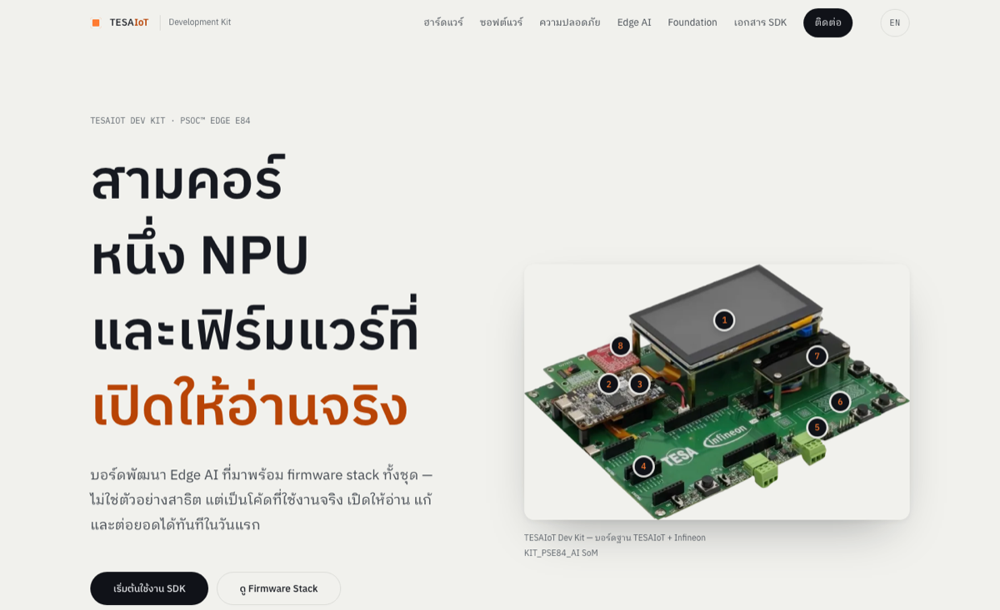

**TESAIoT Dev Kit SDK**
<https://tesaiot.github.io/tesaiot-pse84-devkit-sdk/>
ฮาร์ดแวร์ทั้งบอร์ด · ซอฟต์แวร์ · ความปลอดภัย · Edge AI · เอกสาร SDK

<div class="cap">ภาพหน้าเว็บ: TESAIoT Dev Kit SDK — tesaiot.github.io/tesaiot-pse84-devkit-sdk</div>

**วิดีโอ:** [Remote Flashing for TESAIoT Dev Kit via TESA Developer Hub](https://www.youtube.com/watch?v=TZEsLwwyBzw) — Thai Embedded Systems Association · 13:01

</div>
</div>

---

## อ้างอิงและเครดิต (1/2) — ภาพ

<style scoped>
section { font-size: 14px; }
section p, section li { margin: .04em 0; line-height: 1.25; }
section table { font-size: .9em; }
</style>

**ภาพจากแหล่งภายนอก**

| ภาพ | ผู้สร้าง | สัญญาอนุญาต | ที่มา |
|---|---|---|---|
| ผักไฮโดรโปนิกส์ อินโดนีเซีย | Setiawanap | CC BY-SA 4.0 | [Wikimedia Commons](https://commons.wikimedia.org/wiki/File:Budidaya_Tanaman_Sayur_Secara_Hidroponik_di_Kebun_SAP_Garden_Hidroponik,_Indonesia.jpg) |
| รถบรรทุกห้องเย็น | Spielvogel | CC0 | [Wikimedia Commons](https://commons.wikimedia.org/wiki/File:Isuzu_N-Series._Refrigerated_box_rigid_truck._Spielvogel_2013.jpg) |
| ระบบน้ำหยด รัฐเกรละ (ย่อขนาด) | Vis M | CC BY-SA 4.0 | [Wikimedia Commons](https://commons.wikimedia.org/wiki/File:Drip_irrigation_in_Kerala.jpg) |
| โรงเรือนไก่เนื้อ | Larry Rana (USDA) | สาธารณสมบัติ | [Wikimedia Commons](https://commons.wikimedia.org/wiki/File:Florida_chicken_house.jpg) |
| ชิปวัดความชื้นตระกูล SHT | wdwd | CC BY-SA 3.0 | [Wikimedia Commons](https://commons.wikimedia.org/wiki/File:Capacitive_humidity_sensor_SHT.jpg) |
| หัววัดความชื้นแบบตัวเก็บประจุ (ย่อขนาด) | Harke | สาธารณสมบัติ | [Wikimedia Commons](https://commons.wikimedia.org/wiki/File:Hygrometer_probe_rotronic_DV-2.jpg) |
| สถานีอากาศในแปลงเกษตร (แปลงเป็น JPEG พื้นขาว) | Noar 91 | CC BY-SA 3.0 | [Wikimedia Commons](https://commons.wikimedia.org/wiki/File:Station_météorologique_agricole_PULSONIC_Pulsiane.png) |
| กล่องควบคุมหน้าต่างโรงเรือน | yoppy | CC BY 2.0 | [Wikimedia Commons](https://commons.wikimedia.org/wiki/File:スカイテック_天窓自動開閉装置_HT-10_Apr_27,_2014.jpg) |
| หลักการ accelerometer แบบตัวเก็บประจุ | Tosaka | CC BY 3.0 | [Wikimedia Commons](https://commons.wikimedia.org/wiki/File:Accelerometer_(capacitance_type)_NT.PNG) |
| IMU แบบ MEMS เทียบเหรียญ | University of Michigan / DARPA | สาธารณสมบัติ | [Wikimedia Commons](https://commons.wikimedia.org/wiki/File:DARPA_TIMU_Michigan_Penny.jpg) |
| รถไถบนเนินชัน | David Martin | CC BY-SA 2.0 | [Wikimedia Commons](https://commons.wikimedia.org/wiki/File:Ploughing_a_steep_field_above_Kellaton_-_geograph.org.uk_-_4889475.jpg) |
| ภาพบอร์ด TESAIoT Dev Kit + ตำแหน่งหมุด 1–8 · ภาพหน้าเว็บ SDK | TESAIoT | ใช้โดยได้รับอนุญาตจากเจ้าของ | [TESAIoT Dev Kit SDK — tesaiot.github.io/tesaiot-pse84-devkit-sdk](https://tesaiot.github.io/tesaiot-pse84-devkit-sdk/) |

**ภาพที่ทำขึ้นเองสำหรับคอร์สนี้:** ปก · อินโฟกราฟิกทุกภาพที่วาดด้วย SVG/HTML (Sense→Decide→Act, 5 เสาหลัก, เซนเซอร์ความชื้น, ความชื้นสัมพัทธ์, ความกดอากาศ, การสอบเทียบ, ช่วงที่พืชชอบ, สี RGB, hysteresis, Smart IoT Gateway, มุมเอียง, เมนู GPIO & RGB Matrix) · **ภาพหน้าจอทุกภาพจาก BENTO Emulator** (ค่าเซนเซอร์เป็นค่าจำลอง)

**อีโมจิ:** Twemoji — Twitter, Inc. และผู้ร่วมพัฒนา (jdecked/twemoji) — CC BY 4.0 · สูตรคณิตศาสตร์แสดงด้วย KaTeX

**ข้อมูลฮาร์ดแวร์:** TESAIoT Dev Kit SDK — <https://tesaiot.github.io/tesaiot-pse84-devkit-sdk/> · ค่าที่วัดบนบอร์ดจริง (อุณหภูมิ 35.4–36.0 °C, ชิป IMU 37.2 °C, 1010.95 hPa, IMU เอียง ~39°) วัดบนบอร์ด TESAIoT Dev Kit ของผู้สอน firmware 2.4.1 เช้าวันที่ 28 ก.ย. 2569 · ค่าไอน้ำอิ่มตัวจากตารางมาตรฐานทางอุตุนิยมวิทยา

---

## อ้างอิงและเครดิต (2/2) — วิดีโอ

<style scoped>
section { font-size: 15px; }
section p, section li { margin: .04em 0; line-height: 1.25; }
section table { font-size: .9em; }
</style>

**วิดีโอ (YouTube — ลิขสิทธิ์เป็นของเจ้าของช่อง ใช้ด้วยการฝัง/ลิงก์)**

- [HandySense · EP.1 ระบบเกษตรแม่นยำฟาร์มอัจฉริยะ "เพื่อทุกคน"](https://www.youtube.com/watch?v=kr3RPtK0sX8) — NECTEC · 6:13
- [ปลูกพืชเป็นเรื่องง่ายด้วยโรงเรือนอัจฉริยะ ช่วย New Gen! สร้างอาชีพเกษตร](https://www.youtube.com/watch?v=cYTolXA-HdU) — เทคโนโลยีชาวบ้าน - Technologychaoban · 6:29
- [Relative Humidity Measurement explained](https://www.youtube.com/watch?v=IoXwZ5CfKWY) — Rotronic · 4:46
- [How does atmospheric pressure affect weather?](https://www.youtube.com/watch?v=SWHj71qS_NA) — Met Office - Learn About Weather · 1:40
- [Temperature hysteresis](https://www.youtube.com/watch?v=GYd6gmAnNn4) — Texas Instruments · 6:53
- [How a Smartphone Knows Up from Down (accelerometer)](https://www.youtube.com/watch?v=KZVgKu6v808) — engineerguy · 4:24
- [ตอนที่ 3 - ระบบ IoT sensor สำหรับความชื้นในดิน](https://www.youtube.com/watch?v=MHUWmhuaC1A) — mju.mooc · 5:13
- [Control PLC by MQTT Client](https://www.youtube.com/watch?v=-OFNvMDLv5g) — ThaiPLC · 6:21
- [Cold Chain คืออะไร ? ทำไมถึงสำคัญกับ "ทุกคน"](https://www.youtube.com/watch?v=IB7Zq7xcgLY) — Thai Refrigeration Association · 4:16
- [EP5 เข้าใจ MQTT และ HTTP พื้นฐานสำคัญของการสื่อสารในระบบ IoT](https://www.youtube.com/watch?v=-K3zSs1a1yo) — N Academy · 8:15
- [Pub Sub Model · MQTT Essentials Part 3](https://www.youtube.com/watch?v=HCzQJMdHcy0) — HiveMQ · 5:48
- [Remote Flashing for TESAIoT Dev Kit via TESA Developer Hub](https://www.youtube.com/watch?v=TZEsLwwyBzw) — Thai Embedded Systems Association · 13:01
