<!-- fit-css -->
<style>
section { font-size: 24px; padding: 40px 52px; justify-content: flex-start; }
section h1 { font-size: 1.45em; line-height: 1.12; margin: 0 0 .22em; }
section h2 { font-size: 1.12em; margin: .15em 0; }
section h3 { font-size: 1.0em; margin: .12em 0; }
section p, section li { margin: .16em 0; line-height: 1.32; }
section img { max-width: 100%; height: auto; }
section svg { max-height: 330px; width: 100%; }
section table { font-size: .78em; }
section pre { font-size: .70em; line-height: 1.32; background:#0d1117; color:#e6edf3; border:1px solid #30363d; border-radius:8px; padding:12px 16px; box-shadow:0 2px 8px rgba(0,0,0,.25); }
section pre code { white-space: pre-wrap; background:transparent; color:inherit; } section pre .hljs-comment{color:#8b949e;font-style:italic} section pre .hljs-keyword,section pre .hljs-built_in,section pre .hljs-literal{color:#ff7b72} section pre .hljs-string{color:#a5d6ff} section pre .hljs-number{color:#79c0ff} section pre .hljs-title,section pre .hljs-title.function_,section pre .hljs-section{color:#d2a8ff} section pre .hljs-meta{color:#ffa657} section pre .hljs-attr,section pre .hljs-attribute,section pre .hljs-name{color:#7ee787}
section blockquote { margin: .25em 0; font-size: .92em; }
section p > img + img { margin-left: 10px; }
section { overflow-y: auto; overflow-x: hidden; }
section::-webkit-scrollbar { width: 11px; }
section::-webkit-scrollbar-thumb { background:#4a90d9; border-radius:6px; }
section::-webkit-scrollbar-track { background:rgba(0,0,0,.06); }
section img{filter:drop-shadow(0 3px 12px rgba(0,0,0,.5))}
section.cover{background-color:#0b1426}
section.cover *{color:#fff !important}
section.cover h1,section.cover h2,section.cover h3,section.cover p,section.cover li,section.cover strong,section.cover em,section.cover blockquote,section.cover div{text-shadow:0 2px 9px rgba(0,0,0,.92),0 0 3px rgba(0,0,0,.8)}
section.cover blockquote{border-left:4px solid rgba(120,200,255,.6) !important;background:rgba(13,17,23,.55) !important;border-radius:6px;padding:.3em .6em}
section.cover h1,section.cover h2,section.cover h3,section.cover p,section.cover blockquote{max-width:60%}
section.cover img{filter:none}

/* ---- ส่วนของคอร์ส Smart Farm ---- */
section.sec { background: linear-gradient(135deg,#0f3d2e 0%,#1f6b3a 55%,#7cb342 100%); color:#fff; justify-content:center; }
section.sec h1 { font-size: 2.1em; color:#fff; }
section.sec h2, section.sec p, section.sec li { color:#e8f5e9; }
section.sec .when { display:inline-block; background:rgba(0,0,0,.28); border-radius:999px; padding:.1em .8em; font-size:.9em; margin-bottom:.4em; }
.chal { margin-top:.7em; background:rgba(255,255,255,.95); color:#bf360c !important; border-radius:14px; padding:.45em .9em; font-size:.95em; box-shadow:0 4px 18px rgba(0,0,0,.25); }
.chal b { color:#bf360c; }
section.brk { background: linear-gradient(135deg,#ff9f1c 0%,#ffbf69 60%,#ffe8c2 100%); justify-content:center; }
.cols { display:flex; gap:20px; align-items:flex-start; }
.cols > div { flex:1; min-width:0; }
.c40 { flex:0 0 40% !important; } .c45 { flex:0 0 45% !important; } .c55 { flex:0 0 55% !important; } .c60 { flex:0 0 60% !important; }
.cap { font-size:.5em; color:#78909c; line-height:1.3; margin-top:.15em; }
.shot img { border-radius:8px; filter:drop-shadow(0 3px 10px rgba(0,0,0,.35)); }
.goal { background:#e8f5e9; border-left:6px solid #2e7d32; border-radius:8px; padding:.25em .7em; margin:.2em 0; font-size:.86em; }
.think { background:#fff8e1; border-left:6px solid #f5a623; border-radius:8px; padding:.25em .7em; margin:.25em 0; font-size:.84em; }
.warn { background:#ffebee; border-left:6px solid #e53935; border-radius:8px; padding:.25em .7em; margin:.25em 0; font-size:.84em; }
.try { font-size:.84em; }
.tiles { display:grid; grid-template-columns:repeat(4,1fr); gap:12px; }
.tile { background:#f6faf5; border:2px solid #cfe3c9; border-radius:12px; padding:8px 10px; font-size:.6em; line-height:1.3; }
.tile img { width:100%; height:128px; object-fit:cover; border-radius:8px; filter:none; }
.tile b.t { display:block; font-size:1.25em; color:#1b5e20; margin:.2em 0; }
.chip { display:inline-block; border-radius:999px; padding:0 8px; margin:2px 2px 0 0; color:#fff; font-size:.92em; }
.chip.s { background:#1e88e5; } .chip.d { background:#8e24aa; } .chip.a { background:#2e7d32; } .chip.r { background:#607d8b; }
.vid { display:flex; gap:14px; align-items:flex-start; background:#f3f6fb; border:1px solid #d6deea; border-radius:10px; padding:8px 10px; margin:.25em 0; }
.vid iframe { flex:0 0 auto; border-radius:6px; }
.vid div { font-size:.64em; line-height:1.35; }
.vid b { font-size:1.08em; }
.timeline { display:flex; gap:4px; margin:.3em 0 .5em; }
.timeline div { border-radius:8px; padding:6px 6px; color:#fff; font-size:.52em; line-height:1.25; text-align:center; }
.timeline div b { display:block; font-size:1.25em; }
.pill { display:inline-block; background:#263238; color:#fff; border-radius:6px; padding:0 7px; font-family:monospace; font-size:.9em; }
.kbd { display:inline-block; border:2px solid #455a64; border-bottom-width:4px; border-radius:6px; padding:0 7px; font-weight:700; }
.big { font-size:1.35em; font-weight:700; }
.src { font-size:.48em; color:#78909c; }
/* ---- หน้าเปิดส่วน/กิจกรรม: หลักการ · ขั้นตอน · เวลา · ไฟล์ (รูปแบบเดียวกันทุกคาบ) ---- */
section.sec .when { font-weight:700; }
.lead { background:rgba(255,255,255,.15); border-left:6px solid #ffd54f; border-radius:10px; padding:.22em .8em; margin:.15em 0 .5em; font-size:1.02em; font-weight:700; line-height:1.35; color:#fff; }
.flow { display:flex; align-items:center; gap:8px; margin:.15em 0 .5em; }
.flow b { flex:1 1 0; min-width:0; background:#fff; color:#1b5e20; border-radius:10px; padding:.32em .45em; text-align:center; font-size:.68em; line-height:1.25; box-shadow:0 2px 8px rgba(0,0,0,.18); }
.flow i { flex:0 0 auto; font-style:normal; font-weight:700; color:#ffd54f; font-size:.95em; }
.budget { display:flex; flex-wrap:wrap; gap:8px; margin:.1em 0 .45em; }
.budget span { background:rgba(0,0,0,.28); color:#fff; border-radius:999px; padding:.08em .8em; font-size:.66em; white-space:nowrap; }
.budget b { color:#ffd54f; }
.files { display:grid; grid-template-columns:1fr 1fr; gap:4px 28px; background:#fff; color:#263238; border:2px solid #cfe3c9; border-radius:12px; padding:.45em .95em .55em; margin:.3em 0 .2em; font-size:.66em; line-height:1.5; box-shadow:0 3px 12px rgba(0,0,0,.18); }
.files.one { grid-template-columns:1fr; }
.files.page { font-size:.7em; line-height:1.6; padding:.6em 1.1em .7em; }
.files .fh { font-weight:700; color:#1b5e20; border-bottom:2px solid #cfe3c9; margin-bottom:.2em; }
.files .fh.hw { color:#8d6e63; border-color:#eadfd6; }
.files .fh.lap { color:#37474f; border-color:#dfe5e8; margin-top:.45em; }
.files .f span { color:#607d8b; }
section .files a, section.sec .files a { color:#1b5e20; font-family:ui-monospace,SFMono-Regular,Menlo,monospace; font-weight:700; text-decoration:none; }
section .files .hw ~ .f a { color:#6d4c41; }
.tip { background:#f1f8e9; border-left:6px solid #7cb342; border-radius:8px; padding:.25em .7em; margin:.3em 0; font-size:.8em; color:#33691e; }
</style>


<!-- _class: cover -->
<!-- _paginate: false -->

# Session 2 — ฟาร์มต่ออินเทอร์เน็ต

## ค่าออกจากโรงเรือน แอปของเราฟัง แล้วสั่งกลับ

> คาถาประจำคาบ: **คาบที่แล้วฟาร์มพูดกับเรา คาบนี้ฟาร์มพูดกับแอปที่เราเขียนเอง แล้วแอปสั่งฟาร์มกลับ**

AIoT Development for Smart Farm — Intensive Course · TESAIoT Dev Kit + BENTO Emulator

---

## 3 ชั่วโมงของเราวันนี้

<div class="timeline">
<div style="flex:10;background:#546e7a"><b>0:00</b>อุ่นเครื่อง<br>Hotspot<br>+ เลขกลุ่ม</div>
<div style="flex:15;background:#5e35b1"><b>0:10</b>กิจกรรม 1<br>ฟาร์ม<br>ขึ้นเน็ต</div>
<div style="flex:30;background:#1e88e5"><b>0:25</b>กิจกรรม 2<br>โรงเรือน<br>รายงานตัว</div>
<div style="flex:10;background:#ff9f1c"><b>0:55</b>พัก</div>
<div style="flex:45;background:#43a047"><b>1:05</b>กิจกรรม 3<br>แอปเฝ้าฟาร์ม<br>ของกลุ่ม</div>
<div style="flex:25;background:#00897b"><b>1:50</b>กิจกรรม 4<br>ปั๊มสั่ง<br>จากที่ไกล</div>
<div style="flex:15;background:#8e24aa"><b>2:15</b>กิจกรรม 5<br>พืชไม่สบาย<br>มือถือรู้</div>
<div style="flex:20;background:#e53935"><b>2:30</b>ภารกิจกลุ่ม<br>ปิดวงจร<br>ฟาร์ม</div>
<div style="flex:10;background:#37474f"><b>2:50</b>Exit</div></div>

<div class="cols">
<div>

**สิ่งที่จะทำได้เมื่อจบคาบ**

- **LO1** พาบอร์ดขึ้นเครือข่ายด้วย Hotspot มือถือ อ่านเลข IP และแยก "ต่อไม่ติด" กับ "ต่อติดแล้วหลุด"
- **LO2** ส่งค่าฟาร์มจริง + ค่าจำลองจากลูกบิด ออกไปทุก 5 วินาทีเป็น JSON แล้วเห็นบนมือถือ
- **LO3** **เขียนแอปของกลุ่มเอง** ที่ subscribe หัวข้อของกลุ่ม ขึ้นตารางสด จด CSV และมีกฎหนึ่งข้อ
- **LO4** ส่งคำสั่งกลับไปสั่งปั๊ม และอธิบายได้ว่าบอร์ด "ไม่เชื่อคนส่ง" อย่างไร

</div>
<div>

**งานแต่ละชั่วโมง**

| ชั่วโมง | ทำอะไร |
|---|---|
| 1 · บอร์ดส่งค่า | รันบอร์ด · เปิดหน้าอ่านค่าบนมือถือ + จดตาราง |
| 2 · แอปของเรา | แก้ TODO ในแอป · ตรวจ CSV |
| 3 · สั่งกลับ | บอร์ด + ปุ่ม SW5 · แอป + กฎ |

ใบงาน: [`sf-s2-th.worksheet.md`](https://github.com/Advance-Innovation-Centre-AIC/aiot-development-for-smart-farm/blob/main/s2/sf-s2-th.worksheet.md) (ทีมละ 1 ชุด)

<div class="tip">💡 ถ้าใช้บอร์ดร่วมกันหลายคน ให้ผลัดกันคุมบอร์ดและแอปทุกกิจกรรม และอีกคนอ่านใบงาน/จดตาราง</div>

</div>
</div>

---

<!-- _class: sec -->

<div class="when">0:00 – 0:10 · อุ่นเครื่อง 10 นาที</div>

# ฟาร์มพูดกับแอปที่เราเขียนเอง

<div class="lead">ค่าออกจากโรงเรือน แอปของเราฟัง แล้วสั่งกลับ</div>

<div class="flow"><b>เปิด Hotspot มือถือ</b><i>→</i><b>รับเลขกลุ่ม (TEAM) จากผู้สอน</b><i>→</i><b>ทวนว่าพืชของกลุ่มคืออะไร</b></div>

<div class="chal">🏆 <b>ทายก่อน:</b> ค่าจากโต๊ะนี้ไปถึงมือถือของเรา <b>ช้ากว่ากี่วินาที</b>? เขียนคำทายลงใบงาน แล้วเฉลยในกิจกรรม 2</div>


---

## ภาพใหญ่ของวันนี้ — สองลูกศรวิ่งสวนทางกัน

<svg viewBox="0 0 1000 250" xmlns="http://www.w3.org/2000/svg" font-family="sans-serif">
  <defs><marker id="g1" markerUnits="userSpaceOnUse" viewBox="0 0 12 12" markerWidth="18" markerHeight="18" refX="10" refY="6" orient="auto"><path d="M0,0 L12,6 L0,12 z" fill="#2e7d32"/></marker>
  <marker id="p1" markerUnits="userSpaceOnUse" viewBox="0 0 12 12" markerWidth="18" markerHeight="18" refX="10" refY="6" orient="auto"><path d="M0,0 L12,6 L0,12 z" fill="#6a1b9a"/></marker></defs>
  <text x="500" y="26" text-anchor="middle" font-size="21" font-weight="700" fill="#37474f">สองฝั่งไม่ต้องรู้จักกัน รู้แค่ "ชื่อหัวข้อ" เดียวกัน</text>
  <rect x="20" y="46" width="250" height="130" rx="14" fill="#e8f5e9" stroke="#2e7d32" stroke-width="3"/>
  <text x="145" y="78" text-anchor="middle" font-size="22" font-weight="700" fill="#1b5e20">🌱 บอร์ดในโรงเรือน</text>
  <text x="145" y="108" text-anchor="middle" font-size="18" fill="#37474f">SHT40 · DPS368 · BMI270</text>
  <text x="145" y="134" text-anchor="middle" font-size="18" fill="#37474f">ลูกบิด VR1–VR4 (จำลอง)</text>
  <text x="145" y="160" text-anchor="middle" font-size="18" fill="#37474f">ไฟสีฟ้า = ปั๊มน้ำ</text>
  <rect x="375" y="46" width="250" height="130" rx="14" fill="#eceff1" stroke="#455a64" stroke-width="3"/>
  <text x="500" y="78" text-anchor="middle" font-size="22" font-weight="700" fill="#37474f">📮 ที่พักข้อความ</text>
  <text x="500" y="108" text-anchor="middle" font-size="18" fill="#37474f">broker.hivemq.com</text>
  <text x="500" y="134" text-anchor="middle" font-size="17" fill="#546e7a">ใครฟังหัวข้อไหน ก็ได้ของ</text>
  <text x="500" y="160" text-anchor="middle" font-size="17" fill="#546e7a">สาธารณะ ไม่ต้องตั้งเอง</text>
  <rect x="730" y="46" width="250" height="130" rx="14" fill="#e3f2fd" stroke="#1565c0" stroke-width="3"/>
  <text x="855" y="78" text-anchor="middle" font-size="22" font-weight="700" fill="#0d47a1">📱 แอปของกลุ่ม</text>
  <text x="855" y="108" text-anchor="middle" font-size="18" fill="#37474f">มือถือ · หน้าเว็บ</text>
  <text x="855" y="134" text-anchor="middle" font-size="18" fill="#37474f">Python บนโน้ตบุ๊ก</text>
  <text x="855" y="160" text-anchor="middle" font-size="18" fill="#37474f">จด CSV · กดสั่งปั๊ม</text>
  <line x1="274" y1="84" x2="368" y2="84" stroke="#2e7d32" stroke-width="5" marker-end="url(#g1)"/>
  <line x1="629" y1="84" x2="723" y2="84" stroke="#2e7d32" stroke-width="5" marker-end="url(#g1)"/>
  <line x1="726" y1="146" x2="632" y2="146" stroke="#6a1b9a" stroke-width="5" marker-end="url(#p1)"/>
  <line x1="371" y1="146" x2="277" y2="146" stroke="#6a1b9a" stroke-width="5" marker-end="url(#p1)"/>
  <circle id="sf2anim1" cx="290" cy="84" r="7" fill="#2e7d32"/><animate href="#sf2anim1" attributeName="cx" values="290;360;290" dur="2.2s" repeatCount="indefinite"/>
  <circle id="sf2anim2" cx="710" cy="146" r="7" fill="#6a1b9a"/><animate href="#sf2anim2" attributeName="cx" values="710;640;710" dur="2.6s" repeatCount="indefinite"/>
  <text x="500" y="212" text-anchor="middle" font-size="20" font-weight="700" fill="#2e7d32">เขียว = ค่าฟาร์มออกไป (telemetry · event)</text>
  <text x="500" y="240" text-anchor="middle" font-size="20" font-weight="700" fill="#6a1b9a">ม่วง = คำสั่งกลับมา (cmd)</text>
</svg>

- คาบที่แล้วทุกอย่างจบอยู่บนจอบอร์ด วันนี้ค่าจากโรงเรือนจะ **ออกไปให้คนที่ไม่ได้ยืนหน้าโรงเรือนเห็น** และเขา **สั่งปั๊มกลับมาได้**
- บอร์ดไม่ต้องรู้ว่าใครจะมาอ่าน แอปไม่ต้องรู้ว่าบอร์ดอยู่ที่ไหน — **รู้แค่ชื่อหัวข้อเดียวกัน**

---

## MQTT: ส่งเข้าหัวข้อ (publish) · ขอฟังหัวข้อ (subscribe)

<style scoped>
section table { font-size: .62em; }
</style>

<div class="cols">
<div class="c60">

**หัวข้อของกลุ่มเรา** (`<TEAM>` = เลขกลุ่ม เช่น `team05` ตัวเล็กทั้งหมด)

| หัวข้อ | ทิศทาง | มีอะไร |
|---|---|---|
| `bento-aiot/<TEAM>/telemetry` | บอร์ด → แอป | ค่าฟาร์มทุก 5 วินาที |
| `bento-aiot/<TEAM>/event` | บอร์ด → แอป | เหตุการณ์: กด SW6 เรียก · แจ้งเตือนพืช |
| `bento-aiot/<TEAM>/cmd` | แอป → บอร์ด | คำสั่ง เช่น รดน้ำ 10 วินาที |
| `bento-aiot/<TEAM>/field/<เซนเซอร์>` | โหนดเซนเซอร์ → Gateway | `field/soil` · `field/tank` |
| `bento-aiot/<TEAM>/plc/cmd` | Gateway → PLC | สั่งปั๊ม |
| `bento-aiot/<TEAM>/plc/state` | PLC → Gateway | ปั๊มทำอะไรอยู่ **จริง** |
| `bento-aiot/<TEAM>/ai` | บอร์ด → แอป | ผล AI บนบอร์ด (`sf3_06` คาบ 3): ชื่อโมเดล · ป้าย · ความมั่นใจ % |

ฟังทุกหัวข้อของกลุ่มในทีเดียว: `bento-aiot/<TEAM>/#` · ทุกโหนดในแปลง: `bento-aiot/<TEAM>/field/+`

ทุกข้อความเป็น **JSON** ข้อความเดียว — หัวข้อ คีย์ และคำสั่งทั้งหมดอยู่ใน [`MQTT_CONTRACT_th.md`](https://github.com/Advance-Innovation-Centre-AIC/aiot-development-for-smart-farm/blob/main/s2/app/MQTT_CONTRACT_th.md) หน้าเดียว

</div>
<div>

<div class="vid" style="flex-direction:column">
<iframe width="300" height="169" src="https://www.youtube.com/embed/-K3zSs1a1yo" title="EP5 เข้าใจ MQTT และ HTTP — N Academy" loading="lazy" frameborder="0" allowfullscreen></iframe>
<div><b>EP5 เข้าใจ MQTT และ HTTP พื้นฐานสำคัญของการสื่อสารในระบบ IoT</b><br>N Academy · 8:15 · ภาษาไทย<br><https://www.youtube.com/watch?v=-K3zSs1a1yo></div>
</div>

<div class="vid" style="flex-direction:column">
<iframe width="300" height="169" src="https://www.youtube.com/embed/HCzQJMdHcy0" title="Pub Sub Model — HiveMQ" loading="lazy" frameborder="0" allowfullscreen></iframe>
<div><b>Pub Sub Model | MQTT Essentials Part 3</b><br>HiveMQ · 5:48 · EN<br><https://www.youtube.com/watch?v=HCzQJMdHcy0></div>
</div>

</div>
</div>

---

## ก่อนเริ่ม — ทุกกลุ่มเปิด Hotspot มือถือให้บอร์ด

<style scoped>
section p, section li { font-size: .86em; line-height: 1.3; margin: .05em 0; }
section table { font-size: .64em; }
section pre { font-size: .6em; }
</style>

| ขั้น | iPhone | Android |
|---|---|---|
| 1 · ตั้งชื่อ **เอง** | ชื่อ Hotspot คือชื่อเครื่อง: การตั้งค่า > ทั่วไป > เกี่ยวกับ > ชื่อ | การตั้งค่า Hotspot > ชื่อเครือข่าย |
| 2 · ตั้งรหัส | ฮอตสปอตส่วนบุคคล > รหัสผ่าน Wi-Fi **อย่างน้อย 8 ตัว** | รหัสผ่าน **อย่างน้อย 8 ตัว** · ความปลอดภัย WPA2 |
| 3 · ย่านความถี่ | เปิด **"เพิ่มความเข้ากันได้สูงสุด (Maximize Compatibility)"** | เลือก **2.4 GHz** ถ้ามีให้เลือก |
| 4 · เปิดค้าง | เปิดหน้าฮอตสปอตค้างไว้ตอนบอร์ดต่อครั้งแรก | เปิด Hotspot ค้างไว้ |

<div class="cols">
<div class="c55">

**ชื่อ:** อักษรอังกฤษหรือตัวเลขสั้น ๆ ที่กลุ่มคิดเอง **ไม่มีเว้นวรรค ไม่มีภาษาไทย** (ชื่อเครื่องแบบ `สมชาย’s iPhone` จอบอร์ดวาดไม่ได้) · **รหัส:** 8 ตัวขึ้นไป — บอร์ดต่อวงที่ไม่มีรหัสไม่ได้

แล้วแก้ข้อความใน `< >` บนหัว**ทุกไฟล์บอร์ด**ของคาบนี้:

```python
WIFI_SSID = "<ชื่อ Hotspot ของกลุ่ม>"   # ตั้งเอง: อังกฤษ/ตัวเลขสั้น ๆ ไม่มีเว้นวรรค
WIFI_PASS = "<รหัส Hotspot ของกลุ่ม>"   # อย่างน้อย 8 ตัว · อย่าส่งไฟล์ที่ใส่รหัสจริงให้ใคร
```

</div>
<div>

<div class="warn">

🔒 **อย่าส่งต่อหรืออัปโหลดไฟล์ที่ใส่รหัสจริง** (แชตกลุ่ม GitHub ฯลฯ) — ก่อนส่งงานแก้กลับเป็น `<...>` เหมือนเดิม

</div>

- ใบงาน: จดแค่ **ชื่อ** Hotspot ไม่ต้องจดรหัส
- บอร์ดใช้เน็ตน้อยมาก ใบละราว 150 ไบต์ ทุก 5 วินาที
- โน้ตบุ๊กจะต่อ Wi-Fi ของสถานที่ก็ได้ ถ้าแอปต่อ broker ไม่ได้ ให้ย้ายมาต่อ Hotspot เดียวกับบอร์ด

</div>
</div>

---

## ทำไมบอร์ดใช้ Wi-Fi ของสถานที่ไม่ได้ — captive portal

<svg viewBox="0 0 1000 250" xmlns="http://www.w3.org/2000/svg" font-family="sans-serif">
  <defs><marker id="cp" markerUnits="userSpaceOnUse" viewBox="0 0 12 12" markerWidth="18" markerHeight="18" refX="10" refY="6" orient="auto"><path d="M0,0 L12,6 L0,12 z" fill="#546e7a"/></marker></defs>
  <rect x="20" y="40" width="190" height="100" rx="12" fill="#e8f5e9" stroke="#2e7d32" stroke-width="3"/>
  <text x="115" y="80" text-anchor="middle" font-size="21" font-weight="700" fill="#1b5e20">บอร์ด</text>
  <text x="115" y="110" text-anchor="middle" font-size="16" fill="#37474f">ไม่มีเบราว์เซอร์</text>
  <rect x="280" y="40" width="190" height="100" rx="12" fill="#e3f2fd" stroke="#1565c0" stroke-width="3"/>
  <text x="375" y="80" text-anchor="middle" font-size="20" font-weight="700" fill="#0d47a1">Wi-Fi สถานที่</text>
  <text x="375" y="110" text-anchor="middle" font-size="16" fill="#37474f">แจกเลข IP ให้ ✓</text>
  <rect id="sf2anim3" x="540" y="40" width="190" height="100" rx="12" fill="#ffebee" stroke="#c62828" stroke-width="3"/><animate href="#sf2anim3" attributeName="stroke-width" values="3;6;3" dur="1.6s" repeatCount="indefinite"/>
  <text x="635" y="76" text-anchor="middle" font-size="20" font-weight="700" fill="#b71c1c">🚧 หน้า login</text>
  <text x="635" y="104" text-anchor="middle" font-size="16" fill="#b71c1c">"กดยอมรับ / ใส่รหัส"</text>
  <text x="635" y="126" text-anchor="middle" font-size="16" fill="#b71c1c">บนหน้าเว็บก่อน</text>
  <rect x="800" y="40" width="180" height="100" rx="12" fill="#eceff1" stroke="#455a64" stroke-width="3"/>
  <text x="890" y="80" text-anchor="middle" font-size="20" font-weight="700" fill="#37474f">อินเทอร์เน็ต</text>
  <text x="890" y="110" text-anchor="middle" font-size="16" fill="#37474f">broker.hivemq.com</text>
  <line x1="212" y1="90" x2="274" y2="90" stroke="#546e7a" stroke-width="4" marker-end="url(#cp)"/>
  <line x1="472" y1="90" x2="534" y2="90" stroke="#546e7a" stroke-width="4" marker-end="url(#cp)"/>
  <line x1="732" y1="90" x2="794" y2="90" stroke="#c62828" stroke-width="4" stroke-dasharray="8 6"/>
  <text x="763" y="80" text-anchor="middle" font-size="26" fill="#c62828">✕</text>
  <text x="500" y="186" text-anchor="middle" font-size="20" font-weight="700" fill="#37474f">บอร์ดได้เลข IP ตามปกติ — แต่ทุกอย่างถูกกันไว้ที่หน้า login ที่บอร์ดกดไม่ได้</text>
  <text x="500" y="218" text-anchor="middle" font-size="18" fill="#546e7a">wifi.connect() คืน True · IP ไม่ใช่ 0.0.0.0 · แต่ mqtt.connect() ไปไม่ถึง broker = "ติดขั้นแรก ไม่ผ่านขั้นสอง"</text>
</svg>

- Wi-Fi ที่ต้อง **login หรือกดยอมรับเงื่อนไขบนหน้าเว็บก่อนใช้งาน** (captive portal) รอให้คนเปิดเบราว์เซอร์ — บอร์ดไม่มีเบราว์เซอร์ จึงไม่มีทางผ่าน
- วงที่ **ไม่มีรหัสผ่าน** บอร์ดก็ต่อไม่ได้ (บอร์ดรับเฉพาะวงที่เข้ารหัส WPA2/WPA3) · **ทางออกของวันนี้:** Hotspot มือถือของกลุ่ม
- เน็ตที่กันพอร์ต 1883 ขาออกก็ไปไม่ถึงเช่นกัน — ไฟล์บอร์ดจะขึ้นบนจอว่า **"broker ไม่ตอบ …"** (ข้อความท้ายต่างกันเล็กน้อยในแต่ละไฟล์)

---

## โมดูล `wifi` — ห้าตัวที่ไฟล์วันนี้ใช้

<svg viewBox="0 0 1000 230" xmlns="http://www.w3.org/2000/svg" font-family="sans-serif">
  <rect x="20" y="16" width="310" height="126" rx="12" fill="#e8f5e9" stroke="#2e7d32" stroke-width="3"/>
  <text x="175" y="48" text-anchor="middle" font-size="22" font-weight="700" fill="#2e7d32">wifi.connect(ssid, pw)</text>
  <text x="175" y="78" text-anchor="middle" font-size="18" fill="#1b5e20">คืน True หรือ False</text>
  <text x="175" y="104" text-anchor="middle" font-size="18" fill="#c62828">บล็อก โปรแกรมหยุดรอ (ถึงราว 85 วิ)</text>
  <text x="175" y="130" text-anchor="middle" font-size="17" fill="#4a7c4e">ตอบว่า "ตอนนั้นต่อสำเร็จไหม"</text>
  <rect x="345" y="16" width="310" height="126" rx="12" fill="#e3f2fd" stroke="#1565c0" stroke-width="3"/>
  <text x="500" y="48" text-anchor="middle" font-size="22" font-weight="700" fill="#1565c0">wifi.ip()</text>
  <text x="500" y="78" text-anchor="middle" font-size="18" fill="#0d47a1">คืนสตริงเสมอ ไม่เคยคืน None</text>
  <text x="500" y="104" text-anchor="middle" font-size="18" fill="#c62828">ยังไม่มีที่อยู่ = "0.0.0.0"</text>
  <text x="500" y="130" text-anchor="middle" font-size="17" fill="#5472a3">ตอบว่า "เลขที่อยู่ของเราคืออะไร"</text>
  <rect x="670" y="16" width="310" height="126" rx="12" fill="#fff3e0" stroke="#ef6c00" stroke-width="3"/>
  <text x="825" y="48" text-anchor="middle" font-size="22" font-weight="700" fill="#ef6c00">wifi.is_connected()</text>
  <text x="825" y="78" text-anchor="middle" font-size="18" fill="#e65100">คืน True หรือ False</text>
  <text x="825" y="104" text-anchor="middle" font-size="18" fill="#a1683a">ไม่บล็อก ถามได้ทุกรอบ</text>
  <text x="825" y="130" text-anchor="middle" font-size="17" fill="#a1683a">ตอบว่า "ตอนนี้ยังต่ออยู่ไหม"</text>
  <rect x="20" y="156" width="475" height="62" rx="10" fill="#f3e5f5" stroke="#6a1b9a" stroke-width="3"/>
  <text x="257" y="182" text-anchor="middle" font-size="21" font-weight="700" fill="#6a1b9a">wifi.scan()</text>
  <text x="257" y="207" text-anchor="middle" font-size="17" fill="#4a148c">ทุกวงที่ได้ยิน (ชื่อ, ความแรง, ความปลอดภัย, ช่อง)</text>
  <rect x="505" y="156" width="475" height="62" rx="10" fill="#eceff1" stroke="#455a64" stroke-width="3"/>
  <text x="742" y="182" text-anchor="middle" font-size="21" font-weight="700" fill="#455a64">wifi.status()["rssi"]</text>
  <text x="742" y="207" text-anchor="middle" font-size="17" fill="#c62828">บนบอร์ดตอนนี้ยังตอบ 0 เสมอ — ไม่ใช่ค่าที่วัดมา</text>
</svg>

- สามตัวบนใช้ตอนต่อ สองตัวล่างใช้ตอน **หาสาเหตุ** · ความต่างของสามตัวบนอยู่ที่ **เวลาของคำถาม** ไม่ใช่ข้อมูลที่คืนมา
- โมดูลนี้มีอีกสามตัวที่วันนี้ไม่ใช้ (`disconnect` · `ping` · `softap`) — ตรวจเองได้เสมอด้วย `print(dir(wifi))` บนบอร์ด
- `ui` `rgbmatrix` `pots` `buttons` `sensors` `gpio` คือชุดเดิมจากคาบที่แล้ว · ของใหม่วันนี้คือ `wifi` `mqtt` `json` (และ `tesaiot` ใน `sf2_05`)
- ปุ่มและลูกบิด **เชื่อตัวอักษรบนแผงบอร์ด:** SW5 = ปุ่มล่าง = `buttons.pressed(0)` · SW6 = ปุ่มบน = `buttons.pressed(1)` · VR1–VR4 = `pots.read(0)`–`pots.read(3)` · อย่าเชื่อ `buttons.name()` ไฟล์คาบนี้จึงเขียนชื่อเองใน `BTN_NAMES`

---

## อ่านโค้ดให้เป็น: ไฟล์คาบนี้มี 6 ส่วน — ส่วนใหม่คือ "เครือข่าย"

<svg viewBox="0 0 1000 230" xmlns="http://www.w3.org/2000/svg" font-family="sans-serif">
  <g font-size="16" text-anchor="middle">
    <rect x="8" y="16" width="155" height="150" rx="14" fill="#eceff1" stroke="#546e7a" stroke-width="3"/>
    <text x="85" y="52" font-size="28">⚙️</text><text x="85" y="86" font-weight="700" fill="#37474f">1) ตั้งค่า</text>
    <text x="85" y="112" fill="#546e7a">WIFI_SSID · TEAM</text><text x="85" y="134" fill="#546e7a">เกณฑ์ · เวลา</text>
    <rect x="173" y="16" width="155" height="150" rx="14" fill="#e3f2fd" stroke="#1e88e5" stroke-width="3"/>
    <text x="250" y="52" font-size="28">🔌</text><text x="250" y="86" font-weight="700" fill="#1565c0">2) ฮาร์ดแวร์</text>
    <text x="250" y="112" fill="#546e7a">เซนเซอร์ ลูกบิด</text><text x="250" y="134" fill="#546e7a">ปุ่ม ไฟ</text>
    <rect x="338" y="16" width="155" height="150" rx="14" fill="#f3e5f5" stroke="#8e24aa" stroke-width="3"/>
    <text x="415" y="52" font-size="28">🧠</text><text x="415" y="86" font-weight="700" fill="#6a1b9a">3) สมอง</text>
    <text x="415" y="110" font-size="14" fill="#546e7a">build_payload()</text><text x="415" y="130" font-size="14" fill="#546e7a">handle_command()</text><text x="415" y="150" font-size="14" fill="#546e7a">judge()</text>
    <rect x="503" y="16" width="155" height="150" rx="14" fill="#fffde7" stroke="#f9a825" stroke-width="4"/>
    <text x="580" y="52" font-size="28">📡</text><text x="580" y="86" font-weight="700" fill="#f57f17">4) เครือข่าย</text>
    <text x="580" y="112" fill="#546e7a">connect_farm()</text><text x="580" y="134" fill="#546e7a">publish · subscribe</text>
    <rect x="668" y="16" width="155" height="150" rx="14" fill="#fff3e0" stroke="#ef6c00" stroke-width="3"/>
    <text x="745" y="52" font-size="28">🖥️</text><text x="745" y="86" font-weight="700" fill="#e65100">5) หน้าจอ</text>
    <text x="745" y="112" fill="#546e7a">build_screen()</text><text x="745" y="134" fill="#546e7a">show...()</text>
    <rect x="833" y="16" width="160" height="150" rx="14" fill="#e8f5e9" stroke="#2e7d32" stroke-width="3"/>
    <text x="913" y="52" font-size="28">🔁</text><text x="913" y="86" font-weight="700" fill="#1b5e20">6) โปรแกรมหลัก</text>
    <text x="913" y="112" fill="#546e7a">main() วนลูป</text><text x="913" y="134" font-size="14" fill="#546e7a">อ่าน→ตัดสิน→ส่ง/ทำ</text>
  </g>
  <text x="415" y="200" text-anchor="middle" font-size="17" font-weight="700" fill="#6a1b9a">"สมอง" ไม่แตะฮาร์ดแวร์ ไม่แตะเน็ต</text>
  <text x="415" y="222" text-anchor="middle" font-size="15" fill="#6a1b9a">จึงตรวจกฎได้โดยไม่ต้องต่ออะไรเลย</text>
  <text x="580" y="200" text-anchor="middle" font-size="17" font-weight="700" fill="#f57f17">↑ ของใหม่</text>
</svg>

- ในไฟล์ให้หาบรรทัด `# ---- 1) ตั้งค่า (แก้ได้) ----` ถึง `# ---- 6) โปรแกรมหลัก ----` — ของที่ **ต้องแก้ก่อนรัน** อยู่ส่วนที่ 1 เสมอ
- ส่วน **3) สมอง** คือที่ที่ไฟล์ฝึก Code Quest เว้นช่องให้เติม เพราะมันไม่พึ่งเน็ตและไม่พึ่งบอร์ด
- **ไฟ MQTT มุมขวาบนของจอ** (ทุกไฟล์ที่ใช้ MQTT): เขียว = เชื่อมต่อแล้ว · หรี่ = ออฟไลน์ — เปลี่ยนตอนต่อติด และตอนสายหลุดหรือโปรแกรมจบ
- **เสียง:** ส่วนที่ 1 มี `SPEAKER = 40` (ความดังลำโพงรวม 0–100 % ใช้ได้กับ firmware 2.4.2 ขึ้นไป บอร์ดรุ่นเก่าข้ามบรรทัดนี้เอง) และ `VOLUME = 25` (ความดังของแต่ละเสียง) · ทุกเสียงผ่าน `beep("tap")` และดัง **เฉพาะตอนเกิดเหตุการณ์** ไม่ใช่ทุกรอบลูป

---

## Code Quest — โจทย์ 4 ระดับในทุกกิจกรรม

ทำเรียงจากระดับ 1 ขึ้นไป ทำได้ถึงไหนก็ได้แค่นั้น · แต้มสนุก ไม่นับเกรด · ไม่เพิ่มเวลาคาบ

| ระดับ | ทำอะไร | ประเภท | แต้ม |
|---|---|---|---|
| **1 เดา** (Predict) | อ่านโค้ด เขียนคำตอบที่เดาไว้ก่อน แล้วรันดูว่าตรงไหม เช่น สั่งปั๊ม 9999 วินาทีจะเปิดจริงกี่วินาที | โจทย์หลัก (มีเฉลยในคาบ) | ข้อละ 1 |
| **2 แก้** (Tweak) | แก้ตัวเลขในส่วน `# ---- 1) ตั้งค่า ----` แล้วดูผล เช่น `TANK_MIN` `SEND_MS` | โจทย์หลัก (มีเฉลยในคาบ) | ข้อละ 2 |
| **3 เติม** (Fill-in) | เติมช่อง `____` ในส่วน **3) สมอง** ของไฟล์ฝึก ให้ผ่านการตรวจอัตโนมัติ | กิจกรรม 4 = โจทย์หลัก (มีเฉลยในคาบ) · กิจกรรม 5 = โจทย์เพิ่ม (โบนัส เฉลยคาบหน้า) | ลงมือ 3 + ผ่าน 1 |
| **4 สร้าง** (Make) | เพิ่มความสามารถใหม่ 1 อย่าง เช่น คำสั่ง `{"cmd":"set","tank_min":20}` หรือกฎข้อที่สองในแอป | โจทย์เพิ่ม (โบนัส เฉลยคาบหน้า) | 5 |

<div class="goal">

**โจทย์หลัก (มีเฉลยในคาบ)** = ทุกกลุ่มควรทำได้ ไม่มีใครติดค้าง · **โจทย์เพิ่ม (โบนัส เฉลยคาบหน้า)** = ทำเพื่อสนุกและเก็บแต้ม เฉลยต้นคาบหน้า

</div>

---

## Code Quest — ไฟล์ฝึกอยู่ที่ไหน + ติดขัดทำอย่างไร

<div class="cols">
<div>

**ไฟล์ฝึก (ระดับ 3)**
- [`s2/practise/sf2_03_practise.py`](https://github.com/Advance-Innovation-Centre-AIC/aiot-development-for-smart-farm/blob/main/s2/practise/sf2_03_practise.py) — โจทย์หลัก กิจกรรม 4: ตรวจคำสั่งปั๊มใน `pump_seconds()` กับ `handle_command()`
- [`s2/practise/solutions/sf2_03_practise_solution.py`](https://github.com/Advance-Innovation-Centre-AIC/aiot-development-for-smart-farm/blob/main/s2/practise/solutions/sf2_03_practise_solution.py) — เฉลย เปิดได้ในคาบ
- [`s2/practise/sf2_04_practise.py`](https://github.com/Advance-Innovation-Centre-AIC/aiot-development-for-smart-farm/blob/main/s2/practise/sf2_04_practise.py) — โจทย์เพิ่ม กิจกรรม 5: กฎตัดสินพืชใน `judge()` (การบ้าน รันใน Emulator ได้)

ช่องที่ต้องเติมเขียนว่า `____` · รันแล้วไฟล์ **ตรวจกฎของเราเองก่อนเปิดจอ** ไม่ต้องต่อเน็ตก็ตรวจได้

</div>
<div>

**ติดขัด? บันไดช่วยเหลือ 5 ขั้น**
1. **คำใบ้ 3 ขั้น** ท้ายใบงาน — เปิดทีละขั้น ขั้นละ −1 แต้ม
2. **อ่านข้อความ error** — `NameError: name '____'` = ยังมีช่องที่ไม่ได้เติม
3. **ถามเพื่อน 3 คนก่อนถามผู้สอน** (ในทีมหรือทีมข้าง ๆ)
4. **ทางออกฉุกเฉิน:** รันไฟล์ตัวอย่างเต็มเพื่อไปต่อก่อน แล้วค่อยกลับมาเทียบ
5. **เฉลย:** โจทย์หลักอยู่ใน `s2/practise/solutions/` · ทุกข้ออธิบายต้นคาบหน้า

</div>
</div>

---

<!-- _class: sec -->

<div class="when">0:10 – 0:25 · 15 นาที</div>

# กิจกรรม 1 — ฟาร์มขึ้นเน็ตครั้งแรก

<div class="lead">"ต่อติดแล้ว" ไม่ได้แปลว่า "ออนไลน์ตลอด" — ต้องเฝ้าลิงก์</div>

<div class="flow"><b>wifi.connect()</b><i>→</i><b>ได้เลข IP ที่ไม่ใช่ 0.0.0.0</b><i>→</i><b>เฝ้าลิงก์ 1 นาที</b></div>

<div class="files one"><div><div class="fh">★ ทำในห้อง</div><div class="f"><a href="https://github.com/Advance-Innovation-Centre-AIC/aiot-development-for-smart-farm/blob/main/s2/sf2_01_farm_goes_online.py">sf2_01_farm_goes_online.py</a> <span>— พาโรงเรือนขึ้นอินเทอร์เน็ตครั้งแรก</span></div></div></div>

<div class="chal">🏆 <b>ท้าทาย:</b> กลุ่มไหน <b>ต่อ Wi-Fi ได้เร็วที่สุด</b> (เลข ms บนจอ = เวลาของ <code>wifi.connect()</code>) — แล้ว <b>รหัสผิดหนึ่งตัว</b> ใช้เวลาต่างไปแค่ไหน?</div>


---

## กิจกรรม 1 — ฟาร์มขึ้นเน็ตครั้งแรก

<div class="cols">
<div class="c40">

<div class="goal">

🎯 **เป้าหมาย:** บอร์ดได้เลข IP ที่ **ไม่ใช่** `0.0.0.0` แล้วเฝ้าดูว่าฟาร์มออนไลน์กี่ % ของเวลา

</div>

<div class="try">

**ลองทำ**
1. แก้ `WIFI_SSID` `WIFI_PASS` แล้วกด **Program to Device** — **จอหลักจะนิ่ง อย่ากดรีเซ็ต**
2. ระหว่างจอนิ่ง: จับเวลาด้วยมือถือ · **จอไฟ RGB ยังวิ่งคำว่า WIFI อยู่ไหม?**
3. จดเวลา (ms) กับ IP ลงใบงาน แล้วลอง **รหัสผิดหนึ่งตัว** เทียบกัน
4. ระหว่างเฝ้าดู **ปิด Hotspot 10 วินาที** แล้วเปิดใหม่ → วงแหวน % · ไฟ · กราฟ · จอไฟ `OFFLINE`

</div>

</div>
<div class="shot">

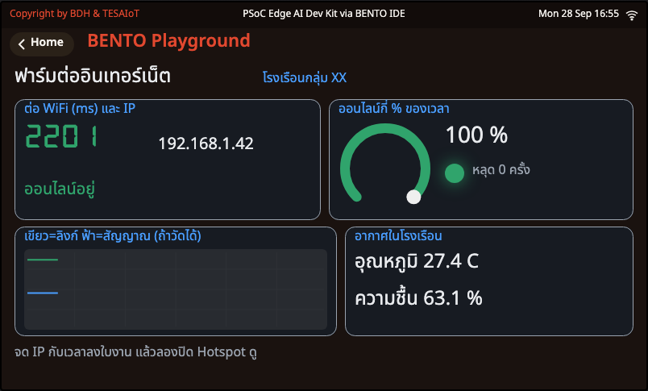

<div class="cap">ภาพจริงจาก BENTO Emulator — Wi-Fi ใน Emulator เป็นแบบจำลอง: เวลา 2201 ms กับ IP 192.168.1.42 ในภาพ <b>ไม่ใช่</b> ค่าของบอร์ดจริง · บนบอร์ดจริงเฝ้าดูลิงก์ด้วย <code>wifi.is_connected()</code> ทุกวินาทีเป็นเวลา 1 นาที</div>

</div>
</div>

---

## หัวใจของโค้ด — ป้ายต้องขึ้น "ก่อน" บรรทัดที่บล็อก แล้วจับเวลาคร่อมมัน

<style scoped>
section pre { font-size: .56em; }
section svg { max-height: 150px; }
section p { margin: .08em 0; font-size: .9em; }
</style>

```python
def connect_wifi(w):
    # ป้ายเตือนต้องขึ้นจอ "ก่อน" บรรทัดที่บล็อก คืน (สำเร็จไหม, ใช้ไปกี่ ms)
    show_note(w, "ครั้งแรกอาจรอนาน จอนิ่งได้ อย่ากดรีเซ็ต", COL_WARN)
    ui.poll()                          # ป้ายทั้งหมดต้องขึ้นจอก่อนเข้าบรรทัดที่บล็อก
    marquee("WIFI", rgbmatrix.YELLOW)
    print("กำลังต่อ", WIFI_SSID, "- บรรทัดถัดไปจะบล็อก")
    t0 = time.ticks_ms()
    ok = wifi.connect(WIFI_SSID, WIFI_PASS)
    took = time.ticks_diff(time.ticks_ms(), t0)
    w["seg"].text(str(took))           # Seg7 รับข้อความ ไม่ใช่ตัวเลข
    w["seg"].color(COL_OK if ok else COL_BAD)
    return ok, took
```

<svg viewBox="0 0 1000 160" xmlns="http://www.w3.org/2000/svg" font-family="sans-serif">
  <rect x="20" y="20" width="220" height="52" rx="8" fill="#eceff1" stroke="#78909c" stroke-width="2"/>
  <text x="130" y="52" text-anchor="middle" font-size="19" fill="#546e7a">ป้าย + ui.poll()</text>
  <rect x="280" y="20" width="340" height="52" rx="8" fill="#fff8e1" stroke="#f57f17" stroke-width="3"/>
  <text x="450" y="43" text-anchor="middle" font-size="19" font-weight="700" fill="#e65100">wifi.connect(WIFI_SSID, WIFI_PASS)</text>
  <text x="450" y="64" text-anchor="middle" font-size="16" fill="#e65100">โปรแกรมหยุดรอตรงนี้</text>
  <rect x="660" y="20" width="150" height="52" rx="8" fill="#e8f5e9" stroke="#2e7d32" stroke-width="2"/>
  <text x="735" y="52" text-anchor="middle" font-size="19" font-weight="700" fill="#2e7d32">True → หา IP</text>
  <rect x="830" y="20" width="150" height="52" rx="8" fill="#ffebee" stroke="#c62828" stroke-width="2"/>
  <text x="905" y="52" text-anchor="middle" font-size="19" font-weight="700" fill="#c62828">False → บอกเหตุ</text>
  <line x1="242" y1="46" x2="276" y2="46" stroke="#455a64" stroke-width="3"/>
  <line x1="622" y1="46" x2="656" y2="46" stroke="#2e7d32" stroke-width="3"/>
  <rect x="300" y="86" width="300" height="12" rx="6" fill="#ffe0b2"/>
  <rect id="sf2anim4" x="300" y="86" width="190" height="12" rx="6" fill="#f57f17"/><animate href="#sf2anim4" attributeName="width" values="20;300;20" dur="3s" repeatCount="indefinite"/>
  <text x="450" y="122" text-anchor="middle" font-size="17" fill="#c62828">ระหว่างแถบนี้เดิน จอหลักไม่ขยับเลย (นานถึงราว 85 วินาที)</text>
  <text x="500" y="152" text-anchor="middle" font-size="17" fill="#546e7a">t0 ก่อน · ticks_diff หลัง → ตัวเลข ms บนจอเป็นของบอร์ดเอง ไม่ใช่ความรู้สึกว่า "นานจัง"</text>
</svg>

ป้ายที่สร้างแล้วแต่ยังไม่ได้ `ui.poll()` จะไปโผล่ **หลัง** `connect()` จบ — ตอนที่ไม่มีใครต้องการมันแล้ว · ถ้า `ok` เป็น `False` ไฟล์รายงานบนจอแล้วหยุดเอง: **โปรแกรมที่พูดเฉพาะตอนสำเร็จ จะเงียบในจังหวะที่คนอยากรู้ที่สุด**

---

## กับดักที่ชื่อ `"0.0.0.0"` — และรหัสผิดใช้เวลาเท่าไร

<style scoped>
section pre { font-size: .58em; }
section p, section li { font-size: .9em; }
</style>

<div class="cols">
<div style="flex:0 0 300px">


<div class="cap">ลำดับการเข้าร่วมเครือข่ายไร้สาย: ค้นหา → แนะนำตัว → ขอเข้าร่วม — ภาพ: Superspritz / Wikimedia Commons — CC BY-SA 4.0</div>

</div>
<div>

```python
def wait_for_ip():
    # ip() คืน "0.0.0.0" ตอนยังไม่มีที่อยู่ ซึ่งเป็นสตริงที่ if ถือว่าจริง ต้องเทียบตรง ๆ
    ip = wifi.ip()
    for _ in range(IP_TRIES):
        if ip != "0.0.0.0":
            break
        ui.poll()
        time.sleep_ms(IP_WAIT_MS)
        ip = wifi.ip()
    return ip
```

- **เข้าร่วมวงได้** กับ **ได้เลขที่อยู่** เป็นคนละขั้น — ช่วงที่ยังไม่มีใครแจกเลข `wifi.ip()` คืน `"0.0.0.0"`
- `"0.0.0.0"` ไม่ใช่สตริงว่าง Python จึงถือว่า **จริง** — เขียน `if wifi.ip():` แล้วผ่านทั้งที่ยังส่งอะไรออกไม่ได้ **ไม่มี error ให้จับเลย**
- **รหัสผิดใช้เวลาต่างจากรหัสถูกไหม?** เรายังไม่เคยวัดบนบอร์ดรุ่นนี้ — ให้แต่ละกลุ่มวัดเอง แล้วเทียบกันทั้งห้อง

<div class="think">

**ลองดู:** ใส่รหัสผิดหนึ่งตัว จับเวลาเทียบรอบที่ถูก จดทั้งสองค่าลงใบงาน แล้วเดาว่าทำไมจึงต่างกัน (ถ้าต่าง) — ในขั้น "แนะนำตัว" ของภาพซ้าย บอร์ดรู้ได้ตอนไหนว่ารหัสผิด?

</div>

</div>
</div>

---

## ต่อไม่ติดเพราะอะไร? — ให้บอร์ด "ฟังทั้งห้อง" ก่อนตอบ

<style scoped>
section pre { font-size: .56em; }
</style>

<div class="cols">
<div class="c55">

```python
def ssid_heard(nets, ssid):
    # ในผล scan() [(ชื่อวง, rssi, ความปลอดภัย, ช่อง), ...] มีวงชื่อนี้ไหม
    for net in nets:
        if net[0] == ssid:
            return True
    return False
# ...
def heard_on_air():
    # "ไม่ได้ยินวงเลย" กับ "ได้ยินแต่รหัสผิด" แก้คนละทาง scan() ช่วยแยกให้
    try:
        return ssid_heard(wifi.scan(), WIFI_SSID)
    except OSError:
        return False
# ...
def failed(w, led, took):
    # ต่อไม่สำเร็จ: บอกว่าต้องแก้ตรงไหน แล้วค้างจอไฟ RGB เป็นสีแดงให้เห็นว่าไม่ผ่าน
    heard = heard_on_air()
    show_state(w, "ต่อไม่สำเร็จ", COL_BAD)
    stop(w, led, "ได้ยินวงแต่ต่อไม่ผ่าน ตรวจรหัสผ่าน" if heard
         else "ไม่ได้ยินวง " + WIFI_SSID + " ตรวจชื่อวง", COL_BAD)
```

</div>
<div>

<svg viewBox="0 0 440 300" xmlns="http://www.w3.org/2000/svg" font-family="sans-serif">
  <rect x="10" y="10" width="420" height="130" rx="12" fill="#e3f2fd" stroke="#1565c0" stroke-width="3"/>
  <text x="220" y="44" text-anchor="middle" font-size="21" font-weight="700" fill="#0d47a1">ไม่ได้ยินวงเลย</text>
  <text x="220" y="76" text-anchor="middle" font-size="17" fill="#37474f">ชื่อสะกดผิด · Hotspot ปิด</text>
  <text x="220" y="102" text-anchor="middle" font-size="17" fill="#37474f">เป็นคลื่น 5 GHz · อยู่ไกลเกิน</text>
  <text x="220" y="128" text-anchor="middle" font-size="16" font-weight="700" fill="#1565c0">→ แก้ที่มือถือ / ชื่อวง</text>
  <rect x="10" y="160" width="420" height="130" rx="12" fill="#ffebee" stroke="#c62828" stroke-width="3"/>
  <text x="220" y="194" text-anchor="middle" font-size="21" font-weight="700" fill="#b71c1c">ได้ยินแต่ต่อไม่ผ่าน</text>
  <text x="220" y="226" text-anchor="middle" font-size="17" fill="#37474f">รหัสผ่านผิด</text>
  <text x="220" y="252" text-anchor="middle" font-size="17" fill="#37474f">(scan() ไม่ต้องรู้รหัสของใคร)</text>
  <text x="220" y="278" text-anchor="middle" font-size="16" font-weight="700" fill="#c62828">→ แก้ WIFI_PASS</text>
</svg>

</div>
</div>

- `wifi.scan()` คืนทุกวงที่บอร์ดได้ยิน `[(ชื่อวง, rssi, ความปลอดภัย, ช่อง), ...]` — ไฟล์เรียกมัน **หลัง** ต่อไม่สำเร็จ เพื่อแยกสองปัญหาที่ **แก้คนละทาง**
- `scan()` เองก็บล็อกจนสแกนเสร็จ (จอนิ่งระหว่างนั้น) · ความแรงจริง (dBm) มาจาก `scan()` ไม่ใช่ `status()`

---

## เฝ้าลิงก์ — "ต่อติดแล้ว" ไม่ได้แปลว่า "ออนไลน์ตลอด"

<style scoped>
section pre { font-size: .56em; }
</style>

<div class="cols">
<div class="c55">

```python
def watch_link(w, led):
    # connect() ตอบว่า "ตอนนั้นต่อสำเร็จ" ส่วน is_connected() ตอบว่า "ตอนนี้ยังต่ออยู่ไหม"
    # ...
    while time.ticks_diff(time.ticks_ms(), t0) < RUN_MS:
        online = wifi.is_connected()
        total += 1
        up += 1 if online else 0
        if online != was:
            drops += 0 if online else 1
            link_changed(online, time.ticks_diff(time.ticks_ms(), t0) // 1000)
        was = online
        set_led(led, online)
        show_link(w, online, up * 100 // total, drops)
        # ...
        time.sleep_ms(TICK_MS)
    return up, total, drops
```

```python
def link_changed(online, sec):
    # จอ LED กับเสียง: ทำเฉพาะตอนสถานะเปลี่ยน ไม่ใช่ทุกวินาที
    if not online:
        print("หลุดตอนวินาทีที่", sec)
    marquee("ONLINE" if online else "OFFLINE", rgbmatrix.GREEN if online else rgbmatrix.RED)
    beep("good" if online else "bad")
```

</div>
<div>

**สองงาน สองจังหวะ**
- **ทุกรอบ (ทุกวินาที):** ถาม `is_connected()` ใหม่ · วงแหวน % · ไฟ · กราฟ — ไม่เชื่อคำตอบเดิมจากรอบก่อน
- **เฉพาะตอนเปลี่ยน:** จอไฟ `ONLINE`/`OFFLINE` · เสียง · `print("หลุดตอนวินาทีที่", ...)` — ทำทุกรอบเมื่อไร เสียงจะดังทุกวินาทีและหาไม่เจอว่าหลุดตอนไหน

<div class="think">

**คิด:** ถ้าโรงเรือนจริงอยู่ห่างบ้าน 2 กม. กลุ่มจะเอาเน็ตจากไหนมาให้บอร์ด? และจะรู้ได้อย่างไรว่ามันหลุดตอนตีสาม?

</div>

</div>
</div>

---

<!-- _class: sec -->

<div class="when">0:25 – 0:55 · 30 นาที</div>

# กิจกรรม 2 — โรงเรือนรายงานตัวทุก 5 วินาที

<div class="lead">ส่งค่าจริงทุก 5 วินาที และบอกตรง ๆ ว่าค่าไหนจำลอง</div>

<div class="flow"><b>เซนเซอร์ + ลูกบิดจำลอง</b><i>→</i><b>JSON</b><i>→</i><b>broker (MQTT)</b><i>→</i><b>มือถือ</b></div>

<div class="files one"><div><div class="fh">★ ทำในห้อง</div><div class="f"><a href="https://github.com/Advance-Innovation-Centre-AIC/aiot-development-for-smart-farm/blob/main/s2/sf2_02_greenhouse_report.py">sf2_02_greenhouse_report.py</a> <span>— วัดทุก 1 วินาที ส่งรายงานทุก 5 วินาที</span></div><div class="fh lap">📱 เปิดบนมือถือ</div><div class="f"><a href="https://github.com/Advance-Innovation-Centre-AIC/aiot-development-for-smart-farm/blob/main/s2/app/my_first_reader.html">my_first_reader.html</a> <span>— หน้าอ่านค่า เปิดบนมือถือ ต่อท้าย ?team=</span></div></div></div>

<div class="chal">🏆 <b>ท้าทาย:</b> เป่าลมใส่บอร์ด แล้ว <b>จับเวลาว่ามือถือเห็นช้ากว่าจอบอร์ดกี่วินาที</b> — กลุ่มไหนอธิบายตัวเลขนั้นได้ถูกที่สุด?</div>


---

## บอร์ดใช้ 1883 · เบราว์เซอร์ใช้ wss 8884 — แต่เจอกันที่หัวข้อเดียวกัน

<style scoped>
section p, section li { font-size: .86em; line-height: 1.26; }
</style>

<svg viewBox="0 0 1000 250" xmlns="http://www.w3.org/2000/svg" font-family="sans-serif">
  <defs><marker id="r1" markerUnits="userSpaceOnUse" viewBox="0 0 12 12" markerWidth="16" markerHeight="16" refX="10" refY="6" orient="auto"><path d="M0,0 L12,6 L0,12 z" fill="#2e7d32"/></marker>
  <marker id="r2" markerUnits="userSpaceOnUse" viewBox="0 0 12 12" markerWidth="16" markerHeight="16" refX="10" refY="6" orient="auto"><path d="M0,0 L12,6 L0,12 z" fill="#6a1b9a"/></marker></defs>
  <rect x="20" y="20" width="230" height="110" rx="12" fill="#e8f5e9" stroke="#2e7d32" stroke-width="3"/>
  <text x="135" y="52" text-anchor="middle" font-size="20" font-weight="700" fill="#2e7d32">บอร์ดของกลุ่ม</text>
  <text x="135" y="80" text-anchor="middle" font-size="17" fill="#1b5e20">sf2_02 · sf2_03 · sf2_04</text>
  <text x="135" y="106" text-anchor="middle" font-size="16" fill="#4a7c4e">mqtt ไม่เข้ารหัส</text>
  <rect x="385" y="20" width="230" height="110" rx="12" fill="#eceff1" stroke="#455a64" stroke-width="3"/>
  <text x="500" y="52" text-anchor="middle" font-size="20" font-weight="700" fill="#455a64">broker.hivemq.com</text>
  <text x="500" y="80" text-anchor="middle" font-size="16" fill="#37474f">สาธารณะ ไม่มีรหัสผ่าน</text>
  <text x="500" y="106" text-anchor="middle" font-size="15" fill="#78909c">bento-aiot/&lt;TEAM&gt;/...</text>
  <rect x="750" y="10" width="230" height="62" rx="12" fill="#e3f2fd" stroke="#1565c0" stroke-width="3"/>
  <text x="865" y="36" text-anchor="middle" font-size="18" font-weight="700" fill="#1565c0">📱 เบราว์เซอร์ · wss 8884</text>
  <text x="865" y="60" text-anchor="middle" font-size="15" fill="#0d47a1">farm_web · my_first_reader</text>
  <rect x="750" y="82" width="230" height="62" rx="12" fill="#fff3e0" stroke="#ef6c00" stroke-width="3"/>
  <text x="865" y="108" text-anchor="middle" font-size="18" font-weight="700" fill="#e65100">💻 Python · TCP 1883</text>
  <text x="865" y="132" text-anchor="middle" font-size="15" fill="#a1683a">farm_monitor.py</text>
  <line x1="252" y1="56" x2="380" y2="56" stroke="#2e7d32" stroke-width="4" marker-end="url(#r1)"/>
  <line x1="380" y1="100" x2="256" y2="100" stroke="#6a1b9a" stroke-width="4" marker-end="url(#r2)"/>
  <text x="316" y="84" text-anchor="middle" font-size="16" font-weight="700" fill="#37474f">TCP 1883</text>
  <line x1="618" y1="56" x2="744" y2="40" stroke="#2e7d32" stroke-width="4" marker-end="url(#r1)"/>
  <line x1="618" y1="92" x2="744" y2="112" stroke="#2e7d32" stroke-width="4" marker-end="url(#r1)"/>
  <circle id="sf2anim5" cx="262" cy="56" r="6" fill="#2e7d32"/><animate href="#sf2anim5" attributeName="cx" values="262;370;262" dur="2.4s" repeatCount="indefinite"/>
  <rect x="20" y="168" width="960" height="66" rx="10" fill="#fff3e0" stroke="#ef6c00" stroke-width="2" stroke-dasharray="8 6"/>
  <text x="40" y="196" font-size="18" font-weight="700" fill="#e65100">BENTO Emulator: broker จำลองอยู่ในเบราว์เซอร์ — "No TCP leaves the browser"</text>
  <text x="40" y="222" font-size="16" fill="#8d4a4a">ค่าที่บอร์ดใน Emulator ส่งไม่ไปถึงแอปจริง และคำสั่งจากแอปไม่ถึงบอร์ดใน Emulator · หลักฐานข้อ MQTT นับจากบอร์ดจริง</text>
</svg>

- เบราว์เซอร์เปิดสาย TCP ตรง ๆ ไม่ได้ จึงพูด MQTT ผ่าน WebSocket ที่ `wss://broker.hivemq.com:8884/mqtt` · broker ส่งต่อให้เองโดยไม่สนว่าแต่ละฝั่งมาทางไหน
- **ตัวสำรอง (ใช้เมื่อผู้สอนประกาศเท่านั้น):** `test.mosquitto.org` พอร์ต 1883 · หน้าเว็บ `wss://test.mosquitto.org:8081/mqtt` — แก้ `BROKER` (ไฟล์บอร์ดและ [`farm_monitor.py`](https://github.com/Advance-Innovation-Centre-AIC/aiot-development-for-smart-farm/blob/main/s2/app/farm_monitor.py)) กับ `BROKER_URL` ([`farm_web.html`](https://github.com/Advance-Innovation-Centre-AIC/aiot-development-for-smart-farm/blob/main/s2/app/farm_web.html)) **พร้อมกัน**
- ไม่มีชื่อผู้ใช้ ไม่มีรหัสผ่าน · QoS 0 · **ไม่มี retain** — แอปที่เปิดทีหลังเห็นแค่ใบถัดไป

---

## broker สาธารณะ: ใครก็อ่านได้ ใครก็เขียนได้

<style scoped>
section li { margin: .05em 0; font-size: .86em; line-height: 1.26; }
</style>

<svg viewBox="0 0 1000 140" xmlns="http://www.w3.org/2000/svg" font-family="sans-serif">
  <rect x="10" y="20" width="235" height="96" rx="10" fill="#e8f5e9" stroke="#2e7d32" stroke-width="3"/>
  <text x="127" y="56" text-anchor="middle" font-size="19" font-weight="700" fill="#2e7d32">หัวข้อไม่ซ้ำใคร</text>
  <text x="127" y="86" text-anchor="middle" font-size="15" fill="#1b5e20">bento-aiot/team05/...</text>
  <rect x="260" y="20" width="235" height="96" rx="10" fill="#e3f2fd" stroke="#1565c0" stroke-width="3"/>
  <text x="377" y="56" text-anchor="middle" font-size="19" font-weight="700" fill="#1565c0">ห้าม subscribe #</text>
  <text x="377" y="86" text-anchor="middle" font-size="15" fill="#0d47a1">เท่ากับขอรับทั้งโลก</text>
  <rect id="sf2anim6" x="510" y="20" width="235" height="96" rx="10" fill="#ffebee" stroke="#c62828" stroke-width="3"/><animate href="#sf2anim6" attributeName="stroke-width" values="3;6;3" dur="1.8s" repeatCount="indefinite"/>
  <text x="627" y="56" text-anchor="middle" font-size="19" font-weight="700" fill="#c62828">ห้ามส่งความลับ</text>
  <text x="627" y="86" text-anchor="middle" font-size="15" fill="#8d4a4a">ไม่เข้ารหัส ใครก็อ่านได้</text>
  <rect x="760" y="20" width="230" height="96" rx="10" fill="#fff3e0" stroke="#ef6c00" stroke-width="3"/>
  <text x="875" y="56" text-anchor="middle" font-size="19" font-weight="700" fill="#ef6c00">client_id ไม่ชน</text>
  <text x="875" y="86" text-anchor="middle" font-size="15" fill="#e65100">ชนได้กับทุกคนในโลก</text>
</svg>

<div class="cols">
<div class="c60">

- **หัวข้อต้องไม่ซ้ำใคร** ผู้สอนแจก `TEAM` ให้แต่ละกลุ่มไม่ซ้ำกัน · ไฟล์บอร์ด **ไม่ยอมรัน** ถ้ายังเป็น `teamXX`
- **ห้าม subscribe `#`** ข้อความของคนแปลกหน้าทั้งโลกจะไหลเข้ามา · แอปของกลุ่มฟัง `bento-aiot/<TEAM>/#` · หน้ารวมฟัง `bento-aiot/+/telemetry` กับ `/+/event`
- **ห้ามส่งความลับ** ไม่ว่ารหัส Wi-Fi ชื่อจริง หรือเบอร์โทร
- **client_id ชนกันได้กับทุกคนบนอินเทอร์เน็ต** ชนเมื่อไร broker เตะตัวเก่าออก · บอร์ดใช้ `bento-farm-<TEAM>-<สุ่ม>` (สุ่มใหม่ทุกครั้งที่ต่อ) · แอป Python ใช้ `farm-app-<TEAM>-<สุ่ม>` · หน้าเว็บสุ่มชื่อของตัวเอง (`farm-web-…` / `web-…`) จึงไม่เตะกัน

</div>
<div>

<div class="vid" style="flex-direction:column">
<iframe width="300" height="169" src="https://www.youtube.com/embed/juq_l70Vg1w" title="MQTT Topic Best Practices — HiveMQ" loading="lazy" frameborder="0" allowfullscreen></iframe>
<div><b>MQTT Topic Best Practices | MQTT Essentials Part 6</b><br>HiveMQ · 5:50 · EN<br><https://www.youtube.com/watch?v=juq_l70Vg1w></div>
</div>

</div>
</div>

> ใครก็ส่งเข้า `bento-aiot/<TEAM>/cmd` ได้ ไม่ใช่แค่แอปของเรา — นี่คือเหตุผลที่ไฟล์บอร์ด **ไม่เชื่อคนส่งเลยสักบรรทัด** (กิจกรรม 4)

---

## บันไดสามขั้นที่ห้ามสลับ: Wi-Fi → IP → broker แล้วค่อยส่ง

<style scoped>
section pre { font-size: .56em; }
section svg { max-height: 120px; }
section p { font-size: .9em; }
section li { font-size: .88em; }
</style>

<svg viewBox="0 0 1000 170" xmlns="http://www.w3.org/2000/svg" font-family="sans-serif">
  <rect x="20" y="100" width="300" height="56" rx="9" fill="#e8f5e9" stroke="#2e7d32" stroke-width="3"/>
  <text x="170" y="124" text-anchor="middle" font-size="19" font-weight="700" fill="#2e7d32">1 · Wi-Fi ต้องให้ IP ก่อน</text>
  <text x="170" y="146" text-anchor="middle" font-size="16" fill="#1b5e20">wifi.connect() + ip() != "0.0.0.0"</text>
  <rect x="350" y="60" width="300" height="56" rx="9" fill="#e3f2fd" stroke="#1565c0" stroke-width="3"/>
  <text x="500" y="84" text-anchor="middle" font-size="19" font-weight="700" fill="#1565c0">2 · แนะนำตัวกับ broker</text>
  <text x="500" y="106" text-anchor="middle" font-size="16" fill="#0d47a1">mqtt.connect(BROKER, port=1883, ...)</text>
  <rect x="680" y="20" width="300" height="56" rx="9" fill="#f3e5f5" stroke="#6a1b9a" stroke-width="3"/>
  <text x="830" y="44" text-anchor="middle" font-size="19" font-weight="700" fill="#6a1b9a">3 · ส่งของจริงออกไป</text>
  <text x="830" y="66" text-anchor="middle" font-size="16" fill="#4a148c">mqtt.publish(TOPIC, json.dumps(body))</text>
  <line x1="322" y1="116" x2="348" y2="100" stroke="#90a4ae" stroke-width="3"/>
  <line x1="652" y1="76" x2="678" y2="60" stroke="#90a4ae" stroke-width="3"/>
  <text x="170" y="40" text-anchor="middle" font-size="17" font-weight="700" fill="#c62828">ขั้นไหนพัง ขึ้นจอว่าพังที่ไหน</text>
  <text x="170" y="64" text-anchor="middle" font-size="16" fill="#c62828">ไม่ใช่ค้างเงียบ</text>
</svg>

<div class="cols">
<div class="c60">

```python
def connect_farm(w):
    # บันไดสามขั้น WiFi -> IP -> broker ขั้นไหนพังคืนข้อความบอกว่าพังตรงไหน
    show_note(w, "ต่อ WiFi... จอนิ่งได้", COL_WARN)
    ui.poll()                          # ป้ายต้องขึ้นจอก่อนบรรทัดที่บล็อก
    if not wifi.connect(WIFI_SSID, WIFI_PASS) or wifi.ip() == "0.0.0.0":
        return "ต่อ WiFi ไม่ได้"
    linked = connect_broker(w)         # ลองได้ 3 ครั้ง (ดู connect_broker)
    return "" if linked else "broker ไม่ตอบ: รอ 1 นาทีแล้วรันใหม่"
```

</div>
<div>

- `connect_farm()` คืน `""` = ผ่าน · คืน **ข้อความบอกว่าพังขั้นไหน** ให้ `main()` ขึ้นจอ
- `mqtt.connect()` ใช้ `username=` ไม่ใช่ `user=`
- `connect_broker()` ลองได้ **3 ครั้ง** `client_id` ใหม่ทุกครั้ง — broker สาธารณะบางเครื่องไม่ตอบเป็นพัก ๆ
- สายหลุด `publish()` **โยน `OSError`** ไม่คืน `False` — ครอบด้วย `try` (ข้างล่าง)

</div>
</div>

```python
def publish_json(topic, obj):
    # คืน "ok" / "refused" (broker ไม่รับใบนี้) / "lost" (สายหลุด: publish โยน OSError ไม่ใช่คืน False)
    try:
        return "ok" if mqtt.publish(topic, json.dumps(obj)) else "refused"
    except OSError:
        return "lost"
```

---

## ค่าที่ส่งออกไปต้องเป็นค่าจริง — และบอกตรง ๆ ว่าอะไรจำลอง

<style scoped>
section pre { font-size: .58em; }
section p, section li { font-size: .88em; }
</style>

```python
def build_payload(n, t, h, p, az, knobs, manual):
    # รายงานหนึ่งใบ คีย์ครบตามสัญญา MQTT ข้อ 3.1: มี id กับ n เสมอ ตัวไหนอ่านไม่ได้เป็น None
    # (ลำดับคีย์ในใบที่ส่งจริงอาจสลับกัน แอปจึงต้องอ่านด้วยชื่อคีย์ ไม่ใช่ตำแหน่ง)
    # sim บอกตรง ๆ ว่าคีย์ไหนมาจากลูกบิดจำลอง · by บอกว่าส่งเพราะครบเวลาหรือเพราะคนกด SW5
    body = {"id": TEAM, "n": n, "temp_c": r1(t), "rh": r1(h), "hpa": r1(p), "az": r1(az, 2)}
    body["soil"], body["light"], body["tank"] = knobs          # ลูกบิดจำลอง VR1 VR3 VR4
    body["sim"], body["by"] = "soil light tank", "sw5" if manual else "timer"
    return body
```

ใบจริงที่บอร์ด TESAIoT Dev Kit ส่งถึง broker.hivemq.com ระหว่างการทดสอบ (คีย์ครบตาม [`MQTT_CONTRACT_th.md`](https://github.com/Advance-Innovation-Centre-AIC/aiot-development-for-smart-farm/blob/main/s2/app/MQTT_CONTRACT_th.md) ข้อ 3.1 · ลำดับคีย์สลับจากในโค้ด · `temp_c` สูงเพราะรอบนั้นยังไม่ตั้ง `TEMP_OFFSET`):

```json
{"n": 2, "sim": "soil light tank", "az": 7.88, "id": "team97", "hpa": 1012.2, "soil": 42, "rh": 48.3, "by": "timer", "tank": 28, "temp_c": 40.1, "light": 99}
```

<div class="cols">
<div>

- `temp_c` `rh` `hpa` `az` = **เซนเซอร์จริง** ต่อหน้าเรา — เป่าลม เอียงบอร์ด แล้วเลขบนมือถือขยับตามมือเรา
- `soil` `light` `tank` = **ลูกบิดจำลอง** VR1 · VR3 · VR4 → คีย์ `sim` **บอกคนรับตรง ๆ** ว่าคีย์ไหนไม่ใช่เซนเซอร์จริง
- `n` เริ่ม 1 ใหม่ทุกครั้งที่รัน ใช้ดูว่ามีใบหาย · `by` = `"timer"` หรือ `"sw5"`

</div>
<div>

<div class="think">

**ทำไมต้องบอกว่าจำลอง?** ถ้าวันหนึ่งข้อมูลนี้ไปอยู่ในรายงานของฟาร์ม แล้วมีคนเอาค่า `soil` จากลูกบิดไปตัดสินใจรดน้ำจริง — ใครผิด?

</div>

`null` = เซนเซอร์ตัวนั้นอ่านไม่ได้รอบนั้น **แอปต้องไม่พังเมื่อเจอ `null`**

</div>
</div>

---

## กิจกรรม 2 — โรงเรือนรายงานตัว

<div class="cols">
<div class="c40">

<div class="goal">

🎯 **เป้าหมาย:** ค่าฟาร์มของกลุ่มขึ้นบน **มือถือ** ทุก 5 วินาที และจดตารางจาก **หน้าเว็บ** ไม่ใช่จากจอบอร์ด

</div>

<div class="try">

**ลองทำ**
1. แก้ `WIFI_SSID` `WIFI_PASS` และ `TEAM` แล้วรัน (ส่งนาน 30 นาที)
2. เปิดหน้าอ่านค่าบนมือถือ (สไลด์ถัดไป) ต่อท้าย `?team=` ด้วยเลขกลุ่ม
3. จด 3 ใบจากหน้าเว็บ · **เป่าลมใส่บอร์ด** จับเวลาว่ามือถือช้ากว่ากี่วินาที
4. กด **SW5** (ปุ่มล่าง) = ส่งทันที `by = sw5` · กด **SW6** (ปุ่มบน) = เหตุการณ์ `"event": "sw6"`
5. ห้องเสียงดังไป? ตั้ง `SOUND = False`

</div>

</div>
<div class="shot">

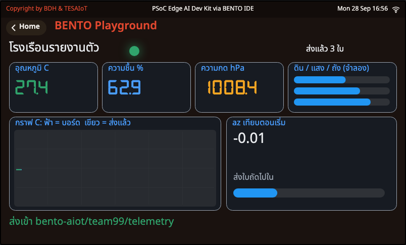

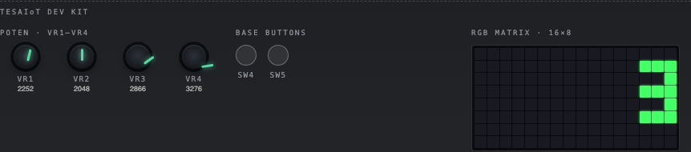

<div class="cap">ภาพจริงจาก BENTO Emulator (TEAM = team99 เฉพาะตอนถ่าย · ค่าเซนเซอร์จำลอง) — <b>MQTT ใน Emulator เป็น broker จำลอง "No TCP leaves the browser"</b> "ส่งแล้ว 3 ใบ" จึงไม่ได้ออกไปถึง broker.hivemq.com · จอไฟ RGB นับใบที่ส่ง · แผง Emulator พิมพ์ชื่อปุ่มเป็น SW4 / SW5: ปุ่มซ้าย = <b>SW5</b> (ปุ่มล่าง) ปุ่มขวา = <b>SW6</b> (ปุ่มบน)</div>

</div>
</div>

---

## เปิดหน้าเว็บอ่านค่าของกลุ่ม — ไม่ต้องติดตั้งอะไร

<style scoped>
section svg { max-height: 120px; }
section li { font-size: .84em; line-height: 1.26; margin: .05em 0; }
section a { word-break: break-all; }
</style>

<svg viewBox="0 0 1000 130" xmlns="http://www.w3.org/2000/svg" font-family="sans-serif">
  <rect x="10" y="16" width="230" height="76" rx="9" fill="#e8f5e9" stroke="#2e7d32" stroke-width="2.5"/>
  <text x="125" y="48" text-anchor="middle" font-size="18" font-weight="700" fill="#2e7d32">1 · เปิดลิงก์</text>
  <text x="125" y="74" text-anchor="middle" font-size="15" fill="#1b5e20">มือถือหรือโน้ตบุ๊ก</text>
  <rect x="260" y="16" width="230" height="76" rx="9" fill="#e3f2fd" stroke="#1565c0" stroke-width="2.5"/>
  <text x="375" y="48" text-anchor="middle" font-size="18" font-weight="700" fill="#1565c0">2 · ท้ายลิงก์ ?team=</text>
  <text x="375" y="74" text-anchor="middle" font-size="15" fill="#0d47a1">เลขเดียวกับ TEAM ในไฟล์</text>
  <rect x="510" y="16" width="230" height="76" rx="9" fill="#fff3e0" stroke="#ef6c00" stroke-width="2.5"/>
  <text x="625" y="48" text-anchor="middle" font-size="18" font-weight="700" fill="#ef6c00">3 · สถานะ "ต่อแล้ว"</text>
  <text x="625" y="74" text-anchor="middle" font-size="15" fill="#e65100">รอใบถัดไปจากบอร์ด</text>
  <rect id="sf2anim7" x="760" y="16" width="230" height="76" rx="9" fill="#f3e5f5" stroke="#6a1b9a" stroke-width="3"/><animate href="#sf2anim7" attributeName="stroke-width" values="3;5;3" dur="1.8s" repeatCount="indefinite"/>
  <text x="875" y="48" text-anchor="middle" font-size="18" font-weight="700" fill="#6a1b9a">4 · การ์ดหนึ่งใบต่อคีย์</text>
  <text x="875" y="74" text-anchor="middle" font-size="15" fill="#4a148c">temp_c · soil · tank ...</text>
  <text x="500" y="120" text-anchor="middle" font-size="17" fill="#546e7a">เปลี่ยน team__ ท้ายลิงก์เป็นเลขกลุ่มของเรา เช่น team05</text>
</svg>

- **หน้าอ่านค่าแบบง่าย** (กล่องค่า + ปุ่มบี๊บ/ไฟ LED 0): <https://advance-innovation-centre-aic.github.io/aiot-development-for-smart-farm/s2/app/my_first_reader.html?team=team__>
- **หน้าฟาร์มของเรา** (การ์ดชื่อไทย + ปุ่มรดน้ำ/ปิดปั๊ม/ข้อความ): <https://advance-innovation-centre-aic.github.io/aiot-development-for-smart-farm/s2/app/farm_web.html?team=team__>
- **หน้ารวมทั้งห้อง** (ผู้สอนฉาย · การ์ดทุกกลุ่ม + ช่องพิมพ์ JSON ส่งคำสั่ง): <https://advance-innovation-centre-aic.github.io/aiot-development-for-smart-farm/s2/app/mqtt_dashboard.html>
- เปิดหน้าเว็บหลังบอร์ดส่งไปแล้ว **จะว่างจนใบถัดไปมาถึง** — บอร์ดส่งแบบ retain ไม่ได้ broker จึงไม่เก็บใบล่าสุดไว้ให้ · ไม่มีหน้าเว็บของเราก็ใช้ <https://www.hivemq.com/demos/websocket-client/> แทนได้ (host `broker.hivemq.com` · port `8884` · เปิด SSL · subscribe `bento-aiot/<TEAM>/#`)

---

## หัวใจของโค้ด — นาฬิกาสามเรือน: ปุ่ม 0.1 · วัด 1 · ส่ง 5 วินาที

<style scoped>
section pre { font-size: .54em; }
</style>

<div class="cols">
<div class="c60">

```python
    while time.ticks_diff(time.ticks_ms(), t0) < RUN_MS:
        now = time.ticks_ms()
        manual = send_btn.pressed_now()               # SW5 = ส่งเดี๋ยวนี้
        if call_btn.pressed_now():                    # SW6 = "เหตุการณ์" ไม่ใช่รายงาน จึงส่งเข้าอีกหัวข้อ
            if publish_json(TOPIC_EVENT, {"id": TEAM, "event": "sw6", "msg": "call"}) == "lost":
                stop(w, "สายหลุด ส่งไม่ออก")
            beep("tap")
        if first or time.ticks_diff(now, t_read) >= READ_MS:   # นาฬิกาสามเรือน: ปุ่ม 0.1 วัด 1 ส่ง 5 วิ
            # ...
        if first or manual or time.ticks_diff(now, t_send) >= SEND_MS:
            first, t_send = False, now
            body = build_payload(sent + 1, t, h, p, az, knobs, manual)
            result = publish_json(TOPIC, body)
            if result == "lost":
                stop(w, "สายหลุด ส่งไม่ออก")
            if result == "ok":
                sent, last_t = sent + 1, t
                on_sent(w, body, manual)
```

</div>
<div>

- "ทุก 5 วินาที" คือ **ถามว่าถึงเวลาหรือยัง** ไม่ใช่ `time.sleep(5)` — ไม่งั้นการกดปุ่มระหว่างหลับจะหาย
- **วัดถี่ แต่ส่งห่าง ๆ** เพราะการส่งกวน broker ของทั้งห้อง
- **SW6 = เหตุการณ์** ไม่ใช่รายงาน จึงส่งเข้าอีกหัวข้อ (`/event`)

<div class="think">

**เฉลยเกมทาย:** มือถือช้ากว่าจอบอร์ดได้ถึง ~5 วินาที ส่วนใหญ่ไม่ใช่เพราะเน็ตช้า — แต่เพราะอะไร? (ดูบรรทัด `SEND_MS`)
**ใบ้:** ฟาร์ม 1,000 แห่งส่งทุก 5 วิ = 200 ใบต่อวินาที เข้าระบบเดียว

</div>

</div>
</div>

---

<!-- _class: brk -->

# ☕ พัก 10 นาที

<div class="big">0:55 – 1:05</div>

**ปล่อย `sf2_02` รันต่อบนบอร์ด** — ชั่วโมงหน้าแอปของเราจะได้ข้อมูลเข้ามาทันที · มันส่งนาน 30 นาที (`RUN_MS`) จึง**หยุดเองกลางกิจกรรม 3** เห็นแอปเงียบเมื่อไร กด **Program to Device** รัน `sf2_02` ใหม่

**ระหว่างพัก ลองทายเล่น:** แอปเปิดทิ้งไว้ 10 นาที ควรได้ข้อมูลกี่แถว? (คำนวณก่อน แล้วเทียบกับของจริงในกิจกรรม 3)

---

<!-- _class: sec -->

<div class="when">1:05 – 1:50 · 45 นาที</div>

# กิจกรรม 3 — แอปเฝ้าฟาร์มของกลุ่ม

<div class="lead">บอร์ดกับแอปคุยกันด้วย "สัญญา MQTT" หน้าเดียว</div>

<div class="flow"><b>ได้ข้อความ</b><i>→</i><b>จด CSV</b><i>→</i><b>กฎหนึ่งข้อ</b><i>→</i><b>เว้น 60 วินาที</b></div>

<div class="files"><div><div class="fh">★ ทำในห้อง</div><div class="f"><a href="https://github.com/Advance-Innovation-Centre-AIC/aiot-development-for-smart-farm/blob/main/s2/app/MQTT_CONTRACT_th.md">MQTT_CONTRACT_th.md</a> <span>— สัญญา MQTT หน้าเดียว</span></div><div class="fh lap">💻 แอปของกลุ่ม (เลือกหนึ่ง)</div><div class="f"><a href="https://github.com/Advance-Innovation-Centre-AIC/aiot-development-for-smart-farm/blob/main/s2/app/farm_monitor.py">farm_monitor.py</a> <span>— Python บนโน้ตบุ๊ก: ตารางสด + CSV</span></div><div class="f"><a href="https://github.com/Advance-Innovation-Centre-AIC/aiot-development-for-smart-farm/blob/main/s2/app/farm_web.html">farm_web.html</a> <span>— แอปในเบราว์เซอร์ ไม่ต้องติดตั้ง</span></div></div><div><div class="fh hw">☆ การบ้าน / ถ้ามีเวลา</div><div class="f"><a href="https://github.com/Advance-Innovation-Centre-AIC/aiot-development-for-smart-farm/blob/main/s2/app/fake_board.py">fake_board.py</a> <span>— บอร์ดจำลอง ทดสอบแอปตอนไม่มีบอร์ด</span></div></div></div>

<div class="chal">🏆 <b>ท้าทาย:</b> แอปของกลุ่มไหน <b>จด CSV ครบทุกใบ โดยเลข <code>n</code> ไม่ขาดเลย</b> ใน 10 นาที — แล้วทำกราฟใน Excel ได้ก่อน?</div>


---

## สัญญา MQTT หน้าเดียว — ข้อความที่บอร์ดส่งออกมา

<style scoped>
section table { font-size: .6em; }
section pre { font-size: .54em; }
section p, section li { font-size: .86em; }
</style>

<div class="cols">
<div class="c55">

| คีย์ | ชนิด | ความหมาย |
|---|---|---|
| `id` · `n` | ข้อความ · จำนวนเต็ม | เลขกลุ่ม (มีเสมอ) · ลำดับใบ (มีในรายงาน telemetry · event ไม่มี `n`) |
| `temp_c` · `rh` · `hpa` | ทศนิยม หรือ `null` | อุณหภูมิ (รวม `TEMP_OFFSET`) · ความชื้น · ความกด |
| `az` | ทศนิยม หรือ `null` | แรงโน้มถ่วงแกนตั้ง m/s² — ตกลงมาก = "กระถางล้ม" |
| `soil` · `light` · `tank` | 0–100 % | **จำลอง** จาก VR1 · VR3 · VR4 |
| `pump` | 0 / 1 | ปั๊มเปิดอยู่ไหม (เฉพาะ `sf2_03` · `sf2_06`) |
| `sim` | ข้อความ | คีย์ไหนมาจากลูกบิด |
| `by` | ข้อความ | `timer` · `sw5` · `gateway` |

</div>
<div>

`sf2_03` → `telemetry` (ไม่มี `temp_c`)
```json
{"id": "team05", "n": 7, "soil": 20, "tank": 80, "pump": 1, "sim": "soil tank"}
```

`sf2_02` กด SW6 → `event`
```json
{"id": "team05", "event": "sw6", "msg": "call"}
```

**กติกาที่แอปต้องรู้:** ไฟล์บอร์ดแต่ละไฟล์ส่งคีย์ไม่เหมือนกัน → **เช็กว่ามีคีย์ก่อนใช้** · ค่าอาจเป็น `null` · broker สาธารณะ → **ตรวจทุกค่าก่อนใช้** (อาจมีคนส่งขยะมา)

</div>
</div>

`sf2_04` แจ้งเตือนพืช → `event` (ตัวอย่าง `sf2_02` → `telemetry` อยู่ในสไลด์ "ค่าที่ส่งออกไปต้องเป็นค่าจริง")
```json
{"id": "team05", "crop": "tomato", "level": 2, "alert": "hot", "temp_c": 33.5, "rh": 62.0, "sun_c": 5}
```

<div class="src">ที่มา: <a href="https://github.com/Advance-Innovation-Centre-AIC/aiot-development-for-smart-farm/blob/main/s2/app/MQTT_CONTRACT_th.md"><code>MQTT_CONTRACT_th.md</code></a> ข้อ 3.1–3.4 — "หน้านี้คือสัญญาตัวจริงตัวเดียว แอปทุกตัวในคอร์สอ่านจากหน้านี้"</div>

---

## สัญญา MQTT — คำสั่งที่บอร์ดรับทาง `bento-aiot/<TEAM>/cmd`

<style scoped>
section table { font-size: .62em; }
section li { font-size: .84em; }
</style>

| ส่งแบบนี้ | ไฟล์ที่ฟัง | บอร์ดทำอะไร |
|---|---|---|
| `{"cmd":"pump","on":1,"sec":10}` | `sf2_03` | เปิดปั๊ม `sec` วินาที (ไม่ใส่ = 10 · **สูงสุด 30** · ไม่ใช่จำนวนเต็มบวก = 10) แล้วดับเอง · **ไม่ยอมเปิดถ้า `tank` ต่ำกว่า 10 %** |
| `{"cmd":"pump","on":0}` | `sf2_03` | ปิดปั๊มทันที |
| `{"cmd":"led","n":0,"on":1}` | `sf2_03` | เหมือน pump · `n` อื่นที่ไม่ใช่ 0 ถูกปฏิเสธ |
| `{"cmd":"beep"}` | `sf2_03` | ลำโพงดังหนึ่งครั้ง "เจ้าของฟาร์มเรียก" |
| `{"cmd":"say","text":"HELLO"}` | `sf2_03` | ตัววิ่งบนจอไฟ RGB · อังกฤษ/ตัวเลข ไม่เกิน 20 ตัว (ไทยถูกตัดทิ้ง) · ไม่วิ่งระหว่างปั๊มเปิด |
| `{"cmd":"ack"}` | `sf2_04` | รับทราบแจ้งเตือน บอร์ดหยุดร้อง (กด SW5 ที่บอร์ดก็ได้ผลเดียวกัน) |
| `{"cmd":"set","t_hi":28}` | `sf2_04` | เปลี่ยนเกณฑ์ "ร้อนไป" (จำนวนเต็ม มากกว่าเกณฑ์หนาว ไม่เกิน 45) แล้วตัดสินใหม่ทันที |

- ข้อความที่ไม่ใช่ JSON object หรือ `cmd` ที่ไม่รู้จัก → บอร์ด **ไม่ทำอะไร** (`sf2_03` ขึ้นเตือนบนจอ · `sf2_04` เงียบ)
- **อย่าส่งรัว:** กล่องรับของบอร์ดมี **ช่องเดียว** ใบใหม่ทับใบเก่า → ส่งห่างกันอย่างน้อย 1 วินาที · กฎอัตโนมัติเว้นอย่างน้อย **60 วินาที** ก่อนสั่งซ้ำ
- ข้อความถึงบอร์ดไม่เกิน 255 ไบต์ · ชื่อหัวข้อไม่เกิน 127 ตัว

---

## `farm_monitor.py` — ติดตั้งครั้งเดียว แล้วแก้ TODO ของกลุ่ม

<style scoped>
section pre { font-size: .56em; }
</style>

<div class="cols">
<div class="c55">

```python
# ===== TODO 1: ตั้งค่าของกลุ่ม =====
TEAM = "teamXX"                                  # ต้องตรงกับ TEAM บนบอร์ด
# ...
# ===== TODO 2: เลือกคอลัมน์ที่อยากเห็นในตารางและใน Excel (ชื่อต้องตรงกับคีย์ที่บอร์ดส่ง) =====
COLUMNS = ["n", "temp_c", "rh", "hpa", "az", "soil", "light", "tank", "pump"]
# ...
# ===== TODO 3: กฎของกลุ่ม ดินแห้งกว่าเกณฑ์ = สั่งรดน้ำ =====
SOIL_MIN = 30          # ดิน (VR1 บนบอร์ด) ต่ำกว่านี้ถือว่าแห้ง
PUMP_SEC = 10          # สั่งรดน้ำครั้งละกี่วินาที (บอร์ดตัดที่ 30 เองอยู่แล้ว)
COOLDOWN_S = 60        # สั่งแล้วรออย่างน้อยกี่วินาทีก่อนสั่งซ้ำ ไม่งั้นแอปสั่งรัวทุก 5 วินาที
# ...
def rule(data):
    """รับค่าหนึ่งใบจากบอร์ด คืนคำสั่งที่จะส่งกลับ (dict) หรือ None ถ้าไม่ต้องทำอะไร"""
    soil = data.get("soil")
    if isinstance(soil, (int, float)) and soil < SOIL_MIN and data.get("pump") != 1:
        return {"cmd": "pump", "on": 1, "sec": PUMP_SEC}
    # TODO 4: เพิ่มกฎของกลุ่มเอง เช่น ร้อนเกิน 32 C ให้ส่ง {"cmd": "say", "text": "HOT"}
    return None
```

</div>
<div>

<div class="goal">

🎯 **เป้าหมาย:** แอปของกลุ่มเองที่ฟังบอร์ดของกลุ่ม ขึ้น **ตารางสด** จด **CSV** และมี **กฎหนึ่งข้อ**

</div>

<div class="try">

**ลองทำ** (บอร์ดยังรัน `sf2_02` อยู่)
1. ติดตั้งครั้งเดียว `pip install paho-mqtt` (Python 3.8+)
2. ในโฟลเดอร์ `app` รัน `python farm_monitor.py`
3. **TODO 1** แก้ `TEAM` · กด SW6 บนบอร์ด → แอปขึ้น `>>> เหตุการณ์`
4. **TODO 2** เลือกคอลัมน์ · **TODO 3** ตั้ง `SOIL_MIN` แล้วหมุน VR1 ลง → `<<< สั่งกลับ`
5. **TODO 4** กฎของกลุ่มเอง · Ctrl+C แล้วเปิด `farm_log_team__.csv` ใน Excel ทำกราฟ

</div>

</div>
</div>

---

## หัวใจของแอป — ได้ข้อความ → จด CSV → กฎ → เว้น 60 วินาที

<style scoped>
section pre { font-size: .56em; }
</style>

<div class="cols">
<div class="c60">

```python
def on_message(client, userdata, msg):
    text = msg.payload.decode("utf-8", "replace")
    try:
        data = json.loads(text)
    except ValueError:
        data = None
    if not isinstance(data, dict):               # คนอื่นส่งอะไรมาก็ได้ ไม่ใช่ JSON object ก็แค่จดไว้
        data = {}
    now = time.strftime("%Y-%m-%d %H:%M:%S")
    if msg.topic == T_EVT:
        print(">>> เหตุการณ์:", text[:120])
        state["writer"].writerow([now, "event"] + [""] * len(COLUMNS) + [text[:200]])
    else:
        print_row(data)
        state["writer"].writerow([now, "telemetry"] + [data.get(c, "") for c in COLUMNS] + [""])
        cmd = rule(data)
        if cmd and time.time() - state["last_cmd"] >= COOLDOWN_S:
            state["last_cmd"] = time.time()
            client.publish(T_CMD, json.dumps(cmd))
            print("<<< สั่งกลับ:", json.dumps(cmd))
            state["writer"].writerow([now, "command"] + [""] * len(COLUMNS) + [json.dumps(cmd)])
    state["log"].flush()                         # เขียนลงดิสก์ทันที ปิดแอปแบบไหนข้อมูลก็ไม่หาย
```

</div>
<div>

- ไม่ใช่ JSON object ก็ **แค่จดไว้** ไม่พัง
- `rule(data)` ตัดสิน · `COOLDOWN_S` กัน **สั่งรัวทุก 5 วินาที**
- ทุกแถวมี `kind` = `telemetry` / `event` / `command` → CSV คือ **หลักฐาน** ของภารกิจกลุ่ม
- `utf-8-sig` = Excel อ่านภาษาไทยถูก · `flush()` ทุกใบ ปิดแอปแบบไหนข้อมูลก็ไม่หาย

<div class="think">

**คิด:** แถวที่ควรได้ =
<span style="display:inline-flex;flex-direction:column;vertical-align:middle;text-align:center;margin:0 .3em"><span style="border-bottom:2px solid currentColor;padding:0 .3em">เวลาที่ฟัง (วินาที)</span><span>บอร์ดส่งทุกกี่วินาที</span></span> · ได้จริงเท่าไร?
ตอนบอร์ดรัน `sf2_02` แอปสั่งปั๊มไปแล้ว **ทำไมบอร์ดไม่ทำอะไร?** · ถ้าไม่มี `COOLDOWN_S` จะสั่งกี่ครั้งใน 1 นาที?

</div>

</div>
</div>

---

## `farm_web.html` — แอปในเบราว์เซอร์ ไม่ต้องติดตั้งอะไร

<style scoped>
section pre { font-size: .54em; }
section li { font-size: .86em; }
</style>

<div class="cols">
<div class="c60">

```js
const BROKER_URL = "wss://broker.hivemq.com:8884/mqtt";   // สำรอง: "wss://test.mosquitto.org:8081/mqtt"
const ROOT = "bento-aiot";
// ชื่อไทยของคีย์ที่บอร์ดส่ง คีย์ที่ไม่อยู่ในนี้ก็ยังขึ้นการ์ด แค่ใช้ชื่ออังกฤษ (TODO: แก้ได้ตามใจ)
const LABELS = { temp_c: "อุณหภูมิ C", rh: "ความชื้น %", hpa: "ความกด hPa", az: "เอียง az",
                 soil: "ดิน % (VR1)", light: "แสง % (VR3)", tank: "ถังน้ำ % (VR4)", pump: "ปั๊ม", n: "ใบที่" };
```

```js
// การ์ดหนึ่งใบต่อหนึ่งคีย์ ใช้ textContent เสมอ ใครส่งอะไรมาก็ไม่ถูกรันเป็นโค้ด
function showCards(data) {
  const box = $("cards");
  box.replaceChildren();
  for (const key of Object.keys(data).slice(0, 20)) {
    if (key === "id") continue;
    # ...
    name.textContent = LABELS[key] || key;
    num.textContent = key === "pump" ? (data[key] ? "เปิด" : "ปิด") : String(data[key]).slice(0, 24);
    card.append(name, num);
    box.append(card);
  }
}
```

</div>
<div>

- เปิด <https://advance-innovation-centre-aic.github.io/aiot-development-for-smart-farm/s2/app/farm_web.html?team=team__> หรือดาวน์โหลดไฟล์ไปแก้เองแล้วเปิดในเครื่อง
- **TODO ของกลุ่ม:** แก้ `LABELS` เป็นชื่อที่กลุ่มอยากเห็น (อย่างน้อย 2 คีย์) · เพิ่มปุ่มคำสั่งของกลุ่ม · การ์ดเป็นสีแดงเมื่อค่าเกินเกณฑ์
- ใช้ `textContent` เสมอ — **ใครส่งอะไรมาก็ไม่ถูกรันเป็นโค้ด**
- ไม่มี CSV → จดตารางด้วยมือ 5 แถวแทน
- ต้องออกเน็ตถึง `cdn.jsdelivr.net` และพอร์ต 8884 ได้

<div class="goal">

✅ `farm_monitor.py` กับ `farm_web.html` **ทดสอบกับ broker.hivemq.com จริงแล้ว** — ทั้งกับบอร์ดจำลองบนโน้ตบุ๊ก และ `farm_monitor.py` กับบอร์ดจริงที่รัน `sf2_02`

</div>

</div>
</div>

---

## Vibe coding — ให้ AI ช่วยเขียนแอปของกลุ่มจาก "สัญญา"

<style scoped>
.pr { display:grid; grid-template-columns:1fr 1fr; gap:10px; }
.pr div { background:#f3f6fb; border:1px solid #d6deea; border-radius:10px; padding:6px 10px; font-size:.5em; line-height:1.4; }
.pr b { font-size:1.2em; color:#1565c0; }
section p, section li { font-size: .84em; }
</style>

**วิธี:** คัดลอก [`MQTT_CONTRACT_th.md`](https://github.com/Advance-Innovation-Centre-AIC/aiot-development-for-smart-farm/blob/main/s2/app/MQTT_CONTRACT_th.md) **ทั้งหน้า** ไปวางก่อน แล้วตามด้วยประโยคเริ่มต้นหนึ่งข้อ (ข้อ 7 ของสัญญา) · เปลี่ยน `team05` เป็นเลขกลุ่มของเราทุกที่

<div class="pr">
<div><b>ก. หน้าเว็บไฟล์เดียว</b><br>เขียนหน้าเว็บ dashboard ไฟล์ HTML ไฟล์เดียว ใช้ mqtt.js จาก CDN ต่อ `wss://broker.hivemq.com:8884/mqtt` subscribe `bento-aiot/team05/#` ตามสัญญาข้างบน แสดงการ์ดอุณหภูมิ ความชื้น ดิน ถังน้ำ กราฟอุณหภูมิย้อนหลัง 5 นาที รายการ event ล่าสุด และปุ่ม "รดน้ำ 10 วินาที" ที่ส่ง `{"cmd":"pump","on":1,"sec":10}` ไป `bento-aiot/team05/cmd` ใช้ client id สุ่ม รองรับค่า null และคีย์ที่ขาดหาย ใช้ textContent ห้ามใช้ innerHTML กับข้อมูลที่รับมา ภาษาไทยทั้งหน้า ใช้บนมือถือได้</div>
<div><b>ข. Python จดข้อมูลและเตือน</b><br>เขียนโปรแกรม Python 3 ใช้ paho-mqtt (รองรับทั้งรุ่น 1.x และ 2.x) ต่อ `broker.hivemq.com` พอร์ต 1883 subscribe telemetry และ event ของ `team05` ตามสัญญาข้างบน จดทุกข้อความลงไฟล์ CSV ที่เปิดใน Excel แล้วภาษาไทยไม่เพี้ยน (utf-8-sig) และเตือนบนจอพร้อมเสียงเมื่อได้ event ที่ `level` เป็น 2 หรือเมื่อ `soil` ต่ำกว่า 30 · ถ้าดินแห้งให้ส่งคำสั่งรดน้ำ แต่เว้นอย่างน้อย 60 วินาทีก่อนสั่งซ้ำ และไม่สั่งเมื่อ `pump` เป็น 1 อยู่แล้ว</div>
<div><b>ค. Streamlit</b><br>เขียนแอป Streamlit หนึ่งไฟล์ ใช้ paho-mqtt ใน thread แยกรับ `bento-aiot/team05/telemetry` ตามสัญญาข้างบน เก็บค่าล่าสุด 300 ใบ แสดงตัวเลขล่าสุดด้วย st.metric กราฟ temp_c และ soil ด้วย st.line_chart รีเฟรชทุก 2 วินาที และปุ่มส่งคำสั่งเปิด/ปิดปั๊มไป `bento-aiot/team05/cmd`</div>
<div><b>ง. Node-RED</b><br>อธิบายทีละขั้นให้สร้าง flow ใน Node-RED ที่ใช้ mqtt in ต่อ `broker.hivemq.com:1883` topic `bento-aiot/team05/telemetry` แปลง JSON แล้วแสดง gauge ความชื้นดินและกราฟอุณหภูมิบน Dashboard พร้อมปุ่มที่ส่ง `{"cmd":"pump","on":1,"sec":10}` ผ่าน mqtt out ไป `bento-aiot/team05/cmd` ตามสัญญาข้างบน และให้ไฟล์ flow JSON ที่ import ได้</div>
</div>

<div class="warn">

**ก่อนเชื่อโค้ดที่ AI เขียน ตรวจ 4 ข้อ:** ① ทดสอบกับ `fake_board.py` ก่อนต่อบอร์ดจริง ② client id **สุ่ม** ไม่ซ้ำบอร์ด ③ ข้อมูลที่รับมาใช้ `textContent` ไม่ใช่ `innerHTML` ④ กฎอัตโนมัติมี cooldown ≥ 60 วินาที — **จะเขียนเองหรือ vibe coding ก็ได้ แต่กลุ่มต้องอธิบายโค้ดของตัวเองได้**

</div>

---

## ทดสอบโดยไม่มีบอร์ด — `fake_board.py` และ `field_sim.py`

<style scoped>
section pre { font-size: .56em; }
section svg { max-height: 150px; }
section li { font-size: .86em; }
</style>

<svg viewBox="0 0 1000 150" xmlns="http://www.w3.org/2000/svg" font-family="sans-serif">
  <line x1="40" y1="70" x2="960" y2="70" stroke="#b0bec5" stroke-width="4"/>
  <rect x="40" y="52" width="180" height="36" rx="6" fill="#1e88e5"/>
  <text x="130" y="76" text-anchor="middle" font-size="16" font-weight="700" fill="#fff">0–20 วิ: แบบ sf2_02</text>
  <rect x="220" y="52" width="740" height="36" rx="6" fill="#00897b"/>
  <text x="590" y="76" text-anchor="middle" font-size="16" font-weight="700" fill="#fff">20 วิ ขึ้นไป: แบบ sf2_03 (ดินแห้ง 20 % ให้แอปสั่งรดน้ำ) — ถึงวินาทีที่ 180</text>
  <circle cx="148" cy="112" r="9" fill="#ef6c00"/><text x="148" y="140" text-anchor="middle" font-size="15" fill="#e65100">วิที่ 12: กด SW6</text>
  <circle cx="400" cy="112" r="9" fill="#e53935"/><text x="400" y="140" text-anchor="middle" font-size="15" fill="#c62828">วิที่ 40: แจ้งเตือนพืช ระดับ 2</text>
  <text x="40" y="36" font-size="17" font-weight="700" fill="#37474f">fake_board.py ส่งข้อความหน้าตาเดียวกับบอร์ดจริงทุกคีย์ · ทุก 5 วินาที · และรับคำสั่งด้วยกฎเดียวกับ sf2_03</text>
</svg>

<div class="cols">
<div class="c55">

```bash
pip install paho-mqtt
python fake_board.py
```

- ตั้ง `TEAM` ให้ตรงกับแอป ใช้เลขที่ไม่มีใครใช้ (เช่น `team99`) · **อย่ารันพร้อมบอร์ดจริงเลขเดียวกัน**
- มันพิมพ์บอกว่า **บอร์ดจริงจะทำอะไร** กับทุกคำสั่งที่แอปส่งมา

</div>
<div>

- [`field_sim.py`](https://github.com/Advance-Innovation-Centre-AIC/aiot-development-for-smart-farm/blob/main/s2/app/field_sim.py) = แปลงผักจำลอง (โหนดเซนเซอร์ + PLC) ใช้คู่กับ Gateway ในช่วงต่อยอด
- **BENTO Emulator ใช้ทดสอบแอปไม่ได้** — MQTT ของ Emulator เป็น broker จำลองในเบราว์เซอร์ ข้อความไม่ออกมาถึงแอป
- ที่มา: [`fake_board.py`](https://github.com/Advance-Innovation-Centre-AIC/aiot-development-for-smart-farm/blob/main/s2/app/fake_board.py) · สัญญาข้อ 6

</div>
</div>

---

<!-- _class: sec -->

<div class="when">1:50 – 2:15 · 25 นาที</div>

# กิจกรรม 4 — ปั๊มน้ำสั่งจากที่ไกล

<div class="lead">ไม่เชื่อคนส่ง — ตรวจทุกคำสั่งก่อนแตะของจริง</div>

<div class="flow"><b>Command: คำสั่งจากแอป</b><i>→</i><b>Check: ตรวจก่อน</b><i>→</i><b>Act: ไฟสีฟ้า = ปั๊ม</b><i>→</i><b>SW5 = หยุดฉุกเฉิน</b></div>

<div class="files one"><div><div class="fh">★ ทำในห้อง</div><div class="f"><a href="https://github.com/Advance-Innovation-Centre-AIC/aiot-development-for-smart-farm/blob/main/s2/sf2_03_remote_pump.py">sf2_03_remote_pump.py</a> <span>— เปิด/ปิดปั๊มตามคำสั่ง ดับเองเมื่อครบเวลา</span></div><div class="f"><a href="https://github.com/Advance-Innovation-Centre-AIC/aiot-development-for-smart-farm/blob/main/s2/practise/sf2_03_practise.py">sf2_03_practise.py</a> <span>— Code Quest ระดับ 3 · ตรวจคำสั่งปั๊ม</span></div></div></div>

<div class="chal">🏆 <b>ท้าทาย:</b> ทายก่อนส่ง <code>{"cmd":"pump","on":1,"sec":9999}</code> — <b>ปั๊มจะเปิดจริงกี่วินาที?</b> ใครทายถูกและชี้บรรทัดที่ตัดได้ ชนะ</div>


---

## คำสั่งเดินทางกลับ — subscribe แล้วถามกล่องทุก 0.1 วินาที

<style scoped>
section pre { font-size: .56em; }
</style>

<div class="cols">
<div class="c55">

```python
    linked = connect_broker(w)         # ลองได้ 3 ครั้ง (ดู connect_broker)
    if not linked or not mqtt.subscribe(TOPIC_CMD):     # subscribe ต้องมาหลัง connect เสมอ
        return "broker ไม่ตอบ: รอ 1 นาทีแล้วรันใหม่"
    return ""
# ...
        soil, tank = knob_percent(0), knob_percent(3)
        msg = mqtt.get_message()       # None = ยังไม่มีอะไรมา / (topic, bytes)
        if msg is not None:
            got += 1
            w["title"].text("ปั๊มน้ำ = ไฟสีฟ้า (คำสั่ง %d)" % got)
            pump_ms, pump_t0 = act_on(w, msg[1], tank, now, pump_ms, pump_t0)
        # ...
        ui.poll()
        wait_ms(POLL_MS, (stop_btn,))
```

</div>
<div>

<svg viewBox="0 0 440 260" xmlns="http://www.w3.org/2000/svg" font-family="sans-serif">
  <rect x="10" y="10" width="420" height="120" rx="12" fill="#fff8e1" stroke="#f57f17" stroke-width="3"/>
  <text x="220" y="42" text-anchor="middle" font-size="21" font-weight="700" fill="#e65100">📬 กล่องรับมีช่องเดียว</text>
  <text x="220" y="72" text-anchor="middle" font-size="17" fill="#a1683a">ใบที่สองมาถึงก่อนบอร์ดหยิบใบแรก</text>
  <text x="220" y="98" text-anchor="middle" font-size="17" fill="#c62828">ทับใบแรกทิ้งไปเลย ไม่ได้ต่อคิว</text>
  <text x="220" y="122" text-anchor="middle" font-size="15" fill="#a1683a">ลูปจึงห้ามหลับยาว ต้องถามถี่ ๆ</text>
  <rect x="10" y="140" width="420" height="110" rx="12" fill="#ffebee" stroke="#c62828" stroke-width="3"/>
  <text x="220" y="172" text-anchor="middle" font-size="21" font-weight="700" fill="#c62828">get_message() ไม่บล็อก</text>
  <text x="220" y="202" text-anchor="middle" font-size="17" fill="#8d4a4a">None = ยังไม่มีอะไรมา</text>
  <text x="220" y="228" text-anchor="middle" font-size="17" fill="#8d4a4a">(topic, bytes) → ต้อง .decode() ก่อน</text>
</svg>

</div>
</div>

<div class="think">

**เกมทั้งห้อง (ถ้าผู้สอนเปิด):** บอร์ดหน้าห้องรัน `sf2_03` เป็น `team00` · ทุกกลุ่มกด **บี๊บ** จากหน้ารวมพร้อมกันเมื่อผู้สอนนับถึงสาม — หัวการ์ดบนจอบอร์ด "(คำสั่ง N)" จะขึ้นกี่ใบ? ทายก่อน แล้วอธิบายด้วยกล่องช่องเดียว

</div>

---

## ไม่เชื่อคนส่ง — ตรวจทุกคำสั่งก่อนแตะของจริง

<style scoped>
section pre { font-size: .52em; }
section li { font-size: .84em; }
</style>

<div class="cols">
<div class="c60">

```python
def pump_seconds(sec):
    # ตรวจเวลาที่สั่ง: ไม่ใช่จำนวนเต็มบวก = ค่าตั้งต้น  เกินเพดาน = เพดาน
    if not isinstance(sec, int) or sec <= 0:
        sec = PUMP_DEFAULT_S
    return min(sec, PUMP_MAX_S)
# ...
def handle_command(raw, tank):
    # ตัดสินคำสั่งหนึ่งใบ -> (ทำอะไร, วินาทีหรือข้อความ, ข้อความขึ้นจอ, สี)  ไม่แตะของจริงในนี้
    try:
        cmd = json.loads(raw.decode())
    except ValueError:
        cmd = None
    if not isinstance(cmd, dict):      # 5, null, [] ก็เป็น JSON ได้ แต่ไม่ใช่คำสั่ง
        return "deny", 0, "อ่านคำสั่งไม่ได้", COL_BAD
    act, on = cmd.get("cmd", ""), cmd.get("on", 1)
    if act == "led" and cmd.get("n", 0) != 0:
        return "deny", 0, "ไม่มีปั๊มดวงที่ " + str(cmd.get("n")), COL_WARN
    if act in ("led", "pump") and not on:
        return "off", 0, "สั่งปิดปั๊ม", COL_OK
    if act in ("led", "pump") and tank < TANK_MIN:
        return "deny", 0, "น้ำเหลือ %d%% ไม่ยอมเปิด" % tank, COL_BAD
    if act in ("led", "pump"):
        sec = pump_seconds(cmd.get("sec", PUMP_DEFAULT_S))
        return "on", sec, "เปิดปั๊ม %d วิ" % sec, COL_OK
    # ...
    if act != "":
        return "deny", 0, "ไม่รู้จัก " + str(act)[:12], COL_WARN
    return "", 0, "", COL_INFO
```

</div>
<div>

- `json.loads` พัง → ไม่พัง แค่ **"อ่านคำสั่งไม่ได้"** · `5` `null` `[]` เป็น JSON ได้แต่ **ไม่ใช่คำสั่ง**
- ใครสั่ง 9999 วินาที ก็ได้แค่ **`PUMP_MAX_S` = 30** · ไม่ใช่จำนวนเต็มบวก = 10
- **ถังต่ำกว่า `TANK_MIN`** → ไม่ยอมเปิด (ปั๊มเดินตัวเปล่า = พัง)
- `handle_command()` **แค่ตัดสิน** ไม่แตะฮาร์ดแวร์ → คนละฟังก์ชันกับ `act_on()` ที่ลงมือ → ตรวจกฎได้โดยไม่ต้องมีปั๊ม (ไฟล์ฝึก Code Quest ระดับ 3 เติมตรงนี้)

</div>
</div>

---

## กิจกรรม 4 — ปั๊มน้ำสั่งจากที่ไกล

<style scoped>
section table { font-size: .6em; }
</style>

<div class="cols">
<div class="c45">

<div class="goal">

🎯 **เป้าหมาย:** เปิด/ปิดปั๊มจากที่ไกลได้ และชี้ได้ว่าบอร์ด **กันคำสั่งแปลก ๆ** ตรงไหน

</div>

ส่งจาก 3 ทาง: ปุ่มบน `my_first_reader.html` · ปุ่ม/ช่องข้อความใน `farm_web.html` · **ช่อง JSON** ใน `mqtt_dashboard.html`

| ส่งอะไร | ดูอะไร |
|---|---|
| `{"cmd":"pump","on":1,"sec":10}` | ไฟสีฟ้า · วงแหวนนับถอยหลัง · จอไฟ RGB |
| `{"cmd":"pump","on":1,"sec":9999}` | เปิดจริงกี่วินาที? |
| `{"cmd":"say","text":"HELLO"}` แล้ว `"สวัสดี"` | จอไฟวิ่งอะไร? |
| `hello` (ไม่ใช่ JSON) | จอบอร์ดขึ้นว่าอะไร? |
| หมุน VR4 < 10 % แล้วสั่งเปิด | ปั๊มยอมไหม? |

</div>
<div class="shot">

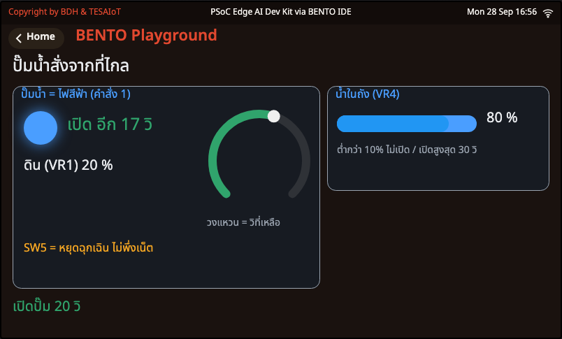

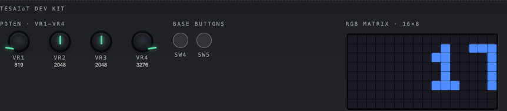

<div class="cap">ภาพจริงจาก BENTO Emulator — <b>MQTT ใน Emulator เป็น broker จำลอง ("No TCP leaves the browser")</b> คำสั่ง <code>{"cmd": "pump", "on": 1, "sec": 20}</code> ในภาพป้อนเข้า broker จำลองตอนถ่ายภาพ ไม่ได้มาจากแอปจริง (TEAM = team99 เฉพาะตอนถ่าย) · ไฟปั๊มบนจอติด วงแหวนและจอไฟ RGB นับถอยหลัง 17 วินาที</div>

</div>
</div>

---

## ความปลอดภัยที่ไม่พึ่งเน็ต — SW5 หยุดฉุกเฉิน · ถังแห้งดับเอง

<style scoped>
section pre { font-size: .56em; }
</style>

<div class="cols">
<div class="c55">

```python
        if stop_btn.pressed_now() and pump_ms:                      # SW5 ไม่ผ่านเน็ตเลย
            pump_ms = 0
            show_note(w, "หยุดฉุกเฉิน " + BTN_NAMES[0], COL_BAD)
            beep("stop")
        soil, tank = knob_percent(0), knob_percent(3)
        msg = mqtt.get_message()       # None = ยังไม่มีอะไรมา / (topic, bytes)
        if msg is not None:
            got += 1
            w["title"].text("ปั๊มน้ำ = ไฟสีฟ้า (คำสั่ง %d)" % got)
            pump_ms, pump_t0 = act_on(w, msg[1], tank, now, pump_ms, pump_t0)
        left = pump_ms - time.ticks_diff(now, pump_t0) if pump_ms else 0
        if pump_ms and (left <= 0 or tank < TANK_MIN):   # ปั๊มดับเองเมื่อครบเวลาหรือน้ำหมดถัง
            pump_ms = 0
            show_note(w, "ครบเวลา ดับเอง" if left <= 0 else "ถังแห้ง ดับเอง", COL_INFO)
            beep("stop")
```

</div>
<div class="shot">

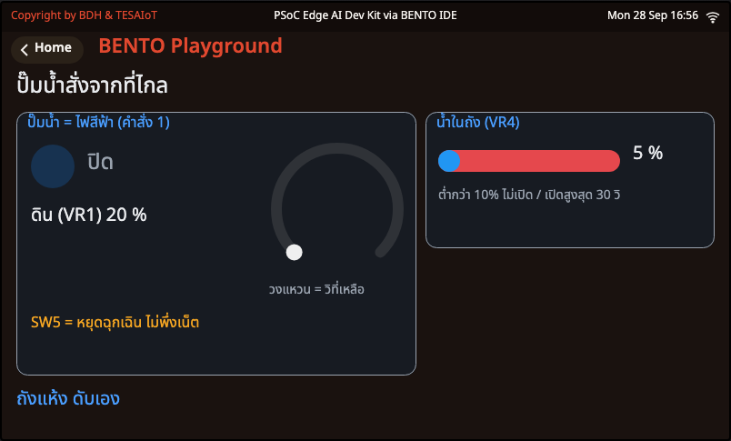

<div class="cap">ภาพจริงจาก BENTO Emulator — หมุน VR4 ลงเหลือ 5 % ระหว่างปั๊มเปิด → "ถังแห้ง ดับเอง" หลอดถังเป็นสีแดง · กฎนี้อยู่ในบอร์ดเอง ไม่พึ่ง MQTT (ซึ่งใน Emulator เป็น broker จำลอง)</div>

</div>
</div>

<div class="think">

**คิด:** ระหว่างปั๊มเปิด **ปิด Hotspot** แล้วกด SW5 — ปั๊มยังดับไหม? · ถ้าฟาร์มจริงไม่มีเพดาน 30 วินาที แล้วมีคนพิมพ์ 9999 จะเกิดอะไรกับแปลงและถังน้ำ? · ทำไมปุ่มหยุดฉุกเฉินต้อง **ไม่ผ่านเน็ต**?

</div>

---

<!-- _class: sec -->

<div class="when">2:15 – 2:30 · 15 นาที</div>

# กิจกรรม 5 — พืชไม่สบาย มือถือรู้ทันที

<div class="lead">ส่งเมื่อ "เปลี่ยน" ไม่ใช่ทุกวินาที — คนรับจะได้ไม่ชินจนเมิน</div>

<div class="flow"><b>กฎเดียวกับ sf1_02</b><i>→</i><b>สถานะเปลี่ยน</b><i>→</i><b>ส่งแจ้งเตือน</b><i>→</i><b>รับทราบจากมือถือ หรือ SW5</b></div>

<div class="files"><div><div class="fh">★ ทำในห้อง</div><div class="f"><a href="https://github.com/Advance-Innovation-Centre-AIC/aiot-development-for-smart-farm/blob/main/s2/sf2_04_crop_alert.py">sf2_04_crop_alert.py</a> <span>— แจ้งเตือนเมื่อพืชเปลี่ยนสถานะ · ตั้งเกณฑ์จากที่ไกล</span></div></div><div><div class="fh hw">☆ การบ้าน / ถ้ามีเวลา</div><div class="f"><a href="https://github.com/Advance-Innovation-Centre-AIC/aiot-development-for-smart-farm/blob/main/s2/practise/sf2_04_practise.py">sf2_04_practise.py</a> <span>— Code Quest ระดับ 3 · เติม judge()</span></div></div></div>

<div class="chal">🏆 <b>ท้าทาย:</b> พอบอร์ดร้อง "แย่แล้ว!" กลุ่มไหน <b>รับทราบจากมือถือได้เร็วที่สุด</b> — ภายในกี่วินาที?</div>


---

## ส่งเมื่อ "เปลี่ยน" ไม่ใช่ทุกวินาที — คนรับจะได้ไม่ชินจนเมิน

<style scoped>
section pre { font-size: .54em; }
</style>

<div class="cols">
<div class="c55">

```python
def read_and_judge(w, s):
    # อ่าน -> ตัดสิน -> โชว์ -> แจ้งถ้าเปลี่ยน  คืน True ถ้าเพิ่งแจ้ง (เริ่มนับรอบร้องซ้ำใหม่)
    sun = pots.read(2) * 10 // 4095    # VR3 = แดดจำลอง 0-10 C ที่บวกเข้าอุณหภูมิ
    t, h = read_climate()
    if t is None or h is None:
        s.t = None                     # อ่านไม่ได้ = ลองใหม่รอบหน้าเลย ไม่ต้องรอครบวินาที
        return False
    s.t = t = t + sun
    level, why_th, why_en = judge(t, h, s.lim)
    show_reading(w, s, t, h, sun, level, why_th)
    if level == s.level:               # ส่ง เล่นเสียง และเขียนจอไฟ RGB เฉพาะตอนเปลี่ยน
        return False
    on_level(w, s, level, why_th, why_en, t, h, sun)
    return True
```

```python
def on_level(w, s, level, why_th, why_en, t, h, sun):
    # ระดับเปลี่ยน: แจ้งออกเน็ต (สัญญาข้อ 3.4) แล้วค่อยเสียง จอไฟ RGB และกล่องเตือน
    s.level, s.acked = level, level < 2
    s.alerts += 1
    if not send({"id": TEAM, "crop": s.crop[1], "level": level, "alert": why_en,
                 "temp_c": round(t, 1), "rh": round(h, 1), "sun_c": sun}):
        stop(w, "สายหลุดตอนส่ง")
```

</div>
<div class="shot">

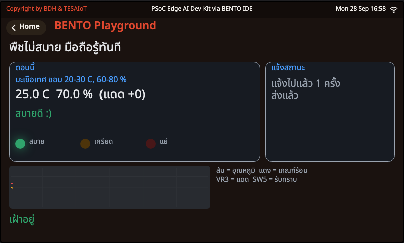

<div class="cap">ภาพจริงจาก BENTO Emulator (TEAM = team99 เฉพาะตอนถ่าย) — มะเขือเทศ 25 °C 70 %RH แดด +0 → "สบายดี" · รอบแรกแจ้งเสมอ จึงขึ้น "แจ้งไปแล้ว 1 ครั้ง" · MQTT ใน Emulator เป็น broker จำลอง ใบแจ้งนั้นไม่ได้ออกนอกเบราว์เซอร์</div>

- **VR3 = แดดจำลอง** บวกอุณหภูมิ 0–10 °C · แจ้งเตือนส่ง `sun_c` บอกว่าบวกไปเท่าไร
- `level` 0 สบาย · 1 เริ่มเครียด · 2 แย่แล้ว (ร้องซ้ำทุก 5 วินาทีจนมีคนรับทราบ)

</div>
</div>

---

## กิจกรรม 5 — พืชไม่สบาย มือถือรู้ทันที

<div class="cols">
<div class="c40">

<div class="goal">

🎯 **เป้าหมาย:** แจ้งเตือนขึ้นบนมือถือเมื่อพืชเปลี่ยนสถานะ · มีคนรับทราบ · เปลี่ยนเกณฑ์ได้จากที่ไกล

</div>

<div class="try">

**ลองทำ**
1. แก้ `CROP` เป็นพืชของกลุ่ม (ต้องมีใน `CROPS`) และ `TEMP_OFFSET` ค่าเดียวกับคาบที่แล้ว
2. หมุน **VR3** (แดด) จนขึ้น **"แย่แล้ว!"** — ดูมือถือ จอ กล่องเตือน จอไฟ `ALERT`
3. รับทราบด้วย `{"cmd":"ack"}` จากช่อง JSON ในหน้ารวม · อีกรอบรับทราบด้วย **SW5**
4. ส่ง `{"cmd":"set","t_hi":28}` → เส้นแดงในกราฟขยับ
5. หมุน VR3 ขึ้นลงเร็ว ๆ ข้ามเส้น นับแจ้งเตือนใน 30 วินาที

</div>

</div>
<div class="shot">

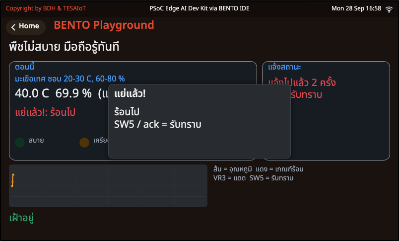

<div class="cap">ภาพจริงจาก BENTO Emulator — ตั้งอุณหภูมิจำลอง 30 °C + หมุน VR3 สุด (แดด +10) = 40 °C → "แย่แล้ว!: ร้อนไป" กล่องเตือนลอยกลางจอจนกว่าจะมีคนรับทราบ · <b>MQTT ใน Emulator เป็น broker จำลอง</b> แจ้งเตือนในภาพจึงไม่ได้ออกไปถึงมือถือจริง</div>

</div>
</div>

---

## รับทราบ + ตั้งเกณฑ์จากที่ไกล — และจุดวางภารกิจกลุ่ม

<style scoped>
section pre { font-size: .54em; }
</style>

<div class="cols">
<div>

```python
def on_command(w, s, raw):
    # คำสั่งจากแอป (สัญญาข้อ 4) คืน True ถ้าเป็นการรับทราบ  คำสั่งที่ไม่รู้จัก = เงียบ ไม่ทำอะไร
    try:                               # ใครส่งอะไรมาก็ได้ ไม่ใช่ JSON object ก็ไม่ใช้
        cmd = json.loads(raw.decode())
        act = cmd.get("cmd")
    except Exception:
        return False
    if act == "ack":
        return True
    elif act == "set":                 # เกณฑ์ใหม่จากที่ไกล ต้องเป็นเลขจำนวนเต็มในช่วงที่สมเหตุผล
        v = cmd.get("t_hi")
        if isinstance(v, int) and s.lim[0] < v <= T_HI_MAX:
            s.lim[1], s.level, s.t = v, -1, None     # level -1 + t None = ตัดสินใหม่และแจ้งทันที
            show_crop(w, s)
            beep("tap")
    # >>> ภารกิจกลุ่ม: วาง elif สำหรับ "led"/"pump" จาก sf2_03 ตรงนี้ <<<
    return False
```

</div>
<div>

```python
        msg = mqtt.get_message()       # ฟังทุก 20 ms แม้จะอ่านเซนเซอร์แค่ทุกวินาที
        ack = on_command(w, s, msg[1]) if msg else False
        down = buttons.pressed(0)      # SW5 (ปุ่มล่าง) = คนหน้าฟาร์มกดรับทราบเอง ไม่ต้องพึ่งเน็ต
        if down and not was_down:      # นับตอนเพิ่งกดลง กดค้างไม่นับซ้ำ
            ack = True
        was_down = down
        if ack and not s.acked:        # มีคนรับทราบ: หยุดร้อง ปิดกล่องเตือน จอไฟ RGB ขึ้น ACK
            s.acked = True
            close_box(w)
            show_ack(w, s, "รับทราบแล้ว", COL_OK)
            rgbmatrix.scroll("ACK", rgbmatrix.CYAN, 80)
            beep("tap")
```

<div class="think">

**คิด:** หมุนแดดข้ามเส้นเร็ว ๆ ได้ ______ แจ้งเตือนใน 30 วินาที — ถ้าเป็นมือถือเจ้าของฟาร์มจริงจะเกิดอะไร? · แก้อย่างไรให้ต้อง "แย่ติดกัน 5 วินาที" ก่อนแจ้ง?

</div>

</div>
</div>

---

<!-- _class: sec -->

<div class="when">2:30 – 2:50 · 20 นาที</div>

# ภารกิจกลุ่ม — ปิดวงจรฟาร์ม

<div class="lead">ไม่มีใครกดปุ่มสั่งปั๊มเอง — ระบบปิดวงจรเอง</div>

<div class="flow"><b>ดินแห้ง</b><i>→</i><b>แอปตัดสิน</b><i>→</i><b>ปั๊มเปิด</b><i>→</i><b>CSV เป็นหลักฐาน</b></div>

<div class="files one"><div><div class="fh">★ ทำในห้อง</div><div class="f"><a href="https://github.com/Advance-Innovation-Centre-AIC/aiot-development-for-smart-farm/blob/main/s2/sf2_03_remote_pump.py">sf2_03_remote_pump.py</a> <span>— บอร์ด: รับคำสั่งปั๊ม ตรวจก่อนทำ</span></div><div class="fh lap">💻 แอปบนโน้ตบุ๊ก</div><div class="f"><a href="https://github.com/Advance-Innovation-Centre-AIC/aiot-development-for-smart-farm/blob/main/s2/app/farm_monitor.py">farm_monitor.py</a> <span>— แอป: กฎดินแห้ง + จด CSV</span></div></div></div>

<div class="chal">🏆 <b>ท้าทาย:</b> วัดเวลา <b>"ดินแห้งจนปั๊มเปิด" จาก CSV</b> — กลุ่มไหนได้ตัวเลขสั้นที่สุด และอธิบายได้ว่าเวลานั้นมาจากไหนบ้าง?</div>


---

## ภารกิจ: ดินแห้ง → แอปตัดสิน → ปั๊มเปิด → CSV เป็นหลักฐาน

<style scoped>
section table { font-size: .6em; }
section li { font-size: .84em; }
</style>

<svg viewBox="0 0 1000 200" xmlns="http://www.w3.org/2000/svg" font-family="sans-serif">
  <defs><marker id="lp" markerUnits="userSpaceOnUse" viewBox="0 0 12 12" markerWidth="16" markerHeight="16" refX="10" refY="6" orient="auto"><path d="M0,0 L12,6 L0,12 z" fill="#546e7a"/></marker></defs>
  <rect x="10" y="30" width="220" height="80" rx="12" fill="#e8f5e9" stroke="#2e7d32" stroke-width="3"/>
  <text x="120" y="62" text-anchor="middle" font-size="19" font-weight="700" fill="#1b5e20">① หมุน VR1 ลง</text>
  <text x="120" y="90" text-anchor="middle" font-size="16" fill="#37474f">บอร์ดส่ง soil ทุก 5 วิ</text>
  <rect x="265" y="30" width="220" height="80" rx="12" fill="#e3f2fd" stroke="#1565c0" stroke-width="3"/>
  <text x="375" y="62" text-anchor="middle" font-size="19" font-weight="700" fill="#0d47a1">② แอป: soil &lt; SOIL_MIN</text>
  <text x="375" y="90" text-anchor="middle" font-size="16" fill="#37474f">rule() + cooldown 60 วิ</text>
  <rect x="520" y="30" width="220" height="80" rx="12" fill="#f3e5f5" stroke="#6a1b9a" stroke-width="3"/>
  <text x="630" y="62" text-anchor="middle" font-size="19" font-weight="700" fill="#6a1b9a">③ ส่ง cmd pump</text>
  <text x="630" y="90" text-anchor="middle" font-size="16" fill="#37474f">บอร์ดตรวจ แล้วเปิดปั๊ม</text>
  <rect x="775" y="30" width="215" height="80" rx="12" fill="#fff3e0" stroke="#ef6c00" stroke-width="3"/>
  <text x="882" y="62" text-anchor="middle" font-size="19" font-weight="700" fill="#e65100">④ pump = 1</text>
  <text x="882" y="90" text-anchor="middle" font-size="16" fill="#37474f">ในใบถัดไป → CSV</text>
  <line x1="232" y1="70" x2="260" y2="70" stroke="#546e7a" stroke-width="4" marker-end="url(#lp)"/>
  <line x1="487" y1="70" x2="515" y2="70" stroke="#546e7a" stroke-width="4" marker-end="url(#lp)"/>
  <line x1="742" y1="70" x2="770" y2="70" stroke="#546e7a" stroke-width="4" marker-end="url(#lp)"/>
  <path d="M882 114 C 882 170, 120 170, 120 116" fill="none" stroke="#546e7a" stroke-width="3" stroke-dasharray="9 7" marker-end="url(#lp)"/>
  <text x="500" y="190" text-anchor="middle" font-size="17" fill="#546e7a">ส่วนหนึ่งของเวลา "ดินแห้งจนปั๊มเปิด" มาจากรอบส่งทุก 5 วินาทีของบอร์ด — ส่วนไหนอีก?</text>
</svg>

<div class="cols">
<div>

| รอบ | ดินต่ำกว่าเกณฑ์ (CSV) | แอปสั่ง (แถว `command`) | `pump` = 1 | ใช้กี่วินาที |
|---|---|---|---|---|
| 1 | | | | |
| 2 | | | | |

**ส่งงาน:** กราฟจาก Excel (ดิน + ปั๊ม) · รูปจอบอร์ดตอนปั๊มเปิด · โค้ดส่วนที่แก้

</div>
<div>

**เลือกเพิ่ม 1 ข้อ (ท้าทาย)**
- **A** TODO 4: ร้อนเกินเกณฑ์ → ส่ง `{"cmd":"say","text":"HOT"}`
- **B** ใน `sf2_04` ตรง `>>> ภารกิจกลุ่ม` วางคำสั่ง `pump` จาก `sf2_03`
- **C** ใน `sf2_03` เพิ่ม `{"cmd":"set","tank_min":20}` พร้อมกันค่าแปลก ๆ
- **D** Smart IoT Gateway: `sf2_06` + `field_sim.py` (ช่วงต่อยอด)

</div>
</div>

---

## วิธีรันบนบอร์ด

<style scoped>
section li, section p { margin: .05em 0; line-height: 1.26; font-size: .88em; }
</style>

<div class="cols">
<div class="c55">

1. **บนจอบอร์ด** แตะการ์ด **BENTO Playground** เปิดค้างไว้ก่อนส่งโค้ด
2. **บนคอม** เปิด BENTO IDE (<https://ide.tesaiot.com/>) กด **Connect** บอร์ด
3. เปิดไฟล์ของคาบนี้ แก้หัวไฟล์: `WIFI_SSID` · `WIFI_PASS` · `TEAM` จาก `teamXX` เป็นเลขที่ผู้สอนแจก (ลืม = ไฟล์หยุดตั้งแต่แรกพร้อมบอกบนจอ) · `sf2_01` ไม่มี `TEAM` · `sf2_04` แก้ `CROP` กับ `TEMP_OFFSET` ด้วย · `sf2_05` ใช้ `DEVICE_ID` ที่ผู้สอนแจก · `BROKER` ตั้งไว้แล้ว ไม่ต้องแก้
4. กด **Program to Device** แล้ว **หันไปมองจอบอร์ด** · อย่ากดรีเซ็ตระหว่างที่จอนิ่ง
5. ข้อความจาก `print()` เช่น `ส่ง: {...}` ดูได้ใน **Console**
6. **ไฟล์ละครั้ง รันครั้ง** — อย่าแก้หลายไฟล์แล้วค่อยรันทีเดียว จะไม่รู้ว่าพังที่ไหน

</div>
<div>

<div class="warn">

**บอกตรง ๆ:** ไฟล์บอร์ดของคาบนี้ รันกับ Wi-Fi และ MQTT จริงบนบอร์ด TESAIoT Dev Kit แล้ว (broker.hivemq.com): ค่าจากบอร์ดถึง `farm_monitor.py` และลง CSV · คำสั่งปั๊มถึงบอร์ด · Gateway สั่ง PLC รดน้ำเองเมื่อดินแห้ง · ยกเว้น `sf2_05` ที่ต้องใช้รหัสอุปกรณ์จากผู้สอน · broker สาธารณะบางครั้งตอบช้า ถ้าขึ้น **"broker ไม่ตอบ …"** ให้กด **Program to Device** อีกครั้ง · เจออาการแปลกอื่น จดข้อความบนจอลงใบงานแล้วบอกผู้สอน

</div>

<div class="think">

**ถ้าเน็ตของสถานที่กันพอร์ตทั้งห้อง** (ผู้สอนประกาศ): ข้อ MQTT ผ่านเมื่อกลุ่มอธิบายจากจอได้ว่าหยุดที่ขั้นไหนของ **Wi-Fi → IP → broker** และเพราะอะไร

</div>

</div>
</div>

---

## ข้อมูลไหลไปทางไหน — วิทยุอยู่ฝั่งเดียวกับโค้ดของเรา

<svg viewBox="0 0 1000 250" xmlns="http://www.w3.org/2000/svg" font-family="sans-serif">
  <defs><marker id="w1" markerUnits="userSpaceOnUse" viewBox="0 0 12 12" markerWidth="16" markerHeight="16" refX="10" refY="6" orient="auto"><path d="M0,0 L12,6 L0,12 z" fill="#455a64"/></marker></defs>
  <rect x="20" y="80" width="250" height="96" rx="12" fill="#e3f2fd" stroke="#1565c0" stroke-width="3"/>
  <text x="145" y="110" text-anchor="middle" font-size="18" font-weight="700" fill="#1565c0">Cortex-M33 (Non-secure)</text>
  <text x="145" y="138" text-anchor="middle" font-size="17" fill="#0d47a1">โค้ด Python ของเรา</text>
  <text x="145" y="162" text-anchor="middle" font-size="17" fill="#0d47a1">+ Wi-Fi · MQTT</text>
  <rect x="304" y="80" width="150" height="96" rx="12" fill="#fff3e0" stroke="#ef6c00" stroke-width="3"/>
  <text x="379" y="120" text-anchor="middle" font-size="19" font-weight="700" fill="#ef6c00">ชิปวิทยุ</text>
  <text x="379" y="148" text-anchor="middle" font-size="16" fill="#e65100">Wi-Fi บน SoM</text>
  <rect x="488" y="80" width="160" height="96" rx="12" fill="#eceff1" stroke="#455a64" stroke-width="3"/>
  <text x="568" y="120" text-anchor="middle" font-size="19" font-weight="700" fill="#455a64">Hotspot มือถือ</text>
  <text x="568" y="148" text-anchor="middle" font-size="16" fill="#37474f">แจกเลข IP</text>
  <rect x="682" y="80" width="170" height="96" rx="12" fill="#f3e5f5" stroke="#6a1b9a" stroke-width="3"/>
  <text x="767" y="120" text-anchor="middle" font-size="19" font-weight="700" fill="#6a1b9a">broker</text>
  <text x="767" y="148" text-anchor="middle" font-size="16" fill="#4a148c">hivemq · 1883</text>
  <rect x="780" y="10" width="200" height="56" rx="12" fill="#e8f5e9" stroke="#2e7d32" stroke-width="3"/>
  <text x="880" y="34" text-anchor="middle" font-size="18" font-weight="700" fill="#2e7d32">Cortex-M55</text>
  <text x="880" y="56" text-anchor="middle" font-size="15" fill="#1b5e20">วาดจอ ไม่ยุ่งกับเน็ต</text>
  <line x1="272" y1="128" x2="300" y2="128" stroke="#455a64" stroke-width="3" marker-end="url(#w1)"/>
  <line x1="456" y1="128" x2="484" y2="128" stroke="#455a64" stroke-width="3" marker-end="url(#w1)"/>
  <line x1="650" y1="128" x2="678" y2="128" stroke="#455a64" stroke-width="3" marker-end="url(#w1)"/>
  <path d="M145 78 C 145 22, 600 16, 776 34" fill="none" stroke="#6a1b9a" stroke-width="3" marker-end="url(#w1)"/>
  <text x="470" y="68" text-anchor="middle" font-size="15" fill="#6a1b9a">ui.* → ส่งให้ M55 วาด (ui.poll())</text>
  <text x="500" y="212" text-anchor="middle" font-size="19" font-weight="700" fill="#37474f">เน็ตทั้งเส้นอยู่ฝั่ง M33 — คอร์เดียวกับที่รัน Python ของเรา</text>
  <text x="500" y="238" text-anchor="middle" font-size="17" fill="#78909c">wifi.connect() จึงบล็อกได้ทั้งโปรแกรม และต้อง ui.poll() ให้จอทันก่อนเข้าบรรทัดนั้น</text>
</svg>

- `wifi.connect()` บล็อกคอร์เดียวกับที่รัน Python → ระหว่างนั้นไม่มีใครส่งงานใหม่ไปให้ M55 วาด → **จอหลักนิ่ง**
- `mqtt.get_message()` ตรงกันข้าม **ไม่บล็อกเลย** จึงต้องเป็นเราที่วนถามเองทุก 0.1 วินาที

> ถ้าเข้าใจสไลด์นี้ จะไม่มีวันเขียนป้ายบอกสถานะไว้ **หลัง** บรรทัดที่บล็อกอีกเลย

---

## MVP checkpoint — ผ่านคาบนี้เมื่อ

<style scoped>
section li, section p { margin: .04em 0; line-height: 1.26; font-size: .9em; }
</style>

**กลุ่มส่งค่าฟาร์มออกไปให้แอปของตัวเองเห็น และสั่งปั๊มกลับมาได้**

- [ ] `sf2_01` ขึ้นเลข IP ที่ **ไม่ใช่** `0.0.0.0` บนจอบอร์ด
- [ ] `sf2_02` ค่าของกลุ่มขึ้นบนหน้าเว็บมือถือ (`id` ตรงกับ TEAM) และกรอกตาราง 4.2 ครบ 3 ใบ
- [ ] แอปของกลุ่ม (`farm_monitor.py` หรือ `farm_web.html`) แสดงค่าจากบอร์ดของกลุ่มเอง และแก้ TODO อย่างน้อย 2 ข้อ
- [ ] มีไฟล์ CSV ที่เปิดใน Excel พร้อมกราฟ (กลุ่มที่ใช้เว็บ: ตารางจดมือ 5 แถว)
- [ ] `sf2_03` ปั๊มเปิดจากคำสั่งที่ไกลอย่างน้อย 1 ครั้ง และกรอกตาราง 4.4 อย่างน้อย 4 แถว
- [ ] ภารกิจกลุ่มสำเร็จอย่างน้อย 1 รอบ (มีแถว `command` และ `pump` = 1 ใน CSV)

> **ถ้าเน็ตของห้องกันพอร์ตทั้งห้อง** (ผู้สอนประกาศ) ข้อ MQTT ผ่านเมื่อกลุ่มอธิบายจากจอได้ว่าหยุดที่ขั้นไหนของ Wi-Fi → IP → broker และเพราะอะไร

---

## กับดักที่เจอบ่อย

<style scoped>
section table { font-size: .52em; }
section table td, section table th { padding: .1em .45em; }
section blockquote { font-size: .8em; }
</style>

| อาการ | สาเหตุที่แท้จริง | วิธีแก้ |
|---|---|---|
| จอนิ่งค้างนาน คิดว่าบอร์ดแฮงก์ | `wifi.connect()` บล็อกได้ถึงราว 85 วินาที | รอ **อย่ากดรีเซ็ต** · ป้าย + `ui.poll()` ต้องมาก่อนบรรทัดนั้น |
| ได้ IP แต่ขึ้น "broker ไม่ตอบ …" | broker สาธารณะตอบช้าชั่วคราว · หรือ Wi-Fi ที่ต้อง login หน้าเว็บ / เน็ตกันพอร์ต 1883 | บอร์ดลองให้เองแล้ว 3 ครั้ง · รอ 1 นาทีแล้วกด **Program to Device** อีกครั้ง · ถ้ายังไม่ได้ ใช้ Hotspot มือถือของกลุ่ม |
| "ได้ยินวงแต่ต่อไม่ผ่าน" | รหัสผ่านผิด | แก้ `WIFI_PASS` (อย่างน้อย 8 ตัว) |
| "ไม่ได้ยินวง ..." | ชื่อผิด · Hotspot ปิด · เป็นคลื่น 5 GHz | iPhone เปิด Maximize Compatibility · Android เลือก 2.4 GHz |
| โค้ดบอกว่าได้ IP แต่ส่งอะไรไม่ออก | เขียน `if wifi.ip():` — `"0.0.0.0"` ถือว่าจริง | เทียบตรง ๆ `wifi.ip() != "0.0.0.0"` |
| "แก้ TEAM เป็นเลขกลุ่มก่อน" | ยังเป็น `teamXX` | แก้ `TEAM` ให้ตรงกับที่ผู้สอนแจก |
| บอร์ดส่งแต่หน้าเว็บว่าง | `?team=` ไม่ตรง หรือเปิดหน้าเว็บหลังบอร์ดส่ง (ไม่มี retain) | ตรวจ TEAM สองที่ แล้วรอใบถัดไป 5 วินาที |
| สองเครื่องผลัดกันหลุด | `client_id` ซ้ำ — broker เตะตัวเก่า | บอร์ดต่อท้ายตัวสุ่มเองทุกครั้งที่ต่อ · แอปต่อท้ายตัวสุ่มเสมอ |
| ต่อ broker ไม่ได้ทันทีหลังหยุดโปรแกรม | การเชื่อมต่อของรอบก่อนยังค้างอยู่ที่ broker | รอราว 1 นาที หรือกด **RESET** แล้วรันใหม่ |
| ยิงคำสั่งสามใบ บอร์ดได้ใบเดียว | กล่องรับมีช่องเดียว ใบใหม่ทับใบเก่า | ส่งห่างอย่างน้อย 1 วินาที · กฎอัตโนมัติเว้น 60 วินาที |
| `say` ภาษาไทยแล้วจอไฟไม่ขึ้น | จอไฟ RGB รับเฉพาะอักษรอังกฤษ ตัวเลข เครื่องหมาย | ใช้อังกฤษ ไม่เกิน 20 ตัว |
| `farm_monitor.py` ต่อไม่ได้ | ยังไม่ `pip install paho-mqtt` หรือเน็ตกันพอร์ต 1883 | ติดตั้ง · ใช้ Hotspot · หรือใช้ `farm_web.html` |
| หน้าเว็บขึ้นผิดพลาด | เน็ตกันพอร์ต 8884 | ตัวสำรองที่ผู้สอนประกาศ `wss://test.mosquitto.org:8081/mqtt` หรือต่อ Hotspot |
| แอปไม่เห็นอะไรจากบอร์ดใน Emulator | MQTT ของ Emulator เป็น broker จำลองในเบราว์เซอร์ | ทดสอบแอปด้วย `fake_board.py` |

> ครึ่งหนึ่งของตารางนี้ **ไม่มี error ให้จับสักตัว** โปรแกรมเดินผ่านไปเงียบ ๆ แล้วรายงานสิ่งที่ไม่จริง — บั๊กที่แพงที่สุดในงานเครือข่าย

---

<!-- _class: sec -->

<div class="when">ต่อยอด · ทีมที่เสร็จเร็ว + โปรเจกต์</div>

# บอร์ดของเราคือ Smart IoT Gateway

<div class="lead">Gateway ตัดสินใจ แต่ความจริงคือสิ่งที่ PLC รายงาน</div>

<div class="flow"><b>โหนดเซนเซอร์ในแปลง</b><i>→</i><b>Gateway ตัดสิน</b><i>→</i><b>PLC คุมปั๊ม</b><i>→</i><b>PLC รายงานกลับ</b></div>

<div class="files"><div><div class="fh hw">☆ ทางที่ 1 · บอร์ดเดียว + โน้ตบุ๊ก</div><div class="f"><a href="https://github.com/Advance-Innovation-Centre-AIC/aiot-development-for-smart-farm/blob/main/s2/sf2_06_smart_gateway.py">sf2_06_smart_gateway.py</a> <span>— บอร์ดของเราเป็น Gateway ของฟาร์ม</span></div><div class="fh lap">💻 แอปบนโน้ตบุ๊ก</div><div class="f"><a href="https://github.com/Advance-Innovation-Centre-AIC/aiot-development-for-smart-farm/blob/main/s2/app/field_sim.py">field_sim.py</a> <span>— แปลงผักจำลองบนโน้ตบุ๊ก</span></div></div><div><div class="fh hw">☆ ทางที่ 2 · สองบอร์ด ร่วมกับทีมข้าง ๆ</div><div class="f"><a href="https://github.com/Advance-Innovation-Centre-AIC/aiot-development-for-smart-farm/blob/main/s2/sf2_06_smart_gateway.py">sf2_06_smart_gateway.py</a> <span>— บอร์ดของเราเป็น Gateway</span></div><div class="f"><a href="https://github.com/Advance-Innovation-Centre-AIC/aiot-development-for-smart-farm/blob/main/s2/sf2_07_field_station.py">sf2_07_field_station.py</a> <span>— บอร์ดทีมข้าง ๆ เล่นเป็นแปลงผัก</span></div></div></div>

<div class="chal">🏆 <b>ท้าทาย:</b> ปิด <code>field_sim.py</code> กลางคัน แล้ว <b>จับเวลาว่า Gateway ขึ้น "PLC หลุด!" ภายในกี่วินาที</b> — ตรงกับค่าไหนในโค้ด?</div>


---

## ภาพฟาร์มจริง: โหนดเซนเซอร์ → Gateway → PLC

<style scoped>
section li { font-size: .82em; margin: .03em 0; }
section svg { max-height: 290px; }
</style>

<svg viewBox="0 0 1000 330" xmlns="http://www.w3.org/2000/svg" font-family="sans-serif">
  <defs><marker id="gw" markerUnits="userSpaceOnUse" viewBox="0 0 12 12" markerWidth="15" markerHeight="15" refX="10" refY="6" orient="auto"><path d="M0,0 L12,6 L0,12 z" fill="#37474f"/></marker>
  <marker id="gp" markerUnits="userSpaceOnUse" viewBox="0 0 12 12" markerWidth="15" markerHeight="15" refX="10" refY="6" orient="auto"><path d="M0,0 L12,6 L0,12 z" fill="#6a1b9a"/></marker></defs>
  <!-- field node -->
  <rect x="20" y="10" width="270" height="92" rx="14" fill="#e8f5e9" stroke="#2e7d32" stroke-width="3"/>
  <text x="155" y="40" text-anchor="middle" font-size="19" font-weight="700" fill="#1b5e20">🌱 โหนดเซนเซอร์ไร้สาย</text>
  <text x="155" y="66" text-anchor="middle" font-size="15" fill="#37474f">กลางแปลง · วัดอย่างเดียว ไม่ตัดสิน</text>
  <text x="155" y="90" text-anchor="middle" font-size="15" fill="#37474f">ความชื้นดิน · น้ำในถัง</text>
  <!-- PLC -->
  <rect x="710" y="10" width="270" height="92" rx="14" fill="#fff3e0" stroke="#ef6c00" stroke-width="3"/>
  <text x="845" y="40" text-anchor="middle" font-size="19" font-weight="700" fill="#e65100">🔌 PLC Wi-Fi ที่โรงสูบ</text>
  <text x="845" y="66" text-anchor="middle" font-size="15" fill="#37474f">รีเลย์ → ปั๊ม/วาล์ว</text>
  <text x="845" y="90" text-anchor="middle" font-size="15" fill="#37474f">กฎของตัวเอง: ≤ 30 วิ · ถัง ≥ 10 %</text>
  <!-- broker band -->
  <rect x="20" y="138" width="960" height="44" rx="10" fill="#eceff1" stroke="#455a64" stroke-width="3"/>
  <text x="500" y="167" text-anchor="middle" font-size="19" font-weight="700" fill="#455a64">MQTT broker · bento-aiot/&lt;TEAM&gt;/...</text>
  <!-- gateway -->
  <rect x="20" y="220" width="400" height="100" rx="14" fill="#e3f2fd" stroke="#1565c0" stroke-width="4"/>
  <text x="220" y="252" text-anchor="middle" font-size="20" font-weight="700" fill="#0d47a1">🖥️ Dev Kit = Smart IoT Gateway</text>
  <text x="220" y="280" text-anchor="middle" font-size="15" fill="#37474f">อ่านทุกโหนด · ตัดสินว่าต้องรดน้ำไหม · สั่ง PLC</text>
  <text x="220" y="304" text-anchor="middle" font-size="15" fill="#37474f">จอสัมผัส · เสียง · ไฟ · รายงานสรุปให้แอป</text>
  <!-- app -->
  <rect x="640" y="220" width="340" height="100" rx="14" fill="#f3e5f5" stroke="#6a1b9a" stroke-width="3"/>
  <text x="810" y="252" text-anchor="middle" font-size="20" font-weight="700" fill="#6a1b9a">📱 แอปของกลุ่ม</text>
  <text x="810" y="280" text-anchor="middle" font-size="15" fill="#37474f">ดูได้ทุกหัวข้อ (#)</text>
  <text x="810" y="304" text-anchor="middle" font-size="15" fill="#37474f">สั่งผ่าน Gateway ไม่สั่ง PLC ตรง</text>
  <!-- arrows -->
  <line x1="155" y1="104" x2="155" y2="134" stroke="#37474f" stroke-width="4" marker-end="url(#gw)"/>
  <text x="165" y="126" font-size="14" fill="#1b5e20">field/soil · field/tank</text>
  <line x1="800" y1="136" x2="800" y2="106" stroke="#6a1b9a" stroke-width="4" marker-end="url(#gp)"/>
  <text x="700" y="126" font-size="14" fill="#6a1b9a">plc/cmd ↑</text>
  <line x1="890" y1="104" x2="890" y2="134" stroke="#37474f" stroke-width="4" marker-end="url(#gw)"/>
  <text x="900" y="126" font-size="14" fill="#e65100">plc/state</text>
  <line x1="44" y1="184" x2="44" y2="216" stroke="#37474f" stroke-width="4" marker-end="url(#gw)"/>
  <text x="56" y="206" font-size="13" fill="#0d47a1">ฟัง field/+ · plc/state · cmd</text>
  <line x1="330" y1="218" x2="330" y2="186" stroke="#6a1b9a" stroke-width="4" marker-end="url(#gp)"/>
  <text x="340" y="206" font-size="13" fill="#6a1b9a">plc/cmd · telemetry · event</text>
  <line x1="740" y1="184" x2="740" y2="216" stroke="#37474f" stroke-width="4" marker-end="url(#gw)"/>
  <line x1="880" y1="218" x2="880" y2="186" stroke="#6a1b9a" stroke-width="4" marker-end="url(#gp)"/>
  <text x="890" y="206" font-size="13" fill="#6a1b9a">cmd</text>
  <circle id="sf2anim8" cx="155" cy="110" r="6" fill="#2e7d32"/><animate href="#sf2anim8" attributeName="cy" values="106;132;106" dur="2s" repeatCount="indefinite"/>
  <circle id="sf2anim9" cx="800" cy="130" r="6" fill="#6a1b9a"/><animate href="#sf2anim9" attributeName="cy" values="132;108;132" dur="2.4s" repeatCount="indefinite"/>
</svg>

<div class="cols">
<div class="c60">

- **Sense (โหนด) → Decide (Gateway) → Act (PLC) → Confirm (PLC บอกสถานะจริงกลับมา)**
- **คนสั่งไม่ใช่ความจริง** ความจริงคือสิ่งที่ PLC รายงานกลับ — จอ Gateway จึงโชว์ `plc/state` ไม่ใช่คำสั่งที่ส่งไป
- ในห้องเรียนไม่มีโหนดและ PLC จริง: รัน `field_sim.py` บนโน้ตบุ๊กแทน หรือให้บอร์ดอีกกลุ่มรัน `sf2_07` เป็นแปลง · **ตั้ง TEAM เดียวกันทุกตัว**

</div>
<div>

<div class="vid" style="flex-direction:column">
<iframe width="280" height="158" src="https://www.youtube.com/embed/fCfK7ugax1s" title="อธิบาย IoT Gateway — Factonation" loading="lazy" frameborder="0" allowfullscreen></iframe>
<div><b>อธิบาย IoT Gateway | What is IoT Gateway</b><br>Factonation · 3:53 · ภาษาไทย<br><https://www.youtube.com/watch?v=fCfK7ugax1s></div>
</div>

</div>
</div>

---

## ข้อความในแปลง — โหนด · PLC · Gateway

<style scoped>
section pre { font-size: .54em; }
section p, section li { font-size: .84em; }
</style>

<div class="cols">
<div>

**โหนดเซนเซอร์ → `field/<เซนเซอร์>`** (ทุก 5 วิ ต่อโหนด)
```json
{"node": "soil-1", "value": 42, "unit": "%", "n": 17}
```

**PLC → `plc/state`** (ทุกครั้งที่เปลี่ยน · ได้คำสั่ง · ทุก 5 วิ)
```json
{"pump": 1, "left_s": 8, "why": "on", "n": 23}
```

`why`: `start` · `on` · `off` · `timeout` · `blocked_tank` · `bad_cmd` · `stop` · `tick` — **ไม่ได้ยิน `plc/state` เกิน 15 วินาที = ถือว่า PLC หลุด**

</div>
<div>

**Gateway → `telemetry`** (สรุปทุก 5 วิ)
```json
{"id": "team05", "n": 31, "soil": 42, "tank": 77, "pump": 0, "auto": 1, "by": "gateway"}
```

**Gateway → `event`**
```json
{"id": "team05", "event": "pump", "pump": 1, "why": "on"}
{"id": "team05", "event": "plc_lost"}
{"id": "team05", "event": "auto_water", "soil": 28}
```

**แอป → Gateway ทาง `cmd`:** `{"cmd":"pump","on":1,"sec":10}` · `{"cmd":"pump","on":0}` · `{"cmd":"auto","on":0}` — Gateway ตรวจก่อนแล้วส่งต่อให้ PLC ทาง `plc/cmd` เช่น `{"pump":1,"sec":10}`

</div>
</div>

<div class="src">ที่มา: <a href="https://github.com/Advance-Innovation-Centre-AIC/aiot-development-for-smart-farm/blob/main/s2/app/MQTT_CONTRACT_th.md"><code>MQTT_CONTRACT_th.md</code></a> ข้อ 0, 3.5–3.8, 4.1–4.2</div>

---

## Gateway ตัดสินใจ — แต่ความจริงคือสิ่งที่ PLC รายงาน

<style scoped>
section pre { font-size: .52em; }
</style>

<div class="cols">
<div class="c55">

```python
def should_water(farm, soil, tank, since_cmd_ms):
    # กฎออโต้: เปิดโหมด + ดินแห้ง + น้ำพอ + PLC บอกว่าปั๊มหยุด + พ้นช่วงรอ
    return (farm.auto and soil is not None and soil < SOIL_MIN and tank is not None
            and tank >= TANK_MIN and farm.pump == 0 and since_cmd_ms >= COOLDOWN_MS)
# ...
def app_request(cmd, tank):
    # คำสั่งจากแอป (สัญญาข้อ 4.1) -> (คำสั่งถึง PLC หรือ None, โหมดออโต้ใหม่หรือ None, ข้อความ)
    act = cmd.get("cmd") if cmd else None
    if act == "pump" and not cmd.get("on", 1):
        return {"pump": 0}, None, "หยุดปั๊ม"
    if act == "pump":
        if tank is None or tank < TANK_MIN:
            return None, None, "ถังน้ำไม่พอ"
        sec = cmd.get("sec", PUMP_SEC)
        sec = min(sec, PUMP_MAX_S) if isinstance(sec, int) and sec > 0 else PUMP_SEC
        return {"pump": 1, "sec": sec}, None, "รดน้ำ %d วิ" % sec
    if act == "auto":
        return None, 1 if cmd.get("on", 1) else 0, "ตั้งออโต้"
    return None, None, "ไม่รู้จักคำสั่ง"
```

</div>
<div class="shot">

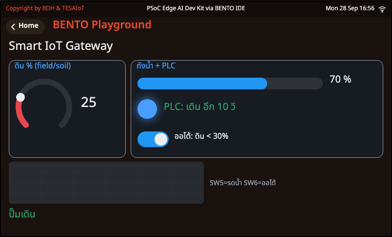

<div class="cap">ภาพจริงจาก BENTO Emulator — ใน Emulator ไม่มีแปลงและ PLC จริง และ <b>MQTT เป็น broker จำลอง ("No TCP leaves the browser")</b> ภาพนี้ป้อนข้อความแทน <code>field_sim.py</code> เข้า broker จำลองตอนถ่าย: <code>field/soil</code> = 25 · <code>field/tank</code> = 70 · และคำตอบ <code>plc/state</code> ของ PLC → Gateway เห็นดิน 25 % &lt; 30 % สั่งรดน้ำ · ไฟ PLC ติด "เดิน อีก 10 วิ"</div>

</div>
</div>

- **กฎออโต้ห้าข้อต้องจริงพร้อมกัน** ถ้าข้อใดไม่แน่ใจ (`None`) = ไม่สั่ง · ปุ่ม **SW5** ผ่าน `app_request()` **กฎเดียวกับคำสั่งจากแอป** · **SW6** หรือแตะสวิตช์บนจอ = สลับโหมดออโต้

---

## PLC ไม่เชื่อใคร — ความปลอดภัยสองชั้น

<style scoped>
section pre { font-size: .54em; }
section li { font-size: .84em; }
</style>

<div class="cols">
<div class="c55">

```python
def plc_decide(raw, tank):
    # คำสั่งจาก plc/cmd (สัญญาข้อ 4.2) -> (วินาทีที่จะเปิด / 0 = ปิด / None = ไม่ทำ, เหตุผล)
    try:
        cmd = json.loads(raw.decode())
    except ValueError:
        cmd = None
    if not isinstance(cmd, dict) or "pump" not in cmd:
        return None, "bad_cmd"
    if not cmd["pump"]:
        return 0, "off"
    if tank < PLC_TANK_MIN:
        return None, "blocked_tank"
    sec = cmd.get("sec", PLC_DEFAULT_S)
    if not isinstance(sec, int) or sec <= 0:
        sec = PLC_DEFAULT_S
    return min(sec, PLC_MAX_S), "on"
```

```python
def check_plc_alive(w, farm, now):
    # PLC เงียบเกิน STALE_MS: ไม่รู้แล้วว่าปั๊มเดินไหม ต้องบอกคนทันที (เสียง + ข้อความแดง + event)
    if farm.plc_ms is not None and not farm.lost and time.ticks_diff(now, farm.plc_ms) >= STALE_MS:
        farm.lost, farm.pump = True, None
        beep("bad")
        show_note(w, "PLC หลุด!", COL_BAD)
        send("event", {"id": TEAM, "event": "plc_lost"})
```

</div>
<div class="shot">

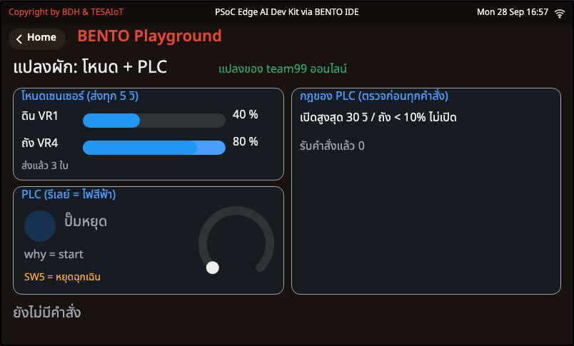

<div class="cap">ภาพจริงจาก BENTO Emulator — <code>sf2_07</code> เล่นเป็นแปลง: VR1 = ดิน 40 % · VR4 = ถัง 80 % · ไฟสีฟ้า = รีเลย์ (TEAM = team99 เฉพาะตอนถ่าย · MQTT ใน Emulator เป็นแบบจำลอง จึง "รับคำสั่งแล้ว 0")</div>

- **ชั้นที่ 1** Gateway ตรวจก่อนส่ง · **ชั้นที่ 2** PLC ตรวจซ้ำด้วยกฎของตัวเอง — ชั้นไหนพลาด อีกชั้นยังกันไว้
- Gateway สั่งเปิด 999 วินาที → **ใคร** ตัดเหลือ 30?

</div>
</div>

---

## อ่านนอกเวลา: `sf2_05` — ฟาร์มจำที่อยู่คลาวด์เอง

<style scoped>
section pre { font-size: .54em; }
section li { font-size: .84em; }
</style>

<div class="cols">
<div class="c55">

```python
def wait_platform(w):
    # สั่งต่อ แล้ววนถาม is_connected() ทุก POLL_MS จนติด (True) หรือรอครบ WAIT_MS (False)
    # connect() คืนทันที = "รับคำสั่งแล้ว" ไม่ใช่ "ต่อติดแล้ว" ส่งบรรทัดถัดไปเลยจะหาย
    tesaiot.connect()
    t0 = time.ticks_ms()
    while not tesaiot.is_connected():
        waited = time.ticks_diff(time.ticks_ms(), t0)
        show_wait(w, waited)
        if waited >= WAIT_MS:
            return False
        time.sleep_ms(POLL_MS)
    return True
```

- [`sf2_05_farm_cloud_one_call.py`](https://github.com/Advance-Innovation-Centre-AIC/aiot-development-for-smart-farm/blob/main/s2/sf2_05_farm_cloud_one_call.py) อ่าน **คลังค่าตั้งบนแฟลช** (`tesaiot.config()`) ได้โดยไม่ต้องมีเน็ต · ถอดไฟแล้วค่ายังอยู่
- `tesaiot.connect()` ต่อแบบ **เข้ารหัส TLS เสมอ** จึงต่อ `broker.hivemq.com:1883` ไม่ได้ · มัน **คืนค่าทันที** ไม่ได้แปลว่าต่อติด → ต้องวนถาม `is_connected()` เองพร้อมเวลาเลิกรอ
- ต้องรอผู้สอนแจกชื่อ broker ของแพลตฟอร์ม · ยังไม่แจก = ไฟล์อ่านคลังค่าตั้งอย่างเดียวแล้วจบอย่างสุภาพ

</div>
<div class="shot">

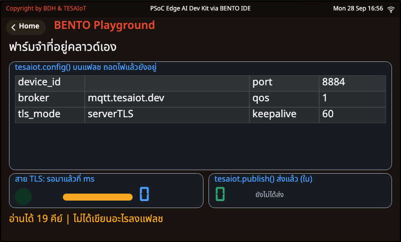

<div class="cap">ภาพจริงจาก BENTO Emulator — ค่าในตารางเป็นคลังค่าตั้ง <b>จำลอง</b> ของ Emulator ไม่ใช่ค่าบนบอร์ดของกลุ่ม · <code>PLATFORM_BROKER</code> ว่าง จึงขึ้นสีส้ม "ไม่ได้เขียนอะไรลงแฟลช"</div>

</div>
</div>

---

<!-- _class: sec -->

<div class="when">2:50 – 3:00 · 10 นาที</div>

# Exit ticket + ต่อยอดโปรเจกต์

<div class="lead">ทวนว่าบอร์ด "ส่ง" อะไร "ฟัง" อะไร และ "ไม่เชื่อ" อะไร แล้ววางแผนโปรเจกต์</div>

<div class="flow"><b>Exit ticket</b><i>→</i><b>แผน "ทางออก" + "ทางกลับ" ของโปรเจกต์</b><i>→</i><b>คาบหน้า: เซนเซอร์และ AI</b></div>


---

## Exit ticket (ทุกคนตอบ 1 ข้อ) + แผนโปรเจกต์ของกลุ่ม

<style scoped>
section table { font-size: .62em; }
section li { font-size: .86em; }
</style>

<div class="cols">
<div>

เลือกตอบ **1 ข้อ** จากข้อ 1–3 · ทุกคนตอบข้อ 4

<div class="goal">

1. หัวข้อสามอันของกลุ่มคืออะไร อันไหนบอร์ด **ส่ง** อันไหนบอร์ด **ฟัง**?

</div>

<div class="goal" style="border-color:#1e88e5;background:#e3f2fd">

2. ยกตัวอย่างหนึ่งอย่างที่บอร์ด **"ไม่เชื่อคนส่ง"** — ถ้าไม่ทำ ฟาร์มจริงจะเกิดอะไร?

</div>

<div class="goal" style="border-color:#8e24aa;background:#f3e5f5">

3. CSV ของกลุ่มช่วยตัดสินใจเรื่องอะไรในงานโลจิสติกส์ของฟาร์ม (วางแผนน้ำ · รอบรดน้ำ)?

</div>

4. ความมั่นใจวันนี้ ☐1 ☐2 ☐3 ☐4 ☐5 · เรื่องที่ยังงง …

</div>
<div>

**ต่อยอดโปรเจกต์** — เริ่มจากแผงควบคุมฟาร์มของคาบที่แล้ว ([`sf1_05_my_farm_dashboard.py`](https://github.com/Advance-Innovation-Centre-AIC/aiot-development-for-smart-farm/blob/main/s1/sf1_05_my_farm_dashboard.py)) คาบนี้เติม **"ทางออก"** กับ **"ทางกลับ"** ให้มัน

| คำถาม | แผนของกลุ่ม |
|---|---|
| ค่าที่แผงจะส่งออก (คีย์ JSON) ทุกกี่วินาที | |
| เหตุการณ์ที่ควรส่งเข้า `/event` | |
| คำสั่งที่รับ + ข้อห้ามที่บอร์ดต้องกันเอง | |
| กฎในแอป + cooldown กี่วินาที | |
| จอไฟ RGB · SW5 · SW6 · เสียง ทำอะไร | |

☐ รวมโค้ดส่งค่าจาก `sf2_02` เข้า `sf1_05` · ☐ แอปของกลุ่มบันทึก CSV ของโปรเจกต์ได้

</div>
</div>

---

## คาบหน้า: เซนเซอร์และ AI ในฟาร์ม + เริ่มโปรเจกต์ของกลุ่ม

<div class="cols">
<div class="c55">

- ให้บอร์ด **"รู้สึก"** มากขึ้น: **เรดาร์** เฝ้าคอก · **ไมค์** ฟังเล้าไก่ · **แรงสั่น** ของปั๊มน้ำ
- **กฎที่เราเขียนเอง vs AI ที่รันบนชิปในบอร์ด (Edge AI)** — แล้ววัดเองว่าแบบไหนเหมาะกับปัญหาไหน
- ชั่วโมงสุดท้ายของคาบ **เริ่มโปรเจกต์ของกลุ่ม** (Project Canvas แล้ว MVP บนบอร์ด) จากแม่แบบ **Smart IoT Gateway ครบห้าเสา** — เก็บแอปและ CSV ของวันนี้ไว้ ใช้ต่อได้ทันที
- **เตรียมมา:** Hotspot มือถือ (ชื่อ/รหัสเดิม) · โน้ตบุ๊กที่ติดตั้ง `paho-mqtt` แล้ว · แผนโปรเจกต์ในตารางสไลด์ก่อน

</div>
<div>

<div class="vid" style="flex-direction:column">
<iframe width="300" height="169" src="https://www.youtube.com/embed/-OFNvMDLv5g" title="Control PLC by MQTT Client — ThaiPLC" loading="lazy" frameborder="0" allowfullscreen></iframe>
<div><b>Control PLC by MQTT Client</b><br>ThaiPLC · 6:21 · ดูเพิ่มเรื่อง PLC รับคำสั่ง MQTT<br><https://www.youtube.com/watch?v=-OFNvMDLv5g></div>
</div>

</div>
</div>

---

## ดูเพิ่มเติมนอกเวลา

<style scoped>
section table { font-size: .54em; }
section p, section li { font-size: .86em; }
section a { word-break: break-all; }
</style>

<div class="cols">
<div>

**คลิปทั้งหมดในคาบนี้**

| หัวข้อ | คลิป | ช่อง | ยาว |
|---|---|---|---|
| MQTT (ไทย) | [EP5 เข้าใจ MQTT และ HTTP](https://www.youtube.com/watch?v=-K3zSs1a1yo) | N Academy | 8:15 |
| pub/sub | [Pub Sub Model \| MQTT Essentials Part 3](https://www.youtube.com/watch?v=HCzQJMdHcy0) | HiveMQ | 5:48 |
| publish/subscribe | [MQTT Publish / Subscribe / Unsubscribe \| Part 5](https://www.youtube.com/watch?v=t2b1CwQmDRY) | HiveMQ | 5:23 |
| ตั้งชื่อหัวข้อ | [MQTT Topic Best Practices \| Part 6](https://www.youtube.com/watch?v=juq_l70Vg1w) | HiveMQ | 5:50 |
| IoT Gateway | [อธิบาย IoT Gateway \| What is IoT Gateway](https://www.youtube.com/watch?v=fCfK7ugax1s) | Factonation | 3:53 |
| PLC + MQTT | [Control PLC by MQTT Client](https://www.youtube.com/watch?v=-OFNvMDLv5g) | ThaiPLC | 6:21 |
| รดน้ำด้วย IoT | [ตอนที่ 3 - ระบบ IoT sensor สำหรับความชื้นในดิน](https://www.youtube.com/watch?v=MHUWmhuaC1A) | mju.mooc | 5:13 |

</div>
<div class="c40">

**หน้าของเรา**
- สัญญา MQTT: [`MQTT_CONTRACT_th.md`](https://github.com/Advance-Innovation-Centre-AIC/aiot-development-for-smart-farm/blob/main/s2/app/MQTT_CONTRACT_th.md)
- หน้าฟาร์มของเรา: <https://advance-innovation-centre-aic.github.io/aiot-development-for-smart-farm/s2/app/farm_web.html?team=team__>
- หน้าอ่านค่า: <https://advance-innovation-centre-aic.github.io/aiot-development-for-smart-farm/s2/app/my_first_reader.html?team=team__>
- หน้ารวม: <https://advance-innovation-centre-aic.github.io/aiot-development-for-smart-farm/s2/app/mqtt_dashboard.html>

**เครื่องมือ**
- paho-mqtt (Python): <https://pypi.org/project/paho-mqtt/>
- ทดลอง MQTT บนเบราว์เซอร์: <https://www.hivemq.com/demos/websocket-client/>
- TESAIoT Dev Kit SDK: <https://tesaiot.github.io/tesaiot-pse84-devkit-sdk/>

</div>
</div>

---

## อ้างอิงและเครดิต (1/2) — ภาพและไดอะแกรม

<style scoped>
section { font-size: 15px; }
section p, section li { margin: .04em 0; line-height: 1.28; }
section table { font-size: .92em; }
</style>

**ภาพจากแหล่งภายนอก**

| ภาพ | ผู้สร้าง | สัญญาอนุญาต | ที่มา |
|---|---|---|---|
| ลำดับการเข้าร่วมเครือข่ายไร้สาย (802.11 Connection Setup) | Superspritz | CC BY-SA 4.0 | [Wikimedia Commons](https://commons.wikimedia.org/wiki/File:802.11_Connection_Setup.svg) |

**ภาพหน้าจอจาก BENTO Emulator** (ค่าเซนเซอร์ Wi-Fi และ MQTT เป็นค่าจำลอง · MQTT ใน Emulator เป็น broker จำลองในเบราว์เซอร์ "No TCP leaves the browser" · ไฟล์ของคอร์สไม่ถูกแก้ ตอนถ่ายภาพแทน `TEAM = "teamXX"` เป็น `team99` และป้อนข้อความเข้า broker จำลองในภาพ `sf2_03` กับ `sf2_06` ตามที่เขียนใต้ภาพ)
`sf2_01` ต่อ Wi-Fi แล้ว · `sf2_02` ส่งแล้ว 3 ใบ (+ แผงลูกบิด/จอไฟ RGB) · `sf2_03` ปั๊มเปิด (+ แผง) และถังแห้งดับเอง · `sf2_04` สบายดี และแย่แล้ว (กล่องเตือน) · `sf2_05` คลังค่าตั้ง · `sf2_06` Gateway สั่งรดน้ำ · `sf2_07` แปลงผัก: โหนด + PLC

**ไดอะแกรมที่วาดขึ้นเองสำหรับคอร์สนี้ (SVG/HTML):** ปก · สองลูกศรวิ่งสวนทาง · captive portal · โมดูล wifi · ไฟล์ 6 ส่วน · ป้ายก่อนบรรทัดที่บล็อก · ได้ยินวงไหม · 1883 กับ wss 8884 · broker สาธารณะ · บันไดสามขั้น · หน้าอ่านค่า 4 ขั้น · เส้นเวลา fake_board · กล่องรับช่องเดียว · ภารกิจปิดวงจร · ข้อมูลไหลไปทางไหน · Smart IoT Gateway

**อีโมจิ:** Twemoji — Twitter, Inc. และผู้ร่วมพัฒนา (jdecked/twemoji) — CC BY 4.0

**ข้อมูลในสไลด์:** โค้ดทุกชิ้นคัดจากไฟล์ใน `s2/` ของคอร์สตรงตัว (ละได้เฉพาะบรรทัด `# ...`) · หัวข้อ คีย์ และคำสั่งจาก [`MQTT_CONTRACT_th.md`](https://github.com/Advance-Innovation-Centre-AIC/aiot-development-for-smart-farm/blob/main/s2/app/MQTT_CONTRACT_th.md) · ลำดับกิจกรรมจาก [`sf-s2-th.worksheet.md`](https://github.com/Advance-Innovation-Centre-AIC/aiot-development-for-smart-farm/blob/main/s2/sf-s2-th.worksheet.md) · ฮาร์ดแวร์: TESAIoT Dev Kit SDK — <https://tesaiot.github.io/tesaiot-pse84-devkit-sdk/>

**สถานะการทดสอบ:** `farm_monitor.py` และ `farm_web.html` ทดสอบกับ broker.hivemq.com จริงแล้ว โดยใช้บอร์ดจำลองบนโน้ตบุ๊ก · ไฟล์บอร์ด รันกับ Wi-Fi และ MQTT จริงบนบอร์ด TESAIoT Dev Kit แล้ว (broker.hivemq.com): ค่าจากบอร์ดถึง `farm_monitor.py` และลง CSV · คำสั่งปั๊มถึงบอร์ด · Gateway สั่ง PLC รดน้ำเองเมื่อดินแห้ง · ยกเว้น `sf2_05` ที่ต้องใช้รหัสอุปกรณ์จากผู้สอน

---

## อ้างอิงและเครดิต (2/2) — วิดีโอ

<style scoped>
section { font-size: 16px; }
section p, section li { margin: .05em 0; line-height: 1.28; }
</style>

**วิดีโอ (YouTube — ลิขสิทธิ์เป็นของเจ้าของช่อง ใช้ด้วยการฝัง/ลิงก์)**

- [EP5 เข้าใจ MQTT และ HTTP พื้นฐานสำคัญของการสื่อสารในระบบ IoT](https://www.youtube.com/watch?v=-K3zSs1a1yo) — N Academy · 8:15
- [Pub Sub Model · MQTT Essentials Part 3](https://www.youtube.com/watch?v=HCzQJMdHcy0) — HiveMQ · 5:48
- [MQTT Publish / Subscribe / Unsubscribe · MQTT Essentials Part 5](https://www.youtube.com/watch?v=t2b1CwQmDRY) — HiveMQ · 5:23
- [MQTT Topic Best Practices · MQTT Essentials Part 6](https://www.youtube.com/watch?v=juq_l70Vg1w) — HiveMQ · 5:50
- [อธิบาย IoT Gateway · What is IoT Gateway](https://www.youtube.com/watch?v=fCfK7ugax1s) — Factonation · 3:53
- [Control PLC by MQTT Client](https://www.youtube.com/watch?v=-OFNvMDLv5g) — ThaiPLC · 6:21
- [ตอนที่ 3 - ระบบ IoT sensor สำหรับความชื้นในดิน](https://www.youtube.com/watch?v=MHUWmhuaC1A) — mju.mooc · 5:13

**มาตรฐานและเอกสารเปิดที่อ้างถึง:** IEEE 802.11 (ลำดับการเข้าร่วมเครือข่าย) · MQTT 3.1.1 — OASIS Standard (topic, publish/subscribe, QoS 0) · RFC 8259 (JSON) · HiveMQ public broker `broker.hivemq.com` (1883 TCP · 8884 wss) · หน้าเว็บของคอร์สใช้ MQTT.js 5.16.0 จาก cdn.jsdelivr.net · Python ใช้ paho-mqtt
