<!-- fit-css -->
<style>
section { font-size: 24px; padding: 40px 52px; justify-content: flex-start; }
section h1 { font-size: 1.45em; line-height: 1.12; margin: 0 0 .22em; }
section h2 { font-size: 1.12em; margin: .15em 0; }
section h3 { font-size: 1.0em; margin: .12em 0; }
section p, section li { margin: .16em 0; line-height: 1.32; }
section img { max-width: 100%; height: auto; }
section svg { max-height: 330px; width: 100%; }
section table { font-size: .78em; }
section pre { font-size: .70em; line-height: 1.32; background:#0d1117; color:#e6edf3; border:1px solid #30363d; border-radius:8px; padding:12px 16px; box-shadow:0 2px 8px rgba(0,0,0,.25); }
section pre code { white-space: pre-wrap; background:transparent; color:inherit; } section pre .hljs-comment{color:#8b949e;font-style:italic} section pre .hljs-keyword,section pre .hljs-built_in,section pre .hljs-literal{color:#ff7b72} section pre .hljs-string{color:#a5d6ff} section pre .hljs-number{color:#79c0ff} section pre .hljs-title,section pre .hljs-title.function_,section pre .hljs-section{color:#d2a8ff} section pre .hljs-meta{color:#ffa657} section pre .hljs-attr,section pre .hljs-attribute,section pre .hljs-name{color:#7ee787}
section blockquote { margin: .25em 0; font-size: .92em; }
section p > img + img { margin-left: 10px; }
section { overflow-y: auto; overflow-x: hidden; }
section::-webkit-scrollbar { width: 11px; }
section::-webkit-scrollbar-thumb { background:#4a90d9; border-radius:6px; }
section::-webkit-scrollbar-track { background:rgba(0,0,0,.06); }
section img{filter:drop-shadow(0 3px 12px rgba(0,0,0,.5))}
section.cover{background-color:#0b1426}
section.cover *{color:#fff !important}
section.cover h1,section.cover h2,section.cover h3,section.cover p,section.cover li,section.cover strong,section.cover em,section.cover blockquote,section.cover div{text-shadow:0 2px 9px rgba(0,0,0,.92),0 0 3px rgba(0,0,0,.8)}
section.cover blockquote{border-left:4px solid rgba(120,200,255,.6) !important;background:rgba(13,17,23,.55) !important;border-radius:6px;padding:.3em .6em}
section.cover h1,section.cover h2,section.cover h3,section.cover p,section.cover blockquote{max-width:60%}
section.cover img{filter:none}

/* ---- ส่วนของคอร์ส Smart Farm ---- */
section.sec { background: linear-gradient(135deg,#0f3d2e 0%,#1f6b3a 55%,#7cb342 100%); color:#fff; justify-content:center; }
section.sec h1 { font-size: 2.1em; color:#fff; }
section.sec h2, section.sec p, section.sec li { color:#e8f5e9; }
section.sec .when { display:inline-block; background:rgba(0,0,0,.28); border-radius:999px; padding:.1em .8em; font-size:.9em; margin-bottom:.4em; }
.chal { margin-top:.7em; background:rgba(255,255,255,.95); color:#bf360c !important; border-radius:14px; padding:.45em .9em; font-size:.95em; box-shadow:0 4px 18px rgba(0,0,0,.25); }
.chal b { color:#bf360c; }
section.brk { background: linear-gradient(135deg,#ff9f1c 0%,#ffbf69 60%,#ffe8c2 100%); justify-content:center; }
.cols { display:flex; gap:20px; align-items:flex-start; }
.cols > div { flex:1; min-width:0; }
.c40 { flex:0 0 40% !important; } .c45 { flex:0 0 45% !important; } .c55 { flex:0 0 55% !important; } .c60 { flex:0 0 60% !important; }
.cap { font-size:.5em; color:#78909c; line-height:1.3; margin-top:.15em; }
.shot img { border-radius:8px; filter:drop-shadow(0 3px 10px rgba(0,0,0,.35)); }
.goal { background:#e8f5e9; border-left:6px solid #2e7d32; border-radius:8px; padding:.25em .7em; margin:.2em 0; font-size:.86em; }
.think { background:#fff8e1; border-left:6px solid #f5a623; border-radius:8px; padding:.25em .7em; margin:.25em 0; font-size:.84em; }
.warn { background:#ffebee; border-left:6px solid #e53935; border-radius:8px; padding:.25em .7em; margin:.25em 0; font-size:.84em; }
.try { font-size:.84em; }
.tiles { display:grid; grid-template-columns:repeat(4,1fr); gap:12px; }
.tile { background:#f6faf5; border:2px solid #cfe3c9; border-radius:12px; padding:8px 10px; font-size:.6em; line-height:1.3; }
.tile img { width:100%; height:128px; object-fit:cover; border-radius:8px; filter:none; }
.tile b.t { display:block; font-size:1.25em; color:#1b5e20; margin:.2em 0; }
.chip { display:inline-block; border-radius:999px; padding:0 8px; margin:2px 2px 0 0; color:#fff; font-size:.92em; }
.chip.s { background:#1e88e5; } .chip.d { background:#8e24aa; } .chip.a { background:#2e7d32; } .chip.r { background:#607d8b; }
.vid { display:flex; gap:14px; align-items:flex-start; background:#f3f6fb; border:1px solid #d6deea; border-radius:10px; padding:8px 10px; margin:.25em 0; }
.vid iframe { flex:0 0 auto; border-radius:6px; }
.vid div { font-size:.64em; line-height:1.35; }
.vid b { font-size:1.08em; }
.timeline { display:flex; gap:4px; margin:.3em 0 .5em; }
.timeline div { border-radius:8px; padding:6px 6px; color:#fff; font-size:.52em; line-height:1.25; text-align:center; }
.timeline div b { display:block; font-size:1.25em; }
.pill { display:inline-block; background:#263238; color:#fff; border-radius:6px; padding:0 7px; font-family:monospace; font-size:.9em; }
.kbd { display:inline-block; border:2px solid #455a64; border-bottom-width:4px; border-radius:6px; padding:0 7px; font-weight:700; }
.big { font-size:1.35em; font-weight:700; }
.src { font-size:.48em; color:#78909c; }
</style>

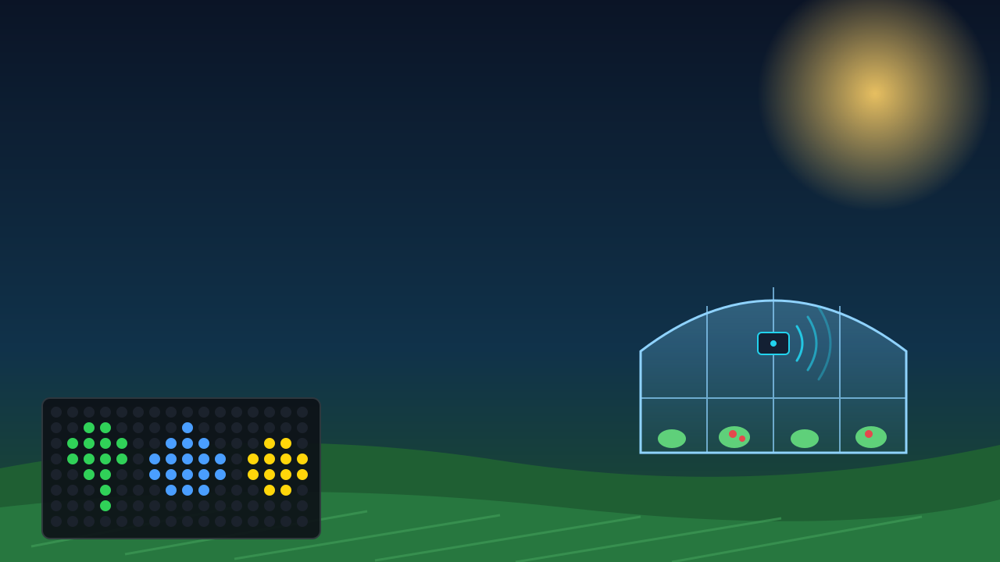

<!-- _class: cover -->
<!-- _paginate: false -->

# Session 3 — AI ในฟาร์ม + ลงมือทำโปรเจกต์

## เรดาร์เฝ้าคอก · หูฟังเล้า · หมอฟังปั๊ม · Smart IoT Gateway ครบวงจร

> คาถาประจำวัน: **วัด → ตัดสิน → สั่งงาน → รายงาน**

AIoT Development for Smart Farm · Intensive Course · TESAIoT Dev Kit + BENTO Emulator

---

## 3 ชั่วโมงของเราวันนี้

<div class="timeline">
<div style="flex:10;background:#546e7a"><b>0:00</b>เปิด<br>ทวน S1–S2<br>แจกโจทย์</div>
<div style="flex:15;background:#1e88e5"><b>0:10</b>กิจกรรม 1<br>ยามเฝ้าคอก<br>(เรดาร์)</div>
<div style="flex:15;background:#43a047"><b>0:25</b>กิจกรรม 2<br>หูฟังเล้าไก่<br>(ไมค์)</div>
<div style="flex:12;background:#8e24aa"><b>0:40</b>กิจกรรม 3<br>หมอฟัง<br>ปั๊มน้ำ</div>
<div style="flex:13;background:#3949ab"><b>0:52</b>Edge AI<br>บนบอร์ด</div>
<div style="flex:10;background:#00897b"><b>1:05</b>กิจกรรม 4<br>Gateway<br>ครบวงจร</div>
<div style="flex:10;background:#ff9f1c"><b>1:15</b>พัก</div>
<div style="flex:15;background:#5e35b1"><b>1:25</b>Sprint 0<br>Project<br>Canvas</div>
<div style="flex:35;background:#e53935"><b>1:40</b>Sprint 1<br>MVP บนบอร์ด</div>
<div style="flex:25;background:#c2185b"><b>2:15</b>Sprint 2<br>แอป + ทดสอบ</div>
<div style="flex:10;background:#6d4c41"><b>2:40</b>ซ้อม<br>พูด</div>
<div style="flex:10;background:#37474f"><b>2:50</b>Stand-up<br>+ Exit</div></div>

<div class="cols">
<div>

**สิ่งที่จะทำได้เมื่อจบวัน**

- **LO1** ใช้ **เรดาร์ ไมค์ และ IMU** จับเหตุการณ์ในฟาร์ม: คนเข้าคอก · เสียงดังในเล้า · เครื่องสั่น
- **LO2** ใช้ **ยืนยัน N ครั้ง** และ **นับเหตุการณ์ในช่วงเวลา** ลดการเตือนผิด
- **LO3** ให้บอร์ด **เรียนรู้ค่าปกติ** ของเครื่องเอง แล้วจับสิ่งที่ผิดไปจากปกติ
- **LO4** มี **Project Canvas** ครบห้าเสา และ **MVP** ที่รันบนบอร์ดได้ก่อนจบวัน

</div>
<div>

**ทำงานเป็นคู่ สลับบทบาททุกกิจกรรม**

| บทบาท | ทำอะไร |
|---|---|
| 🚜 **คนขับ** | คุมบอร์ด กด Program to Device |
| 🧭 **ผู้นำทาง** | อ่านใบงาน ลองไฟล์เดียวกันใน **Emulator** ก่อน แล้วจดผล |

ใบงาน: [`s3/sf-s3-th.worksheet.md`](https://github.com/Advance-Innovation-Centre-AIC/aiot-development-for-smart-farm/blob/main/s3/sf-s3-th.worksheet.md) · ครึ่งหลังของวัน = **เวลาทำโปรเจกต์ของทีม**

</div>
</div>

---

## ทวน Session 1–2: บอร์ดเดียว สองบทบาท

<div class="cols">
<div>

<div class="goal">

🖥️ **Smart HMI** (Session 1) — คนหน้างานดูและสั่งได้ที่บอร์ด

</div>

- จอสัมผัส: หน้าปัด วงแหวน กราฟ แท็บ · **จอไฟ RGB 16×8** เห็นจากอีกฝั่งห้อง · ลำโพงเตือน
- กฎ **สบาย / เครียด / แย่แล้ว** · ปั๊มรดน้ำแบบ **ช่องกันกระพือ** (hysteresis) · มุมเอียงของแท็งก์
- ลูกบิด **VR1–VR4** = ค่าตั้ง/เซนเซอร์จำลอง · ปุ่ม **SW5 (ล่าง)** / **SW6 (บน)**

</div>
<div>

<div class="goal" style="border-color:#1e88e5;background:#e3f2fd">

📡 **Smart IoT Gateway** (Session 2) — บอร์ดคุยกับฟาร์มและแอปผ่าน MQTT

</div>

- ส่ง **telemetry** ทุก 5 วิ · ส่ง **event** ตอนสถานะเปลี่ยน · ฟัง **cmd** จากแอป — [`sf2_02_greenhouse_report.py`](https://github.com/Advance-Innovation-Centre-AIC/aiot-development-for-smart-farm/blob/main/s2/sf2_02_greenhouse_report.py) · [`sf2_03_remote_pump.py`](https://github.com/Advance-Innovation-Centre-AIC/aiot-development-for-smart-farm/blob/main/s2/sf2_03_remote_pump.py) · [`sf2_04_crop_alert.py`](https://github.com/Advance-Innovation-Centre-AIC/aiot-development-for-smart-farm/blob/main/s2/sf2_04_crop_alert.py)
- แอปของทีม: [`farm_monitor.py`](https://github.com/Advance-Innovation-Centre-AIC/aiot-development-for-smart-farm/blob/main/s2/app/farm_monitor.py) · [`farm_web.html`](https://github.com/Advance-Innovation-Centre-AIC/aiot-development-for-smart-farm/blob/main/s2/app/farm_web.html) · สัญญา MQTT [`MQTT_CONTRACT_th.md`](https://github.com/Advance-Innovation-Centre-AIC/aiot-development-for-smart-farm/blob/main/s2/app/MQTT_CONTRACT_th.md)
- Gateway สั่ง **PLC Wi-Fi** คุมปั๊ม — [`sf2_06_smart_gateway.py`](https://github.com/Advance-Innovation-Centre-AIC/aiot-development-for-smart-farm/blob/main/s2/sf2_06_smart_gateway.py) + [`sf2_07_field_station.py`](https://github.com/Advance-Innovation-Centre-AIC/aiot-development-for-smart-farm/blob/main/s2/sf2_07_field_station.py)

</div>
</div>

<div class="think">

**วันนี้เพิ่มอีกสามชั้น:** เซนเซอร์ที่ "ฟังเหตุการณ์" (เรดาร์ · ไมค์ · การสั่น) → ตัดสินด้วย **กฎที่กันเตือนผิด** → ประกอบทุกอย่างเป็น **Smart IoT Gateway ครบวงจร** ที่เป็นแม่แบบโปรเจกต์ของทีม

</div>

---

## หัวใจของวันนี้: เตือน "ให้ถูก" ไม่ใช่เตือน "ให้ดัง"

<svg viewBox="0 0 1000 250" xmlns="http://www.w3.org/2000/svg" font-family="sans-serif">
  <g font-size="18" text-anchor="middle">
    <rect x="10" y="10" width="316" height="230" rx="14" fill="#e8f5e9" stroke="#2e7d32" stroke-width="3"/>
    <text x="168" y="44" font-weight="700" fill="#1b5e20">① ช่องกันกระพือ</text>
    <line x1="40" y1="94" x2="296" y2="94" stroke="#43a047" stroke-width="2.5" stroke-dasharray="7 5"/>
    <line x1="40" y1="124" x2="296" y2="124" stroke="#e53935" stroke-width="2.5" stroke-dasharray="7 5"/>
    <path d="M40 72 L80 92 L120 120 L148 130 L176 120 L206 106 L236 98 L266 92 L296 88" fill="none" stroke="#1e88e5" stroke-width="3.5"/>
    <text x="168" y="164" fill="#37474f">เปิดที่เส้นหนึ่ง ปิดอีกเส้น</text>
    <text x="168" y="192" fill="#546e7a" font-size="16">Session 1 · ปั๊ม/พัดลมในกิจกรรม 4</text>
    <text x="168" y="224" fill="#2e7d32" font-size="16">กันเครื่อง "เปิด-ปิดรัว"</text>
    <rect x="342" y="10" width="316" height="230" rx="14" fill="#e3f2fd" stroke="#1e88e5" stroke-width="3"/>
    <text x="500" y="44" font-weight="700" fill="#1565c0">② ยืนยัน N ครั้ง</text>
    <g font-size="24" font-weight="700" fill="#fff">
      <rect x="392" y="76" width="48" height="48" rx="8" fill="#1e88e5"/><text x="416" y="109">1</text>
      <rect x="452" y="76" width="48" height="48" rx="8" fill="#1e88e5"/><text x="476" y="109">2</text>
      <rect x="512" y="76" width="48" height="48" rx="8" fill="#1e88e5"/><text x="536" y="109">3</text>
    </g>
    <text x="596" y="110" font-size="26">✅</text>
    <text x="500" y="164" fill="#37474f">เห็นซ้ำติดกันถึงเชื่อ</text>
    <text x="500" y="192" fill="#546e7a" font-size="16">เรดาร์ (กิจกรรม 1, 4) · ปั๊มสั่น (กิจกรรม 3)</text>
    <text x="500" y="224" fill="#1565c0" font-size="16">กันคลื่นหรือแรงกระแทก "วูบเดียว"</text>
    <rect x="674" y="10" width="316" height="230" rx="14" fill="#f3e5f5" stroke="#8e24aa" stroke-width="3"/>
    <text x="832" y="44" font-weight="700" fill="#6a1b9a">③ นับในช่วงเวลา</text>
    <line x1="704" y1="114" x2="960" y2="114" stroke="#90a4ae" stroke-width="2"/>
    <g stroke="#8e24aa" stroke-width="6"><line x1="728" y1="114" x2="728" y2="84"/><line x1="774" y1="114" x2="774" y2="84"/><line x1="818" y1="114" x2="818" y2="84"/><line x1="868" y1="114" x2="868" y2="84"/><line x1="920" y1="114" x2="920" y2="84"/></g>
    <path d="M716 128 L716 136 L932 136 L932 128" fill="none" stroke="#6a1b9a" stroke-width="2"/>
    <text x="832" y="164" fill="#37474f">5 ครั้งใน 30 วิ = ตื่นตกใจ</text>
    <text x="832" y="192" fill="#546e7a" font-size="16">ไมค์ในเล้าไก่ (กิจกรรม 2)</text>
    <text x="832" y="224" fill="#6a1b9a" font-size="16">ครั้งเดียวยังไม่ใช่เหตุ</text>
  </g>
</svg>

- ทั้งสามวิธีคือ **"ตัวกันเตือนผิด"** — โปรเจกต์ของทีมต้องมี **อย่างน้อย 1 อย่าง** (เสา 2 ในโจทย์โปรเจกต์)
- ระบบที่เตือนผิดบ่อย เจ้าของฟาร์มจะ **ปิดเสียงทิ้ง** แล้ววันที่เกิดเหตุจริงก็ไม่มีใครฟัง

---

## ของบนบอร์ดที่ใช้วันนี้ — ใช้ในกิจกรรมไหน

<style scoped>
section table { font-size: .66em; }
</style>

| ของบนบอร์ด | ในโค้ด | ในฟาร์มใช้ทำอะไร | กิจกรรม |
|---|---|---|---|
| 📡 **เรดาร์** | `sensors.radar()` · `sensors.radar_range()` · `sensors.radar_config(dB)` | คน/สัตว์เข้าเขตคอก ระยะเป้า | 1 · 4 |
| 🎙️ **ไมโครโฟน** | `mic.start()` · `mic.stats()` · `mic.level()` · `mic.stop()` | เสียงดังฉับพลันในเล้า | 2 |
| 📐 **IMU** (ความเร่ง 3 แกน) | `sensors.bmi270.motion()` | การสั่นของปั๊ม/พัดลม | 3 |
| 🌡️ อุณหภูมิ ความชื้น ความกดอากาศ | `sensors.sht40` · `sensors.dps368` | อากาศในโรงเรือน | 4 |
| 🎛️ ลูกบิด **VR2–VR4** | `pots.read(1)` … `pots.read(3)` ค่า 0–4095 | เขตเตือน · เกณฑ์เสียง · เกณฑ์พัดลม · ดิน (จำลอง) | 1 · 2 · 4 |
| 🔘 ปุ่ม **SW5 (ล่าง)** / **SW6 (บน)** | `buttons.pressed(0)` / `buttons.pressed(1)` | เปิด/ปิดระบบเฝ้า · เรียนรู้ใหม่ · รดน้ำเอง · รับทราบ | 1 · 3 · 4 |
| 🟩 **จอไฟ RGB 16×8** | `rgbmatrix.scroll()` · `score()` · `bar()` · `fill()` · `blit()` | INTRUDER · PANIC · แถบคะแนน · สีสถานะ | ทุกกิจกรรม |
| 🔊 ลำโพง | `beep(...)` = `ui.tone(...)` เบา ๆ (`VOLUME` ≈20%) · ลำโพงรวม `SPEAKER = 40` % ด้วย `ui.volume()` (firmware 2.4.2+) | ไซเรน เสียงเตือน — **เฉพาะตอนเกิดเหตุ** | ทุกกิจกรรม |

<div class="warn">

**SW2** บนฐานบอร์ดคือ **สวิตช์ตัดไฟ** — ห้ามโยก · ในแผง Emulator ป้ายชื่อปุ่มยังเป็นชื่อเก่า ให้ดูที่ **ลำดับ**: ปุ่มแรก = `pressed(0)` = **SW5 (ล่าง)** · ปุ่มที่สอง = `pressed(1)` = **SW6 (บน)**

</div>

---

<!-- _class: sec -->

<div class="when">0:10 – 0:25 · คนขับ = คนที่ 1</div>

# กิจกรรม 1 — ยามเฝ้าคอก (เรดาร์)

[`sf3_01_pen_guard.py`](https://github.com/Advance-Innovation-Centre-AIC/aiot-development-for-smart-farm/blob/main/s3/sf3_01_pen_guard.py) · เรดาร์ + ลูกบิด VR3 + ปุ่ม SW5 · ไซเรน + INTRUDER บนจอไฟ RGB

<div class="chal">🏆 <b>ท้าทาย:</b> ตั้งค่าให้ <b>เดินผ่านเร็ว ๆ ไม่ถูกนับ</b> แต่ <b>เดินเข้ามาในเขตคอกถูกนับทุกครั้ง</b></div>

---

## เบื้องหลัง: เรดาร์บนบอร์ดวัดอะไร

<style scoped>
section svg { max-height: 250px; }
section pre { font-size: .64em; }
</style>

<svg viewBox="0 0 1000 250" xmlns="http://www.w3.org/2000/svg" font-family="sans-serif">
  <rect x="150" y="60" width="369" height="120" fill="#ffebee"/>
  <text x="334" y="80" text-anchor="middle" font-size="15" fill="#c62828">เขตเตือน (ตั้งด้วย VR3 · 50–250 cm)</text>
  <line x1="519" y1="50" x2="519" y2="190" stroke="#e53935" stroke-width="3" stroke-dasharray="8 5"/>
  <rect x="30" y="85" width="90" height="70" rx="10" fill="#263238"/>
  <text x="75" y="126" text-anchor="middle" font-size="15" fill="#fff">บอร์ด</text>
  <g fill="none" stroke="#1e88e5" stroke-width="3" opacity=".8">
    <path d="M130 95 Q 145 120 130 145"/><path d="M142 82 Q 165 120 142 158"/><path d="M154 70 Q 185 120 154 170"/>
  </g>
  <g stroke="#90a4ae" stroke-dasharray="3 5">
    <line x1="244" y1="55" x2="244" y2="190"/><line x1="337" y1="55" x2="337" y2="190"/><line x1="431" y1="55" x2="431" y2="190"/><line x1="525" y1="55" x2="525" y2="190"/><line x1="619" y1="55" x2="619" y2="190"/><line x1="712" y1="55" x2="712" y2="190"/><line x1="806" y1="55" x2="806" y2="190"/><line x1="900" y1="55" x2="900" y2="190"/>
  </g>
  <g font-size="13" fill="#546e7a" text-anchor="middle">
    <text x="244" y="206">0.33</text><text x="337" y="206">0.66</text><text x="431" y="206">0.99</text><text x="525" y="206">1.32</text><text x="619" y="206">1.65</text><text x="712" y="206">1.98</text><text x="806" y="206">2.31</text><text x="900" y="206">2.64 ม.</text>
  </g>
  <text x="430" y="150" text-anchor="middle" font-size="46">🧍</text>
  <text x="430" y="172" text-anchor="middle" font-size="13" fill="#c62828">เป้าอยู่ในเขต</text>
  <text x="850" y="150" text-anchor="middle" font-size="40">🧱</text>
  <text x="850" y="172" text-anchor="middle" font-size="13" fill="#37474f">ผนัง = ฉากนิ่ง</text>
  <text x="500" y="234" text-anchor="middle" font-size="16" fill="#37474f">ช่องละราว 0.33 ม. → เรดาร์บอกได้ว่าเป้าอยู่ <tspan font-weight="700">"ช่องไหน"</tspan> ไม่ใช่ไม้บรรทัด</text>
  <text x="30" y="30" font-size="16" fill="#1565c0">radar_range() → target (เจอเป้าไหม) · distance_m (ระยะเป้าแรก) &#160;·&#160; radar() → presence (มีการเคลื่อนไหว) · energy</text>
</svg>

<div class="cols">
<div class="c55">

```python
def calibrate_radar():
    # radar_config(0) = จำ "ฉากนิ่ง" ใหม่ (ต้องไม่มีใครขยับหน้าบอร์ด)
    # แล้วตั้งเกณฑ์ THRESH_DB: ของที่แรงกว่าฉากนิ่งเท่านี้ถึงนับเป็นเป้า
    try:
        sensors.radar_config(0)
        time.sleep_ms(500)
        sensors.radar_config(THRESH_DB)
        return True
    except OSError:
        return False
```
<div class="src"><a href="https://github.com/Advance-Innovation-Centre-AIC/aiot-development-for-smart-farm/blob/main/s3/sf3_01_pen_guard.py">sf3_01_pen_guard.py</a> · calibrate_radar()</div>

</div>
<div>

- **ทำไมเรดาร์เหมาะกับคอกกลางคืน:** เห็นได้ในที่มืด · ไม่ใช่กล้อง จึง **ไม่ถ่ายภาพคน** (ความเป็นส่วนตัว)
- ตอนเริ่มจึงต้อง **ถอยห่างบอร์ด** — ใครยืนอยู่ตอนจำฉากนิ่ง จะกลายเป็น "ส่วนหนึ่งของฉาก"

<div class="vid" style="padding:6px">
<iframe width="200" height="113" src="https://www.youtube.com/embed/XJ6JhB8wOPU" title="What is mmWave sensing? — Mouser Electronics" loading="lazy" frameborder="0" allowfullscreen></iframe>
<div><b>What is mmWave sensing?</b><br>Mouser Electronics · 2:14 · EN<br><https://www.youtube.com/watch?v=XJ6JhB8wOPU></div>
</div>

</div>
</div>

---

## เบื้องหลัง: กันเรดาร์ "วูบ" สองชั้น — ค่ากลาง 5 ค่า + ยืนยัน 3 รอบ

<svg viewBox="0 0 1000 290" xmlns="http://www.w3.org/2000/svg" font-family="sans-serif">
  <line x1="60" y1="250" x2="950" y2="250" stroke="#b0bec5"/>
  <line x1="60" y1="120" x2="950" y2="120" stroke="#e53935" stroke-width="2.5" stroke-dasharray="9 6"/>
  <text x="954" y="116" text-anchor="end" font-size="15" fill="#e53935">เขตเตือน 130 cm</text>
  <g fill="#90a4ae">
    <circle cx="80" cy="70" r="6"/><circle cx="156" cy="74" r="6"/><circle cx="232" cy="68" r="6"/><circle cx="308" cy="210" r="7" fill="#ff7043"/><circle cx="384" cy="72" r="6"/><circle cx="460" cy="80" r="6"/><circle cx="536" cy="100" r="6"/><circle cx="612" cy="130" r="6"/><circle cx="688" cy="150" r="6"/><circle cx="764" cy="165" r="6"/><circle cx="840" cy="180" r="6"/><circle cx="916" cy="188" r="6"/>
  </g>
  <path d="M80 70 L156 70 L232 70 L308 70 L384 72 L460 74 L536 80 L612 100 L688 100 L764 130 L840 150 L916 165" fill="none" stroke="#1e88e5" stroke-width="4"/>
  <text x="318" y="236" font-size="15" fill="#e64a19">ค่าดิบวูบเดียว (คลื่นสะท้อนหลายทาง)</text>
  <text x="330" y="60" font-size="15" fill="#1565c0">เส้นฟ้า = ค่ากลางของ 5 ค่าล่าสุด → ไม่สนใจจุดที่วูบ</text>
  <g font-size="16" font-weight="700" fill="#fff" text-anchor="middle">
    <circle cx="764" cy="36" r="15" fill="#1e88e5"/><text x="764" y="42">1</text>
    <circle cx="840" cy="36" r="15" fill="#1e88e5"/><text x="840" y="42">2</text>
    <circle cx="916" cy="36" r="15" fill="#e53935"/><text x="916" y="42">3</text>
  </g>
  <text x="900" y="76" text-anchor="end" font-size="15" fill="#c62828">ยืนยันครบ 3 รอบ → ไซเรน!</text>
  <text x="60" y="274" font-size="15" fill="#546e7a">ทุกจุด = อ่านเรดาร์ 1 ครั้ง (ทุก 0.25 วิ) · จุดเทา = ค่าดิบ · ภาพประกอบแนวคิด ไม่ใช่ค่าจริง</text>
</svg>

- **ชั้นที่ 1 `smooth()`:** เรียง 5 ค่าล่าสุดแล้วหยิบ **ตัวกลาง** — ค่าวูบเดียวไม่มีทางเป็นตัวกลาง
- **ชั้นที่ 2 `confirm()`:** เข้าเขตแล้วต้องอยู่ **`CONFIRM_N = 3` รอบติดกัน** (ราว 0.75 วิ) ถึงนับว่าบุกรุก — ถ้าไม่มีสองชั้นนี้ จุดสีส้มจะทำให้ไซเรนดังผิด

---

## กิจกรรม 1 — ยามเฝ้าคอก

<div class="cols">
<div class="c40">

<div class="goal">

🎯 **เป้าหมาย:** เรดาร์นับผู้บุกรุกเข้าคอก เชื่อเมื่อเห็นซ้ำ และปิดระบบได้ตอนเจ้าของเข้าเอง

</div>

<div class="try">

**ลองทำ**
1. รันไฟล์ ตอนจอนับถอยหลัง 3-2-1 **ทุกคนถอยห่างหน้าบอร์ด** (บอร์ดกำลังจำ "ฉากนิ่ง")
2. เดินเข้าหาบอร์ดช้า ๆ จนจอขึ้น **"มีผู้บุกรุก!"** ไซเรนดัง จอไฟ RGB วิ่ง **INTRUDER** สีแดง
3. หมุน **VR3** ตั้งเขตเตือน 50–250 cm · กด **SW5 (ปุ่มล่าง)** หรือแตะสวิตช์บนจอ = **ปิดระบบเฝ้า** แล้วเดินเข้าไปอีกครั้ง
4. วัดระยะจริงด้วยตลับเมตร 0.5 / 1.0 / 1.5 / 2.0 ม. เทียบเลขบนจอ → จดลงใบงาน

</div>

</div>
<div class="shot">

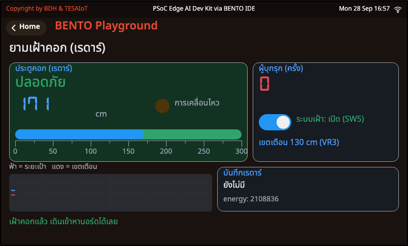

<div class="cap">ภาพจาก BENTO Emulator (ค่าจำลอง: ลูกบิด VR1 ของแผง Emulator แทนระยะเป้า = 171 cm · เขตเตือน VR3 = 130 cm) · ไฟส้ม "การเคลื่อนไหว" = presence จาก radar() · กราฟล่าง: ฟ้า = ระยะเป้า แดง = เขตเตือน</div>

</div>
</div>

---

## กิจกรรม 1 — หัวใจของโค้ด: ค่ากลาง + ยืนยัน N ครั้ง

<div class="cols">
<div class="c55">

```python
def smooth(hist, cm):
    # median 5 ค่า กันเรดาร์กระโดดข้ามเฟรมจากคลื่นสะท้อนหลายทาง
    hist.append(cm)
    if len(hist) > 5:
        hist.pop(0)
    return sorted(hist)[len(hist) // 2]
```

```python
def confirm(inside, streak, near):
    # สถานะใหม่ต้องยืนครบ CONFIRM_N รอบติดกันถึงจะเชื่อ
    # คืน (สถานะที่เชื่อแล้ว, จำนวนรอบที่เห็นสถานะใหม่ติดกัน)
    if near == inside:
        return inside, 0
    if streak + 1 >= CONFIRM_N:
        return near, 0
    return inside, streak + 1
```
<div class="src"><a href="https://github.com/Advance-Innovation-Centre-AIC/aiot-development-for-smart-farm/blob/main/s3/sf3_01_pen_guard.py">sf3_01_pen_guard.py</a> · smooth() และ confirm() ในส่วน "3) สมอง"</div>

- เห็น **เหมือนเดิม** → ล้างตัวนับเป็น 0 · เห็น **ต่าง** → นับเพิ่ม · ครบ `CONFIRM_N` → **เปลี่ยนสถานะ**
- ใช้ทั้ง "เข้า" และ "ออก" — ออกจากเขตก็ต้องยืนยัน 3 รอบเหมือนกัน

</div>
<div class="shot">

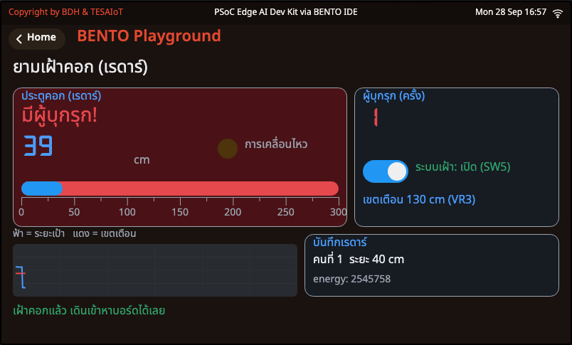

<div class="cap">ค่าจำลอง (Emulator): หมุน VR1 ให้เป้าเข้ามาที่ ~40 cm → ยืนยันครบ → "มีผู้บุกรุก!" ตัวนับ = 1 · บันทึก "คนที่ 1 ระยะ 40 cm"</div>

</div>
</div>

---

## กิจกรรม 1 — ทดลองเตือนผิด: `CONFIRM_N` = 1 กับ 3

<div class="cols">
<div>

**เดินผ่านหน้าบอร์ดเร็ว ๆ 5 รอบ (ไม่หยุด)** แล้วแก้ `CONFIRM_N` ในส่วน `# ---- 1) ตั้งค่า (แก้ได้) ----` รันใหม่

| `CONFIRM_N` | เดินผ่าน 5 รอบ นับได้ | ยืนนิ่ง 10 วิ ยังนับว่าอยู่ไหม | เตือนช้าลงราว |
|---|---|---|---|
| 1 | | ☐ ใช่ ☐ ไม่ | N × 0.25 วิ = ___ |
| 3 | | ☐ ใช่ ☐ ไม่ | N × 0.25 วิ = ___ |

<div class="think">

**คิด:** เรดาร์ละเอียดราว **0.33 ม./ช่อง** ถ้าเจ้าของฟาร์มขอ "เตือนเมื่อเข้าใกล้กว่า **1.10 ม.**" เราจะตอบเขาว่าอะไร? · ทำไมปุ่มเปิด/ปิดระบบเฝ้า (**SW5**) ต้องอยู่ **บนบอร์ด** ไม่ใช่อยู่บนแอปอย่างเดียว?

</div>

</div>
<div class="c40">

**ตาคุณ (ท้ายไฟล์)**
- นับผู้บุกรุกเฉพาะตอนเรดาร์บอกว่า **"มีการเคลื่อนไหว"** ด้วย (ส่ง `moving` เข้า `in_zone()`) แล้วลองยืนนิ่ง — แบบไหนเหมาะกับ **คอกวัวตอนกลางคืน**?
- ให้ **SW6 (ปุ่มบน)** = `Button(1)` ล้างตัวนับ — อย่าลืมใส่ปุ่มใหม่ใน `wait_ms` ด้วย

<div class="warn">

ความละเอียด "เป็นช่อง" ไม่ใช่ข้อบกพร่องของโค้ด — เป็นธรรมชาติของเรดาร์ ออกแบบเขตเตือนให้กว้างกว่าหนึ่งช่องเสมอ

</div>

</div>
</div>

---

<!-- _class: sec -->

<div class="when">0:25 – 0:40 · คนขับ = คนที่ 2</div>

# กิจกรรม 2 — หูฟังเล้าไก่ (ไมค์)

[`sf3_02_coop_ears.py`](https://github.com/Advance-Innovation-Centre-AIC/aiot-development-for-smart-farm/blob/main/s3/sf3_02_coop_ears.py) · ไมค์ + ลูกบิด VR3 · นับเสียงดังฉับพลันใน 30 วินาที · PANIC บนจอไฟ RGB

<div class="chal">🏆 <b>ท้าทาย:</b> หาเกณฑ์ VR3 ที่ <b>ไม่นับเสียงคุย</b> แต่ <b>นับเสียงตบมือทุกครั้ง</b> — กลุ่มไหนหาได้ก่อน?</div>

---

## เบื้องหลัง: "ความดัง" กับ "ยอดเสียงดิบ" ต่างกันอย่างไร

<svg viewBox="0 0 1000 250" xmlns="http://www.w3.org/2000/svg" font-family="sans-serif">
  <line x1="40" y1="60" x2="960" y2="60" stroke="#e53935" stroke-width="2.5" stroke-dasharray="9 6"/>
  <line x1="40" y1="200" x2="960" y2="200" stroke="#e53935" stroke-width="2.5" stroke-dasharray="9 6"/>
  <text x="958" y="52" text-anchor="end" font-size="15" fill="#e53935">เกณฑ์ยอดเสียง (VR3) — ถึงเส้น = นับหนึ่งครั้ง</text>
  <path d="M40 126.4 L44 135.5 L48 130.7 L52 124.4 L56 132.9 L60 135.3 L64 125.5 L68 127.3 L72 135.4 L76 129.2 L80 125.0 L84 133.1 L88 134.0 L92 123.4 L96 129.1 L100 135.0 L104 128.1 L108 124.5 L112 133.9 L116 132.1 L120 124.5 L124 130.1 L128 134.6 L132 128.3 L136 127.9 L140 132.3 L144 130.8 L148 126.5 L152 130.5 L156 132.5 L160 128.2 L164 128.7 L168 132.4 L172 130.1 L176 128.2 L180 130.9 L184 132.1 L188 128.0 L192 129.1 L196 132.9 L200 129.6 L204 127.4 L208 132.3 L212 132.4 L216 127.0 L220 129.3 L224 134.3 L228 128.2 L232 125.6 L236 133.4 L240 133.0 L244 125.6 L248 130.2 L252 136.5 L256 127.3 L260 125.6 L264 134.4 L268 131.9 L272 122.2 L276 131.8 L280 137.4 L284 125.6 L288 125.8 L292 137.2 L296 130.4 L300 123.2 L304 133.6 L308 136.4 L312 124.5 L316 127.5 L320 135.0 L324 129.0 L328 124.0 L332 134.5 L336 134.0 L340 125.6 L344 129.3 L348 135.2 L352 128.8 L356 126.5 L360 132.6 L364 131.3 L368 127.2 L372 130.2 L376 132.5 L380 128.6 L384 128.2 L388 132.8 L392 130.5 L396 127.6 L400 130.7 L404 132.5 L408 128.1 L412 128.5 L416 132.1 L420 130.1 L424 127.6 L428 131.5 L432 132.7 L436 127.9 L440 129.1 L444 133.0 L448 129.4 L452 126.4 L456 132.8 L460 132.3 L464 126.7 L468 129.4 L472 134.9 L476 127.9 L480 124.3 L484 135.1 L488 132.6 L492 123.3 L496 130.6 L500 215 L504 42 L508 60 L512 192.7 L516 138.0 L520 106.4 L524 135.3 L528 141.1 L532 119.9 L536 125.6 L540 137.3 L544 130.1 L548 123.9 L552 133.0 L556 133.6 L560 126.2 L564 128.5 L568 134.5 L572 129.0 L576 126.5 L580 133.7 L584 132.8 L588 126.6 L592 129.6 L596 133.5 L600 128.7 L604 127.8 L608 133.0 L612 131.5 L616 127.2 L620 130.3 L624 131.9 L628 128.9 L632 128.5 L636 131.9 L640 130.6 L644 128.0 L648 130.6 L652 132.6 L656 128.1 L660 128.9 L664 132.9 L668 130.0 L672 126.8 L676 132.1 L680 133.2 L684 126.3 L688 128.9 L692 134.1 L696 129.2 L700 125.0 L704 133.5 L708 133.5 L712 125.1 L716 129.5 L720 137.0 L724 126.8 L728 124.0 L732 136.2 L736 133.0 L740 122.2 L744 130.7 L748 136.7 L752 126.1 L756 126.5 L760 135.0 L764 131.2 L768 123.8 L772 132.4 L776 137.0 L780 125.2 L784 126.3 L788 137.7 L792 129.8 L796 124.7 L800 132.5 L804 133.3 L808 126.2 L812 128.9 L816 134.9 L820 128.8 L824 125.7 L828 132.6 L832 132.2 L836 126.3 L840 129.8 L844 133.2 L848 128.5 L852 127.6 L856 132.4 L860 130.9 L864 128.0 L868 130.4 L872 132.0 L876 128.3 L880 128.1 L884 132.2 L888 130.4 L892 126.7 L896 131.1 L900 132.1 L904 128.0 L908 128.7 L912 134.3 L916 129.8 L920 126.7 L924 132.7 L928 134.0 L932 125.4 L936 128.8 L940 135.6 L944 128.9 L948 126.1 L952 135.2 L956 133.6 L960 123.7" fill="none" stroke="#1e88e5" stroke-width="2"/>
  <text x="520" y="30" font-size="17" font-weight="700" fill="#c62828">👏 ตบมือ: ยอดพุ่งทะลุเส้น (สั้นมาก)</text>
  <text x="60" y="100" font-size="15" fill="#37474f">เสียงคุย / เสียงพื้นหลัง: ยอดต่ำกว่าเส้น</text>
  <text x="40" y="236" font-size="16" fill="#37474f">เสียง 1 วินาที = ตัวเลขราว <tspan font-weight="700">16,000 ตัว</tspan> → บอร์ดยุบเหลือไม่กี่ตัว: <tspan fill="#1565c0" font-weight="700">ยอด (peak)</tspan> กับ <tspan fill="#2e7d32" font-weight="700">ความดัง (level)</tspan> · ภาพประกอบแนวคิด</text>
</svg>

<div class="cols">
<div>

- **ยอดเสียงดิบ** `mic.stats()[1]` ค่า 0–32768 = ค่าสูงสุดในชุดเสียง → **จับเสียงสั้น ๆ อย่างตบมือได้ดี** · ใช้ **นับเหตุการณ์**
- **ความดัง** `mic.level()` 0–100 (สเกลหู) → นิ่งกว่า เหมาะทำ **มิเตอร์** และบอก "เล้าเงียบ"

</div>
<div>

- ตบมือสั้นมาก: ค่าเฉลี่ยแทบไม่ขยับ แต่ **ยอดพุ่ง** — จึงตัดสินจากยอด ไม่ใช่ความดังเฉลี่ย
- บนจอ: ตัวเลขฟ้า = ยอด · เส้นแดงในกราฟ = เกณฑ์จาก VR3 **สเกลเดียวกัน** 3000–30000

</div>
</div>

---

## เบื้องหลัง: นับในหน้าต่าง 30 วิ · กันนับซ้ำ · "ปิดหู" หลังส่งเสียง

<svg viewBox="0 0 1000 250" xmlns="http://www.w3.org/2000/svg" font-family="sans-serif">
  <line x1="60" y1="150" x2="950" y2="150" stroke="#90a4ae" stroke-width="2"/>
  <g font-size="13" fill="#546e7a" text-anchor="middle">
    <text x="60" y="170">0</text><text x="170" y="170">5</text><text x="280" y="170">10</text><text x="390" y="170">15</text><text x="500" y="170">20</text><text x="610" y="170">25</text><text x="720" y="170">30</text><text x="830" y="170">35</text><text x="940" y="170">40 วิ</text>
  </g>
  <rect x="434" y="96" width="18" height="54" fill="#cfd8dc"/>
  <g stroke="#8e24aa" stroke-width="6">
    <line x1="126" y1="150" x2="126" y2="100"/><line x1="236" y1="150" x2="236" y2="100"/><line x1="324" y1="150" x2="324" y2="100"/><line x1="368" y1="150" x2="368" y2="100"/><line x1="434" y1="150" x2="434" y2="100"/>
  </g>
  <line x1="374" y1="150" x2="374" y2="116" stroke="#b0bec5" stroke-width="4"/>
  <line x1="444" y1="150" x2="444" y2="116" stroke="#b0bec5" stroke-width="4"/>
  <text x="368" y="92" text-anchor="middle" font-size="14" fill="#546e7a">ก้องห่าง &lt; 0.4 วิ ไม่นับซ้ำ</text>
  <text x="470" y="126" font-size="14" fill="#546e7a">🔊 เสียงของบอร์ดเอง: ปิดหู 0.8 วิ ไม่นับ</text>
  <text x="434" y="60" text-anchor="middle" font-size="17" font-weight="700" fill="#c62828">ครั้งที่ 5 ใน 30 วิ → PANIC</text>
  <path d="M126 196 L126 206 L786 206 L786 196" fill="none" stroke="#6a1b9a" stroke-width="2.5"/>
  <text x="456" y="228" text-anchor="middle" font-size="15" fill="#6a1b9a">หน้าต่าง 30 วิ ของเหตุการณ์แรก — พ้นวิที่ 33 ครั้งแรกหลุดออก เหลือ 4 → กลับเป็นปกติ</text>
  <text x="790" y="120" font-size="15" fill="#2e7d32">✅ กลับปกติ</text>
  <text x="60" y="30" font-size="15" fill="#37474f">ขีดม่วง = เสียงดังที่ถูกนับ · ขีดเทา = ไม่นับ · ภาพประกอบแนวคิด</text>
</svg>

| ค่าตั้ง | ค่าในไฟล์ | กันอะไร |
|---|---|---|
| `EVENT_GAP_MS` | 400 | เสียงก้อง/ตบถี่กว่า 0.4 วิ นับเป็นครั้งเดียว → ตบห่างกันราวครึ่งวินาที 5–6 ครั้ง |
| `WINDOW_MS` · `ALARM_EVENTS` | 30000 · 5 | เสียงดังครั้งเดียวยังไม่ใช่ "ฝูงตื่นตกใจ" ต้องถึง 5 ครั้งใน 30 วิ |
| `MUTE_MS` | 800 | ลำโพงอยู่ห่างไมค์ไม่กี่เซนติเมตร — ไม่ปิดหู บอร์ดจะได้ยินเสียงเตือนของตัวเองแล้ว **นับเป็นเหตุการณ์** |

---

## กิจกรรม 2 — หูฟังเล้าไก่

<div class="cols">
<div class="c45">

<div class="goal">

🎯 **เป้าหมาย:** นับ "เสียงดังฉับพลัน" ในเล้า แล้วเตือนเมื่อถี่ผิดปกติ

</div>

<div class="try">

**ลองทำ** (ต้องใช้ **บอร์ดจริง**)
1. รันไฟล์ ดู **ความดัง 0–100** · **ยอดเสียงดิบ** เทียบเกณฑ์ · แถวล่างของจอไฟ RGB = ความดัง
2. จดค่า: ห้องเงียบ · คุยปกติ · ตบมือ 1 ครั้งห่าง 1 ม. · เคาะโต๊ะ
3. หมุน **VR3** ให้เส้นแดงในกราฟอยู่ **เหนือยอดเสียงคุย** แต่ **ต่ำกว่ายอดเสียงตบมือ** — จดเลขเกณฑ์
4. ตบมือ 5–6 ครั้ง ห่างกันราวครึ่งวินาที → **PANIC** สีแดงวิ่ง · เงียบแล้วกลับปกติภายในกี่วินาที? (ดู `WINDOW_MS`)
5. **ลำโพงหลอกไมค์:** ตั้ง `MUTE_MS = 0` แล้วทำให้เตือน — เสียงเตือนของบอร์ดถูกนับไหม?

</div>

</div>
<div class="shot">

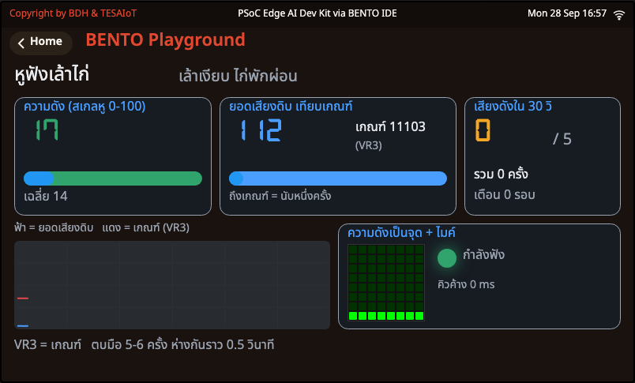

<div class="cap">ภาพจาก BENTO Emulator — ใช้ดู <b>หน้าจอ</b> เท่านั้น: เสียงใน Emulator เป็นสัญญาณสังเคราะห์ (ยอด 112 ต่ำกว่าเกณฑ์ ~11,000 จึงไม่นับ) ตบมือใส่คอมพิวเตอร์ไม่มีผล</div>

</div>
</div>

---

## กิจกรรม 2 — หัวใจของโค้ด: นับเหตุการณ์ในช่วงเวลา

<div class="cols">
<div class="c55">

```python
def is_event(peak, th, now, last, mute_until):
    # นับเป็น "เสียงดังฉับพลัน" เมื่อ: พ้นช่วงปิดหู, ยอดถึงเกณฑ์, และห่างครั้งก่อนพอ
    return (time.ticks_diff(now, mute_until) >= 0 and peak >= th
            and time.ticks_diff(now, last) >= EVENT_GAP_MS)


def forget_old(events, now):
    # ลืมเหตุการณ์ที่เก่ากว่า 30 วินาที เหลือเฉพาะที่อยู่ในหน้าต่างเวลา
    while events and time.ticks_diff(now, events[0]) > WINDOW_MS:
        events.pop(0)
```
<div class="src"><a href="https://github.com/Advance-Innovation-Centre-AIC/aiot-development-for-smart-farm/blob/main/s3/sf3_02_coop_ears.py">sf3_02_coop_ears.py</a> · is_event() และ forget_old() ในส่วน "3) สมอง"</div>

```python
            forget_old(ears.events, now)             # 2) ตัดสิน
            was, panic = panic, len(ears.events) >= ALARM_EVENTS
            if panic != was:                         # 3) ทำ: เสียงเฉพาะตอนสถานะเปลี่ยน
                beep(84, 76) if panic else beep(79, 84)
                ears.mute()                          # ทุกครั้งที่ลำโพงดัง = ปิดหู MUTE_MS
```
<div class="src"><a href="https://github.com/Advance-Innovation-Centre-AIC/aiot-development-for-smart-farm/blob/main/s3/sf3_02_coop_ears.py">sf3_02_coop_ears.py</a> · main()</div>

</div>
<div>

- `events` = **รายการเวลา** ของเสียงดังแต่ละครั้ง · `len(events)` = จำนวนในหน้าต่าง
- `time.ticks_diff()` ใช้เทียบเวลาเสมอ (ตัวนับ ms ของบอร์ดวนกลับได้ ห้ามลบกันตรง ๆ)
- **เสียงเฉพาะตอนสถานะเปลี่ยน** + **ปิดหูทุกครั้งที่ลำโพงดัง** — สองกฎนี้คู่กัน

<div class="think">

**คิด:** เล้าจริงมีเสียงที่ไม่อันตราย (ฝนตกบนหลังคา รถไถผ่าน) จะเพิ่มกฎอะไร ให้ระบบ **ไม่ปลุกเจ้าของฟาร์มตอนตีสาม** โดยไม่จำเป็น?

</div>

</div>
</div>

---

<!-- _class: sec -->

<div class="when">0:40 – 0:52 · คนขับ = คนที่ 1</div>

# กิจกรรม 3 — หมอฟังปั๊มน้ำ (การสั่นผิดปกติ)

[`sf3_03_pump_vibration.py`](https://github.com/Advance-Innovation-Centre-AIC/aiot-development-for-smart-farm/blob/main/s3/sf3_03_pump_vibration.py) · IMU + ปุ่ม SW5 · เรียนรู้ค่าปกติ แล้วให้คะแนนการสั่น 0–100

<div class="chal">🏆 <b>ท้าทาย:</b> ตั้งค่าให้ <b>เคาะโต๊ะเบา ๆ ไม่เตือน</b> แต่ <b>เขย่าแรงเตือนทุกครั้ง</b> — ลองห้าครั้ง ถูกกี่ครั้ง?</div>

---

## เบื้องหลัง: วัดการสั่นให้ไม่สนมุมเอียง

<svg viewBox="0 0 1000 280" xmlns="http://www.w3.org/2000/svg" font-family="sans-serif">
  <g transform="translate(40 40)">
    <rect x="0" y="80" width="150" height="30" rx="6" fill="#455a64"/>
    <line x1="75" y1="80" x2="75" y2="10" stroke="#e53935" stroke-width="4" marker-end="url(#ar)"/>
    <text x="85" y="30" font-size="15" fill="#c62828">az ≈ 9.8</text>
    <text x="75" y="140" text-anchor="middle" font-size="15" fill="#37474f">วางราบ</text>
  </g>
  <g transform="translate(290 30)">
    <g transform="rotate(-25 75 95)">
      <rect x="0" y="80" width="150" height="30" rx="6" fill="#455a64"/>
      <line x1="75" y1="80" x2="75" y2="20" stroke="#1e88e5" stroke-width="3" stroke-dasharray="6 4"/>
      <line x1="75" y1="80" x2="150" y2="80" stroke="#1e88e5" stroke-width="3" stroke-dasharray="6 4"/>
    </g>
    <line x1="75" y1="84" x2="75" y2="10" stroke="#e53935" stroke-width="4"/>
    <text x="85" y="22" font-size="15" fill="#c62828">แรงโน้มถ่วงเท่าเดิม</text>
  </g>
  <text x="365" y="204" text-anchor="middle" font-size="15" fill="#37474f">วางเอียง: แกนของบอร์ด (เส้นประฟ้า) เอียง แรงแบ่งไปหลายแกน</text>
  <rect x="40" y="222" width="470" height="44" rx="10" fill="#e8f5e9" stroke="#2e7d32" stroke-width="2"/>
  <text x="275" y="251" text-anchor="middle" font-size="18" fill="#1b5e20">ขนาดรวม |a| = √(ax² + ay² + az²) ≈ 9.8 ทั้งสองแบบ</text>
  <text x="760" y="40" text-anchor="middle" font-size="16" font-weight="700" fill="#2e7d32">ปั๊มปกติ: |a| แกว่งนิดเดียว</text>
  <path d="M560 92.1 L568 97.8 L576 97.1 L584 93.0 L592 95.0 L600 94.6 L608 96.2 L616 97.3 L624 91.8 L632 91.2 L640 97.7 L648 94.5 L656 97.1 L664 91.0 L672 94.6 L680 96.8 L688 92.8 L696 98.6 L704 98.2 L712 91.2 L720 91.2 L728 95.3 L736 98.5 L744 94.0 L752 92.7 L760 94.4 L768 91.2 L776 92.8 L784 94.5 L792 95.0 L800 92.9 L808 92.8 L816 92.8 L824 94.7 L832 93.3 L840 91.2 L848 97.7 L856 95.5 L864 96.1 L872 92.5 L880 98.9 L888 97.9 L896 92.0 L904 93.7 L912 96.8 L920 96.7 L928 98.5 L936 94.4 L944 97.6 L952 96.4 L960 93.4" fill="none" stroke="#2e7d32" stroke-width="2.5"/>
  <text x="760" y="160" text-anchor="middle" font-size="16" font-weight="700" fill="#c62828">ลูกปืนเริ่มพัง: |a| แกว่งแรง</text>
  <path d="M560 242.4 L568 241.9 L576 188.4 L584 190.1 L592 235.1 L600 229.2 L608 225.2 L616 203.5 L624 221.4 L632 221.4 L640 219.9 L648 194.5 L656 210.8 L664 208.6 L672 228.4 L680 244.7 L688 242.0 L696 217.7 L704 211.7 L712 201.1 L720 187.2 L728 186.6 L736 212.9 L744 204.1 L752 207.8 L760 238.5 L768 216.5 L776 218.6 L784 199.2 L792 186.4 L800 204.5 L808 193.2 L816 215.6 L824 244.9 L832 225.5 L840 195.9 L848 238.6 L856 232.8 L864 229.1 L872 239.4 L880 230.8 L888 232.4 L896 206.2 L904 243.9 L912 242.7 L920 194.7 L928 230.2 L936 227.9 L944 212.7 L952 216.8 L960 214.4" fill="none" stroke="#c62828" stroke-width="2.5"/>
  <text x="760" y="274" text-anchor="middle" font-size="14" fill="#546e7a">ค่าสั่น = ส่วนเบี่ยงเบนมาตรฐานของ |a| 20 ค่าล่าสุด (1 วินาที) · ภาพประกอบแนวคิด</text>
</svg>

<div class="cols">
<div>

- ติดบอร์ดบนปั๊มเอียง ๆ ก็วัดได้ — เราสนแค่ว่า **แกว่งแค่ไหน** ไม่สนว่าวางเอียงแค่ไหน
- **ซ่อมก่อนพัง** (predictive maintenance) ถูกกว่าปั๊มดับกลางฤดูแล้งเสมอ

</div>
<div class="vid" style="flex:0 0 auto;padding:6px">
<iframe width="200" height="113" src="https://www.youtube.com/embed/BPMjYJ_HoWk" title="Vibration Analysis for beginners 1 — ADASH" loading="lazy" frameborder="0" allowfullscreen></iframe>
<div><b>Vibration Analysis for beginners 1</b><br>ADASH · 9:09 · EN<br><https://www.youtube.com/watch?v=BPMjYJ_HoWk></div>
</div>
</div>

---

## เบื้องหลัง: เรียนรู้ "ปกติ" แล้วจับสิ่งที่ต่างไป

<svg viewBox="0 0 1000 280" xmlns="http://www.w3.org/2000/svg" font-family="sans-serif">
  <rect x="60" y="40" width="220" height="210" fill="#fff8e1"/>
  <text x="170" y="62" text-anchor="middle" font-size="15" fill="#e65100">เรียนรู้ 5 วิ (วางนิ่ง)</text>
  <line x1="60" y1="250" x2="950" y2="250" stroke="#b0bec5"/>
  <line x1="60" y1="230" x2="950" y2="230" stroke="#2e7d32" stroke-width="2" stroke-dasharray="4 4"/>
  <line x1="60" y1="190" x2="950" y2="190" stroke="#f5a623" stroke-width="2.5" stroke-dasharray="9 6"/>
  <line x1="60" y1="130" x2="950" y2="130" stroke="#e53935" stroke-width="2.5" stroke-dasharray="9 6"/>
  <text x="954" y="226" text-anchor="end" font-size="14" fill="#2e7d32">ค่าปกติ (base)</text>
  <text x="954" y="186" text-anchor="end" font-size="14" fill="#e65100">× K_WARN 3 = เฝ้าระวัง</text>
  <text x="954" y="126" text-anchor="end" font-size="14" fill="#c62828">× K_BAD 6 = ผิดปกติ</text>
  <path d="M60.0 233.7 L71.0 229.4 L82.0 231.8 L93.0 228.5 L104.0 228.2 L115.0 236.1 L126.0 236.8 L137.0 225.3 L148.0 233.4 L159.0 233.7 L170.0 223.1 L181.0 230.4 L192.0 225.3 L203.0 230.3 L214.0 228.1 L225.0 234.9 L236.0 228.1 L247.0 224.8 L258.0 229.7 L269.0 226.6 L280.0 227.6 L291.0 236.1 L302.0 226.4 L313.0 228.7 L324.0 232.8 L335.0 236.6 L346.0 224.9 L357.0 230.4 L368.0 226.9 L379.0 224.7 L390.0 227.0 L401.0 224.1 L412.0 160.0 L423.0 160.0 L434.0 230.8 L445.0 223.9 L456.0 224.7 L467.0 235.6 L478.0 235.1 L489.0 234.0 L500.0 223.5 L511.0 230.9 L522.0 228.2 L533.0 232.8 L544.0 229.9 L555.0 231.6 L566.0 232.1 L577.0 228.8 L588.0 228.8 L599.0 224.3 L610.0 227.5 L621.0 224.0 L632.0 66.4 L643.0 102.8 L654.0 67.6 L665.0 85.0 L676.0 100.7 L687.0 84.8 L698.0 107.2 L709.0 66.4 L720.0 74.8 L731.0 103.4 L742.0 76.2 L753.0 108.1 L764.0 108.0 L775.0 95.4 L786.0 66.9 L797.0 66.1 L808.0 106.6 L819.0 228.6 L830.0 236.6 L841.0 234.2 L852.0 231.3 L863.0 228.5 L874.0 234.8 L885.0 236.4 L896.0 224.9 L907.0 232.6 L918.0 223.6 L929.0 224.4 L940.0 231.7" fill="none" stroke="#1e88e5" stroke-width="3"/>
  <text x="418" y="150" text-anchor="middle" font-size="14" fill="#37474f">เคาะทีเดียว: ข้ามเส้นส้มแวบเดียว</text>
  <text x="418" y="168" text-anchor="middle" font-size="14" fill="#37474f">ไม่ค้างถึง 0.5 วิ → ยังปกติ</text>
  <text x="720" y="44" text-anchor="middle" font-size="16" font-weight="700" fill="#c62828">เขย่าค้าง &gt; 0.5 วิ → ผิดปกติ! 🔊</text>
  <text x="60" y="272" font-size="14" fill="#546e7a">เส้นฟ้า = ค่าสั่น · ภาพประกอบแนวคิด ไม่ใช่ค่าจริง</text>
</svg>

- นี่คือ **anomaly detection ด้วยกฎที่เขียนเอง**: จำ "ปกติ" ของเครื่องเราเอง แล้วจับสิ่งที่ **ต่างไปหลายเท่า**
- ระดับใหม่ต้องค้าง **`CONFIRM_N = 10` ตัวอย่าง** (10 × 50 ms = 0.5 วิ) ถึงเชื่อ · `MIN_BASE = 0.05` กันบอร์ดนิ่งสนิทได้ค่าปกติเป็นศูนย์
- **ข้อมูลตอนสอนสำคัญที่สุด:** สอนตอนเพื่อนเคาะโต๊ะ → "ปกติ" สูงเกินจริง → ของเสียจริงก็ไม่เตือน

---

## กิจกรรม 3 — หมอฟังปั๊มน้ำ

<div class="cols">
<div class="c40">

<div class="goal">

🎯 **เป้าหมาย:** ให้บอร์ดเรียนรู้การสั่นปกติ แล้วให้คะแนนการสั่น 0–100

</div>

<div class="try">

**ลองทำ**
1. 5 วินาทีแรก **วางบอร์ดนิ่ง** (แถบส้ม = กำลังเรียน → เขียว = ได้ค่าปกติ) · จดค่าปกติ
2. **เคาะโต๊ะเบา ๆ** → ควรยัง "ปกติ" · **เขย่าแรง ๆ** → "ผิดปกติ!" เสียงเตือน ตัวนับบนจอไฟ RGB +1
3. กด **SW5 (ปุ่มล่าง)** = เรียนรู้ใหม่ — ระหว่างนั้นให้เพื่อน **เคาะโต๊ะตลอด** · เขย่าแรงเท่าเดิมยังเตือนไหม?

</div>

</div>
<div class="shot">

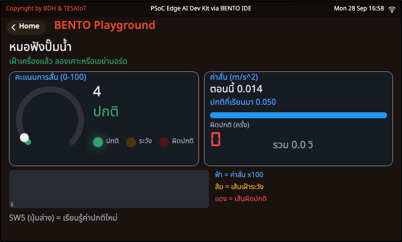 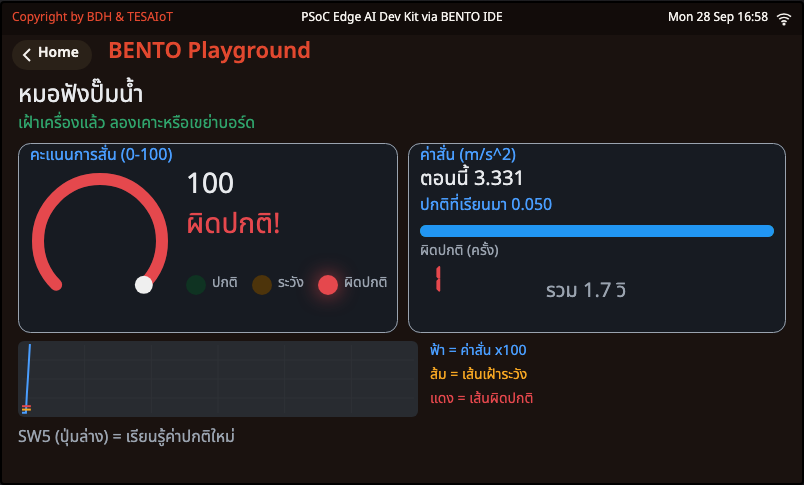

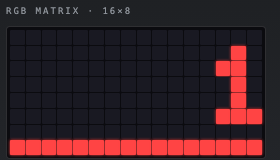

<div class="cap">ภาพจาก BENTO Emulator (ค่าจำลอง): ซ้าย วางนิ่ง ค่าสั่น 0.014 — ค่าปกติถูกยกขึ้นเป็น MIN_BASE 0.050 · ขวา กดปุ่ม Shake ของ Emulator → 3.331 = ผิดปกติ · ล่าง จอไฟ RGB: เลข 1 = ผิดปกติ 1 ครั้ง แถวล่าง = แถบคะแนน</div>

</div>
</div>

---

## กิจกรรม 3 — หัวใจของโค้ด: ขนาด → ระดับ → ยืนยัน

<div class="cols">
<div class="c60">

```python
def magnitude():
    # ขนาดความเร่งรวมสามแกน (m/s^2) วางนิ่งได้ราว 9.8 คือแรงโน้มถ่วง
    # ขนาดไม่เปลี่ยนตามมุมเอียง บอร์ดวางเอียงก็วัดการสั่นได้เหมือนวางราบ
    # อ่านไม่ได้ (บัสไม่ว่าง) คืน None แล้วข้ามตัวอย่างนั้นไป ไม่เดาค่าแทน
    try:
        ax, ay, az, _, _, _ = sensors.bmi270.motion()
    except OSError:
        return None
    return math.sqrt(ax * ax + ay * ay + az * az)
```

```python
def classify(vib, base):
    # 0 = ปกติ, 1 = เฝ้าระวัง (เกิน K_WARN เท่าของปกติ), 2 = ผิดปกติ (เกิน K_BAD เท่า)
    return 2 if vib > base * K_BAD else (1 if vib > base * K_WARN else 0)
```
<div class="src"><a href="https://github.com/Advance-Innovation-Centre-AIC/aiot-development-for-smart-farm/blob/main/s3/sf3_03_pump_vibration.py">sf3_03_pump_vibration.py</a> · magnitude() ในส่วน "2) ฮาร์ดแวร์" · classify() ในส่วน "3) สมอง"</div>

</div>
<div class="c40">

**`Watch.judge()`** — "ระดับใหม่ต้องค้าง `CONFIRM_N` ตัวอย่างติดกันถึงจะเชื่อ (เคาะทีเดียวไม่ถือว่าเครื่องเสีย)" · เปลี่ยนเป็น "ผิดปกติ" เมื่อไร `bad_count` +1

- ตัวเลข **เกณฑ์เป็น "เท่าของปกติ"** ไม่ใช่ค่าตายตัว → ใช้ได้กับปั๊มเล็กหรือใหญ่
- ยืนยัน N ครั้ง **ตัวเดียวกับกิจกรรม 1** แค่เขียนในรูป class

</div>
</div>

---

<!-- _class: sec -->

<div class="when">0:52 – 1:05 · คนขับ = คนที่ 2</div>

# Edge AI — AI หมอเครื่องจักร

[`sf3_04_ai_pump_doctor.py`](https://github.com/Advance-Innovation-Centre-AIC/aiot-development-for-smart-farm/blob/main/s3/sf3_04_ai_pump_doctor.py) · โมเดล AI ที่ติดมากับบอร์ด เรียกด้วย **ชื่อ** · ตัดสินบนบอร์ดเอง · เตือนด้วยเสียง + ไฟ LED แดง + จอไฟ RGB

**เป้าหมาย:** เทียบ **กฎที่เขียนเอง** กับ **Edge AI** บนโจทย์เดียวกัน ด้วยตัวเลขที่วัดเอง แล้วบอกข้อดีข้อจำกัดของแต่ละแบบ

<div class="chal">🏆 <b>ท้าทาย:</b> ห้าท่าเดียวกัน — <b>กฎที่เราเขียน</b> หรือ <b>AI</b> ตอบถูกมากกว่ากัน?</div>

---

## Edge AI คืออะไร — และโมเดลในบอร์ดเรา "รู้" อะไร

<svg viewBox="0 0 1000 200" xmlns="http://www.w3.org/2000/svg" font-family="sans-serif">
  <defs><marker id="ah" markerWidth="10" markerHeight="10" refX="8" refY="5" orient="auto"><path d="M0 0 L10 5 L0 10 Z" fill="#546e7a"/></marker></defs>
  <g font-size="16" text-anchor="middle">
    <rect x="10" y="30" width="160" height="110" rx="12" fill="#e3f2fd" stroke="#1e88e5" stroke-width="3"/>
    <text x="90" y="72" font-size="30">📐</text><text x="90" y="104" font-weight="700" fill="#1565c0">IMU / ไมค์</text><text x="90" y="126" fill="#37474f" font-size="14">สัญญาณดิบ</text>
    <rect x="210" y="30" width="190" height="110" rx="12" fill="#f3e5f5" stroke="#8e24aa" stroke-width="3"/>
    <text x="305" y="72" font-size="30">🧠</text><text x="305" y="104" font-weight="700" fill="#6a1b9a">โมเดล AI</text><text x="305" y="126" fill="#37474f" font-size="14">รันบนชิปในบอร์ดเอง</text>
    <rect x="440" y="30" width="200" height="110" rx="12" fill="#fff3e0" stroke="#ef6c00" stroke-width="3"/>
    <text x="540" y="62" font-weight="700" fill="#e65100">คะแนนทุกคลาส</text>
    <text x="540" y="88" fill="#37474f" font-size="14">idle 0.05</text><text x="540" y="108" fill="#37474f" font-size="14">circle 0.10</text><text x="540" y="128" fill="#c62828" font-size="14" font-weight="700">shaking 0.85</text>
    <rect x="680" y="30" width="170" height="110" rx="12" fill="#e8f5e9" stroke="#2e7d32" stroke-width="3"/>
    <text x="765" y="62" font-weight="700" fill="#1b5e20">กฎของเรา</text>
    <text x="765" y="88" fill="#37474f" font-size="14">มั่นใจ ≥ 60 %</text><text x="765" y="110" fill="#37474f" font-size="14">ชนะติดกัน 3 ครั้ง</text>
    <rect x="880" y="30" width="110" height="110" rx="12" fill="#ffebee" stroke="#e53935" stroke-width="3"/>
    <text x="935" y="78" font-size="30">🚨</text><text x="935" y="112" font-weight="700" fill="#c62828">เตือน</text>
  </g>
  <g stroke="#546e7a" stroke-width="3" marker-end="url(#ah)"><line x1="172" y1="85" x2="206" y2="85"/><line x1="402" y1="85" x2="436" y2="85"/><line x1="642" y1="85" x2="676" y2="85"/><line x1="852" y1="85" x2="876" y2="85"/></g>
  <text x="500" y="180" text-anchor="middle" font-size="16" fill="#37474f">คิดบนบอร์ด: <tspan fill="#2e7d32" font-weight="700">เร็ว · ไม่ต้องมีเน็ต · ข้อมูลดิบไม่ออกนอกฟาร์ม</tspan> &#160; เทียบกับส่งสัญญาณดิบขึ้นคลาวด์ทุกวินาที</text>
</svg>

<div class="cols">
<div>

**โมเดลที่ติดมากับบอร์ด — เรียกด้วย "ชื่อ" เท่านั้น**

| `MODEL_KEY` | ฟังอะไร | คลาสที่ตอบ |
|---|---|---|
| `"Motion"` (เช่น Motion Detection) | IMU | idle · circle · shaking |
| `"Cough"` · `"Alarm"` · `"Siren"` | ไมค์ | unlabelled · cough / alarm / sirens |
| `"Push"` | — | Push |

</div>
<div>

<div class="warn">

**พูดให้ตรง:** โมเดลในตัวบอร์ดเป็น **โมเดลสำเร็จรูปจากผู้พัฒนาภายนอก** (DEEPCRAFT Ready Model) ฝึกจาก **ท่ามือคนและเสียงทั่วไป — ไม่ได้ฝึกจากข้อมูลฟาร์ม** ปั๊ม หรือสัตว์จริง · วันนี้ใช้เป็น **ตัวแทน** เพื่อเรียนแนวคิดเท่านั้น

</div>

- งานจริง: AI ที่รู้จัก "ปั๊มของฟาร์มเรา" ต้อง **เก็บข้อมูลจากเครื่องจริง ติดป้าย แล้วฝึกโมเดลใหม่** — ส่วนนี้ใช้ **เฉพาะโมเดลที่ติดมากับบอร์ด**

</div>
</div>

---

## Edge AI — ลองทำ

<div class="cols">
<div class="c40">

<div class="goal">

🎯 **เป้าหมาย:** ให้ AI บนบอร์ดตัดสินแทนกฎ แล้วดูว่ามัน "มั่นใจ" แค่ไหน

</div>

<div class="try">

**ลองทำ**
1. รันไฟล์ จอขึ้น **ชื่อโมเดล** และ **ชื่อคลาส** · ถ้าจอบอก **"ไม่พบโมเดล"** → ทำเฉพาะคอลัมน์ "กฎ" ในตารางแข่งห้าท่า แล้วแจ้งผู้สอน
2. **วางนิ่ง → ถือวาดวงกลมช้า ๆ → เขย่าแรง ๆ** ดูวงแหวนความมั่นใจ แถบคะแนนทุกคลาส แท่งบนจอไฟ RGB
3. จด **"ใช้เวลาคิด"** (latency) ต่อหนึ่งคำตอบ
4. จอบอก **"ผลไม่ขยับ ลองรีเซ็ตบอร์ด"** → กด RESET แล้วรันใหม่

</div>

<div class="src">ของที่ใช้: แกน AI บนชิป (<code>edge_ai</code>) + IMU · ไฟ LED สีแดงบนโมดูล SoM หาจากชื่อ <code>RGB_RED</code> = ไฟเตือน · ลำโพงดังเฉพาะตอนเริ่ม/หายเตือน</div>

</div>
<div class="shot">

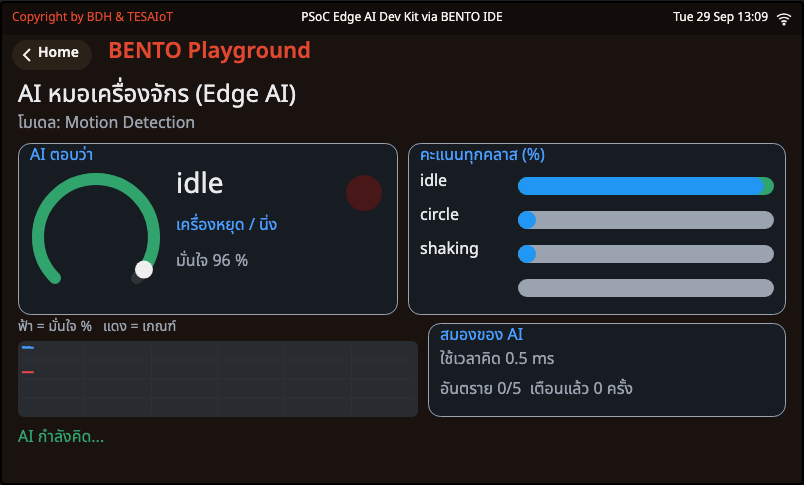 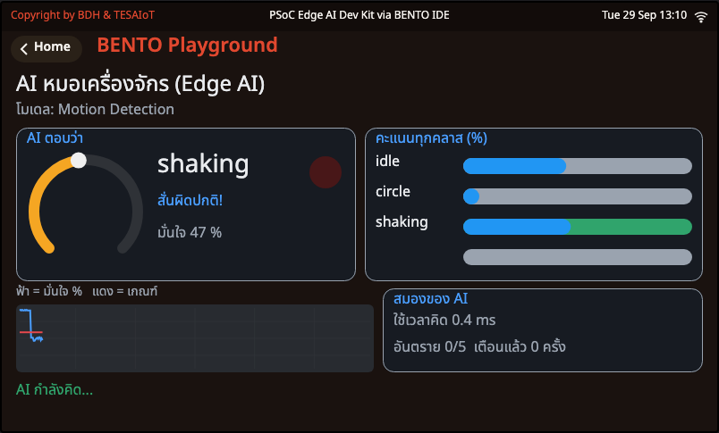

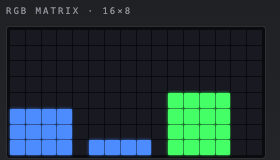

<div class="cap">ภาพจาก BENTO Emulator — <b>ผล AI ใน Emulator เป็นผลจำลอง ไม่ใช่โมเดลจริง</b> และเวลาคิดไม่ใช่ของบอร์ดจริง · ซ้าย วางนิ่ง → idle มั่นใจ 96 % · ขวา กด Shake → shaking ชนะแต่มั่นใจแค่ 50 % ต่ำกว่า CONF_MIN 60 จึง <b>ยังไม่นับ</b> (อันตรายติดกัน 0/3) · ล่าง จอไฟ RGB แท่งละคลาส แท่งที่ชนะเป็นสีเขียว</div>

</div>
</div>

---

## Edge AI — หัวใจของโค้ด: หาด้วยชื่อ · มั่นใจพอไหม · ชนะติดกันไหม

<style scoped>
section .cols li, section .cols p { font-size: .8em; }
section .think { font-size: .7em; margin-top: .1em; }
section pre { font-size: .64em; }
</style>

```python
def find_model(key):
    # หาโมเดลจาก "ชื่อ" เพราะลำดับบนแต่ละบอร์ดไม่เหมือนกัน
    # เก็บแค่ ลำดับ ชื่อ และชื่อคลาส ไม่เก็บทั้งแถว และข้ามโมเดลที่ไม่ได้ติดมากับบอร์ด
    try:
        for m in edge_ai.models():
            if m.get("builtin") is not False and key.lower() in m["name"].lower():
                return m["index"], m["name"], m["labels"]
    except Exception:
        pass                    # แกน AI ไม่ตอบ = ถือว่าไม่พบ
    return None
```
<div class="src"><a href="https://github.com/Advance-Innovation-Centre-AIC/aiot-development-for-smart-farm/blob/main/s3/sf3_04_ai_pump_doctor.py">sf3_04_ai_pump_doctor.py</a> · find_model() ในส่วน "2) ฮาร์ดแวร์"</div>

<div class="cols">
<div class="c55">


```python
def is_danger(label, conf):
    return label in DANGER and conf >= CONF_MIN


def alert_rule(streak, alerting, danger):
    # เตือนเมื่ออันตรายชนะติดกัน CONFIRM_N ครั้ง (กันเตือนมั่วจากคำตอบเดียว)
    # หายเตือนเมื่อคำตอบกลับมาปลอดภัย
    streak = streak + 1 if danger else 0
    if streak >= CONFIRM_N:
        return streak, True
    return streak, alerting and streak > 0
```
<div class="src"><a href="https://github.com/Advance-Innovation-Centre-AIC/aiot-development-for-smart-farm/blob/main/s3/sf3_04_ai_pump_doctor.py">sf3_04_ai_pump_doctor.py</a> · is_danger() และ alert_rule() ในส่วน "3) สมอง"</div>

</div>
<div>

**ค่าตั้งบนหัวไฟล์:** `MODEL_KEY = "Motion"` · `CONF_MIN = 60` (%) · `CONFIRM_N = 3`

- AI ไม่ได้ตัดสิน "คนเดียว" — คำตอบของมันผ่าน **กฎของเราอีกชั้น**: **ความมั่นใจขั้นต่ำ** (ตัวกันเตือนผิดอีกแบบ) + ชนะติดกัน
- เรียกโมเดลด้วย **ชื่อ** เสมอ · **ห้ามพิมพ์ทั้งแถวของ `edge_ai.models()`** เก็บแค่ชื่อ ลำดับ และคลาส
- โมเดลที่ฟังไมค์: ไม่เชื่อผล `MUTE_MS` หลังบอร์ดส่งเสียงเอง (ลำโพงบอร์ดเข้าไมค์)

<div class="think">

**ตาคุณ:** ① ลด `CONFIRM_N` เหลือ 1 แล้วเขย่าเบา ๆ นับว่าเตือนมั่วกี่ครั้ง เทียบกับ 3 · ② เปลี่ยน `MODEL_KEY` เป็น `"Cough"` แล้วลองไอใส่บอร์ด — โมเดลนี้ฝึกจากเสียงไอ **คน** งานจริงในฟาร์มต้องฝึกจากเสียงในฟาร์ม

</div>

</div>
</div>

---

## Edge AI — แข่งห้าท่า: กฎ vs AI

<style scoped>
section table { font-size: .68em; }
</style>

<div class="cols">
<div>

ทำท่าเดียวกันกับไฟล์กฎ [`sf3_03_pump_vibration.py`](https://github.com/Advance-Innovation-Centre-AIC/aiot-development-for-smart-farm/blob/main/s3/sf3_03_pump_vibration.py) และไฟล์ AI **ท่าละ 5 วินาที**

| ท่า | ความจริง | กฎ `sf3_03` ตอบ | ถูก? | AI `sf3_04` ตอบ (มั่นใจ %) | ถูก? |
|---|---|---|---|---|---|
| วางนิ่ง | ปกติ | | ☐ | | ☐ |
| เคาะโต๊ะเบา ๆ | ปกติ | | ☐ | | ☐ |
| ถือวาดวงกลมช้า ๆ | ปกติ (หมุนเป็นจังหวะ) | | ☐ | | ☐ |
| เขย่าแรง ๆ | **ผิดปกติ** | | ☐ | | ☐ |
| ถือเดินไปมา | ปกติ | | ☐ | | ☐ |
| **รวมถูก** | | | ___ / 5 | | ___ / 5 |

</div>
<div class="c40">

| | กฎที่เขียนเอง | Edge AI |
|---|---|---|
| ตัดสินจาก | ค่าสั่น เทียบ "ปกติ" ×3 / ×6 | รูปแบบที่โมเดลเคยเห็นตอนฝึก |
| ต้องเตรียม | วางนิ่ง 5 วิ บนเครื่องจริง | ข้อมูลติดป้ายจำนวนมาก + ฝึก |
| อธิบายให้เจ้าของฟาร์ม | ง่าย อ่านได้ทุกบรรทัด | ยากกว่า ตอบเป็นคะแนน |

</div>
</div>

<div class="think">

**คิด (ตอบให้ครบ 3 ข้อ):** ① โจทย์แบบไหนกฎเขียนเองก็พอ แบบไหนควรใช้ AI? ② ถ้าจะให้ AI รู้จัก "ปั๊มของฟาร์มเรา" ต้องเก็บข้อมูลอะไร จากกี่เครื่อง ติดป้ายอย่างไร? ③ ข้อดีของการคิดบนบอร์ด (Edge) ในฟาร์มที่เน็ตไม่ค่อยดี

</div>

<div class="cap">ดูเพิ่มและเครดิตของส่วนนี้: <a href="https://www.youtube.com/watch?v=mQViYVo2L4w">What is Edge AI?</a> — Esper · 2:24 · EN &#160;·&#160; <a href="https://www.youtube.com/watch?v=b93ZyoY1hjo">Edge AI โฉมหน้าอุตสาหกรรมไทย 5.0 และวิสัยทัศน์จาก Advantech</a> — Techsauce · 10:36 · ไทย &#160;·&#160; โมเดลในตัวบอร์ด: DEEPCRAFT Ready Model (ผู้พัฒนาภายนอก ฝึกจากท่ามือคนและเสียงทั่วไป) &#160;·&#160; อินโฟกราฟิก Edge AI วาดประกอบสำหรับคอร์สนี้ · ภาพหน้าจอจาก BENTO Emulator ซึ่งผล AI เป็นผลจำลอง</div>

---

<!-- _class: sec -->

<div class="when">1:05 – 1:15 · คนขับ = คนที่ 1</div>

# กิจกรรม 4 — Smart IoT Gateway ฟาร์มครบวงจร

[`sf3_05_farm_all_in_one.py`](https://github.com/Advance-Innovation-Centre-AIC/aiot-development-for-smart-farm/blob/main/s3/sf3_05_farm_all_in_one.py) · **แม่แบบโปรเจกต์** ครบห้าเสาในไฟล์เดียว · เน็ตหลุดฟาร์มไม่หยุด

<div class="chal">🏆 <b>ท้าทาย:</b> ทำให้เกิดครบใน 3 นาที — <b>พัดลมเปิด · ปั๊มเปิด · ผู้บุกรุก · กด SW6 รับทราบ · แอปสั่งรดน้ำ</b></div>

---

## ภาพฟาร์มจริง: Dev Kit ตัดสิน แล้วสั่งรีเลย์ผ่าน MQTT

<svg viewBox="0 0 1000 300" xmlns="http://www.w3.org/2000/svg" font-family="sans-serif">
  <defs><marker id="ag" markerWidth="10" markerHeight="10" refX="8" refY="5" orient="auto"><path d="M0 0 L10 5 L0 10 Z" fill="#546e7a"/></marker></defs>
  <g font-size="15">
    <rect x="10" y="10" width="200" height="200" rx="12" fill="#e8f5e9" stroke="#2e7d32" stroke-width="3"/>
    <text x="110" y="36" text-anchor="middle" font-weight="700" fill="#1b5e20">① วัด</text>
    <text x="24" y="70" fill="#37474f">🌡️ อากาศโรงเรือน</text>
    <text x="24" y="104" fill="#37474f">🌱 ดิน (จำลอง VR2)</text>
    <text x="24" y="138" fill="#37474f">📡 เรดาร์ที่คอก</text>
    <text x="24" y="172" fill="#37474f">🎛️ VR3 VR4 · SW5 SW6</text>
    <rect x="250" y="10" width="250" height="200" rx="12" fill="#263238"/>
    <text x="375" y="38" text-anchor="middle" font-weight="700" fill="#fff" font-size="16">② TESAIoT Dev Kit</text>
    <text x="375" y="60" text-anchor="middle" fill="#80cbc4">= Smart IoT Gateway</text>
    <text x="266" y="92" fill="#fff">🧠 กฎทั้งฟาร์มใน decide()</text>
    <text x="266" y="122" fill="#fff">🖥️ จอ 3 การ์ด + ปุ่มบนจอ</text>
    <text x="266" y="152" fill="#fff">🟩 จอไฟ RGB · 🔊 ลำโพง</text>
    <text x="266" y="182" fill="#ffcc80">เน็ตหลุด = ยังตัดสินต่อ</text>
    <rect x="540" y="60" width="150" height="100" rx="12" fill="#eceff1" stroke="#546e7a" stroke-width="3"/>
    <text x="615" y="100" text-anchor="middle" font-size="26">📮</text>
    <text x="615" y="130" text-anchor="middle" font-weight="700" fill="#37474f">MQTT broker</text>
    <rect x="730" y="10" width="260" height="120" rx="12" fill="#fff3e0" stroke="#ef6c00" stroke-width="3"/>
    <text x="860" y="38" text-anchor="middle" font-weight="700" fill="#e65100">③ PLC / รีเลย์ Wi-Fi</text>
    <text x="860" y="70" text-anchor="middle" fill="#37474f">🌀 พัดลม · 💧 ปั๊ม · 🚨 ไซเรน</text>
    <text x="860" y="100" text-anchor="middle" fill="#546e7a" font-size="13">ในไฟล์นี้: ไฟ Led บนจอ + จอไฟ RGB + ลำโพง</text>
    <rect x="730" y="160" width="260" height="90" rx="12" fill="#e3f2fd" stroke="#1e88e5" stroke-width="3"/>
    <text x="860" y="190" text-anchor="middle" font-weight="700" fill="#1565c0">④ แอปของทีม 📱💻</text>
    <text x="860" y="216" text-anchor="middle" fill="#37474f" font-size="14">ดู telemetry / event · สั่ง pump beep ack</text>
    <text x="860" y="238" text-anchor="middle" fill="#37474f" font-size="13">สั่งผ่าน Gateway — ไม่สั่ง PLC ตรง</text>
  </g>
  <g stroke="#546e7a" stroke-width="3" marker-end="url(#ag)"><line x1="212" y1="110" x2="246" y2="110"/><line x1="502" y1="100" x2="536" y2="100"/><line x1="692" y1="90" x2="726" y2="70"/><line x1="726" y1="200" x2="692" y2="140"/></g>
  <text x="500" y="280" text-anchor="middle" font-size="16" fill="#37474f"><tspan font-weight="700">กฎทุกข้ออยู่บนบอร์ด</tspan> — เน็ตมีไว้รายงานและรับคำสั่ง ไม่ได้มีไว้ตัดสินใจแทน</text>
</svg>

<div class="cap">อินโฟกราฟิกวาดประกอบ — "PLC / รีเลย์ Wi-Fi ที่รองรับ MQTT" หมายถึงอุปกรณ์ประเภทนี้โดยทั่วไป ไม่ได้ระบุยี่ห้อ · ต่อ PLC จำลองของ Session 2 ได้ ดูข้อ 3 ของ "ตาคุณ" ท้ายไฟล์</div>

---

## กิจกรรม 4 — ห้าเสาในไฟล์เดียว

<style scoped>
section table { font-size: .68em; }
</style>

<div class="cols">
<div class="c60">

| เสา | ใน [`sf3_05_farm_all_in_one.py`](https://github.com/Advance-Innovation-Centre-AIC/aiot-development-for-smart-farm/blob/main/s3/sf3_05_farm_all_in_one.py) |
|---|---|
| **1 · Smart HMI** | 3 การ์ด **โรงเรือน · แปลงผัก · คอกสัตว์** + ปุ่มบนจอ **"ส่งรายงานเลย"** · จอไฟ RGB **เขียว** ปกติ · **เหลือง** มีเครื่องทำงาน · **แดงวิ่ง INTRUDER** |
| **2 · เซนเซอร์** | อุณหภูมิ ความชื้น ความกดอากาศ · เรดาร์ที่คอก · **ดิน = จำลองด้วย VR2** (ต้องประกาศ) · hysteresis + ยืนยัน 3 รอบ |
| **3 · ปุ่มตั้งค่า** | **VR3** = เกณฑ์พัดลม · **VR4** = เขตคอก 50–250 cm · **SW5 (ล่าง) กดค้าง** = รดน้ำเอง · **SW6 (บน)** = รับทราบผู้บุกรุก ปิดไซเรน |
| **4 · เสียง** | ดังเฉพาะตอนคอกเปลี่ยน กดรับทราบ หรือมีคำสั่งจากแอป |
| **5 · MQTT + แอป** | `telemetry` ทุก 5 วิ · `event` intruder / clear · ฟัง `cmd` จากแอปของทีม |

</div>
<div>

**คำสั่งจากแอป** → หัวข้อ `bento-aiot/<TEAM>/cmd`

```json
{"cmd":"pump","on":1,"sec":10}
{"cmd":"pump","on":0}
{"cmd":"beep"}
{"cmd":"ack"}
```

รดน้ำไม่เกิน 30 วิต่อคำสั่ง · `beep` = เรียกเจ้าของ · `ack` = รับทราบผู้บุกรุก

<div class="warn">

**ยังไม่แก้ `TEAM` = ไม่ต่อเน็ตเลย** ทำงานออฟไลน์ และจอบอก "แก้ TEAM ก่อน" — ถ้าหลายกลุ่มลืมแก้ client id จะชนกัน แล้ว broker เตะกันหลุด · broker สาธารณะไม่เข้ารหัส **ห้ามส่งของลับ**

</div>

</div>
</div>

---

## กิจกรรม 4 — ลองทำ

<div class="cols">
<div class="c40">

<div class="try">

1. แก้ `WIFI_SSID` `WIFI_PASS` `TEAM` ให้เหมือน Session 2 แล้วรัน → แถบสถานะขึ้น **"ออนไลน์ teamNN"** หรือ **"ออฟไลน์ (ทำงานต่อ)"**
2. หมุน **VR2 ลง** (ดินแห้ง → ไฟปั๊ม) · หมุน **VR3 ลง** ต่ำกว่าอุณหภูมิห้อง (→ ไฟพัดลม) · **เดินเข้าหาบอร์ด** (→ INTRUDER) แล้วกด **SW6** · กด **SW5 ค้าง** (รดเอง) · แตะ **"ส่งรายงานเลย"**
3. เปิดแอปของทีม [`farm_monitor.py`](https://github.com/Advance-Innovation-Centre-AIC/aiot-development-for-smart-farm/blob/main/s2/app/farm_monitor.py) หรือ [`farm_web.html`](https://github.com/Advance-Innovation-Centre-AIC/aiot-development-for-smart-farm/blob/main/s2/app/farm_web.html) ใส่ TEAM เดียวกัน → เห็นรายงาน · สั่ง `pump` `beep` แล้วบอร์ดตอบสนอง
4. **ปิด Hotspot กลางทาง** — ฟาร์มยังตัดสินและเตือนได้ไหม?

</div>

</div>
<div class="shot">

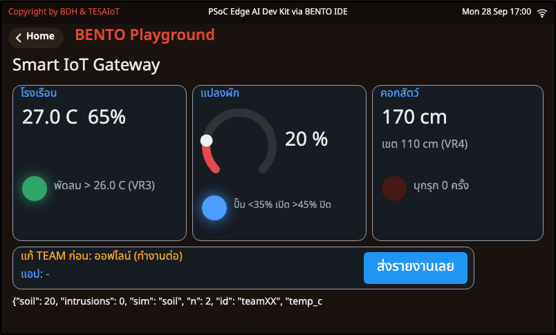 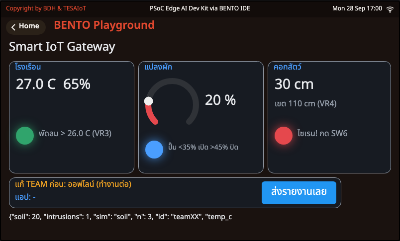

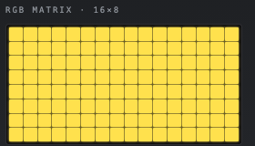

<div class="cap">ภาพจาก BENTO Emulator (ค่าจำลอง 27.0 °C 65 % · ยังไม่แก้ TEAM จึงออฟไลน์ — ฟาร์มยังทำงาน) · ซ้าย VR2 ดิน 20 % → ไฟปั๊มติด · VR3 เกณฑ์ 26 °C → ไฟพัดลมติด · ขวา เป้าเข้ามา 30 cm → "ไซเรน! กด SW6" · ล่าง จอไฟ RGB เหลือง = มีเครื่องทำงาน · บรรทัดล่างสุดของจอ = JSON ใบล่าสุด</div>

</div>
</div>

---

## กิจกรรม 4 — หัวใจของโค้ด: กฎทั้งฟาร์มในที่เดียว

```python
def decide(f, near):
    # กฎทั้งฟาร์มในที่เดียว คืน True ตอนคอกเปลี่ยน (ผู้บุกรุกเข้า/ออก)
    if f.t is not None:                 # อ่านอุณหภูมิไม่ได้ = พัดลมคงเดิม
        f.fan = f.t > f.fan_at or (f.fan and f.t > f.fan_at - 1)   # เย็นกว่าเกณฑ์ 1 C ถึงปิด
    f.auto = f.soil < PUMP_ON or (f.auto and f.soil < PUMP_OFF)    # ช่องตรงกลางกันปั๊มเปิดปิดรัว
    f.streak = f.streak + 1 if near != f.inside else 0            # เรดาร์ต้องเห็นเหมือนเดิม 3 รอบติด
    if f.streak < 3:                                              # ถึงเชื่อ (กันใบไม้ไหว)
        return False
    f.inside, f.streak, f.silenced = near, 0, False
    f.count += near                     # True นับเป็น 1 = นับเฉพาะตอนเข้า
    return True
```
<div class="src"><a href="https://github.com/Advance-Innovation-Centre-AIC/aiot-development-for-smart-farm/blob/main/s3/sf3_05_farm_all_in_one.py">sf3_05_farm_all_in_one.py</a> · decide() ในส่วน "3) สมอง (ตัดสินใจ) ไม่แตะฮาร์ดแวร์ ไม่แตะเน็ต"</div>

<div class="cols">
<div>

- **ช่องกันกระพือ 2 ชุด** (พัดลม 1 °C · ปั๊ม 35/45 %) + **ยืนยัน 3 รอบ** (เรดาร์) — เทคนิคของทั้งสาม Session อยู่ในฟังก์ชันเดียว
- `decide()` **ไม่แตะฮาร์ดแวร์ ไม่แตะเน็ต** → ทดสอบง่าย ยกไปใส่โปรเจกต์ได้ทั้งก้อน
- ไฟล์แบ่ง 6 ส่วน: ตั้งค่า · ฮาร์ดแวร์ · สมอง · **เครือข่าย** · หน้าจอ · โปรแกรมหลัก

</div>
<div class="c40">

<div class="think">

**ตาคุณ:** เพิ่มกฎข้ามระบบใน `decide()` — **"มีผู้บุกรุก ห้ามเปิดปั๊ม"** แล้วส่ง event บอกแอปว่าปั๊มถูกล็อกเพราะอะไร

</div>

</div>
</div>

---

<!-- _class: brk -->

# ☕ พัก 10 นาที

<div class="big">1:15 – 1:25</div>

**ระหว่างพัก:** เปิด [`PROJECT_BRIEF_th.md`](https://github.com/Advance-Innovation-Centre-AIC/aiot-development-for-smart-farm/blob/main/PROJECT_BRIEF_th.md) อ่านไอเดียตั้งต้น 8 เรื่อง แล้วคุยกันว่า **ทีมเราอยากแก้ปัญหาของใคร**

---

<!-- _class: sec -->

<div class="when">1:25 – 2:50 · Sprint 0 → Sprint 1 → Sprint 2 → ซ้อมพูด</div>

# โปรเจกต์ทีม — Smart HMI สำหรับฟาร์มและโลจิสติกส์เกษตร

[`PROJECT_BRIEF_th.md`](https://github.com/Advance-Innovation-Centre-AIC/aiot-development-for-smart-farm/blob/main/PROJECT_BRIEF_th.md) · ทีมละ 2 คน · บอร์ด TESAIoT Dev Kit + BENTO Emulator · นำเสนอใน **Project Showcase** บนบอร์ดจริง

<div class="chal">🏆 <b>ภายในวันนี้:</b> Project Canvas ผ่านการตรวจ + <b>MVP บนบอร์ดรันได้อย่างน้อยเสา 1–4</b></div>

---

## โจทย์ในประโยคเดียว — เริ่มจาก "ปัญหา" ไม่ใช่ "เซนเซอร์"

<div class="cols">
<div>

> เลือก **ปัญหาจริงหนึ่งข้อ** ในฟาร์มหรือในการขนส่งผลผลิต แล้วสร้าง **อุปกรณ์ Smart HMI** บนบอร์ดที่วัดได้ ตัดสินใจเองได้ ส่งเสียงและไฟบอกคนหน้างาน ส่งข้อมูลขึ้น MQTT และมี **แอปของทีมเอง** (เว็บหรือมือถือ) ที่รับข้อมูล เก็บ เตือน และสั่งกลับได้

<div class="warn">

❌ "บอร์ดเรามีเรดาร์ เลยทำอะไรกับเรดาร์ดี" — คำถามที่ผิด

</div>

<div class="goal">

✅ "หัวหน้าคลังไม่รู้ว่าผลไม้เสียตอนไหนของเที่ยวขนส่ง" — คำถามที่ถูก

</div>

</div>
<div>

**ข้อบังคับเรื่องความซื่อตรง**
- บอกให้ชัดว่าเซนเซอร์ไหน **จริง** และไหน **จำลองด้วยลูกบิด** (เช่น ความชื้นดิน ระดับน้ำ) — จำลองได้ แต่ต้องประกาศ
- ถ้าใช้ Edge AI บอกว่าโมเดลในตัวบอร์ด **ฝึกจากท่ามือคน/เสียงทั่วไป ไม่ใช่ข้อมูลฟาร์มจริง** · เรียกโมเดลด้วย **ชื่อ** เท่านั้น
- broker `broker.hivemq.com:1883` ไม่เข้ารหัส ใครก็อ่านหัวข้อเราได้ **ห้ามส่งรหัสผ่านหรือข้อมูลส่วนตัว**
- ตัวเลขเกณฑ์เป็นค่าสำหรับการเรียน ไม่ใช่คำแนะนำทางเกษตรกรรม ถ้าอ้างอิงค่าจริงให้บอกแหล่งที่มา
- งานนี้เป็นต้นแบบเพื่อการเรียน **ไม่ใช่อุปกรณ์ความปลอดภัยจริง**

</div>
</div>

---

## ห้าเสาของโปรเจกต์ — ขั้นต่ำที่ทุกทีมต้องมี

<style scoped>
section table { font-size: .6em; }
</style>

<svg viewBox="0 0 1000 70" xmlns="http://www.w3.org/2000/svg" font-family="sans-serif">
  <g font-size="17" text-anchor="middle" font-weight="700">
    <rect x="4" y="6" width="188" height="56" rx="10" fill="#e3f2fd" stroke="#1e88e5" stroke-width="3"/><text x="98" y="41" fill="#1565c0">🖥️ 1 · Smart HMI</text>
    <rect x="206" y="6" width="188" height="56" rx="10" fill="#e8f5e9" stroke="#2e7d32" stroke-width="3"/><text x="300" y="41" fill="#1b5e20">🌡️ 2 · เซนเซอร์</text>
    <rect x="408" y="6" width="188" height="56" rx="10" fill="#fff3e0" stroke="#ef6c00" stroke-width="3"/><text x="502" y="41" fill="#e65100">🎛️ 3 · ปุ่มตั้งค่า</text>
    <rect x="610" y="6" width="188" height="56" rx="10" fill="#f3e5f5" stroke="#8e24aa" stroke-width="3"/><text x="704" y="41" fill="#6a1b9a">🔊 4 · เสียง</text>
    <rect x="812" y="6" width="184" height="56" rx="10" fill="#eceff1" stroke="#546e7a" stroke-width="3"/><text x="904" y="41" fill="#37474f">📡 5 · MQTT + แอป</text>
  </g>
</svg>

| เสา | ขั้นต่ำที่ต้องมี | ไฟล์ตัวอย่างที่ใช้ได้ |
|---|---|---|
| **1 · Smart HMI** จอสัมผัส + จอไฟ RGB | หน้าจอเป็นเรื่องของทีม อ่านออกจากระยะหนึ่งเมตร มีป้ายสถานะ และมีการแตะอย่างน้อย 1 อย่าง (ปุ่ม/สวิตช์/แท็บบนจอ) ที่ทำงานจริง · จอไฟ RGB บอกสถานะที่เห็นได้จากไกล วาด **เฉพาะตอนสถานะเปลี่ยน** | [`sf1_05`](https://github.com/Advance-Innovation-Centre-AIC/aiot-development-for-smart-farm/blob/main/s1/sf1_05_my_farm_dashboard.py) · [`sf3_01`](https://github.com/Advance-Innovation-Centre-AIC/aiot-development-for-smart-farm/blob/main/s3/sf3_01_pen_guard.py) · [`sf3_05`](https://github.com/Advance-Innovation-Centre-AIC/aiot-development-for-smart-farm/blob/main/s3/sf3_05_farm_all_in_one.py) |
| **2 · เซนเซอร์** | เซนเซอร์จริงบนบอร์ดอย่างน้อย 1 ตัว (SHT40 · DPS368 · BMI270 · เรดาร์ · ไมค์) · กฎหรือ AI ที่มีตัวกันเตือนผิด (hysteresis / ยืนยัน N ครั้ง / นับในช่วงเวลา / ความมั่นใจขั้นต่ำ) · ถ้าใช้ SHT40 ต้องตั้ง `TEMP_OFFSET` เทียบกับเทอร์โมมิเตอร์ | [`sf1_01`](https://github.com/Advance-Innovation-Centre-AIC/aiot-development-for-smart-farm/blob/main/s1/sf1_01_greenhouse_hello.py)–[`sf1_04`](https://github.com/Advance-Innovation-Centre-AIC/aiot-development-for-smart-farm/blob/main/s1/sf1_04_tank_tilt.py) · [`sf3_01`](https://github.com/Advance-Innovation-Centre-AIC/aiot-development-for-smart-farm/blob/main/s3/sf3_01_pen_guard.py)–[`sf3_04`](https://github.com/Advance-Innovation-Centre-AIC/aiot-development-for-smart-farm/blob/main/s3/sf3_04_ai_pump_doctor.py) |
| **3 · ปุ่มตั้งค่า** | ลูกบิด VR อย่างน้อย 1 ตัวเป็น "ค่าตั้ง" ที่มีเหตุผล (เช่น เกณฑ์) · ปุ่ม SW5 (ล่าง) / SW6 (บน) อย่างน้อย 1 ปุ่มที่มีหน้าที่ชัด (เช่น รับทราบ · รดน้ำเอง · เริ่มเที่ยว) | [`sf1_03`](https://github.com/Advance-Innovation-Centre-AIC/aiot-development-for-smart-farm/blob/main/s1/sf1_03_auto_irrigation.py) · [`sf3_05`](https://github.com/Advance-Innovation-Centre-AIC/aiot-development-for-smart-farm/blob/main/s3/sf3_05_farm_all_in_one.py) |
| **4 · เสียง** | เสียงอย่างน้อย 2 แบบ ต่างกันตามเหตุการณ์ ดัง **เฉพาะตอนเกิดเหตุการณ์** | [`sf1_02`](https://github.com/Advance-Innovation-Centre-AIC/aiot-development-for-smart-farm/blob/main/s1/sf1_02_crop_comfort.py) · [`sf3_02`](https://github.com/Advance-Innovation-Centre-AIC/aiot-development-for-smart-farm/blob/main/s3/sf3_02_coop_ears.py) · [`sf3_05`](https://github.com/Advance-Innovation-Centre-AIC/aiot-development-for-smart-farm/blob/main/s3/sf3_05_farm_all_in_one.py) |
| **5 · MQTT + แอปของตัวเอง** | บอร์ดส่ง telemetry ขึ้น `bento-aiot/<TEAM>/telemetry` ไม่ถี่กว่าทุก 5 วินาที · ส่ง event อย่างน้อย 1 ชนิดขึ้น `.../event` · รับคำสั่งอย่างน้อย 1 ชนิดจาก `.../cmd` · **เน็ตหลุดแล้วบอร์ดยังตัดสินและเตือนได้** · แอปของทีมต่อยอดจาก Session 2 เพิ่มอย่างน้อย 1 อย่าง: เก็บ CSV · กฎเตือนฝั่งแอป (เช่น บอร์ดเงียบเกิน 15 วิ) · ปุ่มสั่งกลับบอร์ด · กราฟ | [`sf2_02`](https://github.com/Advance-Innovation-Centre-AIC/aiot-development-for-smart-farm/blob/main/s2/sf2_02_greenhouse_report.py)–[`sf2_04`](https://github.com/Advance-Innovation-Centre-AIC/aiot-development-for-smart-farm/blob/main/s2/sf2_04_crop_alert.py) · [`sf3_05`](https://github.com/Advance-Innovation-Centre-AIC/aiot-development-for-smart-farm/blob/main/s3/sf3_05_farm_all_in_one.py) · [`farm_monitor.py`](https://github.com/Advance-Innovation-Centre-AIC/aiot-development-for-smart-farm/blob/main/s2/app/farm_monitor.py) · [`farm_web.html`](https://github.com/Advance-Innovation-Centre-AIC/aiot-development-for-smart-farm/blob/main/s2/app/farm_web.html) |

---

## ไอเดียตั้งต้น 8 เรื่อง — เลือก ดัดแปลง หรือคิดเองก็ได้

<style scoped>
.tile { font-size:.52em; padding:6px 8px; }
.tile b.t { font-size:1.2em; }
</style>

<div class="tiles">
<div class="tile">
<b class="t">🧊 1 กล่องขนส่งผลไม้ห้องเย็น</b>
<span class="chip r">ปัญหา</span> ผลไม้เสียระหว่างขนส่ง ไม่รู้ว่าร้อนเกิน/ถูกกระแทกช่วงไหน<br>
<span class="chip s">วัด</span> SHT40 + BMI270 กระแทก · VR3 เกณฑ์ · SW5 เริ่มเที่ยว · SW6 รับทราบ<br>
<span class="chip a">ทำ</span> score = จำนวนกระแทก · event "too_hot" · แอปเก็บ CSV ต่อเที่ยว
</div>
<div class="tile">
<b class="t">🚚 2 รถส่งผลผลิตถึงตลาด</b>
<span class="chip r">ปัญหา</span> ลูกค้าอ้างว่าของมาช้า/ช้ำ ไม่มีหลักฐาน<br>
<span class="chip s">วัด</span> BMI270 ถนนขรุขระ + SHT40 ในกระบะ · SW6 "ส่งมอบแล้ว"<br>
<span class="chip a">ทำ</span> event "delivered" · matrix เขียว = ส่งแล้ว · แอปบันทึกเวลาส่งมอบ
</div>
<div class="tile">
<b class="t">🌾 3 ไซโลข้าวเปลือก/เมล็ดพันธุ์</b>
<span class="chip r">ปัญหา</span> ชื้นแล้วขึ้นรา · คนลงไซโลคนเดียวเสี่ยงอันตราย<br>
<span class="chip s">วัด</span> SHT40 + เรดาร์คนเข้าพื้นที่อับอากาศ · VR3 เกณฑ์ · SW5 "มีคนเฝ้าปากไซโลแล้ว"<br>
<span class="chip a">ทำ</span> เสียงเตือนเมื่อเข้าโดยไม่มีคนเฝ้า · แอปดูแนวโน้มความชื้น
</div>
<div class="tile">
<b class="t">🍅 4 โรงเรือนอัจฉริยะ</b>
<span class="chip r">ปัญหา</span> พืชเครียดเพราะร้อน/แห้ง คนงานไม่อยู่ทั้งวัน<br>
<span class="chip s">วัด</span> SHT40 + DPS368 · VR2 ดิน (จำลอง) · VR3 เกณฑ์พัดลม · SW5 รดเอง<br>
<span class="chip a">ทำ</span> matrix เหลือง = เครื่องทำงาน · แอปสั่งรดน้ำ + เก็บชั่วโมงปั๊ม
</div>
<div class="tile">
<b class="t">🐄 5 คอกปศุสัตว์กลางคืน</b>
<span class="chip r">ปัญหา</span> ขโมย/สัตว์ร้ายเข้าคอก สัตว์ตื่นตกใจ<br>
<span class="chip s">วัด</span> เรดาร์ + ไมค์ · VR3 เขตคอก · SW5 เปิด/ปิดระบบเฝ้า<br>
<span class="chip a">ทำ</span> ไซเรน + INTRUDER · event ทุกครั้งที่บุกรุก · แอปสรุปรายคืน
</div>
<div class="tile">
<b class="t">💧 6 หอถังน้ำของฟาร์ม</b>
<span class="chip r">ปัญหา</span> ปั๊มเดินตอนน้ำหมดจนไหม้ · หอถังเอียงหลังพายุ<br>
<span class="chip s">วัด</span> VR4 ระดับน้ำ (จำลอง) + BMI270 มุมเอียง · SW5 หยุดฉุกเฉิน<br>
<span class="chip a">ทำ</span> matrix bar = ระดับน้ำ · แอปสั่งปั๊ม แต่บอร์ดปฏิเสธเมื่อน้ำต่ำ
</div>
<div class="tile">
<b class="t">⚙️ 7 หมอฟังปั๊ม/พัดลมโรงเรือน</b>
<span class="chip r">ปัญหา</span> เครื่องพังกลางฤดู ซ่อมฉุกเฉินแพงกว่าซ่อมตามแผน<br>
<span class="chip s">วัด</span> BMI270 ค่าสั่น (กฎ หรือ Edge AI) · SW5 เรียนรู้ใหม่ · VR3 ความไว<br>
<span class="chip a">ทำ</span> score = ครั้งที่ผิดปกติ · แอปนับชั่วโมงผิดปกติต่อวัน
</div>
<div class="tile">
<b class="t">🐔 8 เล้าไก่กันความเครียดฝูง</b>
<span class="chip r">ปัญหา</span> ไก่เครียดจากความร้อน/เสียง ไข่ลด<br>
<span class="chip s">วัด</span> ไมค์ + SHT40 · VR3 เกณฑ์เสียง · SW6 รับทราบ<br>
<span class="chip a">ทำ</span> PANIC บน matrix · แอปจับคู่ "ร้อน + เสียงดัง" ช่วงเดียวกัน
</div>
</div>

<div class="cap">แต่ละไอเดียมีได้ไม่เกิน 3 ทีม (ลงชื่อบนกระดานรวมตอน Sprint 0) · ทีมที่เลือกไอเดียเดียวกันต้องแก้ปัญหาคนละมุม · ไฟล์ตั้งต้นของแต่ละไอเดียดูตารางใน <a href="https://github.com/Advance-Innovation-Centre-AIC/aiot-development-for-smart-farm/blob/main/PROJECT_BRIEF_th.md">PROJECT_BRIEF_th.md</a> ข้อ 3</div>

---

## Sprint 0 (15 นาที) — Project Canvas

<style scoped>
section table { font-size: .64em; }
</style>

**ประโยคเดียว:** "บอร์ดของเราช่วย ______ ไม่ให้ ______ โดย ______" · ไฟล์ของทีม: `g<เลขทีม>_<ชื่อโปรเจกต์>.py` (คัดลอกจากไฟล์ตั้งต้น แล้วเขียนบนหัวไฟล์ว่า "ต่อยอดจาก `sfX_XX`")

| ช่อง | ตัวอย่าง: กล่องขนส่งผลไม้ห้องเย็น |
|---|---|
| **ปัญหา** — ใครเสียอะไร เท่าไร | ผลไม้ช้ำ/เสียระหว่างขนส่ง ไม่รู้ว่าเสียช่วงไหน ใครรับผิดชอบ |
| **ผู้ใช้** — ใครดูจอบอร์ด ใครดูแอป | คนขับรถดูจอ · ผู้จัดการคลังดูแอป |
| **เสา 1 · Smart HMI** | การ์ดอุณหภูมิ · การ์ดแรงกระแทก · ปุ่มบนจอ "ส่งมอบแล้ว" · จอไฟ RGB แดงเมื่อร้อนเกิน |
| **เสา 2 · เซนเซอร์ + การตัดสิน** | SHT40 (จริง) · BMI270 กระแทก (จริง) · เกิน 8 °C ติดกัน 30 วิ = เตือน · ช่องกันกระพือ 1 °C · กระแทก > 25 m/s² = นับ 1 ครั้ง |
| **เสา 3 · ปุ่มตั้งค่า** | VR3 = เกณฑ์อุณหภูมิ · SW5 = เริ่มเที่ยว · SW6 = รับทราบ |
| **เสา 4 · เสียง** | ร้อนเกิน = เสียง DENY · ครบเที่ยว = เสียง WIN |
| **เสา 5 · MQTT + แอป** | telemetry ทุก 5 วิ: temp_c, shocks · event "too_hot" · cmd {"cmd":"beep"} · แอปเก็บ CSV ทุกเที่ยว + เตือนถ้ารายงานหายเกิน 15 วิ |
| **วิธีวัดว่าได้ผล** — ตัวเลขอะไรบอกว่าสำเร็จ | เตือนภายใน 35 วิ ทุกครั้งใน 5 ครั้งทดสอบ · เตือนผิด 0 ครั้งใน 10 นาที · CSV ครบทุกแถว |

<div class="goal">

Canvas ต้อง **ผ่านการตรวจของทีมข้าง ๆ หรือผู้ช่วยสอน** ก่อนเริ่ม Sprint 1 · วิธีเริ่มที่ง่ายที่สุด: คัดลอก [`sf3_05_farm_all_in_one.py`](https://github.com/Advance-Innovation-Centre-AIC/aiot-development-for-smart-farm/blob/main/s3/sf3_05_farm_all_in_one.py) แล้วเปลี่ยนการ์ดทั้งสามให้เป็นเรื่องของทีม

</div>

---

## Sprint 1–2 — MVP บนบอร์ด · แอปของทีม · ทดสอบ

<div class="cols">
<div>

**Sprint 1 (35 นาที · สลับคนขับทุก 15 นาที)**
- ☐ หัวไฟล์เป็นของทีม (ภารกิจ · ลองเล่น · แนวคิด · บอร์ด) + "ต่อยอดจาก `sfX_XX`"
- ☐ **เสา 1** หน้าจอเป็นเรื่องของทีม อ่านออกจากหนึ่งเมตร
- ☐ **เสา 2** อ่านเซนเซอร์ที่เลือกได้ · เกณฑ์เป็นค่าคงที่บนหัวไฟล์ · มีตัวกันเตือนผิด ≥ 1 อย่าง
- ☐ **เสา 3** ค่าตั้งจาก VR ≥ 1 ตัว · ปุ่ม SW ≥ 1 ปุ่ม (จับขอบกด)
- ☐ **เสา 4** เสียงเฉพาะตอนเกิดเหตุ · จอไฟ RGB วาดเฉพาะตอนสถานะเปลี่ยน
- ☐ **เสา 5 (ฝั่งบอร์ด)** telemetry + ฟัง `cmd` ≥ 1 คำสั่ง · เน็ตหลุดบอร์ดยังทำงาน

</div>
<div>

**Sprint 2 (25 นาที)**
- ☐ **เสา 5 (ฝั่งแอป)** เพิ่ม ≥ 1 อย่าง: เก็บ CSV · กฎเตือนฝั่งแอป · ปุ่มสั่งกลับ · กราฟ
- ☐ **ตารางทดสอบ ≥ 5 กรณี** — มีกรณี **"ไม่ควรเตือน" ≥ 2** และ **"เน็ตหลุด" 1** (ปิด Hotspot กลางทาง → บอร์ดยังเตือนได้ · แอปรู้ว่าบอร์ดเงียบ)
- ☐ คลิป 30–60 วิ เห็น **จอบอร์ด + จอไฟ RGB + แอป** ในเฟรมเดียว (สำรองวันนำเสนอ)

**ซ้อมพูด 1 นาที (2:40–2:50)** กับทีมข้าง ๆ: ปัญหา → ทางแก้ → โชว์

<div class="warn">

ไฟล์ยาวเกินหน่วยความจำ = `MemoryError` ตอน import → ใช้ `#` แทน docstring และเพิ่มโค้ดทีละนิด

</div>

</div>
</div>

---

## เกณฑ์ให้คะแนน (100 คะแนน)

<style scoped>
section table { font-size: .6em; }
</style>

| หมวด | คะแนน | ดีมาก (เต็ม) | ต้องปรับ (0–ต่ำ) |
|---|---|---|---|
| **ปัญหา ผู้ใช้ และคุณค่าทางธุรกิจ/โลจิสติกส์** | **15** | ปัญหาจริงเจาะจง มีผู้ใช้ชัด บอกได้ว่าประหยัด/ลดความเสียหายอะไร ขยายผลได้อย่างไร | เริ่มจากเซนเซอร์ ไม่มีปัญหาจริงรองรับ |
| **เสา 1 · Smart HMI** | **15** | จออ่านง่ายจากหนึ่งเมตร สถานะชัด แตะแล้วตอบสนองทันที คนไม่เคยเห็นใช้เป็นใน 30 วินาที · จอไฟ RGB สื่อสถานะจากไกล วาดเฉพาะตอนเปลี่ยน | ยังเป็นหน้าจอของไฟล์ตัวอย่างเดิม |
| **เสา 2 · เซนเซอร์และการตัดสินใจ** | **15** | เซนเซอร์จริงเหมาะกับปัญหา · เกณฑ์มาจากค่าที่วัดเอง (ชดเชยแล้ว) · มีตัวกันเตือนผิดและพิสูจน์ด้วยกรณี "ไม่ควรเตือน" | อ่านค่าแล้วโชว์อย่างเดียว ไม่มีการตัดสินใจ |
| **เสา 3 · ปุ่มตั้งค่า** | **10** | VR เป็นค่าตั้งที่มีเหตุผลและเห็นค่าบนจอ · ปุ่ม SW5/SW6 มีหน้าที่ชัด กดสั้น ๆ ก็ไม่พลาด | ไม่มี |
| **เสา 4 · เสียง** | **10** | เสียงต่างกันตามเหตุการณ์ ดังเฉพาะตอนเกิดเหตุ ไม่ร้องรัว | ไม่มี |
| **เสา 5 · MQTT + แอปของตัวเอง** | **25** | telemetry + event + cmd ครบ ฟิลด์ตั้งชื่อชัด ความถี่เหมาะสม เน็ตหลุดแล้วฟาร์มยังทำงาน · แอปต่อยอดจาก Session 2 อย่างมีความหมาย และรู้ว่าบอร์ดเงียบ | ต่อ broker ไม่ได้ในวันนำเสนอและไม่มีคลิป หรือใช้แอปจาก Session 2 โดยไม่แก้ |
| **การนำเสนอ สาธิตสด และหลักฐานทดสอบ** | **10** | ตรงเวลา ทั้งสองคนพูดและตอบได้ · สาธิตสดครบตามลำดับ · ตารางทดสอบ ≥ 5 กรณีพร้อมตัวเลข | ไม่มีหลักฐานการทดสอบ |

<div class="think">

**หมายเหตุ:** ประกาศเซนเซอร์จำลองไม่ครบ หรืออ้างความสามารถของ AI เกินจริง **หักคะแนน** · ใช้ Edge AI **ไม่ได้คะแนนเพิ่มในตัวเอง** — ได้เมื่อแสดงด้วยตัวเลขว่าดีกว่ากฎสำหรับปัญหานั้น (หรือบอกได้ว่าทำไมกฎดีกว่า) · ยืมโค้ดจากไฟล์ของคอร์สได้เต็มที่ แต่ต้องเขียน "ต่อยอดจาก `sfX_XX`" และอธิบายได้ทุกบรรทัดที่นำเสนอ

</div>

---

## ปฏิทินงาน + Project Showcase

<style scoped>
section table { font-size: .6em; }
section li { font-size: .9em; }
</style>

<div class="cols">
<div>

| วัน | สิ่งที่ต้องเสร็จ |
|---|---|
| Session 1 | เลือกปัญหาตั้งต้น 3 ข้อ |
| Session 2 | แอปของทีมรับข้อมูลจากบอร์ดได้ และสั่งกลับได้ 1 คำสั่ง |
| **Session 3** | **Canvas ผ่านการตรวจ · MVP บนบอร์ดรันได้อย่างน้อยเสา 1–4** |
| ระหว่าง Session 3 กับ Project Showcase | พัฒนาต่อด้วย Emulator + ทดสอบบนบอร์ด · ครบห้าเสา · ตารางทดสอบ ≥ 5 กรณี · คลิปสำรอง |
| ตามที่ผู้สอนแจ้ง | ส่งโค้ดบอร์ด `g<เลขทีม>_<ชื่อ>.py` · โค้ดแอป · สไลด์ 3–5 หน้า · ตารางทดสอบ · คลิปสำรอง |
| **Project Showcase** | **นำเสนอและสาธิตสด** (13:00–13:10 เปิดงาน · 13:10–15:50 นำเสนอ · 15:50–16:00 ปิดงาน) |

<div class="warn">

**บอร์ดหรือเน็ตมีปัญหาหน้างาน:** ใช้คลิปสำรองได้ แต่หมวด "การนำเสนอ สาธิตสด และหลักฐานทดสอบ" ได้ไม่เกินครึ่ง · ถ้าเน็ตล่มทั้งห้อง ผู้สอนประเมินเสา 5 จากคลิปโดยไม่หักคะแนน

</div>

</div>
<div>

**ช่อง 8 นาทีต่อทีม = สาธิต 5–6 นาที + ถาม-ตอบ 2 นาที** · กริ่งเตือนที่ **5:00** · **ตัดที่ 6:00** · ทีมถัดไปเตรียมบอร์ด/Hotspot ระหว่างทีมก่อนหน้าตอบคำถาม

**ลำดับที่แนะนำ (ทั้งสองคนต้องได้พูด)**
- **0:00–0:30 ปัญหา** — ใครเสียอะไร เท่าไร
- **0:30–1:15 ทางแก้** — Canvas + ผังห้าเสา บอร์ด → broker → แอป → คำสั่งกลับ
- **1:15–4:15 สาธิตสดบนบอร์ดจริง** — ปกติ → เกิดเหตุ (เสียง + matrix + จอ) → กรณี "ไม่ควรเตือน" → ปรับ VR / กด SW5·SW6 → แอปเห็น telemetry + event → สั่งกลับจากแอป
- **4:15–5:15 หลักฐาน** — ตารางทดสอบ ตัวเลข "วิธีวัดว่าได้ผล" และสิ่งที่ยังไม่ดี
- **5:15–6:00 คุณค่า** — ใครจะจ่ายเงิน/ประหยัดอะไร ขยายได้แค่ไหน
- **ถาม-ตอบ** — ถามทั้งสองคน อย่างน้อยหนึ่งคำถามเรื่องโค้ด

</div>
</div>

---

## Code Quest S3 — โจทย์ 4 ระดับ

<style scoped>
section table { font-size: .66em; }
</style>

ทำเรียงจากระดับ 1 ขึ้นไป ทำได้ถึงไหนก็ได้แค่นั้น · แต้มสนุก ไม่นับเกรด · ไม่เพิ่มเวลา (ทำในช่วงของกิจกรรมนั้น ๆ)

| ระดับ | โจทย์ | ประเภท | แต้ม |
|---|---|---|---|
| **1 เดา** (Predict) | **sf3_01:** `SAMPLE_MS = 250`, `CONFIRM_N = 3` — ไซเรนดังช้ากว่าตอนคนเข้าเขตราวกี่วินาที (ยังไม่นับค่ากลาง)? · **sf3_02:** ตบมือ 5 ครั้ง ห่างกันครั้งละ 0.3 วิ จะถูกนับกี่ครั้ง? | โจทย์หลัก (มีเฉลยในคาบ) | ข้อละ 1 |
| **2 แก้** (Tweak) | **sf3_01:** `CONFIRM_N` = 1 กับ 3 เดินผ่าน 5 รอบ · **sf3_02:** `MUTE_MS = 0` · **sf3_03:** กด SW5 เรียนรู้ใหม่ขณะเพื่อนเคาะโต๊ะ | โจทย์หลัก (มีเฉลยในคาบ) | ข้อละ 2 |
| **3 เติม** (Fill-in) | [`sf3_02_practise.py`](https://github.com/Advance-Innovation-Centre-AIC/aiot-development-for-smart-farm/blob/main/s3/practise/sf3_02_practise.py) เติม `is_event()` ช่อง A B C | โจทย์หลัก (มีเฉลยในคาบ) | ลงมือ 3 + ผ่าน 1 |
| | [`sf3_01_practise.py`](https://github.com/Advance-Innovation-Centre-AIC/aiot-development-for-smart-farm/blob/main/s3/practise/sf3_01_practise.py) เติม `confirm()` ช่อง A B C | โจทย์เพิ่ม (โบนัส เฉลยครั้งหน้า) | ลงมือ 3 + ผ่าน 1 |
| **4 สร้าง** (Make) | **sf3_05:** กฎข้ามระบบ "มีผู้บุกรุก ห้ามเปิดปั๊ม" + event บอกแอป · **sf3_02:** กฎ "กลางคืนต้องเงียบ" (เฉลี่ยเกิน 40 นาน 10 วิ) · **sf3_03:** SW6 ล้างตัวนับครั้งผิดปกติ | โจทย์เพิ่ม (โบนัส เฉลยครั้งหน้า) | 5 |

<div class="goal">

**โจทย์หลัก (มีเฉลยในคาบ)** = ทุกทีมควรทำได้ ไม่มีใครติดค้าง · **โจทย์เพิ่ม (โบนัส เฉลยครั้งหน้า)** = ทำเพื่อสนุกและเก็บแต้ม — ระดับ 4 ใช้เป็นชิ้นส่วนของโปรเจกต์ได้เลย

</div>

---

## Code Quest — ไฟล์ฝึก + ติดขัดทำอย่างไร

**ไฟล์ฝึกระดับ 3** — ช่องที่ต้องเติมเขียนว่า `____` · รันแล้วไฟล์ตรวจคำตอบให้เองก่อนเปิดจอ (5–7 กรณี) ผ่านครบ = Console ขึ้น **"ผ่าน!"** · เฉลยโจทย์หลัก: [`sf3_02_practise_solution.py`](https://github.com/Advance-Innovation-Centre-AIC/aiot-development-for-smart-farm/blob/main/s3/practise/solutions/sf3_02_practise_solution.py) (ลองเองก่อน)

```python
    return (time.ticks_diff(now, mute_until) >= ____     # ช่อง A: พ้นช่วงปิดหูแล้ว ผลต่างเวลาต้องไม่ติดลบ
            and peak >= ____                            # ช่อง B: ยอดเสียงต้องถึง "อะไร"?
            and time.ticks_diff(now, last) >= ____)     # ช่อง C: ห่างครั้งก่อนอย่างน้อยกี่ ms? (ส่วน 1)
```
<div class="src"><a href="https://github.com/Advance-Innovation-Centre-AIC/aiot-development-for-smart-farm/blob/main/s3/practise/sf3_02_practise.py">s3/practise/sf3_02_practise.py</a> · is_event() (ตัดตอน)</div>

<div class="cols">
<div>

**ติดขัด? บันไดช่วยเหลือ 5 ขั้น**
1. **คำใบ้ทีละขั้น** — เปิดทีละขั้น ขั้นละ −1 แต้ม
2. **อ่านข้อความ error** ด้วยตารางข้าง ๆ นี้
3. **สลับคนขับกับผู้นำทาง** · ถามเพื่อน 3 คนก่อนถามผู้สอน
4. **ทางออกฉุกเฉิน:** รันไฟล์ตัวอย่างเต็มเพื่อไปต่อก่อน แล้วค่อยกลับมาเทียบ
5. **เฉลย:** โจทย์หลักเฉลยในคาบ · ทุกข้ออธิบายในครั้งถัดไป

</div>
<div>

| เจอข้อความ | แปลว่า |
|---|---|
| `NameError: name '____' isn't defined` | ยังมีช่องที่ไม่ได้เติม (ตั้งใจให้หยุดชัด ๆ แบบนี้) |
| `MemoryError` ตอน import | ไฟล์ยาวเกินหน่วยความจำ — ใช้ `#` แทน docstring |
| `OSError` จากเรดาร์/จอไฟ RGB | บัสไม่ว่างชั่วคราว — โค้ดตัวอย่างห่อ `try` ไว้แล้ว รอบหน้าอ่านใหม่ |

</div>
</div>

---

## Stand-up · Exit ticket · เกณฑ์ผ่าน Session 3

<div class="cols">
<div>

**Stand-up (2:50) ทีมละ 30 วินาที**
- ✅ ทำได้แล้ว · 🧱 ติดอะไร · 🙋 ต้องการอะไร

<div class="goal">

**Exit ticket คนที่ 1:** ตัวกันเตือนผิดแบบไหน **เหมาะกับปัญหาของทีมเรา** เพราะ …

</div>

<div class="goal" style="border-color:#1e88e5;background:#e3f2fd">

**Exit ticket คนที่ 2:** สิ่งที่ทีมยังติดอยู่ และต้องการความช่วยเหลือเรื่อง …

</div>

</div>
<div>

**เกณฑ์ผ่าน Session 3**
- ☐ ทำครบทุกกิจกรรม และกรอกตารางในใบงานทุกช่อง
- ☐ Project Canvas ครบทุกช่อง (ครบห้าเสา) และผ่านการตรวจแล้ว
- ☐ ไฟล์ของทีมรันบนบอร์ดได้อย่างน้อย **เสา 1–4**
- ☐ ตารางทดสอบมีอย่างน้อย 3 กรณี (ครบ 5 ก่อนวันนำเสนอ)

</div>
</div>

---

## ทำต่อที่บ้านด้วย BENTO Emulator + ดูเพิ่มเติม

<div class="cols">
<div>

**Emulator แทนบอร์ดได้แค่ไหน** (แผง **TESAIoT DEV KIT**)
- **VR1 = ระยะเรดาร์** 0.15–1.8 ม. · VR2–VR4 = ค่าตั้ง · ปุ่ม **Shake** = การเคลื่อนไหว/เครื่องสั่น
- ⚠️ **เสียงไมค์เป็นสัญญาณสังเคราะห์** — ทดสอบเกณฑ์เสียงบนบอร์ดจริงเท่านั้น
- ⚠️ **MQTT ใน Emulator เป็น broker จำลองในเบราว์เซอร์** — แอปบนแล็ปท็อปจะไม่เห็นข้อความ ทดสอบเสา 5 บนบอร์ดจริง
- ใช้ Emulator พัฒนา **โครงโปรแกรมและหน้าจอ** แล้วนำตัวเลขเกณฑ์ไปทดสอบบนบอร์ดก่อนวันนำเสนอ

</div>
<div class="c45">

**คลิปดูเพิ่มนอกเวลา**

| หัวข้อ | คลิป | ยาว |
|---|---|---|
| เรดาร์ | [What is mmWave sensing?](https://www.youtube.com/watch?v=XJ6JhB8wOPU) — Mouser Electronics | 2:14 |
| การสั่นของเครื่องจักร | [Vibration Analysis for beginners 1](https://www.youtube.com/watch?v=BPMjYJ_HoWk) — ADASH | 9:09 |

**รู้จักบอร์ดให้ลึกขึ้น:** TESAIoT Dev Kit SDK <https://tesaiot.github.io/tesaiot-pse84-devkit-sdk/> — ฮาร์ดแวร์ · ซอฟต์แวร์ · เอกสาร SDK

</div>
</div>

---

## อ้างอิงและเครดิต

<style scoped>
section { font-size: 19px; }
section p, section li { margin: .05em 0; line-height: 1.28; }
</style>

**ภาพที่ทำขึ้นเองสำหรับคอร์สนี้:** ปก · อินโฟกราฟิกทุกภาพที่วาดด้วย SVG/HTML (ตัวกันเตือนผิด 4 แบบ, ช่องระยะของเรดาร์, ค่ากลาง + ยืนยัน N ครั้ง, ยอดเสียงกับความดัง, หน้าต่างเวลา 30 วินาที, ขนาดความเร่ง, เรียนรู้ค่าปกติ, Smart IoT Gateway, ห้าเสา) — **เป็นภาพประกอบแนวคิด ไม่ใช่ค่าที่วัดจริง**

**ภาพหน้าจอทุกภาพจาก BENTO Emulator** (ค่าเซนเซอร์และเสียงเป็นค่าจำลอง) ถ่ายจากไฟล์ตัวอย่าง [`sf3_01`](https://github.com/Advance-Innovation-Centre-AIC/aiot-development-for-smart-farm/blob/main/s3/sf3_01_pen_guard.py) · [`sf3_02`](https://github.com/Advance-Innovation-Centre-AIC/aiot-development-for-smart-farm/blob/main/s3/sf3_02_coop_ears.py) · [`sf3_03`](https://github.com/Advance-Innovation-Centre-AIC/aiot-development-for-smart-farm/blob/main/s3/sf3_03_pump_vibration.py) · [`sf3_05`](https://github.com/Advance-Innovation-Centre-AIC/aiot-development-for-smart-farm/blob/main/s3/sf3_05_farm_all_in_one.py)

**วิดีโอ (YouTube — ลิขสิทธิ์เป็นของเจ้าของช่อง ใช้ด้วยการฝัง/ลิงก์)**
- [What is mmWave sensing? | Mouser Electronics | Texas Instruments](https://www.youtube.com/watch?v=XJ6JhB8wOPU) — Mouser · 2:14
- [Vibration Analysis for beginners 1 (Predictive Maintenance and vibration explanation. How it works?)](https://www.youtube.com/watch?v=BPMjYJ_HoWk) — ADASH · 9:09

**อีโมจิ:** Twemoji — Twitter, Inc. และผู้ร่วมพัฒนา (jdecked/twemoji) — CC BY 4.0

**ข้อมูลฮาร์ดแวร์:** TESAIoT Dev Kit SDK — <https://tesaiot.github.io/tesaiot-pse84-devkit-sdk/> · โจทย์โปรเจกต์ เกณฑ์ และปฏิทิน: [`PROJECT_BRIEF_th.md`](https://github.com/Advance-Innovation-Centre-AIC/aiot-development-for-smart-farm/blob/main/PROJECT_BRIEF_th.md)

**BENTO : : Make Anything.** · BENTO & TESAIoT
