<!-- fit-css -->
<style>
section { font-size: 24px; padding: 40px 52px; justify-content: flex-start; }
section h1 { font-size: 1.45em; line-height: 1.12; margin: 0 0 .22em; }
section h2 { font-size: 1.12em; margin: .15em 0; }
section h3 { font-size: 1.0em; margin: .12em 0; }
section p, section li { margin: .16em 0; line-height: 1.32; }
section img { max-width: 100%; height: auto; }
section svg { max-height: 330px; width: 100%; }
section table { font-size: .78em; }
section pre { font-size: .70em; line-height: 1.32; background:#0d1117; color:#e6edf3; border:1px solid #30363d; border-radius:8px; padding:12px 16px; box-shadow:0 2px 8px rgba(0,0,0,.25); }
section pre code { white-space: pre-wrap; background:transparent; color:inherit; } section pre .hljs-comment{color:#8b949e;font-style:italic} section pre .hljs-keyword,section pre .hljs-built_in,section pre .hljs-literal{color:#ff7b72} section pre .hljs-string{color:#a5d6ff} section pre .hljs-number{color:#79c0ff} section pre .hljs-title,section pre .hljs-title.function_,section pre .hljs-section{color:#d2a8ff} section pre .hljs-meta{color:#ffa657} section pre .hljs-attr,section pre .hljs-attribute,section pre .hljs-name{color:#7ee787}
section blockquote { margin: .25em 0; font-size: .92em; }
section p > img + img { margin-left: 10px; }
section { overflow-y: auto; overflow-x: hidden; }
section::-webkit-scrollbar { width: 11px; }
section::-webkit-scrollbar-thumb { background:#4a90d9; border-radius:6px; }
section::-webkit-scrollbar-track { background:rgba(0,0,0,.06); }
section img{filter:drop-shadow(0 3px 12px rgba(0,0,0,.5))}
section.cover{background-color:#0b1426}
section.cover *{color:#fff !important}
section.cover h1,section.cover h2,section.cover h3,section.cover p,section.cover li,section.cover strong,section.cover em,section.cover blockquote,section.cover div{text-shadow:0 2px 9px rgba(0,0,0,.92),0 0 3px rgba(0,0,0,.8)}
section.cover blockquote{border-left:4px solid rgba(120,200,255,.6) !important;background:rgba(13,17,23,.55) !important;border-radius:6px;padding:.3em .6em}
section.cover h1,section.cover h2,section.cover h3,section.cover p,section.cover blockquote{max-width:60%}
section.cover img{filter:none}

/* ---- ส่วนของคอร์ส Smart Farm ---- */
section.sec { background: linear-gradient(135deg,#0f3d2e 0%,#1f6b3a 55%,#7cb342 100%); color:#fff; justify-content:center; }
section.sec h1 { font-size: 2.1em; color:#fff; }
section.sec h2, section.sec p, section.sec li { color:#e8f5e9; }
section.sec .when { display:inline-block; background:rgba(0,0,0,.28); border-radius:999px; padding:.1em .8em; font-size:.9em; margin-bottom:.4em; }
section.sec a { color:#fff; text-decoration:underline; }
section.sec code { background:rgba(0,0,0,.25); color:#fff; }
.chal { margin-top:.7em; background:rgba(255,255,255,.95); color:#bf360c !important; border-radius:14px; padding:.45em .9em; font-size:.95em; box-shadow:0 4px 18px rgba(0,0,0,.25); }
.chal b { color:#bf360c; }
section.brk { background: linear-gradient(135deg,#ff9f1c 0%,#ffbf69 60%,#ffe8c2 100%); justify-content:center; }
.cols { display:flex; gap:20px; align-items:flex-start; }
.cols > div { flex:1; min-width:0; }
.c40 { flex:0 0 40% !important; } .c45 { flex:0 0 45% !important; } .c55 { flex:0 0 55% !important; } .c60 { flex:0 0 60% !important; }
.cap { font-size:.5em; color:#78909c; line-height:1.3; margin-top:.15em; }
.shot img { border-radius:8px; filter:drop-shadow(0 3px 10px rgba(0,0,0,.35)); }
.goal { background:#e8f5e9; border-left:6px solid #2e7d32; border-radius:8px; padding:.25em .7em; margin:.2em 0; font-size:.86em; }
.think { background:#fff8e1; border-left:6px solid #f5a623; border-radius:8px; padding:.25em .7em; margin:.25em 0; font-size:.84em; }
.warn { background:#ffebee; border-left:6px solid #e53935; border-radius:8px; padding:.25em .7em; margin:.25em 0; font-size:.84em; }
.try { font-size:.84em; }
.tiles { display:grid; grid-template-columns:repeat(4,1fr); gap:12px; }
.tile { background:#f6faf5; border:2px solid #cfe3c9; border-radius:12px; padding:8px 10px; font-size:.6em; line-height:1.3; }
.tile img { width:100%; height:128px; object-fit:cover; border-radius:8px; filter:none; }
.tile b.t { display:block; font-size:1.25em; color:#1b5e20; margin:.2em 0; }
.chip { display:inline-block; border-radius:999px; padding:0 8px; margin:2px 2px 0 0; color:#fff; font-size:.92em; }
.chip.s { background:#1e88e5; } .chip.d { background:#8e24aa; } .chip.a { background:#2e7d32; } .chip.r { background:#607d8b; }
.vid { display:flex; gap:14px; align-items:flex-start; background:#f3f6fb; border:1px solid #d6deea; border-radius:10px; padding:8px 10px; margin:.25em 0; }
.vid iframe { flex:0 0 auto; border-radius:6px; }
.vid div { font-size:.64em; line-height:1.35; }
.vid b { font-size:1.08em; }
.timeline { display:flex; gap:4px; margin:.3em 0 .5em; }
.timeline div { border-radius:8px; padding:6px 6px; color:#fff; font-size:.52em; line-height:1.25; text-align:center; }
.timeline div b { display:block; font-size:1.25em; }
.pill { display:inline-block; background:#263238; color:#fff; border-radius:6px; padding:0 7px; font-family:monospace; font-size:.9em; }
.kbd { display:inline-block; border:2px solid #455a64; border-bottom-width:4px; border-radius:6px; padding:0 7px; font-weight:700; }
.big { font-size:1.35em; font-weight:700; }
.src { font-size:.48em; color:#78909c; }

/* ---- Special Session: การ์ดหลักการ ---- */
.rule { background:#fffdf5; border:3px solid #f5a623; border-radius:18px; padding:.5em 1em; margin:.4em 0; font-size:1.25em; font-weight:700; line-height:1.4; color:#5d4037; box-shadow:0 4px 18px rgba(0,0,0,.12); }
.p1 { color:#1565c0; } .p2 { color:#6a1b9a; } .p3 { color:#1b5e20; } .p4 { color:#e65100; }
.cards { display:grid; grid-template-columns:repeat(4,1fr); gap:10px; }
.card { border-radius:12px; padding:10px 12px; font-size:.72em; line-height:1.35; color:#fff; }
.card b { display:block; font-size:1.3em; margin-bottom:.2em; }
.card a { color:#fff; text-decoration:underline; }
.no { background:#eceff1; border-left:6px solid #78909c; border-radius:8px; padding:.25em .7em; margin:.25em 0; font-size:.82em; color:#455a64; }
</style>
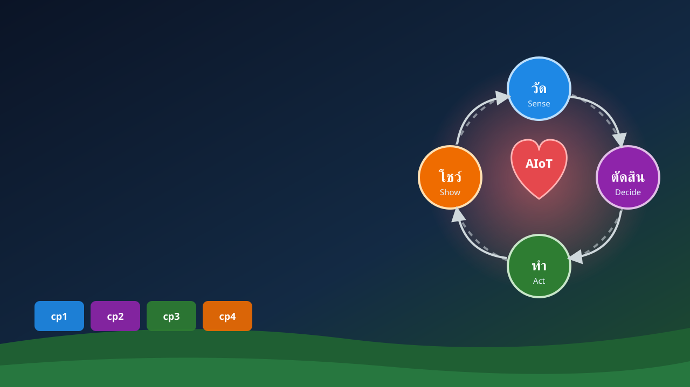

<!-- _class: cover -->
<!-- _paginate: false -->

# Special Session — หัวใจ AIoT

## วัด · ตัดสิน · ทำ · โชว์

> Core Principles Masterclass · **หนึ่งไฟล์ หนึ่งหลักการ**
> "ทุกระบบ AIoT ในฟาร์ม ตั้งแต่เครื่องรดน้ำถึงหมอฟังปั๊ม ใช้หัวใจดวงเดียวกัน"

AIoT Development for Smart Farm · Intensive Course · TESAIoT Dev Kit + BENTO Emulator

**หลัง Session 3 ก่อนวันนำเสนอผลงาน**

---

## 3 ชั่วโมงของเราวันนี้

<div class="timeline">
<div style="flex:10;background:#546e7a"><b>0:00</b>เปิดคาบ<br>หัวใจ<br>ดวงเดียว</div>
<div style="flex:35;background:#1e88e5"><b>0:10</b>ส่วนที่ 1<br>วัด<br>Sense</div>
<div style="flex:45;background:#8e24aa"><b>0:45</b>ส่วนที่ 2<br>ประมวลผล & ตัดสิน<br>Decide</div>
<div style="flex:10;background:#ff9f1c"><b>1:30</b>พัก</div>
<div style="flex:35;background:#2e7d32"><b>1:40</b>ส่วนที่ 3<br>ทำ<br>Act & Report</div>
<div style="flex:35;background:#ef6c00"><b>2:15</b>ส่วนที่ 4<br>โชว์<br>จอบอร์ด</div>
<div style="flex:10;background:#37474f"><b>2:50</b>การ์ด<br>ออกแบบ<br>+ Exit</div></div>

<div class="cols">
<div>

**สิ่งที่จะทำได้เมื่อจบคาบ**

- **วัด** แยกข้อมูลตาม "รูปร่าง" · อ่านถูกจังหวะ · แปลงหน่วย · สอบเทียบ
- **ตัดสิน** กรองตามรูปของสัญญาณรบกวน · ค่าสถิติ · บันไดการตัดสินใจ · AI ที่ตอบว่า "ไม่แน่ใจ" ได้
- **ทำ** ภาษาสถานะเดียว · ส่งเมื่อเปลี่ยน · คำสั่งมีคำยืนยัน · MQTT / MQTTS / Modbus TCP
- **โชว์** เลือก widget ตามชนิดข้อมูล · ปรับหน้าตาขณะรัน · ส่งต่อเหตุการณ์
- **ปิดคาบ** การ์ดออกแบบหนึ่งหน้าให้โปรเจกต์ของกลุ่ม

</div>
<div class="c40">

**ทุกส่วนมีจังหวะเดียวกัน**

| ขั้น | ทำอะไร |
|---|---|
| 👀 **เห็น** | ภาพเดียวอธิบายหลักการ |
| 🎮 **เล่น** | รันไฟล์เล็ก ๆ บนบอร์ด |
| 🤔 **เดา/แก้** | Code Quest |
| 📌 **กฎหนึ่งบรรทัด** | เก็บไว้ใช้กับโปรเจกต์ |

คู่ละ 1 บอร์ด · **คนขับ** สลับทุกส่วน · **ผู้นำทาง** ลองใน Emulator ก่อน

**หลัง Session 3 ก่อนวันนำเสนอผลงาน** · ทุกกฎโยงกับ 5 เสาหลัก

</div>
</div>

---

## หัวใจดวงเดียว: ทุกระบบในฟาร์มวนรอบนี้

<svg viewBox="0 0 1000 320" xmlns="http://www.w3.org/2000/svg" font-family="sans-serif">
  <defs><marker id="oa" viewBox="0 0 10 10" refX="8" refY="5" markerWidth="8" markerHeight="8" orient="auto-start-reverse"><path d="M0 0 L10 5 L0 10 z" fill="#546e7a"/></marker></defs>
  <g font-size="22" font-weight="700" text-anchor="middle">
    <rect x="20" y="40" width="200" height="120" rx="18" fill="#e3f2fd" stroke="#1e88e5" stroke-width="4"/>
    <text x="120" y="88" fill="#1565c0">วัด</text><text x="120" y="118" font-size="17" font-weight="400" fill="#37474f">Sense</text>
    <rect x="270" y="40" width="220" height="120" rx="18" fill="#f3e5f5" stroke="#8e24aa" stroke-width="4"/>
    <text x="380" y="88" fill="#6a1b9a">ประมวลผล & ตัดสิน</text><text x="380" y="118" font-size="17" font-weight="400" fill="#37474f">Process & Decide</text>
    <rect x="540" y="40" width="200" height="120" rx="18" fill="#e8f5e9" stroke="#2e7d32" stroke-width="4"/>
    <text x="640" y="88" fill="#1b5e20">ทำ</text><text x="640" y="118" font-size="17" font-weight="400" fill="#37474f">Act / Report</text>
    <rect x="790" y="40" width="190" height="120" rx="18" fill="#fff3e0" stroke="#ef6c00" stroke-width="4"/>
    <text x="885" y="88" fill="#e65100">โชว์</text><text x="885" y="118" font-size="17" font-weight="400" fill="#37474f">Show (UI)</text>
  </g>
  <g stroke="#546e7a" stroke-width="4" fill="none" marker-end="url(#oa)">
    <path d="M222 100 L266 100"/><path d="M492 100 L536 100"/><path d="M742 100 L786 100"/>
    <path d="M885 162 L885 230 L120 230 L120 166"/>
  </g>
  <text x="500" y="222" text-anchor="middle" font-size="18" fill="#37474f">ผู้ใช้สั่งกลับผ่านจอ หรือผ่าน MQTT (เหตุการณ์)</text>
  <g font-size="15" fill="#546e7a" text-anchor="middle">
    <text x="120" y="190">ปุ่ม ลูกบิด SHT40 IMU ไมค์</text>
    <text x="380" y="190">กรอง · สถิติ · กฎ · AI</text>
    <text x="640" y="190">ไฟ · เสียง · MQTT · PLC</text>
    <text x="885" y="190">จอ LVGL บนบอร์ด</text>
  </g>
  <g font-size="16" fill="#263238">
    <text x="20" y="282">🌱 เครื่องรดน้ำ: ความชื้นดิน → ต่ำกว่าเกณฑ์? → เปิดปั๊ม → จอโชว์ปั๊มเปิด</text>
    <text x="20" y="310">🔊 หมอฟังปั๊ม: เสียง/การสั่น → AI มั่นใจพอไหม? → เตือนเจ้าของ → จอโชว์ความมั่นใจ</text>
  </g>
</svg>

> คาบ 1–3 สอนผ่าน **แอปฟาร์มทั้งตัว** · คาบนี้แยกหัวใจออกเป็น **การ์ดหลักการ** ทีละใบ แล้วประกอบกลับเป็นการ์ดออกแบบของกลุ่ม

---

## หนึ่งไฟล์ หนึ่งหลักการ — ไฟล์ทั้งหมดอยู่ใน [`core/`](https://github.com/Advance-Innovation-Centre-AIC/aiot-development-for-smart-farm/tree/main/core)

<div class="cards">
<div class="card" style="background:#1e88e5;font-size:.56em">

<b>1 · วัด</b>

★ [`cp1_01_button_patterns`](https://github.com/Advance-Innovation-Centre-AIC/aiot-development-for-smart-farm/blob/main/core/cp1_01_button_patterns.py)<br>
★ [`cp1_02_knob_scaling`](https://github.com/Advance-Innovation-Centre-AIC/aiot-development-for-smart-farm/blob/main/core/cp1_02_knob_scaling.py)<br>
★ [`cp1_03_loop_clock`](https://github.com/Advance-Innovation-Centre-AIC/aiot-development-for-smart-farm/blob/main/core/cp1_03_loop_clock.py)<br>
★ [`cp1_04_calibrate`](https://github.com/Advance-Innovation-Centre-AIC/aiot-development-for-smart-farm/blob/main/core/cp1_04_calibrate.py)<br>

</div>
<div class="card" style="background:#8e24aa;font-size:.56em">

<b>2 · ตัดสิน</b>

★ [`cp2_01_filter_race`](https://github.com/Advance-Innovation-Centre-AIC/aiot-development-for-smart-farm/blob/main/core/cp2_01_filter_race.py)<br>
☆ [`cp2_02_rolling_stats`](https://github.com/Advance-Innovation-Centre-AIC/aiot-development-for-smart-farm/blob/main/core/cp2_02_rolling_stats.py)<br>
★ [`cp2_03_decision_ladder`](https://github.com/Advance-Innovation-Centre-AIC/aiot-development-for-smart-farm/blob/main/core/cp2_03_decision_ladder.py)<br>
★ [`cp2_04_sound_spectrum`](https://github.com/Advance-Innovation-Centre-AIC/aiot-development-for-smart-farm/blob/main/core/cp2_04_sound_spectrum.py)<br>
☆ [`cp2_05_dew_point_guard`](https://github.com/Advance-Innovation-Centre-AIC/aiot-development-for-smart-farm/blob/main/core/cp2_05_dew_point_guard.py)<br>
★ [`cp2_06_ai_confidence_gate`](https://github.com/Advance-Innovation-Centre-AIC/aiot-development-for-smart-farm/blob/main/core/cp2_06_ai_confidence_gate.py)<br>

</div>
<div class="card" style="background:#2e7d32;font-size:.56em">

<b>3 · ทำ</b>

★ [`cp3_01_status_language`](https://github.com/Advance-Innovation-Centre-AIC/aiot-development-for-smart-farm/blob/main/core/cp3_01_status_language.py)<br>
☆ [`cp3_02_matrix_toolkit`](https://github.com/Advance-Innovation-Centre-AIC/aiot-development-for-smart-farm/blob/main/core/cp3_02_matrix_toolkit.py)<br>
★ [`cp3_03_report_by_exception`](https://github.com/Advance-Innovation-Centre-AIC/aiot-development-for-smart-farm/blob/main/core/cp3_03_report_by_exception.py)<br>
☆ [`cp3_04_command_confirm`](https://github.com/Advance-Innovation-Centre-AIC/aiot-development-for-smart-farm/blob/main/core/cp3_04_command_confirm.py)<br>
☆ [`cp3_05_two_pipes`](https://github.com/Advance-Innovation-Centre-AIC/aiot-development-for-smart-farm/blob/main/core/cp3_05_two_pipes.py)<br>
★ [`cp3_06_modbus_frame`](https://github.com/Advance-Innovation-Centre-AIC/aiot-development-for-smart-farm/blob/main/core/cp3_06_modbus_frame.py)<br>

</div>
<div class="card" style="background:#ef6c00;font-size:.56em">

<b>4 · โชว์</b>

★ [`cp4_01_one_value_many_faces`](https://github.com/Advance-Innovation-Centre-AIC/aiot-development-for-smart-farm/blob/main/core/cp4_01_one_value_many_faces.py)<br>
★ [`cp4_02_style_at_runtime`](https://github.com/Advance-Innovation-Centre-AIC/aiot-development-for-smart-farm/blob/main/core/cp4_02_style_at_runtime.py)<br>
★ [`cp4_03_event_router`](https://github.com/Advance-Innovation-Centre-AIC/aiot-development-for-smart-farm/blob/main/core/cp4_03_event_router.py)<br>
☆ [`cp4_04_draw_on_screen`](https://github.com/Advance-Innovation-Centre-AIC/aiot-development-for-smart-farm/blob/main/core/cp4_04_draw_on_screen.py)<br>
★ [`cp4_05_hmi_page_pattern`](https://github.com/Advance-Innovation-Centre-AIC/aiot-development-for-smart-farm/blob/main/core/cp4_05_hmi_page_pattern.py)<br>

</div>
</div>

<div class="cap">★ = เล่นในคาบทุกกลุ่ม · ☆ = การบ้านใน BENTO Emulator · ไฟล์ละไม่กี่ร้อยบรรทัด อ่านจบได้ในไม่กี่นาที</div>

---

## อ่านโค้ดให้เป็น: ทุกไฟล์ในคาบนี้มี 6 ส่วนเรียงเหมือนกัน

<svg viewBox="0 0 1000 230" xmlns="http://www.w3.org/2000/svg" font-family="sans-serif">
  <g font-size="16" text-anchor="middle">
    <rect x="6" y="20" width="156" height="140" rx="14" fill="#eceff1" stroke="#546e7a" stroke-width="3"/>
    <text x="84" y="54" font-size="28">⚙️</text><text x="84" y="88" font-weight="700" fill="#37474f">1) ตั้งค่า</text><text x="84" y="114" fill="#546e7a">เกณฑ์ เวลา</text><text x="84" y="136" fill="#546e7a">VOLUME สี</text>
    <rect x="172" y="20" width="156" height="140" rx="14" fill="#e3f2fd" stroke="#1e88e5" stroke-width="3"/>
    <text x="250" y="54" font-size="28">🔌</text><text x="250" y="88" font-weight="700" fill="#1565c0">2) ฮาร์ดแวร์</text><text x="250" y="114" fill="#546e7a">อ่าน ปุ่ม ลูกบิด</text><text x="250" y="136" fill="#546e7a">สั่ง ไฟ เสียง</text>
    <rect x="338" y="20" width="156" height="140" rx="14" fill="#f3e5f5" stroke="#8e24aa" stroke-width="3"/>
    <text x="416" y="54" font-size="28">🧠</text><text x="416" y="88" font-weight="700" fill="#6a1b9a">3) สมอง</text><text x="416" y="114" fill="#546e7a">คิดล้วน ๆ</text><text x="416" y="136" fill="#546e7a">ไม่แตะฮาร์ดแวร์</text>
    <rect x="504" y="20" width="156" height="140" rx="14" fill="#e0f7fa" stroke="#00838f" stroke-width="3"/>
    <text x="582" y="54" font-size="28">📡</text><text x="582" y="88" font-weight="700" fill="#006064">4) เครือข่าย</text><text x="582" y="114" fill="#546e7a">Wi-Fi MQTT</text><text x="582" y="136" fill="#546e7a">(บางไฟล์ไม่ใช้)</text>
    <rect x="670" y="20" width="156" height="140" rx="14" fill="#fff3e0" stroke="#ef6c00" stroke-width="3"/>
    <text x="748" y="54" font-size="28">🖥️</text><text x="748" y="88" font-weight="700" fill="#e65100">5) หน้าจอ</text><text x="748" y="114" fill="#546e7a">สร้างครั้งเดียว</text><text x="748" y="136" fill="#546e7a">show...()</text>
    <rect x="836" y="20" width="158" height="140" rx="14" fill="#e8f5e9" stroke="#2e7d32" stroke-width="3"/>
    <text x="915" y="54" font-size="28">🔁</text><text x="915" y="88" font-weight="700" fill="#1b5e20">6) main()</text><text x="915" y="114" fill="#546e7a">วัด→ตัดสิน</text><text x="915" y="136" fill="#546e7a">→ทำ→โชว์</text>
  </g>
  <g font-size="16" text-anchor="middle" fill="#37474f">
    <text x="84" y="200">แก้ "ตัวเลข"</text><text x="250" y="200">วัด + ทำ</text><text x="416" y="200">ตัดสิน</text><text x="582" y="200">รายงาน/สั่งไกล</text><text x="748" y="200">โชว์</text><text x="915" y="200">ต่อกันเป็นวง</text>
  </g>
</svg>

- ส่วน **3) สมอง** ไม่แตะฮาร์ดแวร์ จึง **ทดสอบได้โดยไม่มีบอร์ด** — ไฟล์ฝึก Code Quest ตรวจคำตอบที่ส่วนนี้
- เขียนคำอธิบายด้วย `#` เท่านั้น ไม่ใช้ docstring (บอร์ดคอมไพล์ไฟล์เองบนชิป docstring กินหน่วยความจำตอน import)
- ทุกไฟล์ในคาบนี้เล็ก: **ไม่เกินราว 3.5 KB** เมื่อคอมไพล์ เล็กกว่าไฟล์ของคาบ 1–3 จึงโหลดขึ้นบอร์ดได้สบาย

---

## Code Quest — โจทย์ 4 ระดับ + บันไดช่วยเหลือ

<div class="cols">
<div>

| ระดับ | ทำอะไร | ประเภท |
|---|---|---|
| **1 เดา** | อ่านโค้ด เขียนคำตอบก่อนรัน | โจทย์หลัก (มีเฉลยในคาบ) |
| **2 แก้** | แก้ตัวเลขในส่วน 1 แล้วดูผล | โจทย์หลัก (มีเฉลยในคาบ) |
| **3 เติม** | เติม `____` ในไฟล์ฝึก ให้ผ่านการตรวจ | ส่วนที่ 2, 3 = โจทย์หลัก · ส่วนที่ 1, 4 = โจทย์เพิ่ม |
| **4 สร้าง** | เพิ่มความสามารถใหม่ 1 อย่าง | โจทย์เพิ่ม (โบนัส เฉลยคาบหน้า) |

ไฟล์ฝึกอยู่ใน [`core/practise/`](https://github.com/Advance-Innovation-Centre-AIC/aiot-development-for-smart-farm/tree/main/core/practise) · เฉลยโจทย์หลักอยู่ใน [`core/practise/solutions/`](https://github.com/Advance-Innovation-Centre-AIC/aiot-development-for-smart-farm/tree/main/core/practise/solutions)

</div>
<div class="c40">

**ติดขัด? บันไดช่วยเหลือ 5 ขั้น**
1. **คำใบ้ 3 ขั้น** ท้ายใบงาน (ขั้นละ −1 แต้ม)
2. **อ่านข้อความ error** ด้วยตารางในใบงาน
3. **สลับคนขับกับผู้นำทาง** · ถามเพื่อน 3 คนก่อนถามผู้สอน
4. **ทางออกฉุกเฉิน:** รันไฟล์ตัวอย่างเต็มเพื่อไปต่อก่อน
5. **เฉลย** โจทย์หลักเปิดได้ในคาบ

ใบงาน: [`core/sf-core-th.worksheet.md`](https://github.com/Advance-Innovation-Centre-AIC/aiot-development-for-smart-farm/blob/main/core/sf-core-th.worksheet.md) (มีภาคผนวก **สรุปคำสั่งหนึ่งหน้าต่อส่วน**)

</div>
</div>

---

<!-- _class: sec -->

<div class="when">0:10 – 0:45 · คนขับ = คนที่ 1</div>

# Part 1 — วัด (Sense)

## ตัวเลขทุกตัวมีที่มา

ของจริง → สัญญาณ → เลขดิบ → หน่วย → สอบเทียบ → เวลา · 👀 เห็น 8 นาที · 🎮 เล่น 20 นาที · 🤔 Code Quest 5 นาที · 📌 กฎ 2 นาที

★ [`cp1_01_button_patterns.py`](https://github.com/Advance-Innovation-Centre-AIC/aiot-development-for-smart-farm/blob/main/core/cp1_01_button_patterns.py) · ★ [`cp1_02_knob_scaling.py`](https://github.com/Advance-Innovation-Centre-AIC/aiot-development-for-smart-farm/blob/main/core/cp1_02_knob_scaling.py) · ★ [`cp1_03_loop_clock.py`](https://github.com/Advance-Innovation-Centre-AIC/aiot-development-for-smart-farm/blob/main/core/cp1_03_loop_clock.py) · ★ [`cp1_04_calibrate.py`](https://github.com/Advance-Innovation-Centre-AIC/aiot-development-for-smart-farm/blob/main/core/cp1_04_calibrate.py)

<div class="chal">🏆 <b>ท้าทาย:</b> ใคร <b>ดับเบิลคลิกได้ 10 ครั้งติด</b> โดยบอร์ดไม่นับพลาดเป็นคลิกเดี่ยวเลย — และใครหมุนลูกบิดให้ได้ <b>ความชื้นดิน 50 %</b> เป๊ะเร็วที่สุด?</div>

---

## ห่วงโซ่การวัด: จากดินในแปลง ถึงตัวเลขบนจอ

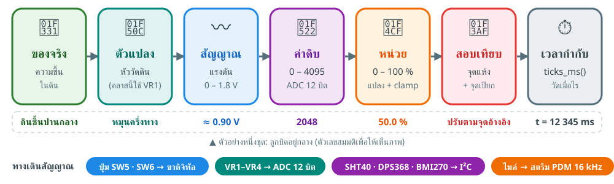

- ตัวเลขบนจอผ่านมา **6 ทอด** และ **ทุกทอดเพี้ยนได้** — รู้ที่มา จึงรู้ว่าเชื่อได้แค่ไหน
- ในคลาสใช้ **ลูกบิด VR1 แทนหัววัดดิน**: ตัวแปลงต่างกัน แต่ห่วงโซ่เหมือนกันทุกทอด
- ค่าที่ไม่มี **หน่วย** และ **เวลา** กำกับ = ตัวเลขลอย ๆ ที่เอาไปตัดสินใจไม่ได้

---

## ข้อมูลบนบอร์ดนี้มี 5 รูปร่าง — รูปร่างบอกวิธีอ่าน

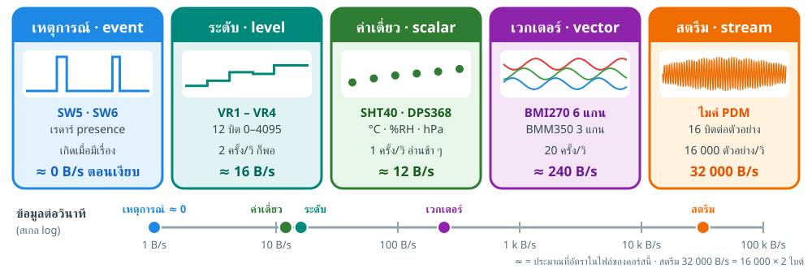

- **เหตุการณ์** ห้ามพลาด · **ระดับ** อ่านช้าได้ · **ค่าเดี่ยว** อ่านนาน ๆ ครั้ง · **เวกเตอร์** อ่านทุกแกนในคำสั่งเดียว · **สตรีม** อ่านเป็นก้อน
- สตรีมเสียงหนักกว่าค่าเดี่ยว **หลักพันเท่า** → ส่งดิบขึ้นเน็ตไม่ไหว ต้องย่อที่บอร์ดก่อน (Part 2)

---

## ปุ่มหนึ่งปุ่ม อ่านได้ 3 แบบ: ระดับ → ขอบ → รูปแบบ

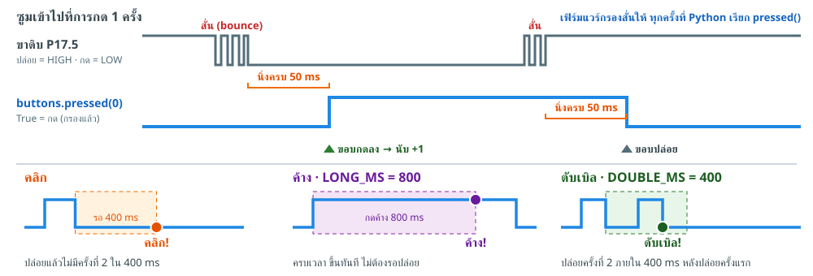

- **ระดับ** = ตอนนี้กดอยู่ไหม · **ขอบ** = เพิ่งเปลี่ยนจากปล่อยเป็นกด · **รูปแบบ** = ต้องดูเวลาประกอบ
- ปุ่มต่อแบบ **active-low + pull-up**: ปล่อย = HIGH · กด = LOW — `buttons.pressed()` กลับด้านให้แล้ว (True = กด)
- เฟิร์มแวร์กรองสั่น 50 ms **ทุกครั้งที่ Python เรียก `pressed()`** ไม่ใช่ตัวจับเวลาเบื้องหลัง → จึงต้องอ่านถี่ทุก 10–20 ms

---

## อ่านวน (polling) หรือ ขัดจังหวะ (interrupt)?

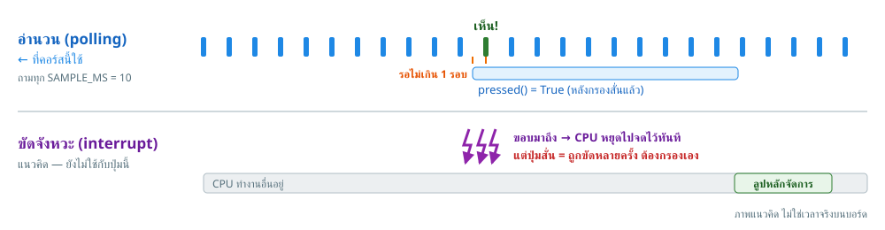

<div class="cols">
<div>

**คอร์สนี้ใช้การอ่านวน (polling) เพราะ**
- โมดูล `buttons` มีแค่ `read()` `pressed()` `name()` `count()` — **ไม่มีคำสั่งแจ้งขอบ**
- การกรองสั่นอยู่ในเฟิร์มแวร์แล้ว และทำงาน **ตอนเราอ่าน** — ยิ่งอ่านสม่ำเสมอ ยิ่งกรองได้ตรง
- อ่านทุก 10 ms ถี่กว่าหน้าต่างกรอง 50 ms หลายเท่า → การกดที่ตัวกรองยอมรับไม่หลุดสายตา

</div>
<div>

<div class="no">

**ยังไม่ได้ลอง:** `machine.Pin.irq` มีอยู่ในเฟิร์มแวร์ แต่ขาของ SW5/SW6 ถูกโมดูล `buttons` ใช้อยู่ — การผูก interrupt กับขาเดียวกัน **ต้องลองบนบอร์ด** ก่อนจึงจะสอนได้

</div>

**interrupt เหมาะกับ** สัญญาณที่สั้นมากจนอ่านวนไม่ทัน เช่น พัลส์จากมาตรวัดน้ำ (แนวคิด) · งานใน interrupt ต้องสั้น: **จดไว้** แล้วให้ลูปหลักทำต่อ

</div>
</div>

---

## เล่น ① ปุ่มเดียว 3 แบบ: ระดับ · ขอบ · รูปแบบ

<div class="cols">
<div class="c40">

<div class="goal">

🎯 **เป้าหมาย:** แยกให้ออกว่า "กดอยู่" "เพิ่งกด" และ "กดแบบไหน" ต่างกันอย่างไร และเห็นว่า **เวลา** คือตัวตัดสินรูปแบบ

</div>

<div class="try">

**ลองทำ** · [`cp1_01_button_patterns.py`](https://github.com/Advance-Innovation-Centre-AIC/aiot-development-for-smart-farm/blob/main/core/cp1_01_button_patterns.py)
1. รันไฟล์ → การ์ด **SW5 (ปุ่มล่าง)** และ **SW6 (ปุ่มบน)**
2. กดค้างไว้ → **ไฟบนจอ** ติดตลอด (ระดับ) แต่ **ตัวเลขใหญ่** ขึ้นแค่ 1 (ขอบ)
3. กดสั้น ๆ → รอราว 0.4 วิ จึงขึ้น **"คลิก!"** · ค้างเกิน 0.8 วิ → **"ค้าง!"** · กด 2 ครั้งเร็ว ๆ → **"ดับเบิล!"**
4. **แข่ง:** ดับเบิลคลิก 10 ครั้ง ให้แถวล่างนับ "ดับเบิล" ครบ 10 โดย "คลิก" ไม่เพิ่ม

</div>

</div>
<div class="shot">

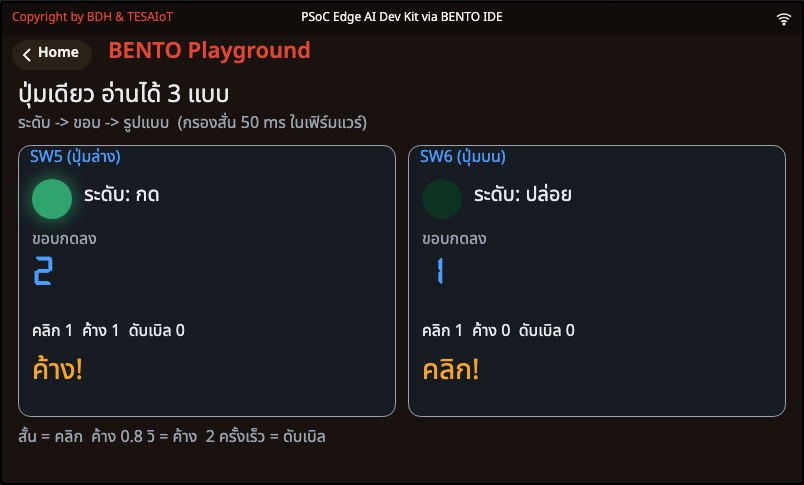

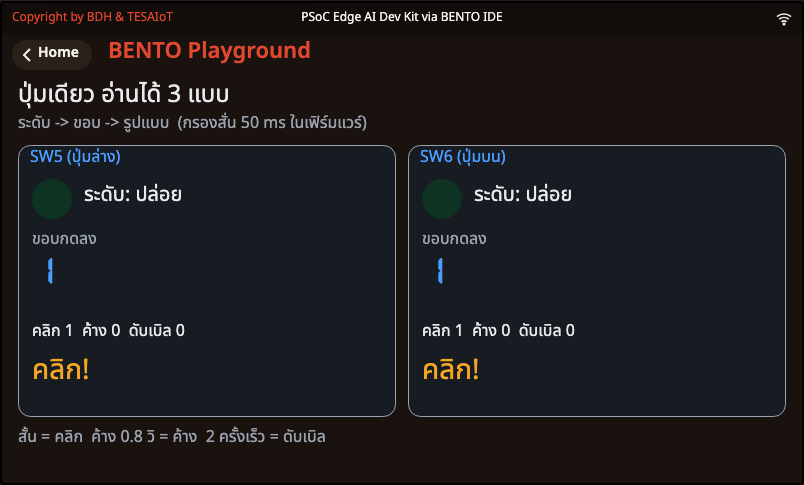

<div class="cap">ภาพจาก BENTO Emulator · การกดปุ่มจำลองจากแผงของ Emulator</div>

</div>
</div>

---

## เล่น ① หัวใจของโค้ด: รูปแบบ = ขอบ + เวลา

```python
    def feed(self, down, now):
        ev = None
        if down and not self.down:                       # ขอบ: เพิ่งกดลง
            self.edges += 1
            self.t_down, self.held = now, False
        elif down and not self.held and time.ticks_diff(now, self.t_down) >= LONG_MS:
            self.held, self.t_up, ev = True, None, "long"
        elif self.down and not down and not self.held:   # ขอบ: เพิ่งปล่อยหลังกดสั้น
            if self.t_up is not None and time.ticks_diff(now, self.t_up) <= DOUBLE_MS:
                self.t_up, ev = None, "double"
            else:
                self.t_up = now                          # รอดูก่อนว่าจะมีครั้งที่สองไหม
        elif not down and self.t_up is not None and time.ticks_diff(now, self.t_up) > DOUBLE_MS:
            self.t_up, ev = None, "click"                # หมดเวลารอ = คลิกเดี่ยว
```

- `feed()` รับแค่ **"กดอยู่ไหม"** กับ **"ตอนนี้กี่ ms"** → อยู่ในส่วน 3) สมอง ไม่แตะฮาร์ดแวร์ ทดสอบได้โดยไม่มีบอร์ด

<div class="think">

**คิด:** ทำไม "คลิก!" ขึ้นช้ากว่าตอนปล่อยปุ่มราว 0.4 วิ? ถ้าตู้ควบคุมของเราไม่ใช้ดับเบิลเลย ควรแก้ตรงไหนให้คลิกตอบทันที?

</div>

---

## ลูกบิด = ADC 12 บิต: เลขดิบเป็นขั้นบันได แปลงเป็นหน่วยไหนก็ได้

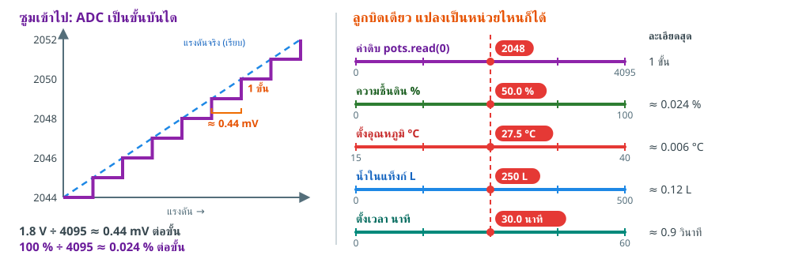

- **แปลงช่วง:** ค่า = ต่ำสุด + (ดิบ ÷ 4095) × (สูงสุด − ต่ำสุด) · แล้ว **clamp** ให้อยู่ในช่วงเสมอ
- **ช่องกันกะพริบ (dead-band):** เปลี่ยนตัวเลขบนจอเฉพาะตอนดิบขยับเกิน `DEADBAND` = 20 count (ราว 0.5 % ของช่วง)
- ทางลัด: `pots.norm(0)` ให้ 0.0–1.0 ได้เลย · บนบอร์ด **ไม่มี** `pots.percent()`

---

## เล่น ② ลูกบิดเดียว สี่หน่วย: เลขดิบ → ค่าที่มีหน่วย

<div class="cols">
<div class="c40">

<div class="goal">

🎯 **เป้าหมาย:** แปลงเลขดิบ 0–4095 เป็น % องศา ลิตร นาที แล้วเห็นว่าช่องกันกะพริบทำให้ตัวเลขนิ่ง

</div>

<div class="try">

**ลองทำ** · [`cp1_02_knob_scaling.py`](https://github.com/Advance-Innovation-Centre-AIC/aiot-development-for-smart-farm/blob/main/core/cp1_02_knob_scaling.py)
1. รันไฟล์ → 4 การ์ด: **VR1** ความชื้นดิน 0–100 % · **VR2** อุณหภูมิเป้า 15–40 · **VR3** น้ำในถัง 0–500 ลิตร · **VR4** ตั้งเวลารดน้ำ 0–60 นาที
2. หมุนช้า ๆ → เทียบ **raw** (ขยับทุกครั้ง) กับ **ตัวเลขใหญ่** (ขยับเป็นช่วง) · **"ข้าม"** = ครั้งที่ช่องกันกะพริบกันไว้
3. อ่านบรรทัด **"1 ขั้น = …"** ของแต่ละการ์ด เทียบกับภาพสไลด์ก่อน
4. กด **SW5** (ปุ่มล่าง) ปิด/เปิดช่องกันกะพริบ แล้วเทียบกัน

</div>

</div>
<div class="shot">

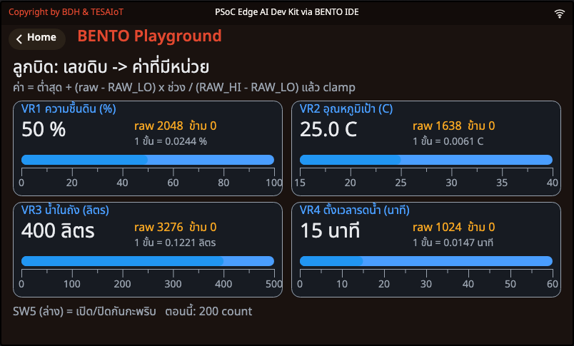


<div class="cap">ภาพจาก BENTO Emulator · ลูกบิดใน Emulator นิ่งสนิท · บนบอร์ดจริง raw อาจแกว่งเองแม้ไม่ได้แตะ (แกว่งแค่ไหน ดูจากบอร์ดของคุณเอง)</div>

</div>
</div>

---

## ลูปเดียว หลายจังหวะ: ถามนาฬิกา อย่านอนรอ

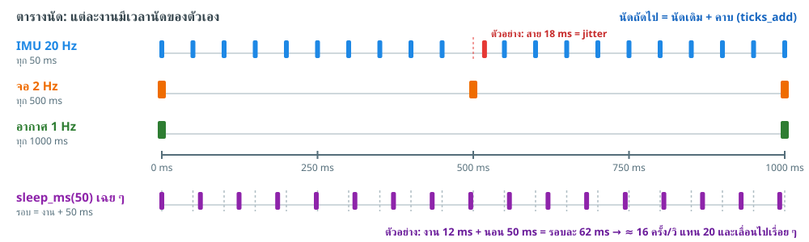

- แต่ละงานมี **นัด** ของตัวเอง: ถึงนัดแล้วจึงทำ แล้วเลื่อนนัด `self.due = time.ticks_add(self.due, self.period)`
- นัดถัดไป = **นัดเดิม** + คาบ ไม่ใช่ "ตอนนี้" + คาบ → คาบเฉลี่ยไม่ค่อย ๆ เลื่อน
- `ticks_diff()` ลบเวลาได้ถูกแม้นาฬิกาวนกลับไปนับใหม่ · **jitter** = เริ่มช้ากว่านัดไม่เท่ากันทุกรอบ เพราะงานอื่นกำลังทำอยู่

---

## อ่านช้าเกิน = เห็นผี (aliasing)

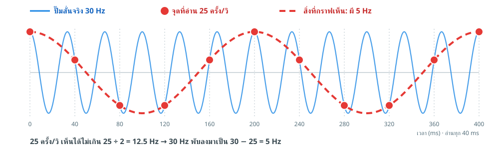

- ปั๊มสั่น 30 Hz แต่เราอ่าน 25 ครั้ง/วิ → กราฟโชว์คลื่นช้า 5 Hz ที่ **ไม่มีอยู่จริง** และดูน่าเชื่อมาก
- กฎ Nyquist: อยากเห็นความถี่ f ต้องอ่าน **เร็วกว่า 2f** · ไมค์อ่าน 16 000 ครั้ง/วิ → เห็นได้ไม่เกิน 8 000 Hz
- ลูป Python อ่าน BMI270 ได้เร็วสุดกี่ครั้ง/วิ **ต้องลองบนบอร์ด** — ยังไม่มีตัวเลขยืนยัน

<div class="think">

**คิด:** cp1_03 อ่าน IMU 20 ครั้ง/วิ — เห็นการสั่นได้ไม่เกินกี่ Hz? พอสำหรับปั๊ม 30 Hz ไหม?

</div>

---

## เล่น ③ ลูปเดียว สามจังหวะ: "นัด" ปะทะ "นอนรอ"

<div class="cols">
<div class="c40">

<div class="goal">

🎯 **เป้าหมาย:** วัดให้เห็นว่าลูปแบบ **นัด** (`ticks_add`) รักษาจังหวะได้ ส่วนลูป **นอนรอ** (`sleep_ms`) ช้าสะสม

</div>

<div class="try">

**ลองทำ** · [`cp1_03_loop_clock.py`](https://github.com/Advance-Innovation-Centre-AIC/aiot-development-for-smart-farm/blob/main/core/cp1_03_loop_clock.py)
1. รันไฟล์ → ตาราง 3 งาน: **IMU 20Hz · อากาศ 1Hz · จอ 2Hz**
2. อ่านคอลัมน์ **เฉลี่ย** เทียบ **เป้า ms** · **ต่ำ-สูง** = jitter · **ช้า** = เริ่มช้ากว่าเป้าเกิน 10 ms
3. กด **SW5** (ปุ่มล่าง) → "โหมดง่าย: sleep_ms(50) ต่อกัน" → ตัวเลขเปลี่ยนอย่างไร
4. จดตัวเลขทั้งสองโหมด **จากบอร์ดจริง** ลงใบงาน

</div>

</div>
<div class="shot">

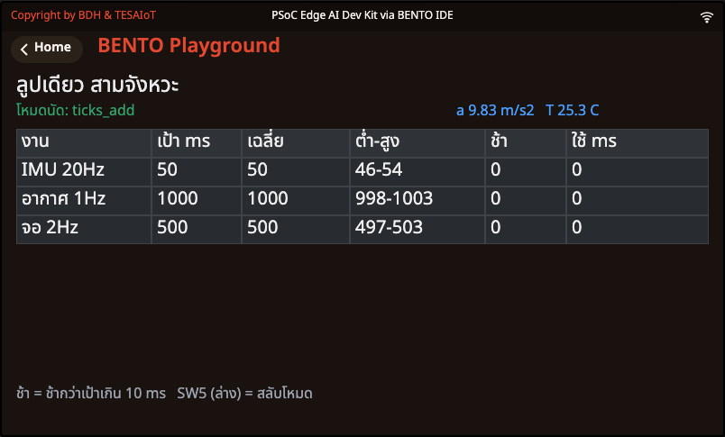

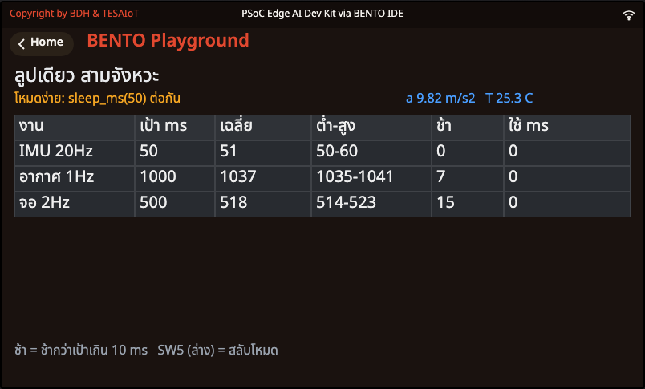

<div class="warn">

ตัวเลขเวลาใน Emulator **ไม่ใช่** เวลาของบอร์ด (เบราว์เซอร์มีจังหวะของตัวเอง) — จะสรุปว่าช้าเร็วเท่าไร ต้องดูจากบอร์ดจริง

</div>

</div>
</div>

---

## สอบเทียบก่อนเชื่อ: ชดเชย · ตั้งศูนย์ · สองจุด

<div class="cols">
<div class="c55">

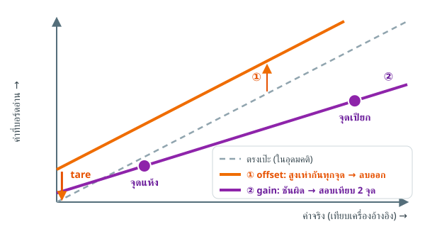

</div>
<div>

**① ชดเชย (offset)** 🌡️ SHT40 อยู่บนบอร์ด จึงวัดความอุ่นของบอร์ดติดมาด้วย → เทียบเทอร์โมมิเตอร์ในห้อง แล้วใส่ `TEMP_OFFSET`

**ตั้งศูนย์ (tare)** 📐 บอร์ดวางนิ่งก็เอียงอยู่แล้ว (เอียงราว 39° บนโต๊ะเรา) → จดท่านี้ไว้เป็น 0° แล้วลบออกทุกครั้ง

**② สองจุด (two-point)** 🌱 หัววัดดินแต่ละตัวให้ค่าดิบไม่เท่ากัน → จับค่าดินแห้ง = 0 % และดินอิ่มน้ำ = 100 % แก้ทั้งชดเชยและความชันในครั้งเดียว

</div>
</div>

<div class="warn">

**เชื่อก่อนต้องตรวจ:** อ่านพลาดลองใหม่ 3 ครั้ง ยังพลาดก็คืน `None` ไม่ให้โปรแกรมล้ม · ผลสองจุดถูกบีบให้อยู่ 0–100 % · จุดแห้งกับจุดเปียกใกล้กันเกิน `MIN_SPAN` = ไม่หาร

</div>

---

## เล่น ④ สอบเทียบก่อนเชื่อ: สามการ์ด สามวิธี

<div class="cols">
<div class="c40">

<div class="goal">

🎯 **เป้าหมาย:** แก้ความเพี้ยน 3 แบบด้วยเลขง่าย ๆ: **บวกค่าคงที่ · หักศูนย์ · สองจุด**

</div>

<div class="try">

**ลองทำ** · [`cp1_04_calibrate.py`](https://github.com/Advance-Innovation-Centre-AIC/aiot-development-for-smart-farm/blob/main/core/cp1_04_calibrate.py)
1. การ์ด 1: เทียบค่าดิบ SHT40 กับเทอร์โมมิเตอร์ในห้อง → ใส่ผลต่างใน `TEMP_OFFSET` แล้วรันใหม่
2. การ์ด 2: วางบอร์ดตามปกติ ดูค่า **ดิบ** ก่อน → กด **SW5** (ปุ่มล่าง) = ท่านี้คือศูนย์ → ลองเอียง
3. การ์ด 3: หมุน VR1 ไปตำแหน่งหนึ่ง กด **SW6** (ปุ่มบน) = จุดแห้ง · หมุนไปอีกตำแหน่ง กด **SW6** = จุดเปียก → หมุนดู %
4. กด SW6 อีกครั้ง = เริ่มใหม่ · ลองให้จุดแห้งมีค่าดิบ **มากกว่า** จุดเปียก สูตรยังใช้ได้ไหม?

</div>

</div>
<div class="shot">

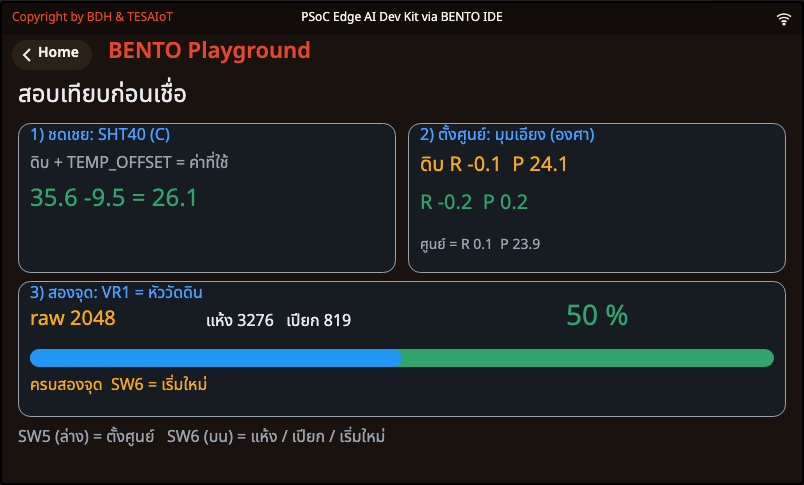

<div class="cap">ภาพจาก BENTO Emulator · อุณหภูมิและมุมเอียงเป็นค่าจำลองจากแผงของ Emulator ไม่ใช่ค่าจากบอร์ดจริง</div>

</div>
</div>

---

## Code Quest — Part 1

| ระดับ | โจทย์ | ประเภท |
|---|---|---|
| **1 เดา** | **cp1_02:** หมุน VR1 ไปกลางช่วง → `pots.read(0)` ≈ **___** → ความชื้นดิน **___ %** · **cp1_01:** กดสองครั้งห่างกัน 0.7 วิ ขณะ `DOUBLE_MS = 400` → แถวล่างนับเป็น **___** กี่ครั้ง? | โจทย์หลัก (มีเฉลยในคาบ) |
| **2 แก้** | **cp1_01:** ตั้ง `LONG_MS = 2000` แล้วกดค้าง 1 วิ ได้อะไร เพราะอะไร · **cp1_03:** ตั้ง `CLIMATE_MS = 250` แล้วดูคอลัมน์ "ช้า" ของ IMU | โจทย์หลัก (มีเฉลยในคาบ) |
| **3 เติม** | [`cp1_02_practise.py`](https://github.com/Advance-Innovation-Centre-AIC/aiot-development-for-smart-farm/blob/main/core/practise/cp1_02_practise.py) เติม 4 ช่องใน `map_range()` และ `clamp()` ให้ผ่านการตรวจอัตโนมัติ 6 กรณี | โจทย์เพิ่ม (โบนัส เฉลยคาบหน้า) |
| **4 สร้าง** | **cp1_01:** กด SW6 ค้าง 3 วิ = ล้างตัวนับทั้งหมด พร้อมแถบบอกความคืบหน้าบนจอ | โจทย์เพิ่ม (โบนัส เฉลยคาบหน้า) |

<div class="goal">

ระดับ 1–2 ทำระหว่างช่วง "เล่น" แล้วเฉลยในคาบ · ระดับ 3–4 เป็นการบ้าน รันใน BENTO Emulator ได้

</div>

---

## 📌 กฎของ Part 1

<div class="rule">

อ่านให้ถูกจังหวะ แปลงให้มีหน่วย และสอบเทียบก่อนเชื่อ

</div>

- **ถูกจังหวะ:** อ่านช้าไปพลาดการกดและเห็นผี · อ่านถี่ไปเปลืองเวลาและจอกะพริบ · ให้แต่ละงานมีนัดของตัวเอง
- **มีหน่วย:** 2048 ยังไม่มีความหมาย จนกว่าจะบอกว่าเป็น 50 % หรือ 250 ลิตร — และติดเวลาไว้ด้วยว่าวัดเมื่อไร
- **สอบเทียบก่อนเชื่อ:** เซนเซอร์บอกความจริงของตัวมันเอง (บอร์ดอุ่น บอร์ดเอียง) เราต้องแปลเป็นความจริงของฟาร์ม

<div class="think">

**การ์ดออกแบบของกลุ่ม ช่อง "วัด":** อินพุตอะไร · ข้อมูลรูปร่างแบบไหน · อ่านกี่ครั้ง/วิ · สอบเทียบอย่างไร?

</div>

---

## ดูเพิ่ม: ปุ่มสั่น และขั้นบันไดของ ADC

<div class="vid">
<iframe width="400" height="225" src="https://www.youtube.com/embed/IvU8m_30iK0" title="What is Switch Bounce and How to Debounce – ATM | Digi-Key Electronics — DigiKey" loading="lazy" frameborder="0" allowfullscreen></iframe>
<div>

<b>What is Switch Bounce and How to Debounce – ATM | Digi-Key Electronics</b><br>
ช่อง DigiKey<br>
<https://www.youtube.com/watch?v=IvU8m_30iK0>

**ดูแล้วตอบ:** สัญญาณสั่นในคลิปตรงกับช่วง "สั่น" ในภาพไทม์ไลน์ของเราตรงไหน และทำไมต้องรอให้นิ่งก่อนจึงยอมรับ?

</div>
</div>

<div class="vid">
<iframe width="400" height="225" src="https://www.youtube.com/embed/plq_Nmud5CM" title="ADC Quantization and Resolution — Microchip Developer Help" loading="lazy" frameborder="0" allowfullscreen></iframe>
<div>

<b>ADC Quantization and Resolution</b><br>
ช่อง Microchip Developer Help<br>
<https://www.youtube.com/watch?v=plq_Nmud5CM>

**ดูแล้วตอบ:** ถ้า ADC เป็น 10 บิต แทน 12 บิต 1 ขั้นของความชื้นดินจะหยาบขึ้นเป็นกี่ %?

</div>
</div>

---

<!-- _class: sec -->

<div class="when">0:45 – 1:30 · คนขับ = คนที่ 2</div>

# Part 2 — ประมวลผล & ตัดสิน

## เลือกขั้นบันไดที่ต่ำที่สุดที่ได้ผล

ค่าดิบ → กรองให้สะอาด → หาฟีเจอร์ → ตัดสิน · 👀 เห็น 8 นาที · 🎮 เล่น 23 นาที · 🤔 Code Quest 12 นาที · 📌 กฎ 2 นาที

★ <a href="https://github.com/Advance-Innovation-Centre-AIC/aiot-development-for-smart-farm/blob/main/core/cp2_01_filter_race.py" style="color:#fff">cp2_01_filter_race.py</a> · ★ <a href="https://github.com/Advance-Innovation-Centre-AIC/aiot-development-for-smart-farm/blob/main/core/cp2_03_decision_ladder.py" style="color:#fff">cp2_03_decision_ladder.py</a> · ★ <a href="https://github.com/Advance-Innovation-Centre-AIC/aiot-development-for-smart-farm/blob/main/core/cp2_04_sound_spectrum.py" style="color:#fff">cp2_04_sound_spectrum.py</a> · ★ <a href="https://github.com/Advance-Innovation-Centre-AIC/aiot-development-for-smart-farm/blob/main/core/cp2_06_ai_confidence_gate.py" style="color:#fff">cp2_06_ai_confidence_gate.py</a><br>
☆ <a href="https://github.com/Advance-Innovation-Centre-AIC/aiot-development-for-smart-farm/blob/main/core/cp2_02_rolling_stats.py" style="color:#fff">cp2_02_rolling_stats.py</a> · ☆ <a href="https://github.com/Advance-Innovation-Centre-AIC/aiot-development-for-smart-farm/blob/main/core/cp2_05_dew_point_guard.py" style="color:#fff">cp2_05_dew_point_guard.py</a> (ถ้ามีเวลา หรือการบ้านใน Emulator)

<div class="chal">🏆 <b>ท้าทาย:</b> ใครทำให้ไฟเตือน <b>กระพือน้อยที่สุด</b> แต่ยัง <b>เตือนทันทุกครั้งที่ร้อนจริง</b>?</div>

---

## ค่าดิบยังตัดสินไม่ได้: ข้อมูลต้องเดินขึ้นบันได 5 ขั้น

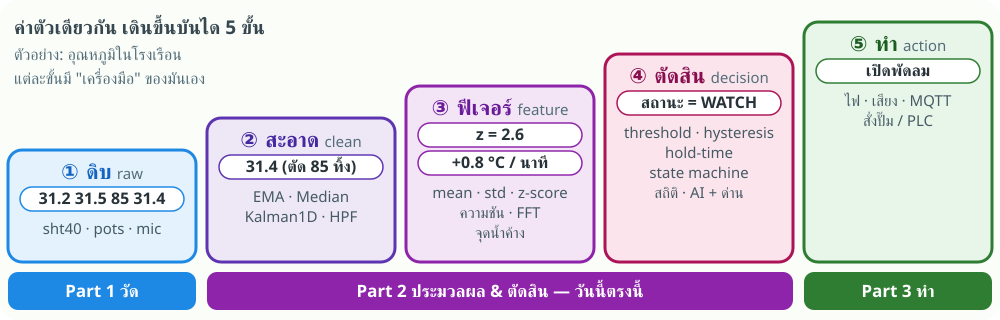

- Part นี้อยู่ขั้น **② สะอาด → ③ ฟีเจอร์ → ④ ตัดสิน** · ทุกเทคนิควันนี้มีที่ของมันบนบันไดนี้
- ตัดสินจากค่าดิบ = ตัดสินจาก **สัญญาณรบกวน** · หนามตัวเดียว (85) ก็สั่งพัดลมผิดจังหวะได้

---

## สัญญาณรบกวนมี 3 รูป — กรองให้ตรงรูป

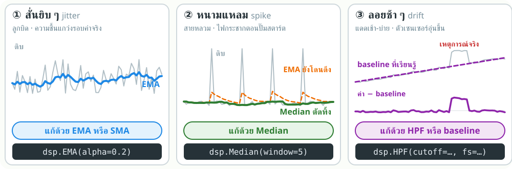

| ทุกตัวกรองใช้คำสั่งชุดเดียวกัน | ตั้งค่าต้องใส่ชื่อเสมอ |
|---|---|
| `f.update(x)` ป้อนค่าใหม่ ได้ค่าที่กรองแล้ว · `f.value()` · `f.reset()` | `dsp.EMA(alpha=0.2)` ✓ · `dsp.EMA(0.2)` ✗ ขึ้น error |
| ผลเป็นทศนิยม ก่อนส่งเข้ากราฟใช้ `int(round(x))` | `Median(window=…)` 3–15 ปัดเป็นเลขคี่ · `SMA(window=…)` 2–64 · `Kalman1D(q=…, r=…)` |

---

## EMA: หมุน α แลก "ความเรียบ" กับ "ความไว"

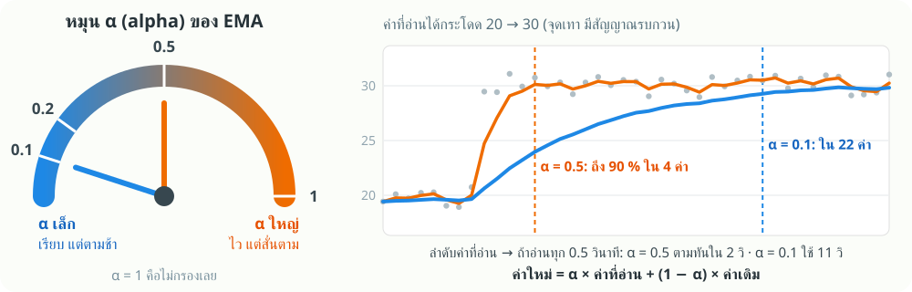

- **ไม่มี α ที่ดีที่สุด** มีแต่ α ที่พอดีกับงาน: ค่าเปลี่ยนช้า → α เล็ก · ต้องตอบไว → α ใหญ่
- ใน cp2_01 ลูกบิด **VR2** หมุน α ได้สด ๆ ตั้งแต่ 0.05 ถึง 0.90

<div class="think">

**คิด:** ความชื้นดิน (เปลี่ยนเป็นชั่วโมง) กับเสียงสั่นของปั๊ม (เปลี่ยนในวินาที) ควรใช้ α แบบไหน?

</div>

---

## เล่น ① แข่งกรอง: ดิบ · EMA · Median · Kalman บนกราฟเดียว

<div class="cols">
<div class="c40">

<div class="goal">

🎯 **เป้าหมาย:** นับให้เห็นว่าตัวกรองแต่ละตัว **ปล่อยหนามผ่าน** กี่ครั้ง แล้วเลือกตัวที่ตรงรูปของสัญญาณรบกวน

</div>

<div class="try">

**ลองทำ** · [`cp2_01_filter_race.py`](https://github.com/Advance-Innovation-Centre-AIC/aiot-development-for-smart-farm/blob/main/core/cp2_01_filter_race.py)
1. รันไฟล์ → 4 เส้นบนกราฟเดียว: เทา = ดิบ · เหลือง = EMA · เขียว = Median · ฟ้า = Kalman
2. หมุน **VR1** = ค่าจริง → เส้นไหนตามทันก่อน?
3. หมุน **VR2** = α ของ EMA → α มาก ตามไว แต่หนามทะลุ (มีเสียงเตือน)
4. ดูแถว **"ผ่าน"** ทางขวา: หนามมาทุก 12 ค่า แต่ละเส้นปล่อยผ่านกี่ครั้ง?

</div>

</div>
<div class="shot">

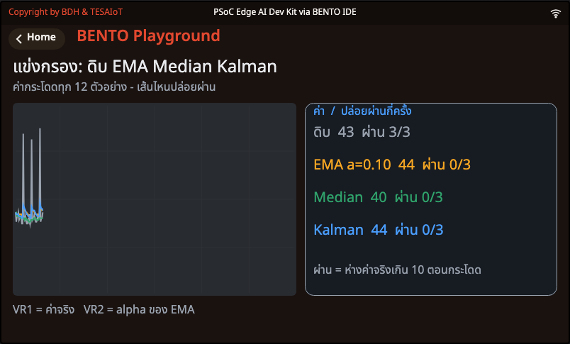

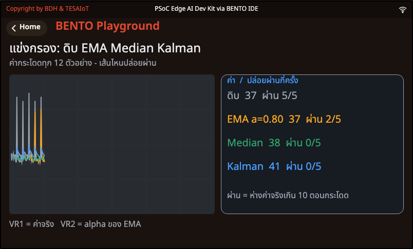

<div class="cap">ภาพจาก BENTO Emulator · สั่นเล็ก ๆ และหนามเป็นค่าจำลองในโปรแกรม (random) ทั้งบน Emulator และบนบอร์ด</div>

</div>
</div>

---

## สถิติคือฟีเจอร์: z บอกว่า "แปลกแค่ไหน"

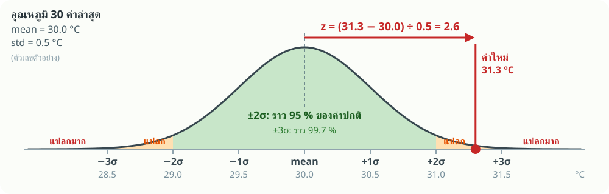

<div class="cols">
<div>

- **z = <sup>x − mean</sup>&frasl;<sub>std</sub>** = ค่าใหม่ห่างจากค่าเฉลี่ยกี่เท่าของ std
- `dsp` ไม่มี mean / std / z ให้ — เราเขียนเองราว **10 บรรทัด**

</div>
<div>

- เกณฑ์ตายตัว (เช่น 32 °C) ไม่รู้ว่า "ปกติ" ของเช้ากับบ่ายต่างกัน · z เทียบกับ **ช่วงล่าสุดของตัวเอง**
- ค่านิ่งสนิท std เกือบ 0 → z พุ่งเกินจริง จึงต้องมี std ขั้นต่ำ

</div>
</div>

---

## ☆ ถ้ามีเวลา: หน้าต่างเลื่อน 30 ค่า → mean, std, z

<div class="cols">
<div class="c55">

**สูตร Welford: เดินผ่านหน้าต่างรอบเดียว ได้ทั้ง mean และ std**

```python
def mean_sd(win):
    # Welford: เดินผ่านหน้าต่างรอบเดียว ได้ค่าเฉลี่ยและ SD (แบบตัวอย่าง หารด้วย n - 1)
    # ไม่ต้องบวกกำลังสองก้อนใหญ่แล้วลบกัน ซึ่งทำให้ทศนิยมหายบน float 32 บิตของบอร์ด
    n, mean, m2 = 0, 0.0, 0.0
    for x in win:
        n += 1
        d = x - mean
        mean += d / n
        m2 += d * (x - mean)
    return mean, (math.sqrt(m2 / (n - 1)) if n > 1 else 0.0)

def zscore(x, mean, sd, sd_min):
    # z = ห่างจากค่าเฉลี่ยกี่ SD (บวก = สูงกว่าปกติ ลบ = ต่ำกว่าปกติ)
    return (x - mean) / max(sd, sd_min)
```
<div class="src"><a href="https://github.com/Advance-Innovation-Centre-AIC/aiot-development-for-smart-farm/blob/main/core/cp2_02_rolling_stats.py">core/cp2_02_rolling_stats.py</a> · mean_sd() และ zscore() (ตัดตอน)</div>

<div class="think">

**คิด:** ทำไมไฟล์นี้เทียบค่าล่าสุดกับ 30 ค่า **ก่อนหน้า** โดยไม่รวมตัวมันเอง?

</div>

</div>
<div class="shot">

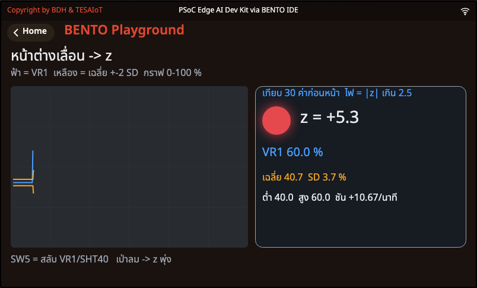

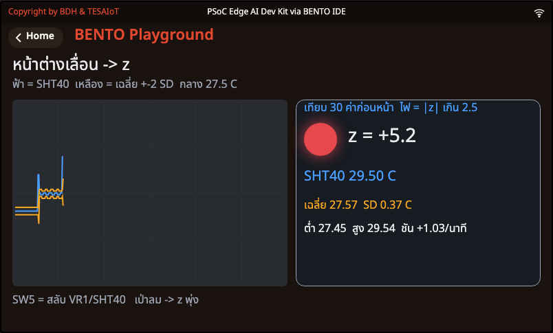

<div class="try">

1. รอเก็บครบ 30 ค่า (15 วินาที)
2. หมุน **VR1** เร็ว ๆ → z พุ่ง ไฟแดงติด (\|z\| เกิน 2.5)
3. หมุนค้างไว้ที่ใหม่ → หน้าต่าง "ลืม" ของเก่า z กลับเข้าใกล้ 0
4. กด **SW5** สลับเป็น SHT40 แล้วเป่าลมหายใจใส่เซนเซอร์

</div>

</div>
</div>

---

## บันไดการตัดสินใจ 6 ขั้น — ใช้ขั้นที่ต่ำที่สุดที่ได้ผล

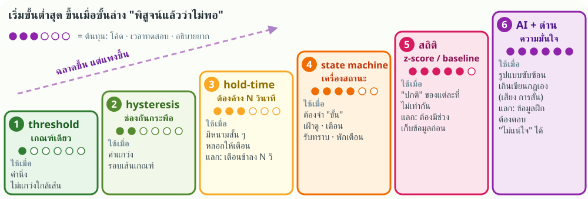

> **"สัญญาณเตือนที่คนเรียนรู้ที่จะเมิน แย่กว่าไม่มีสัญญาณเตือน"** — เตือนผิดบ่อย คนจะเลิกฟัง แล้ววันที่ร้อนจริงก็ไม่มีใครมา

---

## ขั้น 4: เครื่องสถานะของสัญญาณเตือนโรงเรือน

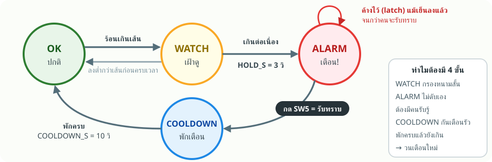

- **ค้างไว้ (latch):** ALARM ไม่ดับเองแม้ค่ากลับปกติ ต้องมีคนกด **SW5 รับทราบ** · **COOLDOWN:** พักเตือน 10 วินาที ไม่ให้เตือนรัว
- ในโค้ด: ฟังก์ชันเดียว `next_state(state, over, ack, t_s)` รับสถานะเดิม + สิ่งที่เห็น แล้วคืนสถานะถัดไป ทดสอบได้โดยไม่มีบอร์ด

---

## เล่น ② บันไดตัดสิน: ค่าเดียว 4 วิธี นับว่าใครกระพือ

<div class="cols">
<div class="c40">

<div class="goal">

🎯 **เป้าหมาย:** เห็นเป็น **ตัวเลข** ว่าแต่ละขั้นของบันได "สลับติด/ดับ" กี่ครั้ง บนค่าเดียวกัน

</div>

<div class="try">

**ลองทำ** · [`cp2_03_decision_ladder.py`](https://github.com/Advance-Innovation-Centre-AIC/aiot-development-for-smart-farm/blob/main/core/cp2_03_decision_ladder.py)
1. รันไฟล์ → 4 การ์ด: **1 เกณฑ์ · 2 กันกระพือ · 3 รอให้นาน · 4 สถานะ** แต่ละการ์ดมีไฟ + ตัวนับ "สลับ (ครั้ง)"
2. หมุน **VR1** ค้างไว้แถวเส้น 50 → ขั้น 1 วิ่งเร็ว ขั้น 2–4 แทบไม่ขยับ
3. หมุนขึ้นไป 70 ค้าง 3 วิ แล้วหมุนกลับลง → ขั้น 4 ยังค้าง **ALARM**
4. กด **SW5** = รับทราบ → COOLDOWN 10 วิ → OK

</div>

</div>
<div class="shot">

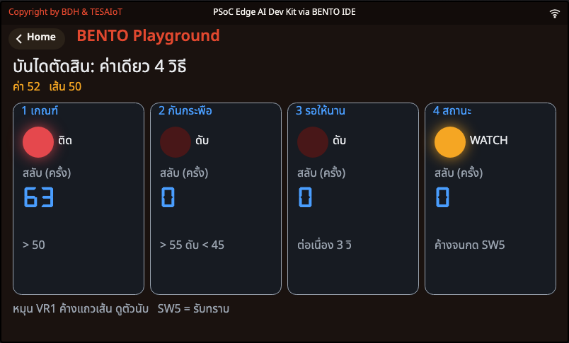

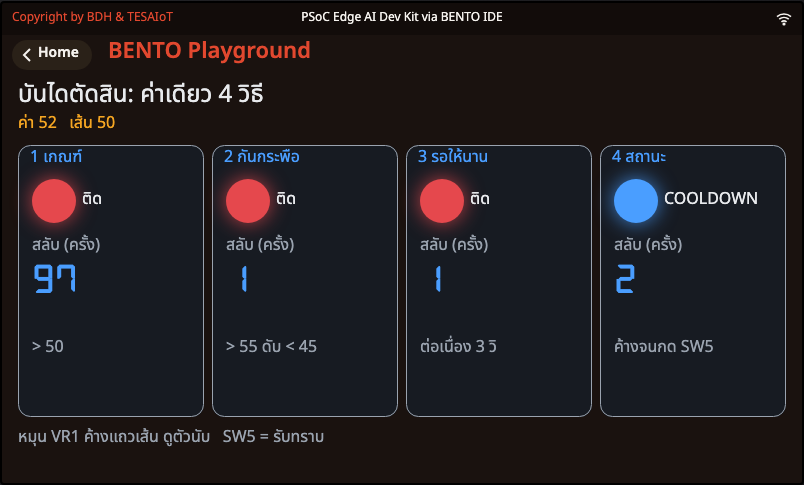

<div class="cap">ภาพจาก BENTO Emulator · ลูกบิดใน Emulator นิ่งสนิท สั่นบวกลบ 2 % มาจาก NOISE ที่โปรแกรมจำลองใส่ (บนบอร์ดก็ใส่เหมือนกัน)</div>

</div>
</div>

---

## เสียงเดียวกัน ดูตามเวลา หรือดูตามความถี่

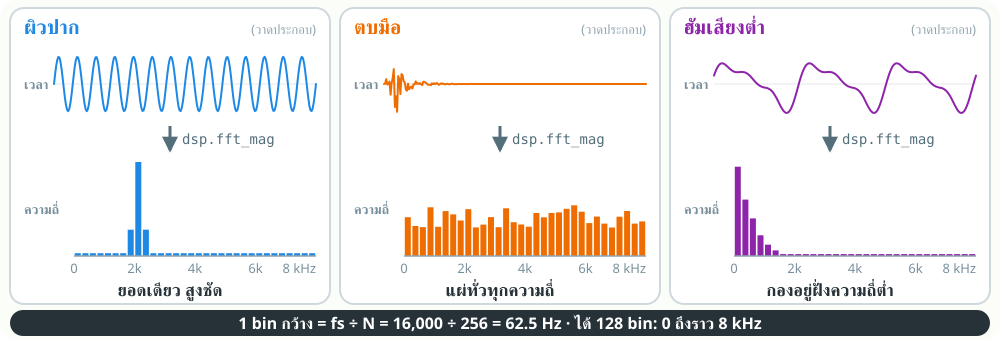

- ไมค์ให้ 16,000 ตัวอย่างต่อวินาที · หยิบทีละ 256 ตัว (16 ms) → `dsp.fft_mag(mic.raw(), 256)` → **128 ช่อง** คำนวณในภาษา C
- N ต้องเป็นกำลังของ 2 ระหว่าง 8–512 · N เล็กลง = ช่องกว้างขึ้น แยกความถี่ที่ใกล้กันไม่ออก

---

## เล่น ③ ฟังเสียงเป็นความถี่: สเปกตรัมบนจอไฟ RGB 16 แท่ง

<div class="cols">
<div class="c40">

<div class="goal">

🎯 **เป้าหมาย:** หาว่ายอดของเสียงอยู่ **ช่องไหน** แล้วแปลงเป็น Hz ด้วย ช่อง × 62.5

</div>

<div class="try">

**ลองทำ** · [`cp2_04_sound_spectrum.py`](https://github.com/Advance-Innovation-Centre-AIC/aiot-development-for-smart-farm/blob/main/core/cp2_04_sound_spectrum.py)
1. **ผิวปาก** → ยอดเดียวสูง · **ฮัมเสียงต่ำ** → ยอดทางซ้าย · **ตบมือ** → กระจายหลายช่อง
2. กด **SW5** = บอร์ดเล่นโน้ต A 440 Hz ให้ไมค์ฟังเอง · **SW6** = 880 Hz (เสียงเบา ถ้ายอดไม่ขึ้นชัดให้ผิวปากแทน)
3. จอไฟ RGB: 16 แท่ง แท่งละ 500 Hz · สูงขึ้นหนึ่งแถว = ดังขึ้น 6 dB

</div>

</div>
<div class="shot">

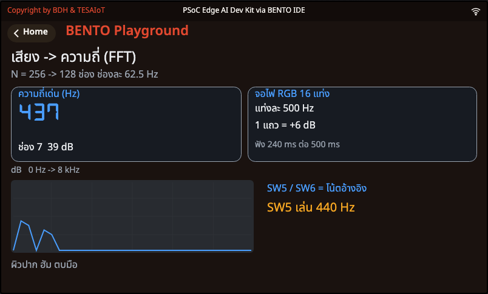

<div class="cap">ภาพจาก BENTO Emulator · ไมค์ของ Emulator เป็นเสียงสังเคราะห์ 440 Hz (ยอดอยู่ช่อง 7 ≈ 437 Hz) ตบมือใส่คอมพิวเตอร์ไม่มีผล · เสียงจริงต้องลองบนบอร์ด</div>

</div>
</div>

---

## ขั้น 6: AI ต้องมีสิทธิ์ตอบว่า "ไม่แน่ใจ"

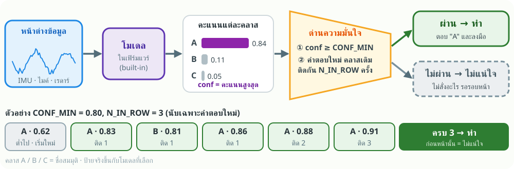

- โมเดลให้ **คะแนนทุกคลาส** (0–1) · คลาสที่สูงสุด = คำตอบ · คะแนนของมัน = ความมั่นใจ (`conf`)
- `edge_ai.result()` คืนคำตอบล่าสุด **ซ้ำทุกครั้งที่ถาม** → นับเฉพาะคำตอบใหม่ (เลข `seq` เปลี่ยน)
- เลือกโมเดลด้วย **ชื่อ**: หาแถวใน `edge_ai.models()` แล้วใช้ `m["index"]` เพราะ `start()` / `select()` รับเลข ไม่รับชื่อ

---

## เล่น ④ ประตูความมั่นใจ: หมุนเกณฑ์ แล้วดูว่าแลกอะไร

<div class="cols">
<div class="c40">

<div class="goal">

🎯 **เป้าหมาย:** รู้สึกด้วยมือว่าเกณฑ์สูง = **ไม่แน่ใจบ่อย แต่ลงมือผิดน้อย** · เกณฑ์ต่ำ = ตอบไว แต่เชื่อคำตอบกำกวมด้วย

</div>

<div class="try">

**ลองทำ** · [`cp2_06_ai_confidence_gate.py`](https://github.com/Advance-Innovation-Centre-AIC/aiot-development-for-smart-farm/blob/main/core/cp2_06_ai_confidence_gate.py)
1. รันไฟล์ → บรรทัดบนบอกชื่อโมเดลที่หาเจอจาก `MODEL_KEY` (หาไม่เจอ = ขึ้น "ไม่พบโมเดล" แล้วจบอย่างสงบ)
2. ทำตามคำแนะนำในไฟล์: วางบอร์ดนิ่ง → ถือบอร์ดวาดวงกลม → เขย่า · เทียบ **"AI ตอบดิบ"** กับ **"ประตูตัดสิน"**
3. หมุน **VR1** = เกณฑ์ 0.50–0.99 แล้วดูตัวนับ **ลงมือ** กับ **ไม่แน่ใจ**

</div>

</div>
<div class="shot">

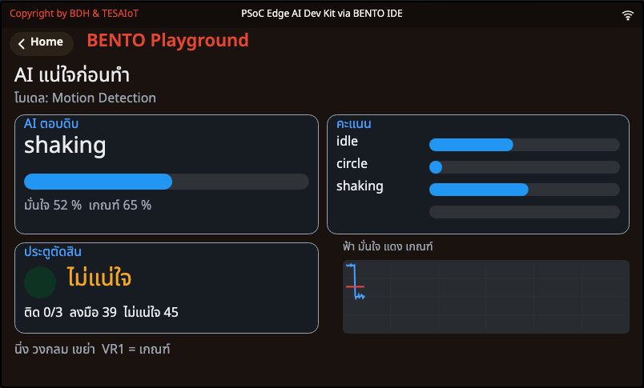

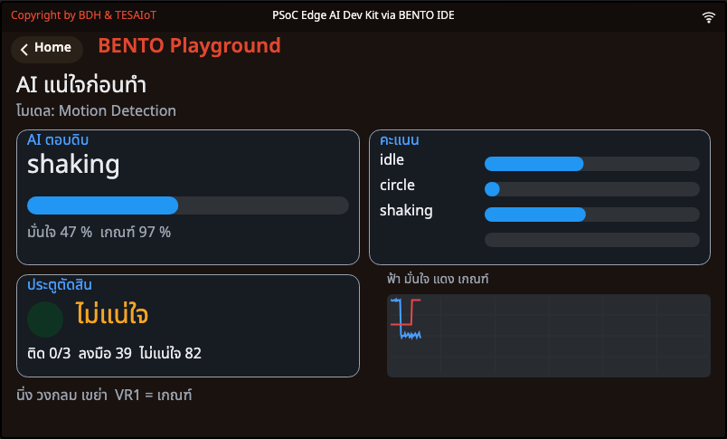

<div class="cap">ภาพจาก BENTO Emulator · คำตอบของ AI ใน Emulator เป็นผลจำลอง (ปุ่ม Shake = เขย่า) ไม่ได้รันโมเดลจริง · ชื่อโมเดลและคลาสบนบอร์ดจริง ต้องลองบนบอร์ด</div>

</div>
</div>

---

## Code Quest — Part 2

| ระดับ | โจทย์ | ประเภท |
|---|---|---|
| **1 เดา** | **cp2_01:** EMA α = 0.2 ค่านิ่งที่ 40 แล้วมีหนามไป 85 หนึ่งตัว → เส้น EMA ขึ้นไปที่ **___** · Median window 5 หนามตัวเดียวกัน → **___** | โจทย์หลัก (มีเฉลยในคาบ) |
| **2 แก้** | **cp2_03:** ตั้ง `HOLD_S = 0` แล้วเทียบตัวนับขั้น 3 กับขั้น 1 · **cp2_06:** ตั้ง `CONF_MIN = 0.95` แล้วจดสัดส่วน ลงมือ : ไม่แน่ใจ | โจทย์หลัก (มีเฉลยในคาบ) |
| **3 เติม** | [`cp2_03_practise.py`](https://github.com/Advance-Innovation-Centre-AIC/aiot-development-for-smart-farm/blob/main/core/practise/cp2_03_practise.py) เติมช่อง A B C ใน `next_state()` ให้ผ่านการตรวจ 8 กรณี | **โจทย์หลัก (มีเฉลยในคาบ)** · 10 นาที |
| **4 สร้าง** | เพิ่มวิธีตัดสินที่ 5 "\|z\| > 3" ลงใน cp2_03 · หรือเพิ่มไฟ "ไม่แน่ใจ" ใน cp2_06 | โจทย์เพิ่ม (โบนัส เฉลยคาบหน้า) |
| ☆ การบ้าน | [`cp2_02_rolling_stats.py`](https://github.com/Advance-Innovation-Centre-AIC/aiot-development-for-smart-farm/blob/main/core/cp2_02_rolling_stats.py) ทำข้อ "ตาคุณ" ท้ายไฟล์ · [`cp2_05_dew_point_guard.py`](https://github.com/Advance-Innovation-Centre-AIC/aiot-development-for-smart-farm/blob/main/core/cp2_05_dew_point_guard.py) จุดน้ำค้าง ดัชนีความร้อน ความเสี่ยงไอน้ำเกาะ (รันใน Emulator ได้) | โจทย์เพิ่ม |

<div class="goal">

ระดับ 1–2 ทำระหว่างช่วง "เล่น" · ระดับ 3 ทุกคู่ทำพร้อมกัน **10 นาที** แล้วเฉลยในคาบ

</div>

---

## Code Quest ระดับ 3 — เติมเครื่องสถานะให้ครบ (โจทย์หลัก 10 นาที)

<div class="cols">
<div class="c60">

```python
def next_state(state, over, ack, t_s):
    # ขั้น 4: state = สถานะตอนนี้, over = เกินเส้นไหม, ack = เพิ่งกดรับทราบไหม
    # t_s = อยู่ในสถานะนี้มากี่วินาทีแล้ว คืนสถานะถัดไป
    if state == "OK":
        return "WATCH" if over else "OK"
    if state == "WATCH":
        if not over:
            return "OK"
        return "ALARM" if t_s >= ____ else "WATCH"     # ช่อง A: เกินต่อเนื่องนานเท่าไรจึงเตือน?
    if state == "ALARM":
        return "COOLDOWN" if ____ else "ALARM"         # ช่อง B: อะไรเท่านั้นที่ปลด ALARM ได้?
    return "OK" if t_s >= ____ else "COOLDOWN"         # ช่อง C: พักนานเท่าไรจึงกลับ OK?
```
<div class="src"><a href="https://github.com/Advance-Innovation-Centre-AIC/aiot-development-for-smart-farm/blob/main/core/practise/cp2_03_practise.py">core/practise/cp2_03_practise.py</a> · next_state() (ตัดตอน)</div>

</div>
<div>

<div class="try">

1. เปิดภาพเครื่องสถานะ 4 วง เป็น **แผนที่**
2. เติมช่อง **A B C** (ใช้ชื่อค่าตั้งในส่วน 1 ได้)
3. รัน → ไฟล์ตรวจ **8 กรณี** ก่อนเปิดจอ · ผ่านครบ = Console ขึ้น **"ผ่าน!"** แล้วเล่นต่อได้เหมือนไฟล์ตัวอย่าง

</div>

| เจอข้อความ | แปลว่า |
|---|---|
| `NameError: name '____' …` | ยังมีช่องที่ไม่ได้เติม |
| `ยังไม่ถูก: next_state …` | บอกกรณีที่ผิด + ค่าที่ควรได้ |

เฉลย (เปิดหลังลองเอง): [`cp2_03_practise_solution.py`](https://github.com/Advance-Innovation-Centre-AIC/aiot-development-for-smart-farm/blob/main/core/practise/solutions/cp2_03_practise_solution.py)

</div>
</div>

---

## 📌 กฎของ Part 2

<div class="rule">

กรองตามรูปของสัญญาณรบกวน ตัดสินด้วยขั้นบันไดที่ต่ำที่สุดที่ได้ผล และให้ AI มีสิทธิ์ตอบว่าไม่แน่ใจ

</div>

- **กรองตามรูป:** สั่นยิบ → EMA · หนาม → Median · ลอย → baseline · เลือกผิดรูปทั้งช้าและยังพลาด
- **ขั้นต่ำสุดที่ได้ผล:** ขั้นสูงแพงกว่า ทดสอบยากกว่า อธิบายให้เกษตรกรฟังยากกว่า และเตือนผิดบ่อย = คนเลิกฟัง
- **"ไม่แน่ใจ" เป็นคำตอบที่ถูกต้อง:** AI ที่ถูกบังคับให้ตอบทุกครั้ง จะตอบผิดอย่างมั่นใจ

<div class="think">

**การ์ดออกแบบของกลุ่ม ช่อง "ตัดสิน":** โปรเจกต์ของเราใช้ขั้นไหนของบันได และทำไมขั้นที่ต่ำกว่าถึงไม่พอ?

</div>

---

## ดูเพิ่ม: สถิติ และ Fourier ด้วยภาพ

<div class="vid">
<iframe width="400" height="225" src="https://www.youtube.com/embed/SzZ6GpcfoQY" title="Calculating the Mean, Variance and Standard Deviation, Clearly Explained!!! — StatQuest with Josh Starmer" loading="lazy" frameborder="0" allowfullscreen></iframe>
<div>

<b>Calculating the Mean, Variance and Standard Deviation, Clearly Explained!!!</b><br>
ช่อง StatQuest with Josh Starmer<br>
<https://www.youtube.com/watch?v=SzZ6GpcfoQY>

**ดูแล้วตอบ:** ทำไม std มีหน่วยเดียวกับข้อมูล (°C) แต่ variance ไม่ใช่ และ z ใช้ตัวไหน?

</div>
</div>

<div class="vid">
<iframe width="400" height="225" src="https://www.youtube.com/embed/spUNpyF58BY" title="But what is the Fourier Transform?  A visual introduction. — 3Blue1Brown" loading="lazy" frameborder="0" allowfullscreen></iframe>
<div>

<b>But what is the Fourier Transform?  A visual introduction.</b><br>
ช่อง 3Blue1Brown<br>
<https://www.youtube.com/watch?v=spUNpyF58BY>

**ดูแล้วตอบ:** ภาพ "ความถี่" ในคลิป ตรงกับ 128 ช่องที่ `dsp.fft_mag` คืนมาอย่างไร?

</div>
</div>

---

<!-- _class: brk -->

# ☕ พัก 10 นาที

<div class="big">1:30 – 1:40</div>

**ระหว่างพัก ลองทายเล่น:** ปั๊มที่เปิดตามเกณฑ์ความชื้นเป๊ะ ๆ ไม่มีช่องกันกระพือ ถ้าลูกบิดสั่นนิดเดียวรอบเกณฑ์ ใน 1 นาทีปั๊มจะเปิด-ปิดกี่ครั้ง? (ดูตัวนับใน `cp2_03` ก่อนพัก)

---

<!-- _class: sec -->

<div class="when">1:40 – 2:15 · คนขับ = คนที่ 1</div>

# Part 3 — ทำ (Act & Report)

## สั่งให้ชัด รายงานเท่าที่จำเป็น ปลอดภัยเมื่อพัง

บอก → รายงาน → สั่ง → ยืนยัน · 👀 เห็น 10 นาที · 🎮 เล่น 16 นาที · 🤔 Code Quest 7 นาที · 📌 กฎ 2 นาที

★ [`cp3_01_status_language.py`](https://github.com/Advance-Innovation-Centre-AIC/aiot-development-for-smart-farm/blob/main/core/cp3_01_status_language.py) · ★ [`cp3_03_report_by_exception.py`](https://github.com/Advance-Innovation-Centre-AIC/aiot-development-for-smart-farm/blob/main/core/cp3_03_report_by_exception.py) · ★ [`cp3_06_modbus_frame.py`](https://github.com/Advance-Innovation-Centre-AIC/aiot-development-for-smart-farm/blob/main/core/cp3_06_modbus_frame.py) · 💻 [`modbus_plc_sim.py`](https://github.com/Advance-Innovation-Centre-AIC/aiot-development-for-smart-farm/blob/main/core/app/modbus_plc_sim.py) · 💻 [`modbus_bridge.py`](https://github.com/Advance-Innovation-Centre-AIC/aiot-development-for-smart-farm/blob/main/core/app/modbus_bridge.py)

☆ [`cp3_02_matrix_toolkit.py`](https://github.com/Advance-Innovation-Centre-AIC/aiot-development-for-smart-farm/blob/main/core/cp3_02_matrix_toolkit.py) · ☆ [`cp3_04_command_confirm.py`](https://github.com/Advance-Innovation-Centre-AIC/aiot-development-for-smart-farm/blob/main/core/cp3_04_command_confirm.py) · ☆ [`cp3_05_two_pipes.py`](https://github.com/Advance-Innovation-Centre-AIC/aiot-development-for-smart-farm/blob/main/core/cp3_05_two_pipes.py) (การบ้าน)

<div class="chal">🏆 <b>ท้าทาย:</b> ก่อนเปิด cp3_06 เขียนคำสั่ง <b>"เปิดปั๊ม"</b> ของ Modbus TCP ลงกระดาษให้ครบ <b>12 ไบต์</b> — ใครถูกมากไบต์ที่สุด?</div>

---

## บันไดการลงมือ 7 ขั้น: ยิ่งไกลตัว ยิ่งต้องมีคำยืนยัน

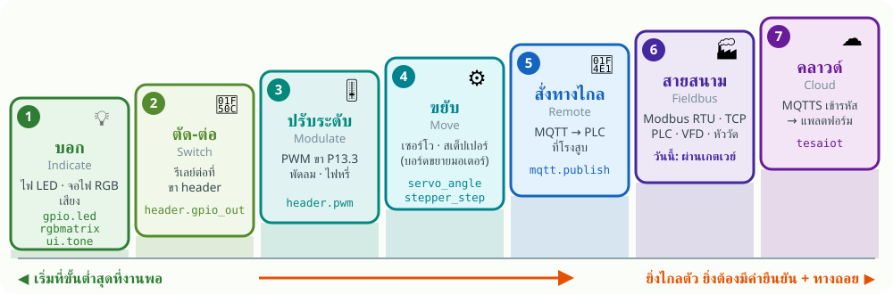

- ขั้น 1–4 ผลอยู่ **ตรงหน้า** เห็นเองว่าไฟติดหรือมอเตอร์หมุน · ขั้น 5–7 ผลอยู่ **ไกลตา** ต้องรอให้ปลายทางยืนยันกลับมา
- Part นี้เล่น 3 ขั้น: **บอก** (ภาษาสถานะ) · **สั่งทางไกล / รายงาน** (MQTT) · **สายสนาม** (Modbus ผ่านเกตเวย์)
- เริ่มที่ขั้นต่ำสุดที่งานพอ: แค่อยากให้คนในโรงเรือนรู้ ไฟกับเสียงก็พอ ไม่ต้องขึ้นคลาวด์

---

## ภาษาสถานะ: สถานะเดียว ได้สี จังหวะ คำ และเสียงเดียวกันทุกช่องทาง

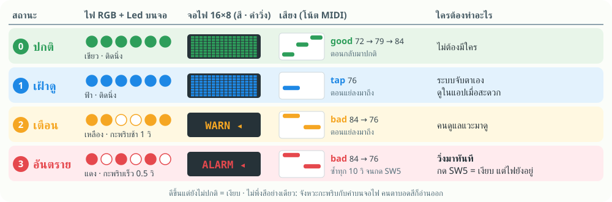

- ยิ่งรุนแรงยิ่งเร่ง: **ติดนิ่ง → กะพริบช้า → กะพริบเร็ว** · ไม่พึ่งสีอย่างเดียว คนตาบอดสีอ่านจังหวะกับคำบนจอไฟได้
- เสียงดัง **เฉพาะตอนแย่ลง และตอนกลับมาปกติ** · ดีขึ้นแต่ยังไม่ปกติ = เงียบ
- "อันตราย" ดังซ้ำได้ **ไม่ถี่กว่าทุก 10 วิ** และต้องกดรับทราบให้เงียบได้ — เตือนถี่เกิน คนจะเลิกฟัง (alarm fatigue) · รับทราบแล้ว **ไฟยังอยู่** จนกว่าต้นเหตุจะหาย

---

## เสียงทั้งคอร์ส: 7 ทำนอง ผ่านทางเดียว เบาเท่ากันทุกไฟล์

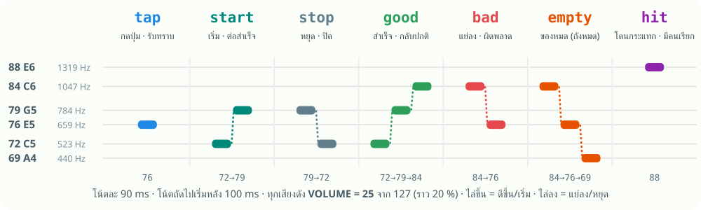

<div class="cols">
<div class="c60">

```python
# เสียงเตือนใช้ ui.tone เพราะปรับความดังได้ (ui.sfx ในเฟิร์มแวร์นี้ปรับความดังไม่ได้)
TUNES = {"tap": (76,), "start": (72, 79), "stop": (79, 72), "good": (72, 79, 84),
         "bad": (84, 76), "empty": (84, 76, 69), "hit": (88,)}


def beep(name):
    for n in TUNES[name]:
        ui.tone(n, ui.WAVE_SINE, VOLUME, 90)
        time.sleep_ms(100)
```

</div>
<div>

- ทุกไฟล์มีเสียงผ่าน **`beep(ชื่อ)`** ทางเดียว และตั้ง **`VOLUME = 25`** (0–127 ราว 20 %) → ชื่อเดียว ทำนองเดียว ดังเท่ากัน
- `ui.tone(โน้ต, คลื่น, ความดัง, ms)` มีช่อง **ความดัง** · `ui.sfx` บนเฟิร์มแวร์นี้รับแค่ **หมายเลขเสียง** จึงหรี่ไม่ได้ — คอร์สนี้ไม่ใช้
- เฟิร์มแวร์ 2.4.2 เพิ่ม `ui.volume()` = **ความดังลำโพงรวม** ทั้งเครื่อง · ส่วน `VOLUME` ยังเป็นความดังของแต่ละโน้ต (velocity) เหมือนเดิม

</div>
</div>

---

## เล่น ① ภาษาสถานะ: หมุนลูกบิดเดียว ทุกช่องทางเปลี่ยนพร้อมกัน

<div class="cols">
<div class="c40">

<div class="goal">

🎯 **เป้าหมาย:** เห็นว่าสถานะเดียวออกทุกช่องทางพร้อมกัน และเสียงเตือนถูกคุมไม่ให้รำคาญ

</div>

<div class="try">

**ลองทำ** · [`cp3_01_status_language.py`](https://github.com/Advance-Innovation-Centre-AIC/aiot-development-for-smart-farm/blob/main/core/cp3_01_status_language.py)
1. รันไฟล์ → หมุน **VR1** จากซ้ายสุดไปขวาสุด: **ปกติ → เฝ้าดู → เตือน → อันตราย** (VR1 แทนผลตัดสินจาก Part 2)
2. ดูไฟ RGB · จอไฟ 16×8 · วงไฟบนจอ · ฟังเสียง — เปลี่ยน **พร้อมกัน** ไหม?
3. ค้างที่ **"อันตราย"** → นับว่าเสียงดังซ้ำทุกกี่วินาที (จอนับถอยหลังให้)
4. กด **SW5** (ปุ่มล่าง) = รับทราบ → เสียงเงียบ แต่ไฟยังกะพริบ · หมุนกลับมา **"ปกติ"** ฟังเสียง `good`

</div>

</div>
<div class="shot">

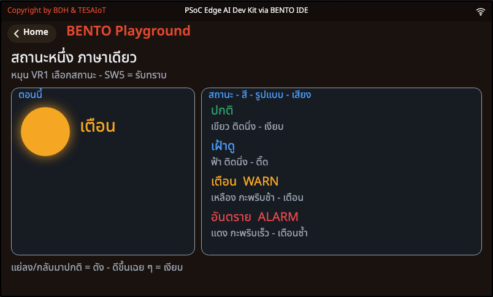

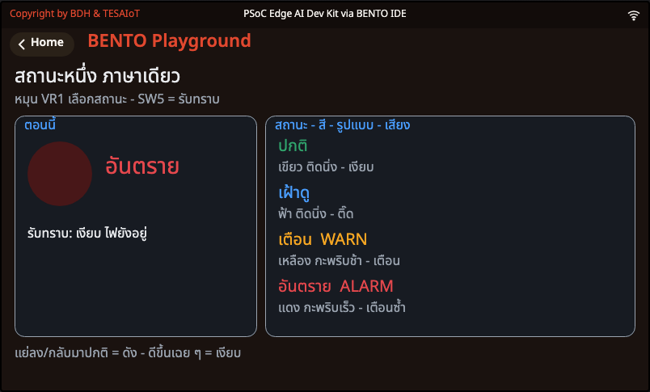

<div class="cap">ภาพจาก BENTO Emulator · ลูกบิดหมุนจากแผงจำลอง · ไฟล์นี้ไม่ใช้เน็ต · คำวิ่งบนจอไฟใน Emulator ขึ้นแค่เฟรมแรก บนบอร์ดวิ่งจริง</div>

</div>
</div>

---

## ส่งเมื่อเปลี่ยน + ส่งว่ายังอยู่: วัดถี่ได้ ไม่ต้องส่งทุกครั้ง

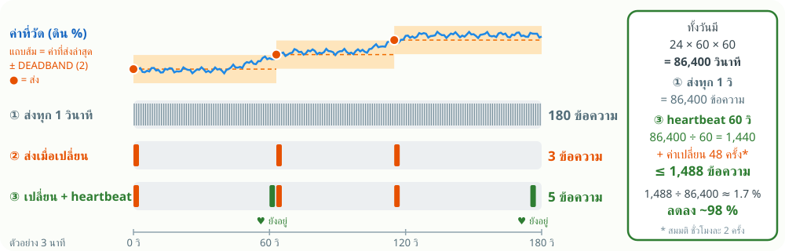

```python
def why_send(value, last, quiet_ms):
    # ส่งใบนี้ไหม: "change" / "heartbeat" / None
    # last = ค่าในใบที่ส่งไปล่าสุด (None = ยังไม่เคยส่ง) - quiet_ms = เงียบมานานเท่าไรแล้ว
    if last is None or abs(value - last) > DEADBAND:
        return "change"
    if quiet_ms >= HEARTBEAT_S * 1000:
        return "heartbeat"
    return None
```

- เทียบกับ **ใบที่ส่งไปล่าสุด** ไม่ใช่ค่ารอบก่อน · ใบ "ยังอยู่" ทำให้ปลายทางแยก **ค่านิ่ง** กับ **บอร์ดตาย** ได้ · ภาพใช้ heartbeat 60 วิ ส่วน cp3_03 ตั้ง `HEARTBEAT_S = 30` — ลองคิดตัวเลขทั้งวันใหม่เอง

---

## เล่น ② ส่งเมื่อเปลี่ยน: นับใบที่ส่งจริง เทียบกับที่วัด

<div class="cols">
<div class="c40">

<div class="goal">

🎯 **เป้าหมาย:** เห็นกับตาว่าส่งน้อยลงเท่าไร โดยปลายทางยังรู้ว่าบอร์ดยังอยู่

</div>

<div class="try">

**ลองทำ** · [`cp3_03_report_by_exception.py`](https://github.com/Advance-Innovation-Centre-AIC/aiot-development-for-smart-farm/blob/main/core/cp3_03_report_by_exception.py)
1. แก้ `WIFI_SSID` `WIFI_PASS` `TEAM` แล้วรัน → วงไฟบนจอติด = ออนไลน์
2. ปล่อย **VR1** นิ่ง ๆ → มีแต่ใบ **heartbeat** ทุก 30 วิ
3. หมุน VR1 ช้า ๆ แล้วเร็ว ๆ → เส้น **เขียว** (ใบที่ส่ง) เดินเป็น **ขั้นบันได** ตามเส้น **ฟ้า** (ค่าที่วัด)
4. อ่าน **"ส่ง … ใบ / วัด … ครั้ง"** และ **% ประหยัด** · ดูใบจริงใน MQTT Explorer: subscribe `bento-aiot/<TEAM>/core/#` แล้วดูช่อง `n` `up_s` `why`

</div>

</div>
<div class="shot">

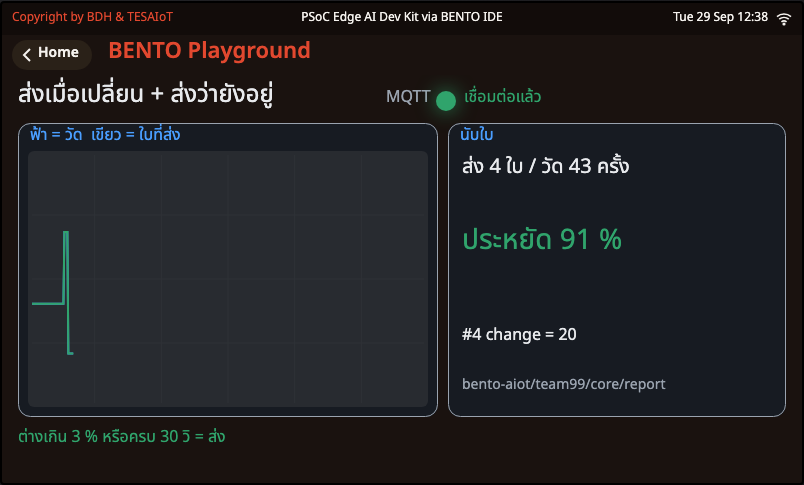

<div class="cap">ภาพจาก BENTO Emulator · MQTT ใน Emulator เป็นแบบจำลองในเบราว์เซอร์ ไม่มีอะไรออกจากเครื่อง · ลูกบิดหมุนจากแผงจำลอง</div>

<div class="warn">

พอร์ต 1883 **ไม่เข้ารหัส** ใครก็อ่านหัวข้อเราได้ — ห้ามส่งรหัสหรือของลับ · `n` = เลขใบ (เห็นใบหาย) · `up_s` = บอร์ดเปิดมากี่วิ (เห็นรีสตาร์ต)

</div>

</div>
</div>

---

## ทุกคำสั่งต้องมีคำยืนยัน และทางถอยที่ปลอดภัย

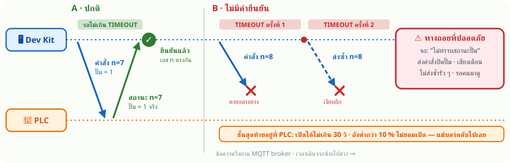

- **สั่ง → รอคำยืนยันที่จับคู่กับคำสั่งนี้ได้ → หมดเวลา = "ไม่รู้"** · เงียบ **ไม่ใช่** สำเร็จ · สถานะปั๊มบนจอมาจาก **คำยืนยันของ PLC** ไม่ใช่จากปุ่มที่เรากด
- **ไม่รู้ = ปิดไว้ก่อน** (fail-safe): cp3_06 ถ้ายังไม่รู้สถานะปั๊ม กด SW6 จะขอ **"ปิด"** ก่อนเสมอ
- **ด่านสุดท้ายอยู่ที่ PLC (interlock):** เปิดได้ไม่เกิน 30 วิ · ถังต่ำกว่า 10 % ไม่ยอมเปิด — ต่อให้บอร์ดดับไปเลย ปั๊มก็ไม่ค้าง

☆ [`cp3_04_command_confirm.py`](https://github.com/Advance-Innovation-Centre-AIC/aiot-development-for-smart-farm/blob/main/core/cp3_04_command_confirm.py) เล่นวงปิดนี้กับ [`field_sim.py`](https://github.com/Advance-Innovation-Centre-AIC/aiot-development-for-smart-farm/blob/main/s2/app/field_sim.py) บนโน้ตบุ๊ก: SW5 ขอเปิด 10 วิ · SW6 ขอปิด · รอ 3 วิ ส่งซ้ำ 1 ครั้ง · ยังเงียบ = สั่งปิดและถือว่า "ไม่รู้"

---

## ท่อสองแบบ: MQTT ซองเปิด · MQTTS ท่อปิดผนึก

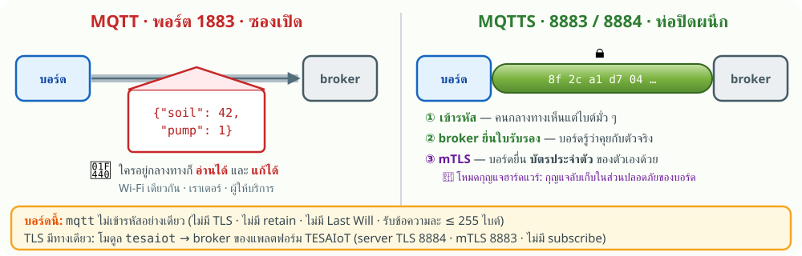

- TLS ให้ 2 อย่าง: **เข้ารหัส** (คนกลางทางอ่าน/แก้ไม่ได้) + **ยืนยันตัวตน broker** · mTLS เพิ่มอีกข้อ: **broker รู้ว่าบอร์ดเป็นใคร**
- ในคลาสใช้ `mqtt` พอร์ต 1883 กับ broker สาธารณะ เพราะเริ่มง่าย — งานจริง **คำสั่งปั๊มต้องไม่วิ่งบนซองเปิด**
- `mqtt` ของบอร์ดนี้ไม่มี retain และไม่มี Last Will → ปลายทางต้อง **จับเวลา heartbeat เอง** (เงียบเกินรอบ = บอร์ดมีปัญหา)

☆ [`cp3_05_two_pipes.py`](https://github.com/Advance-Innovation-Centre-AIC/aiot-development-for-smart-farm/blob/main/core/cp3_05_two_pipes.py) ค่าเดียวกัน สองท่อ: ท่อ 1 โชว์ใบที่วิ่งใน `mqtt` 1883 ทีละตัวอักษร · ท่อ 2 อ่านค่าตั้งของ `tesaiot` (tls_mode, broker, พอร์ต) แบบไม่ต่อเน็ต

---

## Modbus: ภาษาของ PLC ใช้กันมาตั้งแต่ปี 1979

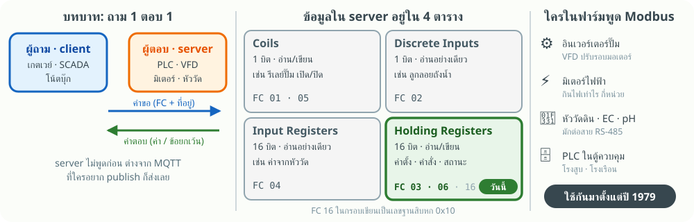

- **ถาม 1 ตอบ 1:** client ขอ → server ตอบ · server ไม่พูดก่อน (ต่างจาก MQTT ที่ใครอยาก publish ก็ส่งเลย)
- ข้อมูลอยู่ใน **4 ตาราง** · วันนี้ใช้ตารางเดียว: **holding register** ช่องละ 16 บิต · อ่าน = **FC03** · เขียนช่องเดียว = **FC06**
- ในฟาร์มเจอ Modbus ที่อินเวอร์เตอร์ปั๊ม (VFD) มิเตอร์ไฟ หัววัดดิน/EC/pH แบบ RS-485 และ PLC ในตู้ควบคุม

---

## กรอบ Modbus TCP 12 ไบต์: "เปิดปั๊ม" หน้าตาแบบนี้

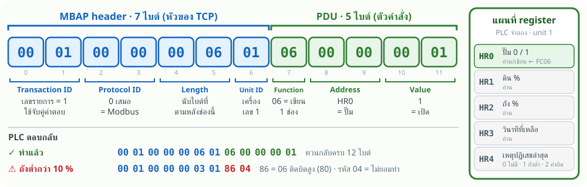

- **MBAP 7 ไบต์** (หัวของ TCP) + **PDU 5 ไบต์** (ตัวคำสั่ง) · ช่อง 2 ไบต์เรียงแบบ **big-endian** (ไบต์สูงมาก่อน)
- PLC ทำสำเร็จ = **ทวนคำขอกลับครบ 12 ไบต์** · ไม่ยอมทำ = function code **ติดบิตสูง** (06 → 86) ตามด้วยรหัสข้อยกเว้น
- ข้อยกเว้นของ PLC จำลอง: **01** ไม่รู้จักคำสั่ง · **02** ไม่มี register ให้ทำแบบนั้น · **03** ค่าไม่ถูกต้อง · **04** ไม่ยอมทำ (ระบบป้องกัน)

---

## เล่น ③ กรอบ Modbus ของจริง สร้างบนบอร์ดทีละไบต์

<div class="cols">
<div class="c45">

<div class="no">

**บอร์ดรุ่นนี้ยังส่ง Modbus TCP เองไม่ได้** (เฟิร์มแวร์ไม่มีโมดูล Modbus และไม่มี socket) — เราจึงให้บอร์ดส่ง **"ความตั้งใจ"** ผ่าน MQTT แล้วให้เกตเวย์บนโน้ตบุ๊กพูด Modbus TCP แทน

</div>

<div class="try">

**ลองทำ** · [`cp3_06_modbus_frame.py`](https://github.com/Advance-Innovation-Centre-AIC/aiot-development-for-smart-farm/blob/main/core/cp3_06_modbus_frame.py)
1. รันโดย **ยังไม่ตั้ง WiFi** = โหมดดูกรอบ (สร้างกรอบโชว์บนจอ ไม่ส่งไปไหน)
2. กด **SW6** (ปุ่มบน) เป็นปุ่มแรก → FC06 เขียน HR0 = 1 → เทียบกับกรอบในสไลด์ก่อน **ตรงทุกไบต์ไหม?**
3. **ทายก่อนกด:** กด **SW5** (ปุ่มล่าง) → FC03 อ่าน HR0–HR2 · ไบต์ 0–1 (tid) และไบต์ 11 (qty) จะเป็นเลขอะไร?
4. กด SW6 ซ้ำ ๆ → ไบต์ไหนเปลี่ยน ไบต์ไหนคงที่ (โหมดนี้สลับ 1 กับ 0 ให้เอง ไม่ใช่สถานะจริงของปั๊ม)

</div>

</div>
<div class="shot">

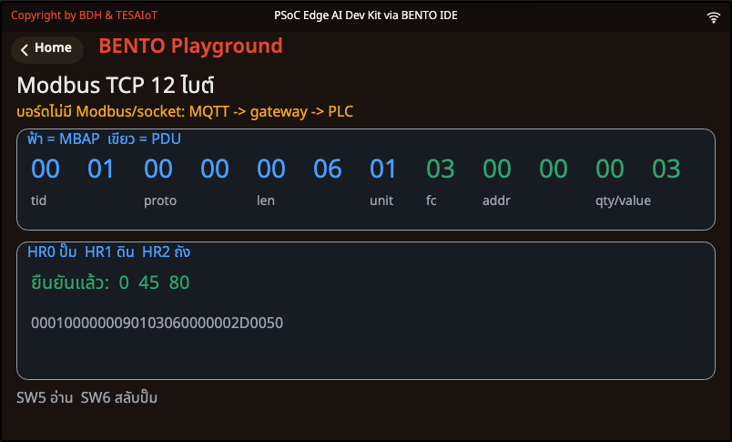

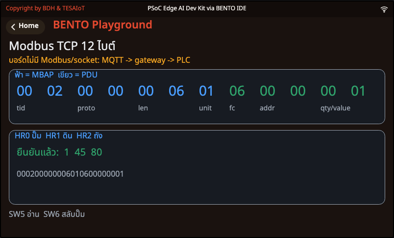

<div class="cap">ภาพจาก BENTO Emulator · MQTT ใน Emulator เป็นแบบจำลองในเบราว์เซอร์ เกตเวย์บนโน้ตบุ๊กจึงตอบไม่ได้ · ไบต์ของกรอบคำนวณด้วย struct จริง</div>

</div>
</div>

---

## เดโมผู้สอน: บอร์ด → MQTT → เกตเวย์ → Modbus TCP → PLC จำลอง

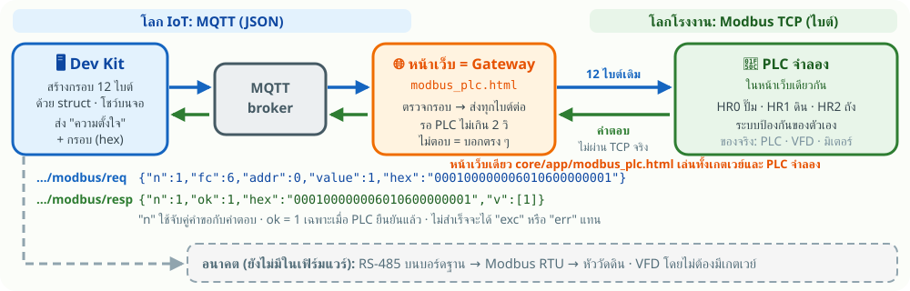

<div class="cols">
<div>

**บนโน้ตบุ๊ก 2 หน้าต่าง** (Python 3)

```bash
python modbus_plc_sim.py      # 1: PLC จำลอง พอร์ต 5020
pip install paho-mqtt         # ครั้งแรกครั้งเดียว
python modbus_bridge.py       # 2: แก้ TEAM ให้ตรงบอร์ดก่อน
```

[`modbus_plc_sim.py`](https://github.com/Advance-Innovation-Centre-AIC/aiot-development-for-smart-farm/blob/main/core/app/modbus_plc_sim.py) · [`modbus_bridge.py`](https://github.com/Advance-Innovation-Centre-AIC/aiot-development-for-smart-farm/blob/main/core/app/modbus_bridge.py)

</div>
<div>

**ดูอะไร** (บอร์ดตั้ง WiFi + TEAM เดียวกัน)
- กด SW5 อ่าน แล้ว SW6 สั่งเปิด → บรรทัด `-> PLC` ในหน้าต่างเกตเวย์คือ **12 ไบต์ชุดเดียวกับบนจอบอร์ด** ออกไปพอร์ต 5020 · คำตอบกลับถึงบอร์ด = **"ยืนยันแล้ว"**
- ปิด PLC จำลองแล้วกดอีกครั้ง → บอร์ดขึ้น `plc_offline` สถานะปั๊มเป็น **--** (ไม่รู้) · เปิดใหม่ด้วย `--tank 5` แล้วสั่งเปิด → **"PLC ปฏิเสธ 4"**

</div>
</div>

---

## อยากให้บอร์ดพูด Modbus เอง ต้องมีอะไรเพิ่ม

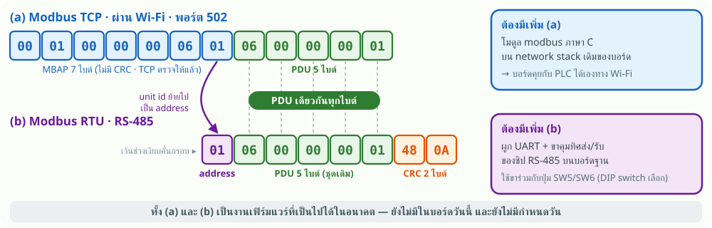

- **RTU กับ TCP ใช้ PDU ชุดเดียวกัน** · TCP ไม่มี CRC (TCP ตรวจให้แล้ว) และ **address ของ RTU** ย้ายไปเป็น **unit id** ใน MBAP
- **(a)** โมดูล `modbus` ภาษา C บน network stack เดิมของบอร์ด → Modbus TCP ทาง Wi-Fi · **(b)** ผูก UART + ขาคุมทิศส่ง/รับของชิป RS-485 บนบอร์ดฐาน → Modbus RTU แต่ขาใช้ร่วมกับปุ่ม **SW5/SW6** (DIP switch เลือก)
- ทั้งสองข้อเป็น **งานเฟิร์มแวร์ในอนาคต ยังไม่มีกำหนดวัน** · วันนี้ใช้เกตเวย์แปล MQTT เป็น Modbus ซึ่งเป็น **รูปแบบที่ใช้กันทั่วไป** ในการพา PLC รุ่นเก่าเข้าระบบ IoT

---

## Code Quest — Part 3

| ระดับ | โจทย์ | ประเภท |
|---|---|---|
| **1 เดา** | **cp3_03:** ค่าที่วัดได้ 40, 40.5, 41, 43, 43.2, 46 ตามลำดับ · `DEADBAND = 2` · เทียบกับ **ใบที่ส่งไปล่าสุด** · ค่าแรกส่งเสมอ · ส่งเมื่อต่าง **มากกว่า** 2 → ส่งกี่ใบ (ไม่นับ heartbeat)? **___** | โจทย์หลัก (มีเฉลยในคาบ) |
| **2 แก้** | **cp3_03:** ตั้ง `HEARTBEAT_S = 10` ปล่อย VR1 นิ่ง ๆ แล้วดู % ประหยัด คุ้มไหมกับการรู้เร็วขึ้นว่าบอร์ดตาย · **cp3_01:** ตั้ง `REPEAT_S = 3` ค้างที่ "อันตราย" ครึ่งนาที รำคาญหรือยัง? | โจทย์หลัก (มีเฉลยในคาบ) |
| **3 เติม** | [`cp3_06_practise.py`](https://github.com/Advance-Innovation-Centre-AIC/aiot-development-for-smart-farm/blob/main/core/practise/cp3_06_practise.py) เติม 2 ช่องใน `fc06_write()`: **A** รูปแบบ `struct` ของ PDU · **B** ค่า len ใน MBAP → ต้องได้ `00 01 00 00 00 06 01 06 00 00 00 01` | **โจทย์หลัก (มีเฉลยในคาบ)** · 7 นาที |
| **4 สร้าง** | สร้างกรอบ **FC16** (เขียนหลายช่องในกรอบเดียว) โชว์บนจอบอร์ด — เกตเวย์และ PLC จำลองของเรารับแค่ FC03/FC06 อยากส่งจริงต้องแก้สองฝั่ง · หรือใน cp3_01 **ยกระดับเตือน** เมื่อ "อันตราย" ไม่มีใครกดรับทราบเกิน 60 วิ | โจทย์เพิ่ม (โบนัส เฉลยคาบหน้า) |
| ☆ การบ้าน | [`cp3_02_matrix_toolkit.py`](https://github.com/Advance-Innovation-Centre-AIC/aiot-development-for-smart-farm/blob/main/core/cp3_02_matrix_toolkit.py) จอไฟ 16×8 เป็นจอเล็ก 4 แบบ: กราฟเส้น หลอด ตัวเลข ตัววิ่ง (7 สี + ดับ · ตัววิ่งรู้จักแค่ 0-9 A-Z a-z) รันใน Emulator ได้ · [`cp3_04_command_confirm.py`](https://github.com/Advance-Innovation-Centre-AIC/aiot-development-for-smart-farm/blob/main/core/cp3_04_command_confirm.py) สั่ง-ยืนยัน-ถอย กับ field_sim.py บนโน้ตบุ๊ก · [`cp3_05_two_pipes.py`](https://github.com/Advance-Innovation-Centre-AIC/aiot-development-for-smart-farm/blob/main/core/cp3_05_two_pipes.py) ค่าเดียวกัน สองท่อ | โจทย์เพิ่ม |

<div class="goal">

ระดับ 1–2 ทำระหว่างช่วง "เล่น" แล้วเฉลยในคาบ · ระดับ 3 ผู้สอนเติมช่องแรกให้ดูสด แล้วทุกคู่เติมที่เหลือ · ระดับ 4 เป็นการบ้าน

</div>

---

## Code Quest ระดับ 3 — เติม `fc06_write()` ให้ได้ 12 ไบต์เป๊ะ (โจทย์หลัก 7 นาที)

```python
def fc03_read(tid, unit, addr, qty):
    # FC03 อ่าน holding register qty ช่อง เริ่มที่ช่อง addr (ทำเสร็จแล้ว ใช้ดูเป็นตัวอย่าง)
    # ">HHHBBHH" = big-endian: tid(H) protocol(H) len(H) unit(B) | fc(B) addr(H) qty(H) รวม 12 ไบต์
    return struct.pack(">HHHBBHH", tid & 0xFFFF, 0, 6, unit, 3, addr, qty)


def fc06_write(tid, unit, addr, value):
    # FC06 เขียนค่า value ลง holding register ช่องเดียว (ช่อง addr) สร้างเป็นสองท่อนแล้วต่อกัน
    pdu = struct.pack(____, 6, addr, value)                    # ช่อง A: รูปแบบของ fc(1) addr(2) value(2)
    mbap = struct.pack(">HHHB", tid & 0xFFFF, 0, ____, unit)   # ช่อง B: len = นับไบต์ที่ตามหลังช่องนี้
    return mbap + pdu
```
<div class="src"><a href="https://github.com/Advance-Innovation-Centre-AIC/aiot-development-for-smart-farm/blob/main/core/practise/cp3_06_practise.py">core/practise/cp3_06_practise.py</a> · fc03_read() + fc06_write() (ตัดตอน)</div>

<div class="cols">
<div class="c55">

<div class="try">

1. ดู `fc03_read()` เป็น **ตัวอย่าง** คู่กับภาพกรอบ 12 ไบต์: ช่อง 2 ไบต์ = `H` · ช่อง 1 ไบต์ = `B` · `>` = big-endian
2. ผู้สอนเติม **ช่อง A** (รูปแบบของ PDU 5 ไบต์) ให้ดูสด → ทุกคู่เติม **ช่อง B** (len = นับไบต์ที่ตามหลังช่องนี้)
3. รัน → ไฟล์ตรวจ **3 กรอบ** ก่อนเปิดจอ · ผ่านครบ = Console ขึ้น **"ผ่าน!"** แล้วกด SW5 / SW6 ดูกรอบบนจอ

</div>

</div>
<div>

| เจอข้อความ | แปลว่า |
|---|---|
| `NameError: name '____' …` | ยังมีช่องที่ไม่ได้เติม |
| `ยังไม่ถูก: fc06_write …` | บอกกรอบที่ผิด ควรได้อะไร ได้กี่ไบต์ |

เฉลย (เปิดหลังลองเอง): [`cp3_06_practise_solution.py`](https://github.com/Advance-Innovation-Centre-AIC/aiot-development-for-smart-farm/blob/main/core/practise/solutions/cp3_06_practise_solution.py)

</div>
</div>

---

## 📌 กฎของ Part 3

<div class="rule">

สถานะหนึ่ง ภาษาเดียว · ส่งเมื่อเปลี่ยน + ส่งว่ายังอยู่ · ทุกคำสั่งต้องมีคำยืนยันและทางถอยที่ปลอดภัย

</div>

- **ภาษาเดียว:** ไฟ จอ เสียง และแอป บอกสถานะเดียวกันด้วยสี จังหวะ และเสียงชุดเดียว · เตือนเท่าที่จำเป็น ไม่งั้นคนเลิกฟัง
- **ส่งเมื่อเปลี่ยน + ส่งว่ายังอยู่:** ประหยัดเน็ตและแบต แต่ปลายทางยังแยก "ค่านิ่ง" กับ "บอร์ดตาย" ได้
- **คำยืนยัน + ทางถอย:** เงียบไม่ใช่สำเร็จ · ไม่รู้ = ปิดไว้ก่อน · และให้ PLC มีด่านป้องกันของตัวเองอีกชั้นเสมอ

<div class="think">

**การ์ดออกแบบของกลุ่ม ช่อง "ทำ":** สถานะมีกี่ระดับ ใช้สี/จังหวะ/เสียงอะไร · ส่งอะไร เมื่อไร heartbeat กี่วิ · คำสั่งไหนต้องรอคำยืนยัน ถ้าไม่มาจะถอยไปทางไหน?

</div>

---

## ดูเพิ่ม: Modbus และ RTU กับ TCP

<div class="vid">
<iframe width="400" height="225" src="https://www.youtube.com/embed/OX5uhoHeFKw" title="Modbus Explained in 2 Minutes (How It Works + RTU vs TCP Explained) — ICP DAS USA, Inc." loading="lazy" frameborder="0" allowfullscreen></iframe>
<div>

<b>Modbus Explained in 2 Minutes (How It Works + RTU vs TCP Explained)</b><br>
ช่อง ICP DAS USA, Inc.<br>
<https://www.youtube.com/watch?v=OX5uhoHeFKw>

**ดูแล้วตอบ:** กรอบ RTU มีอะไรที่ TCP ไม่มี และ TCP มีอะไรที่ RTU ไม่มี — เทียบกับภาพ "PDU เดียวกันทุกไบต์" ของเรา

</div>
</div>

<div class="vid">
<iframe width="400" height="225" src="https://www.youtube.com/embed/fgicf8svA_E" title="เพียง 15 นาที เริ่มต้นกับ MODBUS อย่างไรให้เข้าใจง่ายๆ — ทําอะไรก็มีสุข (saroj1961)" loading="lazy" frameborder="0" allowfullscreen></iframe>
<div>

<b>เพียง 15 นาที เริ่มต้นกับ MODBUS อย่างไรให้เข้าใจง่ายๆ</b><br>
ช่อง ทําอะไรก็มีสุข (saroj1961)<br>
<https://www.youtube.com/watch?v=fgicf8svA_E>

**ดูแล้วตอบ:** ในเดโมของเรา ใครเป็นผู้ถาม (client) ใครเป็นผู้ตอบ (server) — บอร์ด เกตเวย์ หรือ PLC จำลอง? แล้วบอร์ดอยู่ในวง Modbus จริงไหม?

</div>
</div>

---

<!-- _class: sec -->

<div class="when">2:15 – 2:50 · คนขับ = คนที่ 2</div>

# Part 4 — โชว์ (LVGL UI บนบอร์ด)

## สร้างครั้งเดียว อัปเดตเฉพาะที่เปลี่ยน ฟังเหตุการณ์ทุกรอบ

สองสมอง → เลือกวิดเจ็ต → แต่งหน้าตาตอนรัน → ฟังเหตุการณ์ → หน้า HMI · 👀 เห็น 7 นาที · 🎮 เล่น 22 นาที · 🤔 Code Quest 4 นาที · 📌 กฎ 2 นาที

★ [`cp4_01_one_value_many_faces.py`](https://github.com/Advance-Innovation-Centre-AIC/aiot-development-for-smart-farm/blob/main/core/cp4_01_one_value_many_faces.py) · ★ [`cp4_02_style_at_runtime.py`](https://github.com/Advance-Innovation-Centre-AIC/aiot-development-for-smart-farm/blob/main/core/cp4_02_style_at_runtime.py) · ★ [`cp4_03_event_router.py`](https://github.com/Advance-Innovation-Centre-AIC/aiot-development-for-smart-farm/blob/main/core/cp4_03_event_router.py) · ★ [`cp4_05_hmi_page_pattern.py`](https://github.com/Advance-Innovation-Centre-AIC/aiot-development-for-smart-farm/blob/main/core/cp4_05_hmi_page_pattern.py)

☆ การบ้านใน Emulator: [`cp4_04_draw_on_screen.py`](https://github.com/Advance-Innovation-Centre-AIC/aiot-development-for-smart-farm/blob/main/core/cp4_04_draw_on_screen.py) — วาดด้วย `ui.Line` และ `ui.DotMatrix` (ไม่มี Canvas)

<div class="chal">🏆 <b>ท้าทาย:</b> ใน cp4_03 ปั๊มควรเปิดได้เฉพาะตอน <b>กดค้าง</b> — ใครหา <b>อีกทางหนึ่ง</b> ที่ทำให้ปั๊มเปิดได้โดยไม่ต้องกดค้างเจอก่อน และตัดสินได้ว่าทางนั้นควรต้องยืนยันด้วยไหม?</div>

---

## สองสมอง: Python สั่ง · LVGL วาดและจำ

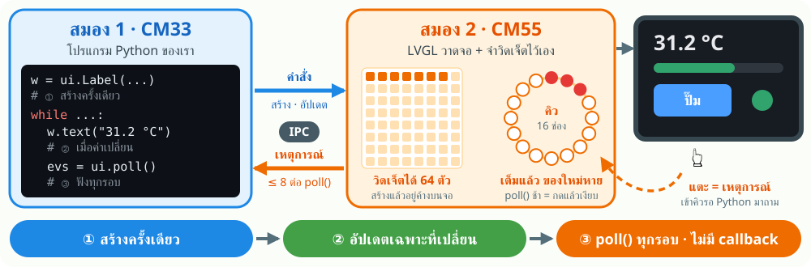

- Python บน **CM33** แค่ **สั่ง** · LVGL บน **CM55** **วาดและจำวิดเจ็ตไว้เอง** → สร้างครั้งเดียว แล้วส่งไปเฉพาะค่าที่เปลี่ยน
- แตะจอ = เหตุการณ์เข้า **คิว 16 ช่อง** · คิวเต็มแล้ว **ของใหม่หาย** · `ui.poll()` ได้ครั้งละ **≤ 8** → เรียกทุก 20–50 ms และดึงจนคิวว่าง (500 ms ใช้กับการอัปเดตตัวเลขบนจอเท่านั้น)
- **ไม่มี callback** · คำสั่ง `ui` ครั้งแรก **พักงานส่งค่าเซนเซอร์เบื้องหลัง** ของเฟิร์มแวร์ → อ่านเซนเซอร์เองในลูป

---

## เลือกวิดเจ็ตจาก "คำถามของคนดู" ไม่ใช่จากความสวย

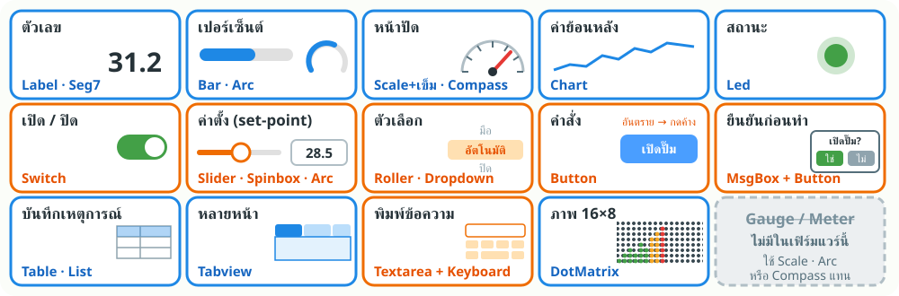

- **เท่าไร?** → Label/Seg7 · **เต็มแค่ไหน?** → Bar/Arc · **อยู่ช่วงไหน?** → หน้าปัด · **ขึ้นหรือลง?** → Chart · **ดีไหม?** → Led · กรอบฟ้า = แสดงผล · กรอบส้ม = รับจากคน
- มีวิดเจ็ต 33 แบบ แต่ **ไม่มี Gauge/Meter/Canvas** → หน้าปัดใช้ Scale แล้วสั่งเข็มเอง: `prop(ui.PROP_SCALE_NEEDLE, (ความยาว << 16) | ค่า)`
- Chart: กว้าง **≤ 400 px** · จำนวนจุด **10–400** (`PROP_CHART_POINTS`)

---

## เล่น ① ค่าเดียว 7 หน้าตา: เลือกวิดเจ็ตตามชนิดข้อมูล

<div class="cols">
<div class="c40">

<div class="goal">

🎯 **เป้าหมาย:** เห็นว่าตัวเลขตัวเดียวแสดงได้หลายแบบ แต่ละแบบตอบคำถามคนละข้อ และเห็นว่า **ค่าไม่เปลี่ยน = ไม่ต้องส่งไปจอ**

</div>

<div class="try">

**ลองทำ** · [`cp4_01_one_value_many_faces.py`](https://github.com/Advance-Innovation-Centre-AIC/aiot-development-for-smart-farm/blob/main/core/cp4_01_one_value_many_faces.py)
1. รันไฟล์ → การ์ด **Label + Seg7 · Bar + Arc · Scale + เข็ม · Led** และ **Chart** แถวล่าง · VR1 = ความชื้นดิน 0–100 %
2. หมุน VR1 ช้า ๆ → 7 หน้าตาขยับพร้อมกัน · ยืนห่างจอ 2 เมตร อันไหนอ่านรู้เรื่องเร็วที่สุด?
3. ปล่อย VR1 นิ่ง → ตัวนับ **"ส่งไปจอ"** หยุด แต่ **"อ่าน"** ยังนับ และกราฟยังเดิน (กราฟคือเวลา)
4. หมุนลงต่ำกว่า 40 % → **"เริ่มแห้ง"** · ต่ำกว่า 25 % → ไฟสถานะสว่างสุด **"แห้ง!"** + เสียงเตือนครั้งเดียว

</div>

</div>
<div class="shot">

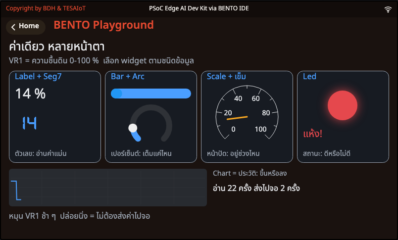

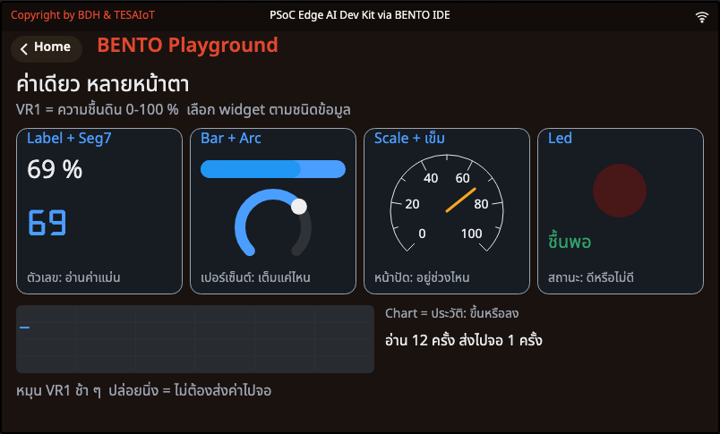

<div class="cap">ภาพจาก BENTO Emulator · VR1 หมุนจากแผงจำลอง · จอใน Emulator วาดด้วยเบราว์เซอร์ หน้าตาใกล้เคียงแต่ไม่เหมือนจอบอร์ดทุกพิกเซล</div>

</div>
</div>

---

## แต่งหน้าตาตอนรัน: ใช้ปุ่มปรับที่มีจริงเท่านั้น

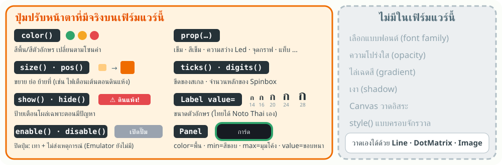

- ส่งคำสั่งแต่งจอ **เฉพาะตอนโซนเปลี่ยน** ไม่ใช่ทุกรอบ · Label เลือกขนาดตัวอักษรตอนสร้างด้วย `value=` 14/16/20/24/28
- Panel ตั้งขอบตอนสร้าง: `color` = พื้น · `min` = สีขอบ · `max` = มุมโค้ง · `value` = ความหนาขอบ
- `disable()` = ปุ่มเทา **และไม่ส่งเหตุการณ์** — แต่เป็นแค่การบอกคน กฎความปลอดภัยจริงต้องเช็กซ้ำในโปรแกรม

---

## เล่น ② การ์ดเดิม แต่งใหม่ตอนรัน: สีบอกความเร่งด่วน

<div class="cols">
<div class="c40">

<div class="goal">

🎯 **เป้าหมาย:** ใช้ `color()` `prop()` `show()/hide()` `disable()` `size()` ให้หน้าตาบอกว่า **ต้องรีบไหม** และ **ปุ่มไหนใช้ไม่ได้**

</div>

<div class="try">

**ลองทำ** · [`cp4_02_style_at_runtime.py`](https://github.com/Advance-Innovation-Centre-AIC/aiot-development-for-smart-farm/blob/main/core/cp4_02_style_at_runtime.py)
1. หมุน **VR1** (ความชื้นดิน) ลงช้า ๆ → ตัวเลข แถบ เข็ม เปลี่ยนสี **เขียว → ส้ม (< 40 %) → แดง (< 25 %)**
2. ตอนแดง: แถบเตือน **"ดินแห้ง! รดน้ำ"** โผล่ · พื้นการ์ดเป็นแดงเข้ม · ไฟเตือนเต้นด้วย `size()`
3. หมุน **VR2** (น้ำในถัง) ต่ำกว่า 20 % → ปุ่ม **"เปิดปั๊ม"** เทาและกดไม่ติด · ข้อความ **"ถังต่ำ: ห้ามกด"**
4. แตะ "เปิดปั๊ม" ตอนถังพอ → ตัวนับ **"สั่ง … ครั้ง"** เพิ่ม · เปิดโค้ดหา `pump_allowed()` = กฎจริงอยู่ตรงนี้

</div>

</div>
<div class="shot">

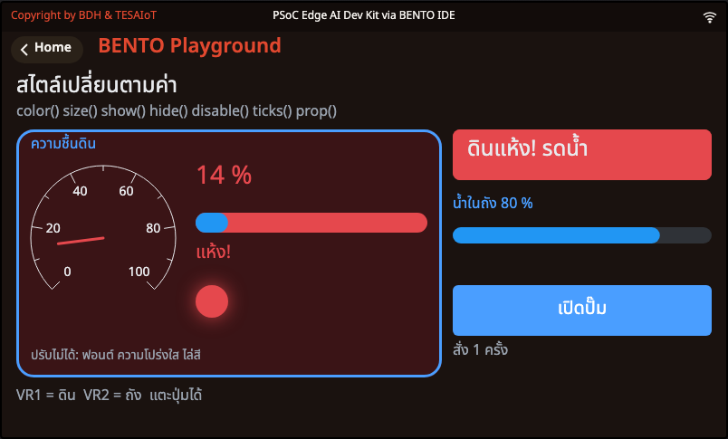

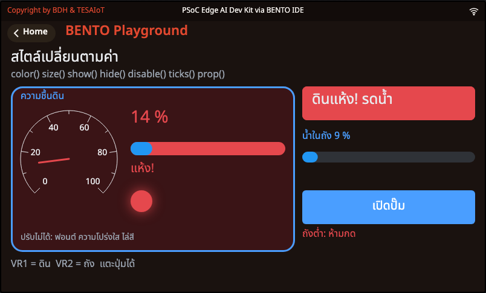

<div class="cap">ภาพจาก BENTO Emulator · VR1 และ VR2 หมุนจากแผงจำลอง</div>

<div class="no">

**Emulator ยังทำไม่ได้:** `enable()/disable()` — ปุ่มใน Emulator จึงไม่เป็นสีเทา ไฟล์ดัก `AttributeError` ไว้ และเช็กถังซ้ำใน `pump_allowed()` ก่อนสั่ง ปั๊มจึงไม่เดินตอนถังต่ำทั้งบนบอร์ดและใน Emulator

</div>

</div>
</div>

---

## เส้นทางของหนึ่งแตะ: จากนิ้ว ถึงปั๊ม

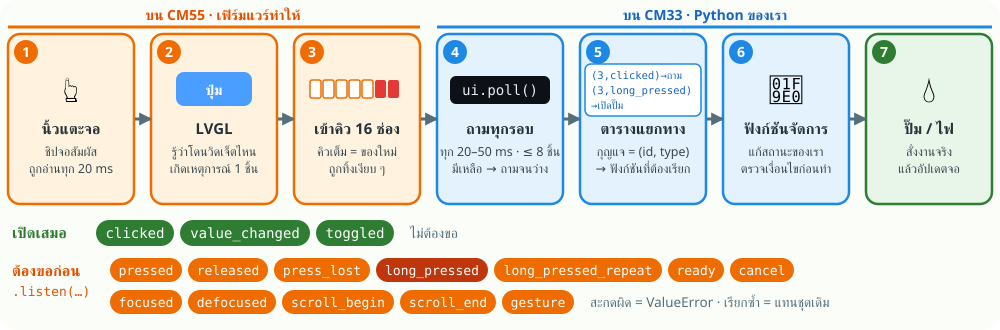

- เหตุการณ์หนึ่งใบ = `{'handle': id, 'type': ชื่อเหตุการณ์, 'value': ตัวเลข}` · ปุ่ม → `clicked` · Slider/Roller → `value_changed` · Switch → `toggled`
- ชนิดอื่นต้องขอด้วย `.listen(...)` ซึ่งต่อท้ายได้ · สะกดผิด = `ValueError` · เรียก `listen()` ซ้ำ = **แทน** ชุดเดิม ไม่ใช่เพิ่ม
- ปุ่มเดียวส่งได้หลายชนิด → ตารางส่งต่อต้องใช้ **คู่ (id, type)** เป็นกุญแจ ไม่ใช่ id อย่างเดียว

---

## เล่น ③ ปุ่มอันตรายต้องกดค้าง: ตาราง (id, type) → ตัวจัดการ

<div class="cols">
<div class="c40">

<div class="goal">

🎯 **เป้าหมาย:** ฟังเหตุการณ์ทุกรอบจนคิวว่าง แล้วส่งต่อด้วยตาราง · **อ่านค่าตั้ง** (Slider · Roller · Switch) และ **สั่งงาน** (ปุ่ม) ในไฟล์เดียว

</div>

<div class="try">

**ลองทำ** · [`cp4_03_event_router.py`](https://github.com/Advance-Innovation-Centre-AIC/aiot-development-for-smart-farm/blob/main/core/cp4_03_event_router.py)
1. **เดาก่อนรัน** (Code Quest ระดับ 1): แตะ "เปิดปั๊ม" 1 ครั้ง ได้เหตุการณ์ชนิดไหน? กดค้าง 1 วิแล้วปล่อยล่ะ? จดไว้
2. แตะสั้น → จอบอก **"กดค้างเพื่อยืนยัน"** · กดค้าง → **"เปิดปั๊มแล้ว"** ไฟปั๊มบนจอ + จอไฟ RGB ติด · แตะ **"หยุด"** = ปิดทันที
3. ดู **บรรทัดตัวส้ม** กลางจอ = เหตุการณ์ล่าสุด `ชนิด = ค่า` → ตรงกับที่เดาไหม?
4. ลาก **Slider** = เกณฑ์ · หมุน **Roller** = วิธีรดน้ำ (สีจอไฟ RGB) · เปิด **Switch อัตโนมัติ** แล้วหมุน VR1 ต่ำกว่าเกณฑ์

</div>

</div>
<div class="shot">

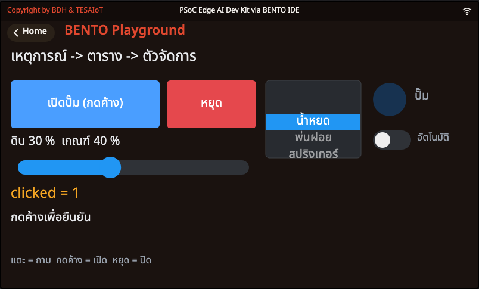

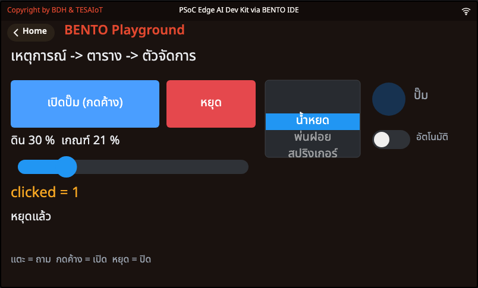

<div class="cap">ภาพจาก BENTO Emulator · แตะจอด้วยเมาส์ กดเมาส์ค้าง = กดค้าง · VR1 หมุนจากแผงจำลอง</div>

</div>
</div>

---

## เล่น ③ หัวใจของโค้ด: ดึงจนคิวว่าง แล้วเปิดตาราง

```python
        evs = ui.poll()                                # 1) ฟัง: ดึงจนคิวว่าง (ครั้งละ <= 8)
        last = None
        while evs:
            for ev in evs:
                p = s["pump"]
                note = dispatch(router, s, ev)         # 2) ตาราง -> ตัวจัดการ
                last = ev
                if note:
                    w["note"].text(note)
                    if s["pump"] == p:
                        beep("tap")                       # ปั๊มไม่เปลี่ยน = เสียงกด (ปั๊มเปลี่ยน show_pump ส่งเสียงเอง)
            evs = ui.poll()
        if last:                                       # ลาก Slider ได้หลายใบต่อรอบ: เขียนจอครั้งเดียว
            w["last"].text("%s = %d" % (last["type"], last["value"]))
```

- `dispatch()` หาตัวจัดการด้วย `router.get((ev["handle"], ev["type"]))` · ไม่อยู่ในตาราง = ไม่สนใจ · ตัวจัดการอยู่ในส่วน 3) สมอง ทดสอบด้วยเหตุการณ์ปลอมได้
- สองทาง: บอร์ดเปลี่ยนสถานะเองก็ต้องเลื่อน Switch ตาม · `.value()` ที่โปรแกรมสั่ง **ไม่ส่ง `toggled` กลับมา** จึงไม่เกิดคำสั่งซ้ำ

<div class="think">

**คิด:** ถ้าเปลี่ยน `while evs:` เป็นเรียก `ui.poll()` ครั้งเดียวต่อรอบ แล้วลาก Slider เร็ว ๆ คิว 16 ช่องจะเป็นอย่างไร — แล้วการแตะ **"หยุด"** ที่ตามมาเสี่ยงอะไร?

</div>

---

## จอ 792 × 398: วางเป็นตาราง เว้นขอบ 12

<div class="cols">
<div class="c55">

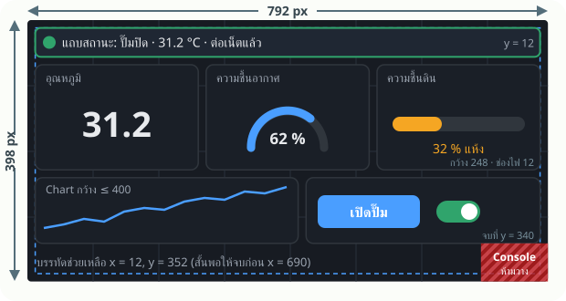

</div>
<div>

**พื้นที่ `ui.screen()` = 792 × 398 px** · ตำแหน่ง `x, y, w, h` นับจากมุมซ้ายบน

- ขอบ 12 · ช่องไฟ 12 · การ์ด 3 ใบกว้าง 248 → 12 + 3 × (248 + 12) = 792 พอดี
- วางของลงในการ์ดหรือแท็บด้วย `parent=`
- มุมขวาล่าง (x ≥ 690 และ y ≥ 340) เป็นที่ของปุ่ม Console — **ห้ามวางทับ**

**ขีดจำกัด:** วิดเจ็ต **≤ 64 ตัว** · ข้อความใน Label **≈ 126 ไบต์** (ไทยตัวละ 3 ไบต์ นับสระและวรรณยุกต์ด้วย) · Chart กว้าง ≤ 400 · ไม่ใช้ Spinner

</div>
</div>

---

## หน้า HMI ที่ดี: 4 กฎจากหน้าตู้ควบคุม

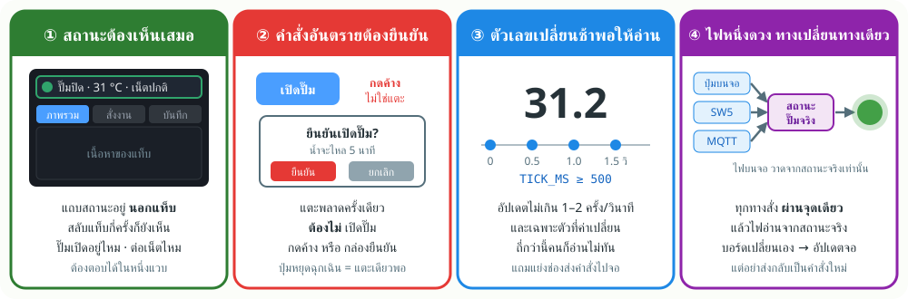

- ① แถบสถานะอยู่ **นอก** Tabview · ② คำสั่งที่ทำให้น้ำไหลต้อง **กดค้าง** (cp4_03) หรือ **กล่องยืนยัน** (cp4_05) · ปุ่มหยุด = แตะเดียว
- ③ ตัวเลขที่คนอ่าน อัปเดต **≤ 2 ครั้ง/วิ** (`TICK_MS ≥ 500`) · ④ ทุกทางสั่ง (จอ · SW5 · MQTT) เข้า **จุดเดียว** แล้วไฟวาดจากสถานะจริง

---

## เล่น ④ หน้า HMI: แถบสถานะ · แท็บ · กล่องยืนยัน · บันทึก

<div class="cols">
<div class="c40">

<div class="goal">

🎯 **เป้าหมาย:** จัดจอแบบตู้ควบคุมจริง: **สถานะเห็นทุกหน้า** · แยกหน้าด้วยแท็บ · **ยืนยันก่อนเปิดปั๊ม** แต่ **หยุดทันที** · ทุกเหตุการณ์ลงบันทึก

</div>

<div class="try">

**ลองทำ** · [`cp4_05_hmi_page_pattern.py`](https://github.com/Advance-Innovation-Centre-AIC/aiot-development-for-smart-farm/blob/main/core/cp4_05_hmi_page_pattern.py)
1. รันไฟล์ → แถบสถานะบนสุด (ไฟปั๊ม · ถัง % · ไฟเตือน) + 3 แท็บ **ภาพรวม · สั่งงาน · บันทึก**
2. แท็บ **สั่งงาน** → แตะ **"เปิดปั๊ม"** → กล่อง **"ยืนยันเปิดปั๊ม?"** บอกว่าจะเกิดอะไร · ลอง **ยกเลิก** · ลอง **รอเกิน 8 วิ** · แล้วค่อย **ยืนยัน**
3. ปั๊มเดินอยู่ → หมุน **VR2** (น้ำในถัง) ต่ำกว่า 20 % → ไฟเตือนติด ปั๊มหยุดเอง สั่งเปิดไม่ได้ · อยู่แท็บไหนแถบสถานะก็ยังบอก
4. แท็บ **บันทึก** → ทุกเหตุการณ์มีเวลา (ครบ 6 แถววนทับแถวเก่าสุด) · เปิดโค้ดหา 3 ก้อน `build()` · `update()` · `handle()`

</div>

</div>
<div class="shot">

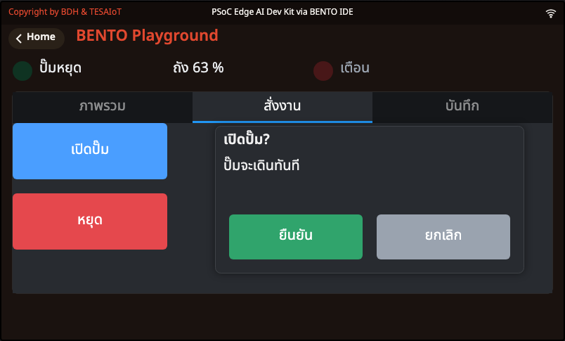

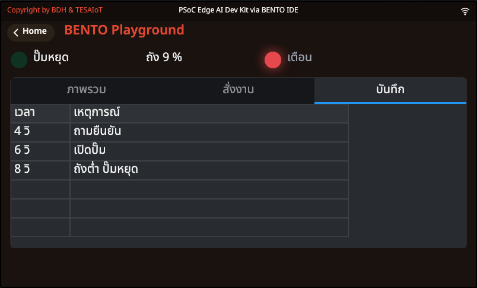

<div class="cap">ภาพจาก BENTO Emulator · VR2 หมุนจากแผงจำลอง · แตะแท็บและปุ่มด้วยเมาส์</div>

<div class="no">

**ยังทำไม่ได้:** ปุ่มที่เติมใน MsgBox ด้วย `add_button()` ไม่ส่งเหตุการณ์กลับมาให้ Python (ทั้งบนบอร์ดและ Emulator) → ไฟล์วาง `ui.Button` จริงสองปุ่มทับกล่องไว้เป็นคำตอบ · กล่องไม่ล็อกทั้งจอ แท็บและ "หยุด" ยังแตะได้

</div>

</div>
</div>

---

## Code Quest — Part 4

| ระดับ | โจทย์ | ประเภท |
|---|---|---|
| **1 เดา** | ปุ่มที่สร้างด้วย `.listen("long_pressed")`: **แตะ 1 ครั้ง** → `ui.poll()` ได้ `type` อะไรบ้าง? **กดค้าง 1 วิแล้วปล่อย** → ได้อะไร เรียงลำดับไหน? | โจทย์หลัก (มีเฉลยในคาบ) |
| **2 แก้** | **cp4_02:** เปลี่ยนเกณฑ์โซน `WARN_BELOW` / `DRY_BELOW` · เปลี่ยนขนาดตัวเลขใหญ่ `value=28` เป็น 20 · ย้ายการ์ดหนึ่งชิ้นด้วย `pos()` หลังสร้าง เช่น `w["tank_bar"].pos(494, 210)` | โจทย์หลัก (มีเฉลยในคาบ) |
| **3 เติม** | [`cp4_03_practise.py`](https://github.com/Advance-Innovation-Centre-AIC/aiot-development-for-smart-farm/blob/main/core/practise/cp4_03_practise.py) เติมช่อง A B C ในตาราง `(id, type) → ตัวจัดการ` ให้ผ่านเหตุการณ์ปลอม 5 กรณี | โจทย์เพิ่ม (โบนัส เฉลยคาบหน้า) |
| **4 สร้าง** | **cp4_05:** เพิ่ม **แท็บที่ 4 "ตั้งค่า"** มี Slider ตั้ง `TANK_MIN` (เพิ่มแถวในตาราง router และลงบันทึก) · หรือเพิ่มปุ่ม **"หยุดทั้งหมด"** ที่มีกล่องยืนยัน แล้วเถียงกับเพื่อนว่าควรถามจริงไหม ในเมื่อไฟล์ตั้งใจให้ "หยุด" ทำทันที | โจทย์เพิ่ม (โบนัส เฉลยคาบหน้า) |

<div class="goal">

ระดับ 1 เดาไว้ตั้งแต่ เล่น ③ · ระดับ 1–2 เฉลยในคาบ · ระดับ 3–4 เป็นการบ้าน รันใน BENTO Emulator ได้

</div>

---

## 📌 กฎของ Part 4

<div class="rule">

สร้างครั้งเดียว อัปเดตเฉพาะที่เปลี่ยน ฟังเหตุการณ์ทุกรอบ และคำสั่งอันตรายต้องยืนยัน

</div>

- **สร้างครั้งเดียว อัปเดตเฉพาะที่เปลี่ยน:** จอจำวิดเจ็ตไว้เองได้ไม่เกิน 64 ตัว · ทุกคำสั่งต้องข้ามไปอีกสมอง ส่งเท่าที่จำเป็น จอจึงลื่นและคนอ่านทัน
- **ฟังทุกรอบ:** ไม่มี callback และคิว 16 ช่องเต็มแล้วของใหม่หาย → `poll()` ทุก 20–50 ms จนคิวว่าง ไม่งั้นการแตะ "หยุด" อาจหายเงียบ
- **ยืนยันก่อนทำ:** แตะพลาดครั้งเดียวต้องไม่ทำให้น้ำไหล · ปุ่มเทาบอกคน แต่กฎจริงต้องอยู่ในสมองของโปรแกรม

<div class="think">

**การ์ดออกแบบของกลุ่ม ช่อง "โชว์":** วิดเจ็ตสำคัญ 3 ตัว · สถานะอะไรต้องเห็นเสมอ · คำสั่งไหนต้องยืนยัน?

</div>

---

## ดูเพิ่ม: LVGL คืออะไร

<div class="vid">
<iframe width="400" height="225" src="https://www.youtube.com/embed/y5O7zKFdgPk" title="LVGL Lessons On ESP32 01: Introduction — Michael ee" loading="lazy" frameborder="0" allowfullscreen></iframe>
<div>

<b>LVGL Lessons On ESP32 01: Introduction</b><br>
ช่อง Michael ee<br>
<https://www.youtube.com/watch?v=y5O7zKFdgPk>

คลิปใช้บอร์ด ESP32 และภาษา C — ดูเพื่อเข้าใจว่า LVGL คืออะไร **ไม่ต้องทำตามโค้ด** บนบอร์ดของเราสั่ง LVGL ผ่านโมดูล `ui` ของ Python

**ดูแล้วตอบ:** วิดเจ็ตที่เห็นในคลิป ตรงกับช่องไหนในตารางเลือกวิดเจ็ตของเรา และบนบอร์ดเรา สมองตัวไหนเป็นคนวาดมัน?

</div>
</div>

---

<!-- _class: sec -->

<div class="when">2:50 – 3:00 · ทั้งคู่</div>

# ปิดคาบ — การ์ดออกแบบของกลุ่ม

กฎหนึ่งบรรทัด 4 ใบ ประกอบกลับเป็นหัวใจของ **โปรเจกต์ของกลุ่มเอง**

---

## สี่กฎที่เก็บกลับบ้าน

<div class="cards">
<div class="card" style="background:#1e88e5">

<b>1 · วัด</b>
อ่านให้ถูกจังหวะ แปลงให้มีหน่วย และสอบเทียบก่อนเชื่อ

</div>
<div class="card" style="background:#8e24aa">

<b>2 · ตัดสิน</b>
กรองตามรูปของสัญญาณรบกวน ตัดสินด้วยขั้นบันไดที่ต่ำที่สุดที่ได้ผล และให้ AI มีสิทธิ์ตอบว่าไม่แน่ใจ

</div>
<div class="card" style="background:#2e7d32">

<b>3 · ทำ</b>
สถานะหนึ่ง ภาษาเดียว · ส่งเมื่อเปลี่ยน + ส่งว่ายังอยู่ · ทุกคำสั่งต้องมีคำยืนยันและทางถอยที่ปลอดภัย

</div>
<div class="card" style="background:#ef6c00">

<b>4 · โชว์</b>
สร้างครั้งเดียว อัปเดตเฉพาะที่เปลี่ยน ฟังเหตุการณ์ทุกรอบ และคำสั่งอันตรายต้องยืนยัน

</div>
</div>

<div class="think">

**คิดก่อนกรอกการ์ด:** โปรเจกต์ของกลุ่มทำผิดกฎข้อไหนอยู่ตอนนี้บ้าง? ข้อไหนแก้ได้ภายใน 10 บรรทัด?

</div>

---

## การ์ดออกแบบ วัด · ตัดสิน · ทำ · โชว์ (หนึ่งหน้าต่อกลุ่ม)

<svg viewBox="0 0 1000 330" xmlns="http://www.w3.org/2000/svg" font-family="sans-serif">
  <rect x="4" y="4" width="992" height="40" rx="10" fill="#263238"/>
  <text x="20" y="31" font-size="19" fill="#fff" font-weight="700">ปัญหาในฟาร์มที่กลุ่มเลือก: ______________________________________</text>
  <g font-size="17">
    <rect x="4" y="54" width="240" height="210" rx="12" fill="#e3f2fd" stroke="#1e88e5" stroke-width="3"/>
    <text x="16" y="82" font-weight="700" fill="#1565c0">วัด</text>
    <text x="16" y="110" fill="#37474f">• อ่านอะไร · รูปร่างไหน</text><text x="16" y="136" fill="#37474f">• อ่านถี่แค่ไหน</text><text x="16" y="162" fill="#37474f">• สอบเทียบอย่างไร</text>
    <rect x="254" y="54" width="240" height="210" rx="12" fill="#f3e5f5" stroke="#8e24aa" stroke-width="3"/>
    <text x="266" y="82" font-weight="700" fill="#6a1b9a">ตัดสิน</text>
    <text x="266" y="110" fill="#37474f">• บันไดขั้นไหน</text><text x="266" y="136" fill="#37474f">• ทำไมขั้นล่างไม่พอ</text><text x="266" y="162" fill="#37474f">• กรองแบบไหน</text>
    <rect x="504" y="54" width="240" height="210" rx="12" fill="#e8f5e9" stroke="#2e7d32" stroke-width="3"/>
    <text x="516" y="82" font-weight="700" fill="#1b5e20">ทำ</text>
    <text x="516" y="110" fill="#37474f">• ภาษาสถานะ</text><text x="516" y="136" fill="#37474f">• ส่งเมื่อไร (dead-band)</text><text x="516" y="162" fill="#37474f">• กันพลาด (interlock)</text>
    <rect x="754" y="54" width="242" height="210" rx="12" fill="#fff3e0" stroke="#ef6c00" stroke-width="3"/>
    <text x="766" y="82" font-weight="700" fill="#e65100">โชว์</text>
    <text x="766" y="110" fill="#37474f">• widget สำคัญ 3 ตัว</text><text x="766" y="136" fill="#37474f">• คำสั่งที่ต้องยืนยัน</text><text x="766" y="162" fill="#37474f">• อะไรต้องเห็นตลอด</text>
  </g>
  <rect x="4" y="276" width="992" height="48" rx="10" fill="#ffebee" stroke="#e53935" stroke-width="3"/>
  <text x="20" y="307" font-size="18" fill="#b71c1c" font-weight="700">ความปลอดภัย: เน็ตหลุด / เซนเซอร์เสีย / ไฟดับ → ระบบอยู่ในสภาพไหน? ____________________</text>
</svg>

- กรอกลงใบงาน ข้อ 8 · การ์ดนี้ตรงกับ **5 เสาหลัก** ของโปรเจกต์ และใช้ต่อในวันนำเสนอได้เลย

---

## บอร์ดรุ่นนี้ทำอะไรได้ · ยังทำอะไรไม่ได้ (พูดตรง ๆ)

<style scoped>
section table { font-size: .6em; }
</style>

| เรื่อง | บอร์ดรุ่นนี้ (เฟิร์มแวร์ปัจจุบัน) | ในคาบเราทำอย่างไร |
|---|---|---|
| **Modbus** TCP / RTU | ไม่มีโมดูล Modbus | บอร์ดสร้างเฟรมจริงด้วย `struct` · เกตเวย์บนโน้ตบุ๊กพูด Modbus TCP แทน |
| **socket** ของ Python | ไม่มี `socket` `network` `ssl` จึงเปิด TCP เองไม่ได้ | คุยผ่าน MQTT |
| **RS-485** บนฐานบอร์ด | มีวงจรบนฐานบอร์ด แต่เฟิร์มแวร์ยังไม่ได้ขับ · ขาควบคุมใช้ร่วมกับปุ่ม SW5/SW6 | เป็นแนวคิดในสไลด์เท่านั้น |
| **`mqtt`** | ไม่เข้ารหัส · ไม่มี retain · ไม่มี Last Will · ข้อความขาเข้ายาวได้ไม่เกิน 255 ไบต์ | ส่งว่ายังอยู่ (heartbeat) · JSON สั้น ๆ |
| **MQTTS** | มีผ่านโมดูล `tesaiot` ไปแพลตฟอร์ม TESAIoT เท่านั้น (ไม่มี subscribe) | คำสั่งในคาบใช้ `mqtt` ธรรมดา |
| **`machine`** | ไม่มี ADC · PWM · UART · SPI · Timer · WDT | `pots` · `header.pwm` · `header.uart_*` |
| **`ui`** | ไม่มี callback (poll ได้ครั้งละ ≤ 8 เหตุการณ์) · ไม่มี Canvas / Gauge / เลือกฟอนต์ / ความโปร่งใส | ตาราง router · Scale / Arc · Line / DotMatrix |
| **`dsp`** | ไม่มี mean · std · z-score | เขียนเองราว 10 บรรทัด |
| **เสียง** | `ui.sfx` ปรับความดังไม่ได้ | `ui.tone` + `VOLUME = 25` (เฟิร์มแวร์ 2.4.2 เพิ่ม `ui.volume()` ความดังรวม) |
| **`edge_ai.select()`** | รับเลขลำดับ ไม่รับชื่อโมเดล | หาเลขจากชื่อใน `edge_ai.models()` |

<div class="cap">ตรวจจากซอร์สของเฟิร์มแวร์ที่ใช้ในคอร์สนี้ · "ยังทำไม่ได้" วันนี้ ไม่ได้แปลว่าทำไม่ได้ตลอดไป</div>

---

## Exit ticket (คนละ 1 ข้อ) + เกณฑ์ผ่านคาบ

<div class="cols">
<div>

<div class="goal">

**คนที่ 1:** กฎหนึ่งบรรทัดข้อไหนที่โปรเจกต์ของกลุ่ม **ยังขาด** และจะเติมตรงไหน …

</div>

<div class="goal" style="border-color:#1e88e5;background:#e3f2fd">

**คนที่ 2:** ในโปรเจกต์ของกลุ่ม จุดไหนควรให้ระบบตอบว่า **"ไม่แน่ใจ"** แทนการเดา …

</div>

</div>
<div>

**เกณฑ์ผ่านคาบ**
- ☐ เล่นไฟล์ ★ ครบทั้ง 4 ส่วน และกรอกตารางบันทึก
- ☐ ผ่านการตรวจอัตโนมัติของไฟล์ฝึกโจทย์หลักอย่างน้อย 1 ไฟล์
- ☐ การ์ดออกแบบของกลุ่มครบ 5 กล่อง

**การบ้าน (BENTO Emulator)**
- ไฟล์ ☆ ทุกไฟล์ใน [`core/`](https://github.com/Advance-Innovation-Centre-AIC/aiot-development-for-smart-farm/tree/main/core)
- ภาคผนวก **สรุปคำสั่งหนึ่งหน้าต่อส่วน** ในใบงาน

</div>
</div>


---

## อ้างอิงและเครดิต

<style scoped>
section { font-size: 16px; }
section p, section li { margin: .05em 0; line-height: 1.3; }
</style>

**วิดีโอ (YouTube — ลิขสิทธิ์เป็นของเจ้าของช่อง ใช้ด้วยการฝัง/ลิงก์)** · ตรวจชื่อคลิปและช่องด้วย YouTube oEmbed ก่อนเผยแพร่

- [What is Switch Bounce and How to Debounce – ATM | Digi-Key Electronics](https://www.youtube.com/watch?v=IvU8m_30iK0) — DigiKey
- [ADC Quantization and Resolution](https://www.youtube.com/watch?v=plq_Nmud5CM) — Microchip Developer Help
- [Calculating the Mean, Variance and Standard Deviation, Clearly Explained!!!](https://www.youtube.com/watch?v=SzZ6GpcfoQY) — StatQuest with Josh Starmer
- [But what is the Fourier Transform?  A visual introduction.](https://www.youtube.com/watch?v=spUNpyF58BY) — 3Blue1Brown
- [Modbus Explained in 2 Minutes (How It Works + RTU vs TCP Explained)](https://www.youtube.com/watch?v=OX5uhoHeFKw) — ICP DAS USA, Inc.
- [เพียง 15 นาที เริ่มต้นกับ MODBUS อย่างไรให้เข้าใจง่ายๆ](https://www.youtube.com/watch?v=fgicf8svA_E) — ทําอะไรก็มีสุข (saroj1961)
- [LVGL Lessons On ESP32 01: Introduction](https://www.youtube.com/watch?v=y5O7zKFdgPk) — Michael ee

**ภาพที่ทำขึ้นเองสำหรับคอร์สนี้:** ปก · อินโฟกราฟิกทุกภาพที่วาดด้วย SVG/HTML (ห่วงโซ่การวัด ห้ารูปร่างของข้อมูล ไทม์ไลน์ปุ่ม ADC aliasing การสอบเทียบ บันไดข้อมูล สัญญาณรบกวน EMA z-score บันไดการตัดสินใจ state machine สเปกตรัม ประตูความมั่นใจ บันไดการสั่งงาน ภาษาสถานะ รูปแบบเสียง รายงานเมื่อเปลี่ยน คำสั่ง-ยืนยัน สองท่อ Modbus สองสมอง ตัวเลือก widget ปุ่มปรับหน้าตา เส้นทางเหตุการณ์ กริดจอ กฎ HMI การ์ดออกแบบ) · **ภาพหน้าจอทุกภาพจาก BENTO Emulator** (ค่าเซนเซอร์ MQTT ไมโครโฟน และผล AI เป็นของจำลอง)

**อีโมจิ:** Twemoji — Twitter, Inc. และผู้ร่วมพัฒนา (jdecked/twemoji) — CC BY 4.0

**ข้อมูลฮาร์ดแวร์และ API:** ตรวจจากซอร์สของเฟิร์มแวร์ที่ใช้ในคอร์สนี้ · TESAIoT Dev Kit SDK — <https://tesaiot.github.io/tesaiot-pse84-devkit-sdk/> · ข้อกำหนด Modbus: Modbus Organization — <https://modbus.org/specs.php>
